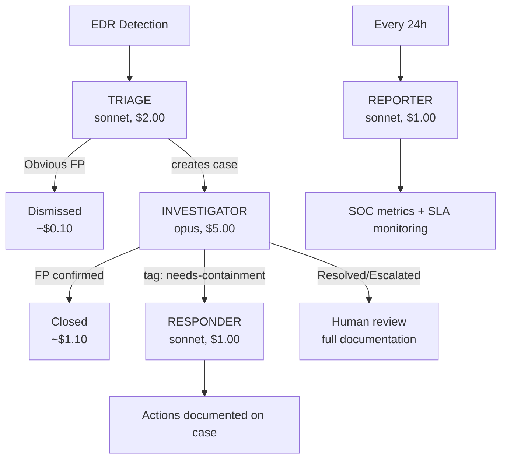

# So You Want to Start an MSSP — A LimaCharlie Walkthrough

This is the article we wish someone had handed us on day one of building a managed security service on LimaCharlie. It is opinionated on purpose: LimaCharlie gives you a lot of moving parts, and a new MSSP can spend weeks deciding things that should take an afternoon. The structure below works. You can absolutely deviate — but if you don't have a strong reason to, follow it.

The goal of this walkthrough is to get you from "I have a LimaCharlie account" to "I have a defensible, multi-tenant, infrastructure-as-code MSSP capable of onboarding a new customer in under an hour, with detection coverage, alerting, case management, AI assistance, and a working IaC export." It is a self-serve POC and a feature tour at the same time — read it linearly the first time, then jump back to the sections you need.

We'll use a fictional MSSP called **Northwind Security** with three sample customers — `ACME` (a 200-seat manufacturing company on Windows + M365), `Globex` (a 60-seat fintech on AWS + Linux + Okta), and `Initech` (a 30-seat law firm on Macs + Google Workspace) — to keep examples concrete.

What this article assumes:

- You have signed up at [app.limacharlie.io](https://app.limacharlie.io). The first two sensors are free; everything in this walkthrough can be done either inside the free tier or for a few dollars in pay-as-you-go usage.
- You have a billing domain (the email domain your team uses, e.g. `@northwindsec.com`). LimaCharlie's [Unified Billing](../7-administration/billing/options.md#unified-billing) ties tenants together by that domain, so use real company addresses for your operators, not personal ones.
- You can run shell commands locally and have a place to keep a private Git repository (GitHub, GitLab, Bitbucket — anything that supports SSH deploy keys).

What this article is *not*:

- A reference manual. The doc tree under [Sensors](../2-sensors-deployment/index.md), [Detection & Response](../3-detection-response/index.md), [Integrations](../5-integrations/index.md), [Administration](../7-administration/index.md), and [Reference](../8-reference/index.md) is the reference manual. We link out to it everywhere.
- A list of every feature. LimaCharlie has many features that are great for some MSSPs and irrelevant for others. When this walkthrough doesn't mention a thing, that doesn't mean it's bad — it means it's optional for the first 90 days.

The whole article is roughly a day of focused work end-to-end. If you do it for real on a friendly first customer, you'll come out the other side with a real production MSSP environment.

---

## Part 1 — The mental model before you click anything

LimaCharlie hands you a small set of primitives that, once you internalize them, explain every UI screen and every API endpoint. Spend ten minutes here. It will save you days.

### The five primitives

| Primitive | What it is | Where it lives |
| --- | --- | --- |
| **Organization** (a.k.a. **tenant**, or **org**) | A fully isolated unit: its own sensors, rules, data, billing, audit log. One org has one OID (a UUID). | The thing you create when you click "Create Organization". |
| **Sensor / Adapter** | The thing that produces events. Sensors are EDR agents on hosts; adapters are connectors that ingest logs from cloud / SaaS / third-party security tools. Both stream events into the org. | [Sensors](../2-sensors-deployment/index.md), [Adapters](../2-sensors-deployment/adapters/index.md). |
| **D&R Rule** | A `detect:` block + `respond:` block in YAML. If `detect` matches an event, `respond` runs. This is the entire automation engine. | [D&R Rules](../3-detection-response/index.md). |
| **Hive** | The platform's typed key-value store. Each "kind" of configuration lives in its own hive: `dr-general` (your rules), `dr-managed` (rules managed by extensions/Sigma), `secret`, `lookup`, `query`, `yara`, `ai_agent`, `fp` (false positives), `extension_config`, etc. Everything you configure ends up as a record in some hive. | [Config Hive](../7-administration/config-hive/index.md). |
| **Output** | A continuous stream of one of the four data types (`event`, `detect`, `audit`, `deployment`) to an external destination — Splunk, S3, BigQuery, Slack, Teams, syslog, etc. | [Outputs](../5-integrations/outputs/index.md). |

### The four data structures

Every event in LimaCharlie flows through one of four streams. Knowing them by reflex makes everything else click.

| Stream | What | Volume | Where it goes |
| --- | --- | --- | --- |
| `event` | Real-time telemetry from sensors and adapters. Two top-level objects: `routing` (sensor metadata) and `event` (event-specific data). | High | SIEM, data lake, S3 |
| `detect` | Detections produced when a D&R rule's `detect:` matches. Inherits the event's `routing` plus adds `cat`, `priority`, `detect_id`, `detect_data`. | Low–medium | SIEM, SOAR, IR, Cases |
| `audit` | Platform management actions (user added, rule changed, output created, secret rotated). Flat object with `oid`, `ts`, `ident`, `entity`. | Low | Compliance archive |
| `deployment` | Sensor lifecycle events (install, uninstall, version change). | Very low | Asset management |

A real-world `event` payload looks like this:

```json
{
  "routing": {
    "oid": "8cbe27f4-aaaa-aaaa-aaaa-138cd51389cd",
    "sid": "bb4b30af-aaaa-aaaa-aaaa-f014ada33345",
    "event_type": "NEW_PROCESS",
    "event_time": 1656959942437,
    "event_id": "8cec565d-14bd-4639-a1af-4fc8d5420b0c",
    "hostname": "ACME-WS-014",
    "ext_ip": "203.0.113.45",
    "int_ip": "10.0.1.25",
    "tags": ["workstation", "prod"]
  },
  "event": {
    "FILE_PATH": "C:\\Windows\\System32\\cmd.exe",
    "COMMAND_LINE": "cmd.exe /c whoami",
    "PROCESS_ID": 4812,
    "USER_NAME": "Administrator",
    "PARENT": {
      "FILE_PATH": "C:\\Windows\\explorer.exe",
      "PROCESS_ID": 2156
    }
  }
}
```

A D&R rule that matches it (and the resulting `detect` record) looks like this:

```yaml
detect:
  event: NEW_PROCESS
  op: contains
  path: event/COMMAND_LINE
  value: whoami

respond:
  - action: report
    name: whoami-execution
    metadata:
      level: low
```

Resulting `detect` record (the same `routing` carried through, the matching event copied into `detect`, plus added classification metadata):

```json
{
  "cat": "whoami-execution",
  "source": "dr-general",
  "routing": { /* same as event */ },
  "detect": { /* the event payload */ },
  "detect_id": "f1e2d3c4-aaaa-aaaa-aaaa-123456789abc",
  "priority": 2
}
```

If you can read those three objects fluently you can read every example in this article.

### The opinionated mental model

Every MSSP customer = **exactly one organization**. Don't share orgs across customers, don't try to sub-divide a customer into multiple orgs unless they have hard data-residency or legal-entity reasons. Customer-as-tenant is the architectural unit you will base every other decision on.

Your *staff* don't get permissions per-customer; they get permissions through **Organization Groups** that contain N customer orgs. You'll have a handful of groups by job function (engineers, L1 analysts, L2 analysts, read-only) and you'll add every new customer org to each relevant group at onboarding time. After that, staff onboarding/offboarding is a one-line operation.

Every config that matters is **a YAML file in a Hive**. The Infrastructure extension reads/writes those files; the Git Sync extension keeps them in lockstep with a Git repository. If you treat that Git repo as the source of truth from day one, you'll never have to "figure out" what's deployed where — you read the repo.

That's the model. The rest of this article is filling it in.

---

## Part 2 — Day 0: accounts, regions, and billing

### Pick one region and stick with it for now

When you create an organization, the region (e.g. `usa`, `europe`, `india`) is **permanent**. Pick the region that matches the majority of your customers' data-residency expectations. If you'll have customers in both EU and US, that's fine — you'll just create their orgs in different regions. The CLI and the web app handle multi-region transparently; cross-region operations are normal.

For Northwind Security in our worked example, we'll put everything in `usa` for simplicity.

### Create your "control" organization first

Before you create any customer org, create one organization that will be your **internal control plane**. Call it something obvious like `northwind-control`. This org:

- Is *not* a customer tenant. No customer EDR sensors land here.
- Holds your IaC templates, your demo data, your training material, your `ai_agent` definitions, your shared `lookup` records, your shared YARA rules.
- Is the org you point Git Sync at first, before you replicate to customers.
- Is the place where your staff can experiment without touching customer data.

Creating this org puts you on the free tier (2 sensor quota). That's enough to validate everything in this walkthrough end-to-end — no credit card required until you scale beyond two real EDR sensors or enable a paid extension.

### Decide on Unified Billing now

If your team's emails all share a domain, opt into [Unified Billing](../7-administration/billing/options.md#unified-billing) immediately. With it, every customer org under your billing domain rolls up into one monthly invoice — paid by ACH or one card — and your billing cycle is the same across tenants. Without it, every customer org is its own billing relationship with its own credit card and its own cycle. **Set up Unified Billing before you onboard your first customer.** Migrating later is a support ticket, not a self-serve operation.

### Understand how you're billed

LimaCharlie's pricing is usage-based across two main axes:

- **EDR endpoints** — flat per-endpoint per-month, all telemetry included, with one year of Insight retention bundled in.
- **External telemetry** (everything from adapters: M365, Okta, CloudTrail, etc.) — per GB ingested, with one year of retention included.

A few helpful order-of-magnitude estimates so you can quote customers credibly:

| Source | Small (≤100 endpoints) | Medium (100–500) | Large (500+) |
| --- | --- | --- | --- |
| AWS CloudTrail | 0.5–2 GB/day | 2–10 GB/day | 10–50 GB/day |
| Azure / GCP combined | 1–3 GB/day | 4–15 GB/day | 20–80 GB/day |
| Identity (Okta / Entra / Duo) | 0.2–1 GB/day | 1–5 GB/day | 5–20 GB/day |
| Email / collab (M365 / Workspace / Slack) | 0.3–1.5 GB/day | 1.5–8 GB/day | 8–35 GB/day |
| Network / firewall / IDS | 2–10 GB/day | 10–55 GB/day | 55–290 GB/day |
| Third-party EDR / EPP logs (CrowdStrike, Defender, etc.) | 1–5 GB/day | 5–25 GB/day | 25–100 GB/day |
| **Typical total** | **5–25 GB/day** | **25–140 GB/day** | **140–500 GB+/day** |

See [Estimating Data Ingestion](../7-administration/billing/data-estimation.md) for the up-to-date detail. Three rules of thumb that always pay off:

1. **Start with identity + cloud + EDR.** Highest signal, lowest volume.
2. **Filter at the source.** Don't ingest "all firewall traffic" — ingest "denies + threat-tagged + anomalous". The customer's firewall is almost always the noisiest source.
3. **Use the [Usage Alerts extension](../5-integrations/extensions/limacharlie/usage-alerts.md) (covered in Part 17)** to fire a detection when any SKU crosses a threshold.

### Enable Strict SSO on your domain

Before you invite a single staff member, enable [Strict SSO Enforcement](../7-administration/access/sso.md#strict-sso-enforcement) on `@northwindsec.com`. This forces every authentication from your domain through your IdP (Okta / Entra / Google Workspace / etc.), which means: when an analyst leaves, disabling them in your IdP locks them out of every customer org instantly. This is the single most impactful access-control control you can apply. Do it on day zero, while you only have one user (you), so you can prove the flow works before relying on it.

Strict SSO disables login+password, GitHub auth, and Microsoft auth for users on your domain — they go through your IdP only. It works on `app.limacharlie.io` and any custom-branded portal.

---

## Part 3 — The control-org bootstrap

In the control org, do the following one-time setup. You'll get value from each of these immediately, and they'll be the foundation for every customer onboarding to come.

### Install the CLI and authenticate

```bash
pip install limacharlie
limacharlie login
```

`login` walks you through creating an Organization API key with the permissions it needs and stores credentials in `~/.limacharlie`. Generated keys are scoped to a single org and a specific permission set — not to your user — which is the right default. See [API Keys](../7-administration/access/api-keys.md) for the full pattern.

Confirm it works:

```bash
limacharlie use            # shows orgs you can reach
limacharlie sensor list    # in the control org, will return [] for now
```

### Create a baseline Organization API key for automation

Eventually you'll have webhooks, CI scripts, and automation calling the API on behalf of an organization. Use an Organization API key for those, never a user API key — the permission scope is narrower and the key dies with the org, not with the human.

Via REST (the CLI command is `limacharlie api-key create`, but seeing the REST shape is useful):

```bash
curl -X POST "https://api.limacharlie.io/v1/orgs/$YOUR_OID/keys" \
  -H "Authorization: Bearer $LC_JWT" \
  -H "Content-Type: application/json" \
  -d '{
    "name": "automation-readonly",
    "permissions": [
      "org.get",
      "sensor.list",
      "sensor.get",
      "dr.list",
      "insight.det.get",
      "insight.evt.get",
      "investigation.get"
    ]
  }'
```

To exchange an API key for a JWT (everything in LimaCharlie speaks JWT-Bearer):

```bash
# Organization-scoped JWT (the most common case)
curl -X POST "https://jwt.limacharlie.io" \
  -H "Content-Type: application/x-www-form-urlencoded" \
  -d "oid=$YOUR_OID&secret=$YOUR_API_KEY"
```

The JWT lasts 30 minutes; cache it, refresh on 401. The CLI handles this for you.

A couple of useful flairs for advanced cases:

- `orchestration-key[bulk]` — for high-volume API call workloads.
- `integration-key[segment]` — segment isolation, the key only sees its own resources.

### Create your first Hive Secret

You'll be storing secrets (Anthropic API keys, GitHub deploy keys, third-party tokens, output credentials) in the [Hive `secret`](../7-administration/config-hive/secrets.md) namespace. Even before you need one, prove it works:

```bash
echo "test-value" > /tmp/example.txt
limacharlie hive set secret --key example-secret \
  --data /tmp/example.txt --data-key secret
limacharlie secret list
limacharlie secret delete --key example-secret --confirm
```

Anywhere a config field would normally take a credential, you'll instead use the syntax `hive://secret/<name>`. This means rules, outputs, and adapter configs **never** contain a literal credential — they contain a reference. That's the only way an IaC repo of these configs can be committed to Git without leaking.

### Subscribe to the standard MSSP extension kit

In the [Marketplace](https://app.limacharlie.io/add-ons), subscribe (in the control org first; you'll repeat per customer) to:

| Extension | Why every MSSP wants it |
| --- | --- |
| [Infrastructure](../5-integrations/extensions/limacharlie/infrastructure.md) | IaC machinery — fetch / push / dry-run / selective sync. |
| [Git Sync](../5-integrations/extensions/limacharlie/git-sync.md) | Bidirectional sync between an org and a Git repo. |
| [Cases](../5-integrations/extensions/limacharlie/cases.md) | Case queue, SLA timers, investigation evidence, reporting. |
| [Exfil](../5-integrations/extensions/limacharlie/exfil.md) | Tune what events sensors send (volume / cost control). |
| [Lookup Manager](../5-integrations/extensions/limacharlie/lookup-manager.md) | Auto-refresh threat-feed lookups. |
| [Usage Alerts](../5-integrations/extensions/limacharlie/usage-alerts.md) | Bill-runaway protection. |
| [Sensor Cull](../5-integrations/extensions/limacharlie/sensor-cull.md) | Auto-remove stale sensors. |
| [Artifact](../5-integrations/extensions/limacharlie/artifact.md) | Collect Windows Event Logs, Mac Unified Logs, PCAPs. |
| [Reliable Tasking](../5-integrations/extensions/limacharlie/reliable-tasking.md) | Guarantee a sensor command runs when the sensor next checks in. |

Five minutes of clicking. You'll IaC them in Part 15.

---

## Part 4 — Designing the customer-org template

You will onboard customers many times. Every onboarding should produce a tenant that's already 90% configured. The way to make that happen is to define one **template org configuration**, in YAML, that you push to every new customer org on creation.

The template comprises:

1. **Connectivity primitives**: installation keys (one per environment / role).
2. **Adapter scaffolding**: the cloud/SaaS/identity adapters every customer is likely to want.
3. **Detection coverage baseline**: a curated set of D&R rules + subscriptions to managed rulesets.
4. **Alerting**: Cases extension config, Slack/Teams/PagerDuty webhooks, severity & SLA mapping.
5. **Outputs**: forward `detect` to the customer's SIEM (or yours); forward `audit` to long-term storage.
6. **Cost guardrails**: usage alerts, sensor cull, sleeper defaults.
7. **AI agent definitions**: triage / investigation / responder agent configs with empty per-customer credentials.
8. **Saved query library**: baseline hunts that ship with every customer.
9. **Lookup feeds**: Tor exit nodes, AlienVault reputation, etc.

We'll build each of these in the next several sections. Keep in mind: at this point you are configuring the *control* org so the configurations exist as records you can later export and replicate. You are not yet onboarding a customer.

---

## Part 5 — What to connect in (telemetry)

Telemetry is the foundation. You can't write detections — let alone offer detection-and-response services — without it. LimaCharlie has two kinds of telemetry sources, both of which produce events flowing into the same `event` stream.

### EDR sensors (endpoints)

The LimaCharlie sensor runs on Windows, macOS, Linux, ChromeOS, and via browser extensions on Chrome and Edge. Feature parity is high across desktop OSes. Install via [Installation Keys](../2-sensors-deployment/installation-keys.md) — one key per role, **with role tags baked in**:

```bash
# server-class hosts: all production servers
limacharlie installation-key create \
  --description "Production servers" --tags "server,prod"

# workstation-class hosts: knowledge-worker machines
limacharlie installation-key create \
  --description "Workstations" --tags "workstation"

# VIP hosts: executives, on-call, devs with prod access
limacharlie installation-key create \
  --description "VIP" --tags "vip"

# pre-deployed sensors held in sleeper mode
limacharlie installation-key create \
  --description "Sleeper / pre-deployed" --tags "lc:sleeper"
```

Tags are sticky — anything installed with that key inherits the tags forever. Your D&R rules and Exfil profiles will key off these tags (`vip` sensors get more aggressive collection; `server` sensors get FIM on `/etc/`).

For ACME, our 200-seat customer, we'll create three keys: `acme-server`, `acme-workstation`, `acme-vip`. The IaC version of those (which is what actually ships in the template) is:

```yaml
version: 3
installation_keys:
  acme-server:
    desc: ACME servers
    tags: [server, prod]
  acme-workstation:
    desc: ACME workstations
    tags: [workstation]
  acme-vip:
    desc: ACME executives and on-call
    tags: [vip, workstation]
```

#### Windows install (interactive)

```batch
:: Run as Administrator
rphcp.exe -i YOUR_INSTALLATION_KEY_GOES_HERE
```

#### Windows install (silent MSI for SCCM/Intune/GPO)

```batch
msiexec /i "C:\Downloads\hcp_win_x64.msi" /qn ^
  INSTALLATIONKEY="YOUR_INSTALLATION_KEY_GOES_HERE"
```

#### Windows install (self-contained PowerShell)

This is the one to send to customer IT — it auto-detects architecture, downloads the right installer, installs silently, and verifies the service is running:

```powershell
#Requires -RunAsAdministrator
param([Parameter(Mandatory=$true)][string]$InstallationKey)

$CpuArch = (Get-CimInstance -ClassName Win32_Processor).Architecture
$Arch = switch ($CpuArch) {
    0  { "32" }
    9  { "64" }
    12 { "arm64" }
    default { if ([Environment]::Is64BitOperatingSystem) { "64" } else { "32" } }
}

$InstallerUrl  = "https://downloads.limacharlie.io/sensor/windows/$Arch"
$InstallerPath = Join-Path $env:TEMP "rphcp.exe"

[Net.ServicePointManager]::SecurityProtocol = [Net.SecurityProtocolType]::Tls12
Invoke-WebRequest -Uri $InstallerUrl -OutFile $InstallerPath -UseBasicParsing
Start-Process -FilePath $InstallerPath `
  -ArgumentList "-i", $InstallationKey -Wait -NoNewWindow

$service = Get-Service -Name "rphcpsvc" -ErrorAction SilentlyContinue
if ($service -and $service.Status -eq "Running") {
    Write-Host "OK: LimaCharlie sensor installed and running." -ForegroundColor Green
} else {
    Write-Host "WARN: service may not be running; check manually." -ForegroundColor Yellow
}
```

#### Linux install (Debian / Ubuntu)

```bash
# Interactive
sudo dpkg -i limacharlie.deb
# or
sudo apt install ./limacharlie.deb

# Silent / scripted
echo "limacharlie limacharlie/installation_key string $INSTALLATION_KEY" \
  | sudo debconf-set-selections \
  && sudo apt install ./limacharlie.deb -y

# Uninstall
sudo apt remove limacharlie
```

#### Linux install (raw binary, init.d / non-deb distros)

```bash
wget https://downloads.limacharlie.io/sensor/linux/64 -O /tmp/lc_sensor
chmod +x /tmp/lc_sensor
sudo /tmp/lc_sensor -d $INSTALLATION_KEY
# Or via env var:
sudo LC_INSTALLATION_KEY=$INSTALLATION_KEY /tmp/lc_sensor -d -
```

#### macOS install

```bash
# Intel: https://downloads.limacharlie.io/sensor/mac/64
# Apple Silicon: https://downloads.limacharlie.io/sensor/mac/arm64
chmod +x lc_sensor
sudo ./lc_sensor -i $INSTALLATION_KEY

# macOS will prompt the user to grant Full Disk Access and Network
# Filter via System Settings. Document this step in your customer
# onboarding email — it's the #1 cause of "the sensor isn't seeing
# anything" tickets.

# Verify:
sudo launchctl list | grep com.refractionpoint.rphcp
```

For larger customers, ship via [Jamf](../2-sensors-deployment/endpoint-agent/macos/jamf.md) or [Intune](../2-sensors-deployment/enterprise-deployment/intune.md). Send the customer's IT a short doc that contains the PowerShell or shell snippet plus your installation key — that's the entirety of the customer-side work.

### Sleeper-mode pre-deployment — the MSSP cheat code

The `lc:sleeper` tag pattern above is worth its own paragraph. A sleeper sensor costs **$0.10 per 30 days** to keep installed and connected, with no telemetry collection running. Your customer's IT team can roll the agent out to thousands of machines now; whenever you need real telemetry from any subset, you remove the tag (manually or via a D&R rule) and they wake up within 10 minutes. This is the foundation of being able to offer 20-minute IR SLAs.

End-to-end sleeper flow:

1. Create the customer's org. Set Quota to 3 to enable billing.
2. Create an installation key with the `lc:sleeper` tag.
3. Customer's IT installs the agent on every endpoint they want to pre-deploy.
4. Sensors land in sleeper mode immediately (~10 min sync). Cost = $0.10 / 30 days each.
5. When an incident happens: bump quota up to N, remove the `lc:sleeper` tag from the N sensors you want awake, wait ≤10 minutes, start collecting full telemetry.
6. When done, re-tag `lc:sleeper`, drop quota back. Costs revert.

Sleeper changes don't touch the binary on disk — only the in-memory profile changes. No reboot needed. While in sleeper mode, things like YARA scans (which require process memory access) are paused.

See [Sleeper Mode](../2-sensors-deployment/endpoint-agent/sleeper.md) for the full mechanics. Build the sleeper-deploy path into your customer onboarding documentation; do not save it for "advanced users".

### Adapters (logs, cloud, SaaS, third-party EDR)

Anything that's not a LimaCharlie sensor lands via an [Adapter](../2-sensors-deployment/adapters/index.md). The catalogue is large; the ones an MSSP almost always wants on a customer's first day:

| Customer asset | Adapter | Notes |
| --- | --- | --- |
| Microsoft 365 mailboxes | [Microsoft 365](../2-sensors-deployment/adapters/types/microsoft-365.md) | Audit, login, file-share events. |
| Identity provider | [Okta](../2-sensors-deployment/adapters/types/okta.md), [Microsoft Entra ID](../2-sensors-deployment/adapters/types/microsoft-entra-id.md), or [Duo](../2-sensors-deployment/adapters/types/duo.md) | This is where your account-takeover detections live. |
| Cloud control plane | [AWS CloudTrail](../2-sensors-deployment/adapters/types/aws-cloudtrail.md), [Azure Event Hub](../2-sensors-deployment/adapters/types/azure-event-hub.md), [GCP Pub/Sub](../2-sensors-deployment/adapters/types/google-cloud-pubsub.md) | Customers running in a public cloud — connect this on day 1. |
| Google Workspace | [Google Workspace](../2-sensors-deployment/adapters/types/google-workspace.md) | Same role as M365 for non-Microsoft shops. |
| Existing EDR | [CrowdStrike](../2-sensors-deployment/adapters/types/crowdstrike.md), [Defender for Endpoint](../2-sensors-deployment/adapters/types/microsoft-defender.md), [SentinelOne](../2-sensors-deployment/adapters/types/sentinelone.md), [Carbon Black](../2-sensors-deployment/adapters/types/carbon-black.md), [Sophos](../2-sensors-deployment/adapters/types/sophos.md) | Customer already has an EDR? Don't fight it — ingest its events as a parallel data source. |
| Network / firewall | [Syslog](../2-sensors-deployment/adapters/types/syslog.md) | Long-tail visibility. Filter at source aggressively. |
| Anything weird | [JSON adapter](../2-sensors-deployment/adapters/types/json.md), [File adapter](../2-sensors-deployment/adapters/types/file.md), [Webhook adapter tutorial](../2-sensors-deployment/adapters/tutorials/webhook-adapter.md) | If a system can write JSON to disk or HTTP-POST a payload, you can ingest it. |

**Opinion:** for your first three customers, connect: EDR + identity (Okta/Entra) + M365/Workspace + cloud control plane (if applicable). That's the minimum-viable telemetry surface to credibly run detections. Everything else is gravy and can be added in week 2+.

#### Microsoft 365 adapter — concrete config

```yaml
sensor_type: office365
office365:
  tenant_id:     hive://secret/acme-o365-tenant-id
  client_id:     hive://secret/acme-o365-client-id
  client_secret: hive://secret/acme-o365-client-secret
  publisher_id:  hive://secret/acme-o365-publisher-id
  domain: acme.onmicrosoft.com
  endpoint: enterprise
  start_time: "2026-01-01T00:00:00Z"
  content_types:
    - Audit.AzureActiveDirectory
    - Audit.Exchange
    - Audit.SharePoint
    - Audit.General
    - DLP.All
  client_options:
    identity:
      oid: <CUSTOMER_OID>
      installation_key: <INSTALLATION_KEY>
    hostname: ms-o365-adapter
    platform: json
    sensor_seed_key: office365-audit-sensor
    mapping:
      sensor_hostname_path: ClientIP
      event_type_path:      Operation
      event_time_path:      CreationTime
```

The customer's M365 admin creates an Azure AD App Registration with the `Office 365 Management APIs` permission and provides the four secrets. Your `secret` hive holds the actual values; this YAML carries only references.

#### Okta adapter — concrete config

```yaml
sensor_type: okta
okta:
  apikey: hive://secret/acme-okta-api-key
  url: https://acme.okta.com
  client_options:
    identity:
      oid: <CUSTOMER_OID>
      installation_key: <INSTALLATION_KEY>
    hostname: okta-systemlog-adapter
    platform: json
    sensor_seed_key: okta-system-logs-sensor
    mapping:
      sensor_hostname_path: client.device
      event_type_path:      eventType
      event_time_path:      published
```

#### AWS CloudTrail adapter — S3-based config

```yaml
s3:
  client_options:
    hostname: aws-cloudtrail-logs
    identity:
      installation_key: <INSTALLATION_KEY>
      oid: <CUSTOMER_OID>
    platform: aws
    sensor_seed_key: cloudtrail-seed
  bucket_name: globex-cloudtrail-logs
  region_name: us-east-1
  access_key:  hive://secret/globex-aws-access-key
  secret_key:  hive://secret/globex-aws-secret-key
```

If the customer has an SQS event-notification on the bucket, prefer SQS — lower latency, no polling cost:

```yaml
sqs:
  client_options:
    hostname: aws-cloudtrail-logs
    identity:
      installation_key: <INSTALLATION_KEY>
      oid: <CUSTOMER_OID>
    platform: aws
    sensor_seed_key: cloudtrail-seed
  region: us-east-1
  queue_url: https://sqs.us-east-1.amazonaws.com/123456789012/cloudtrail-events
  access_key: hive://secret/globex-aws-access-key
  secret_key: hive://secret/globex-aws-secret-key
```

#### Adapters as a Service vs self-hosted

You have four deployment options for adapters; pick by customer size and operational appetite:

| Option | When to use | How |
| --- | --- | --- |
| **As a Service (cloud-managed)** | Default for cloud-to-cloud sources (M365, Okta, CloudTrail). LC runs the adapter for you. | Web app → Adapters → "Cloud" tab. |
| **On-prem binary** | Customer has on-prem log sources (syslog from internal firewall, files in a shared dir). | Download `lc_adapter`, run with config file. |
| **As a Windows service** | On-prem Windows host. | `./lc_adapter.exe -install:service-name <type> param1=value1 ...` |
| **As a Linux systemd service** | On-prem Linux host. | Drop a unit file in `/etc/systemd/system/limacharlie-<name>.service`, see template below. |

Reusable systemd unit template:

```ini
[Unit]
Description=LC Adapter <NAME>
After=network.target

[Service]
Type=simple
ExecStart=/opt/limacharlie/lc-adapter <type> client_options.identity.installation_key=<KEY> client_options.identity.oid=<OID> ...
WorkingDirectory=/opt/limacharlie
Restart=always
RestartSec=10
StandardOutput=journal
StandardError=journal
SyslogIdentifier=lc-adapter-<name>

[Install]
WantedBy=multi-user.target
```

### Tag-based segmentation, not org-based

A common mistake: separating environments (dev/prod) into different orgs. Don't. Use **sensor tags** (`prod`, `nonprod`, `dmz`, `pci`, `hipaa`) and write D&R rules that key off `tags`. One org = one customer; tags are how you express structure inside that customer. The [sensor selector grammar](../8-reference/sensor-selector-expressions.md) reads naturally:

```text
plat == windows                                  # all Windows sensors
plat == linux and production in tags             # Linux production
plat == windows and not isolated                 # non-isolated Windows
hostname matches '^prod-.*'                      # by name
plat == windows and int_ip matches '^10\.3\..*'  # by network range
"vip" in tags or "exec" in tags                  # tag union
ext_plat == windows                              # third-party EDR adapters reporting Windows
```

You'll use these in Exfil watch rules, in installation keys, in `--selector` flags on sensor commands, in sensor-cull rules, everywhere.

### Tune what you collect with the Exfil extension

Some events are gold (`NEW_PROCESS`, `DNS_REQUEST`, `NETWORK_CONNECTIONS`, `CODE_IDENTITY`, `WEL` for relevant channels). Some are firehoses (`MODULE_LOAD`, `FILE_PATH` events on a build server). Subscribe to the [Exfil extension](../5-integrations/extensions/limacharlie/exfil.md) and use **Watch Rules** to get fine-grained.

The most useful Watch Rule pattern: collect `MODULE_LOAD` only when the loaded DLL is interesting:

```json
{
  "action": "add_watch",
  "name": "wininet-loading",
  "event": "MODULE_LOAD",
  "operator": "ends with",
  "value": "wininet.dll",
  "path": ["FILE_PATH"],
  "tags": ["server"],
  "platforms": ["windows"]
}
```

For VIP-tagged hosts, send everything — the volume is small and the value of full telemetry on an executive's laptop dwarfs the cost:

```json
{
  "action": "add_event_rule",
  "name": "vip-full-collection",
  "events": ["NEW_TCP4_CONNECTION", "NEW_TCP6_CONNECTION", "MODULE_LOAD"],
  "tags": ["vip"],
  "platforms": ["windows"]
}
```

For sensors with extreme I/O (build servers, SQL hosts), use **Performance Rules** (Windows-only) and the `ir` tag pattern. Tagging a sensor `ir` activates [IR Mode](../5-integrations/extensions/limacharlie/exfil.md#ir-mode) — full event collection without running every D&R rule, which is what you want both during incident response and on hosts with extreme event rates.

### Day-1 telemetry smoke test

Before declaring telemetry "working", run this 5-minute smoke test on each connected source:

| Source | What to do | What to look for |
| --- | --- | --- |
| Windows EDR | Run `cmd.exe /c whoami /all` on the host | A `NEW_PROCESS` event with that command line in the sensor's Live Feed within ~5 seconds. |
| Linux EDR | `cat /etc/passwd` | `SENSITIVE_PROCESS_ACCESS` or `NEW_PROCESS` event in Live Feed. |
| macOS EDR | `id` from a Terminal | `NEW_PROCESS` event. If nothing appears, Full Disk Access wasn't granted — re-prompt the user. |
| M365 adapter | Sign in to the customer's M365 portal as a test user | `UserLoggedIn` event under platform `json` with `event_type=UserLoggedIn` within ~5 minutes (M365 has API delay). |
| Okta adapter | Trigger an Okta event (e.g., MFA challenge) | `user.session.start` event within ~2 minutes. |
| CloudTrail adapter | `aws sts get-caller-identity` (or any API call) | A CloudTrail event in the platform within ~5 minutes (S3 batch delivery time). |

Don't proceed to Part 6 until each connected source has produced at least one event you can see in the Timeline view.

---

## Part 6 — Detections: getting useful coverage in 30 minutes

You don't write rules from scratch on day one. You import known-good rulesets, see what fires, then layer your own.

### Step 1: Subscribe to the Sigma ruleset

In the marketplace, subscribe to the `sigma` add-on. This auto-applies a curated subset of [SigmaHQ](https://github.com/SigmaHQ/sigma) rules that the LimaCharlie team keeps up to date. Free, on by default. After enabling, generate a couple of test events from a sensor and watch the **Detections** view light up.

### Step 2: Browse the Community Rules library

In the web app, **Automation → Rules → Add Rule → Community Library**. Thousands of rules from Anvilogic, Sigma, Panther, and Okta. You can search by ATT&CK technique, CVE, or keyword, click "Load Rule", and the AI converter renders it as native LimaCharlie YAML in your editor. Pick five rules that match your customers' threat model. Common day-1 picks:

- `T1059.001` — PowerShell encoded commands
- `T1003.001` — LSASS access (credential dumping)
- `T1218` — LOLBin abuse (e.g., rundll32, regsvr32)
- `T1486` — ransomware-like file ops
- `T1136` — new local-account creation

See [Community Rules](../3-detection-response/managed-rulesets/community-rules.md).

### Step 3: Add the Soteria rulesets if you have customers in those clouds

[Soteria EDR](../3-detection-response/managed-rulesets/soteria/edr.md), [Soteria AWS](../3-detection-response/managed-rulesets/soteria/aws.md), and [Soteria M365](../3-detection-response/managed-rulesets/soteria/m365.md) are LimaCharlie-curated production rulesets. AWS and M365 in particular catch a *lot* of identity-misuse activity that custom rules struggle with. Subscribe selectively per customer — for AWS-heavy customers like Globex, Soteria AWS pays for itself in coverage.

### EDR event types you'll detect on most often

You'll see hundreds of event types. The 10 you'll write rules against most often:

| Event | What it captures |
| --- | --- |
| `NEW_PROCESS` | Process creation: full file path, command line, user, parent process. |
| `NETWORK_CONNECTIONS` | TCP/UDP connections with source/destination IP, port, protocol. |
| `DNS_REQUEST` | DNS queries with hostname, type, response IPs. |
| `FILE_CREATE` | File creation events. |
| `CODE_IDENTITY` | DLL/module loading with hash and signature. |
| `REGISTRY_WRITE` | Registry modifications. |
| `WEL` | Windows Event Log entries (per channel). |
| `PROCESS_ENVIRONMENT` | Process env vars and details (handy for cloud-IAM exfil detection). |
| `NETSTAT_REP` | Snapshot of network sockets. |
| `OS_PROCESSES_REP` | Full process-list snapshot. |

The full catalogue is in [EDR Events](../8-reference/edr-events.md).

### Step 4: A detection pattern catalogue

Below are eight detection rule patterns covering the categories an MSSP will touch first. Each is production-grade — copy them into your global `dr-general.yaml`, customize names, and ship.

#### Pattern 1: simple file-path match (executable from Downloads)

```yaml
detect:
  event: NEW_PROCESS
  op: matches
  path: event/FILE_PATH
  case sensitive: false
  re: .:\\(users|temp)\\.*\\downloads\\.*\.(exe|scr|dll|js|vbs|cmd|bat|ps1|hta)
respond:
  - action: report
    name: exec-from-downloads
    metadata:
      level: medium
      tags: [attack.execution, mssp.baseline]
```

#### Pattern 2: encoded PowerShell

```yaml
detect:
  event: NEW_PROCESS
  op: contains
  path: event/COMMAND_LINE
  value: -encodedcommand
  case sensitive: false
respond:
  - action: report
    name: encoded-powershell
    metadata:
      level: high
      tags: [attack.execution, attack.t1059.001]
```

#### Pattern 3: nested boolean — Control Panel item from a non-Windows directory

```yaml
detect:
  op: and
  event: CODE_IDENTITY
  rules:
    - op: is windows
    - op: ends with
      path: event/FILE_PATH
      value: .cpl
      case sensitive: false
    - op: not contains
      path: event/FILE_PATH
      value: "C:\\windows\\"
      case sensitive: false
respond:
  - action: report
    name: suspicious-cpl-execution
    suppression:
      max_count: 1
      period: 1h
      is_global: false
      keys:
        - "{{ .event.FILE_PATH }}"
```

#### Pattern 4: stateful — parent-then-child (cmd.exe → calc.exe)

The `with child` operator says "this event matches AND a subsequent event matches the nested condition". It's how you express attack chains.

```yaml
detect:
  event: NEW_PROCESS
  op: ends with
  path: event/FILE_PATH
  value: cmd.exe
  case sensitive: false
  with child:
    op: ends with
    event: NEW_PROCESS
    path: event/FILE_PATH
    value: calc.exe
    case sensitive: false
respond:
  - action: report
    name: cmd-spawned-calc
```

#### Pattern 5: stateful — N events within a window (5 failed logins in 60s)

```yaml
detect:
  event: WEL
  op: is windows
  with events:
    event: WEL
    op: is
    path: event/EVENT/System/EventID
    value: '4625'
    count: 5
    within: 60
respond:
  - action: report
    name: brute-force-attempt
    metadata:
      level: high
```

#### Pattern 6: behavioral — first-time domain on a host

Suppression with a long period acts as a "remember this happened" mechanism — the report only fires the first time per host per domain, then suppresses for 30 days.

```yaml
detect:
  event: DNS_REQUEST
  op: exists
  path: event/DOMAIN_NAME
respond:
  - action: report
    name: new-domain-for-host
    suppression:
      max_count: 1
      period: 720h
      is_global: false
      keys:
        - first-domain
        - "{{ .event.DOMAIN_NAME }}"
```

#### Pattern 7: behavioral — first login from a new country (uses geo lookup)

```yaml
detect:
  event: USER_LOGIN
  op: lookup
  path: event/SOURCE_IP
  resource: lcr://api/ip-geo
respond:
  - action: report
    name: first-login-from-country
    suppression:
      max_count: 1
      period: 720h
      is_global: true
      keys:
        - first-country
        - "{{ .event.USER_NAME }}"
        - "{{ .mtd.lcr___api_ip_geo.country.iso_code }}"
```

#### Pattern 8: threat-feed-driven (lookup against a managed feed)

```yaml
detect:
  event: NETWORK_CONNECTIONS
  op: lookup
  path: event/NETWORK_ACTIVITY/?/IP_ADDRESS
  resource: hive://lookup/crimeware-ips
respond:
  - action: report
    name: connection-to-crimeware-ip
    metadata:
      level: high
```

The `crimeware-ips` lookup lives in your `lookup` hive and is auto-refreshed by the Lookup Manager extension (see Part 13).

### Step 5: Sensor variables — share state across rules

Sometimes a detection needs to remember something a previous detection saw. [Sensor variables](../3-detection-response/sensor-variables.md) live per-sensor and can be set by one rule and consumed by another.

```yaml
# Rule A: when an admin logs in, set a per-sensor var
detect:
  event: USER_LOGIN
  op: is
  path: event/USER_NAME
  value: Administrator
respond:
  - action: add var
    name: admin-active
    value: "true"
    ttl: 1800   # expires after 30 minutes
```

```yaml
# Rule B: process spawn that's only suspicious while admin-active is set
detect:
  op: and
  event: NEW_PROCESS
  rules:
    - op: contains
      path: event/COMMAND_LINE
      value: net localgroup administrators /add
    - op: is
      path: var/admin-active
      value: "true"
respond:
  - action: report
    name: privilege-escalation-while-admin-active
    metadata:
      level: critical
```

### Step 6: Push the rule via CLI

Save any of the above as `exec-from-downloads.yaml`, then:

```bash
limacharlie dr set --key exec-from-downloads --input-file exec-from-downloads.yaml
limacharlie dr list
limacharlie dr get --key exec-from-downloads
```

For bulk push from your IaC repo, use the Infrastructure extension (Part 15).

### Step 7: Replay against historical data before you trust it

The cleanest feedback loop is the [Replay service](../5-integrations/services/replay.md). Two flavors:

```bash
# Replay the saved rule against the last 24h of all events on this org
limacharlie replay run --name exec-from-downloads \
  --start "$(date -d '24 hours ago' +%s)" \
  --end "$(date +%s)"

# Replay an inline rule file against a single sensor's events
limacharlie replay run --detect-file ./detect.yaml \
  --respond-file ./respond.yaml \
  --start "$(date -d '24 hours ago' +%s)" --end "$(date +%s)"

# Replay against a local file of sample events (CI-friendly)
limacharlie dr test --events events.json \
  --detect-file detect.yaml --respond-file respond.yaml
```

Every replay returns counts of matches and traces of which conditions tripped. Read the trace, especially for noisy rules — the trace tells you *why* a non-malicious event matched.

### Step 8: Layer false-positive rules instead of editing detections

When something noisy fires, the wrong move is to add an exception inside the detection rule. The right move is to write a [false-positive rule](../3-detection-response/false-positives.md) in the `fp` hive that suppresses the matching detection. This keeps detections portable across customers and makes per-customer tuning explicit:

```yaml
# fp/acme-vendor-installer.yaml — applied only to ACME's tenant
op: and
rules:
  - op: ends with
    path: detect/event/FILE_PATH
    value: this_is_fine.exe
  - op: is
    path: routing/hostname
    value: ACME-DEPLOY01
```

That rule lives only in ACME's tenant; the underlying detection lives globally. The platform discards any detection that matches an `fp` rule before it hits Cases.

### Step 9: Unit-test the rules you care about

For rules where regression risk is real, embed a `tests:` block. This lives next to the rule in the same hive record and runs on every `dr validate` and in CI.

```yaml
detect:
  op: and
  event: CODE_IDENTITY
  rules:
    - op: is windows
    - op: ends with
      path: event/FILE_PATH
      value: .cpl
    - op: not contains
      path: event/FILE_PATH
      value: "C:\\windows\\"
respond:
  - action: report
    name: suspicious-cpl-execution
tests:
  match:
    - [{
        "routing": {"plat": 268435456},
        "event": {"FILE_PATH": "C:\\Users\\Admin\\Downloads\\malicious.cpl"}
      }]
  non_match:
    - [{
        "routing": {"plat": 268435456},
        "event": {"FILE_PATH": "C:\\Windows\\System32\\legitimate.cpl"}
      }]
```

Run:

```bash
limacharlie dr validate --detect detect.yaml --respond respond.yaml
```

Any test failure blocks the validation, which means it blocks the CI sync push. See [Unit Tests](../3-detection-response/unit-tests.md) for the assertion grammar.

### Common pitfalls when writing rules

These bite everyone at least once:

1. **Timestamp units.** Detections and events carry timestamps in **milliseconds** (13 digits). API parameters that take time ranges expect **seconds** (10 digits). Divide by 1000. Many tools wrap this for you (the CLI does), but raw API and SDK calls don't.
2. **`gjson` vs Go templates in `extension request`.** When you reach into nested data inside an `extension request:` block, paths resolve as `gjson` paths (e.g. `routing` returns the entire `routing` object). If you wrap them in `{{ }}`, they get stringified and you'll lose nested structure. Don't quote them.
3. **`detect: detect` is not the same as `detect: '@this'`.** When passing detections to AI agents or extensions, `@this` gives you the entire detection (with `detect_id`, `cat`, etc.); `detect` gives you only the inner event payload.
4. **`case sensitive: false` is not the default.** String comparisons are case-sensitive unless you say otherwise.
5. **Suppression `is_global: true` vs `false`.** `false` (the default) means per-sensor suppression; `true` means org-wide. Don't `is_global: true` a per-host pattern — you'll suppress the second host's detection.

### Translating from other platforms

If you're an MSSP coming from Splunk / Sigma / Kusto / Sentinel and have an existing rule library, the [Sigma Converter](../3-detection-response/managed-rulesets/sigma-converter.md) and [uncoder.io](https://uncoder.io/) cover most of what you need. Convert in batch, review, then commit to your IaC repo.

---

## Part 7 — Queries and threat hunting (LCQL)

Detections are the streaming layer; queries are the batch / interactive layer. As an MSSP you need both — a detection fires when a known pattern matches in real time, but a *query* answers the question "did this thing — that we just learned about — happen anywhere in our customer base in the last 30 days?" That's where LimaCharlie's query language, [LCQL](../4-data-queries/lcql-examples.md), earns its keep.

LCQL runs against any of the four streams that Insight retains for a year by default: `event`, `detect`, `audit`, `deployment`. No SIEM required.

### The shape of an LCQL query

LCQL is pipe-separated. Five segments, each narrowing the result:

```text
<time-range> | <sensor-selector> | <event-types> | <filter> | <projection>
```

Concrete:

```text
-24h | plat == windows | NEW_PROCESS | event/COMMAND_LINE contains "psexec" | event/FILE_PATH as path event/COMMAND_LINE as cli routing/hostname as host
```

That's: last 24 hours → only Windows sensors → only `NEW_PROCESS` events → command line contains `psexec` → project these three columns. The earlier you narrow, the faster and cheaper the query.

### Where you'll run queries

- **Query Console UI** ([Query Console UI](../4-data-queries/query-console-ui.md)). The interactive console in the web app is where analysts run hunts, save them, and right-click any matching event to **Build a D&R Rule** — turning a one-off finding directly into a recurring detection. This is the fastest path from "I noticed something" to "we now detect it everywhere".
- **CLI** for scripting and CI:

    ```bash
    limacharlie search run \
      --query "-24h | plat == windows | NEW_PROCESS | event/COMMAND_LINE contains 'psexec'" \
      --start "$(date -d '24 hours ago' +%s)" \
      --end "$(date +%s)" \
      --stream event --limit 1000
    ```

    Full reference: [Query CLI](../4-data-queries/query-cli.md).
- **REST / SDK** when you're embedding hunts in your own tooling. See [Data & Queries — Programmatic Management](../4-data-queries/index.md#running-queries-programmatically) for Python and Go examples.

### Estimate cost before you run a hunt

Queries are billed per million events evaluated, not per result returned. Before you launch a 30-day hunt across a 200-sensor customer, estimate it:

```bash
limacharlie search estimate \
  --query "-30d | * | NEW_PROCESS | event/FILE_PATH ends with '.bat'" \
  --start "$(date -d '30 days ago' +%s)" \
  --end "$(date +%s)"
```

The console UI shows the estimate live as you type. The cure for an expensive query is almost always tightening the early segments — sensor selector and event type — not the filter.

### A 15-query MSSP-baseline hunt library

Commit these as saved queries in `hives/query.yaml` in your IaC repo so they ship with every customer:

```text
# 1. DNS prevalence — domains that appear on many sensors are usually benign;
#    ones that appear on one sensor and contain odd patterns are not
-24h | plat == windows | DNS_REQUEST | event/DOMAIN_NAME contains 'pastebin' | event/DOMAIN_NAME as domain COUNT_UNIQUE(routing/sid) as hosts GROUP BY(domain)

# 2. Unsigned binaries seen in user-land
-24h | plat == windows | CODE_IDENTITY | event/SIGNATURE/FILE_IS_SIGNED != 1 | event/FILE_PATH as Path event/HASH as Hash event/ORIGINAL_FILE_NAME as OriginalFileName COUNT_UNIQUE(Hash) as Count GROUP BY(Path Hash OriginalFileName)

# 3. Process command lines mentioning psexec
-1h | plat == windows | NEW_PROCESS EXISTING_PROCESS | event/COMMAND_LINE contains "psexec" | event/FILE_PATH as path event/COMMAND_LINE as cli routing/hostname as host

# 4. Stack children of cmd.exe (catches LOLBin abuse from interactive shells)
-12h | plat == windows | NEW_PROCESS | event/PARENT/FILE_PATH contains "cmd.exe" | event/PARENT/FILE_PATH as parent event/FILE_PATH as child COUNT_UNIQUE(event) as count GROUP BY(parent child)

# 5. WEL — service installations (T1543.003 persistence)
-12h | plat == windows | WEL | event/EVENT/System/EventID == "7045" | event/EVENT/EventData/ServiceName as svc event/EVENT/EventData/ImagePath as path routing/hostname as host GROUP BY(host svc path)

# 6. WEL — %COMSPEC% in service path (cmd-as-service trick)
-12h | plat == windows | WEL | event/EVENT/System/EventID == "7045" and event/EVENT/EventData/ImagePath contains "COMSPEC"

# 7. WEL — Overpass-the-Hash signatures
-12h | plat == windows | WEL | event/EVENT/System/EventID == "4624" and event/EVENT/EventData/LogonType == "9" and event/EVENT/EventData/AuthenticationPackageName == "Negotiate" and event/EVENT/EventData/LogonProcess == "seclogo"

# 8. WEL — failed logins by source
-1h | plat == windows | WEL | event/EVENT/System/EventID == "4625" | event/EVENT/EventData/IpAddress as SrcIP event/EVENT/EventData/LogonType as LogonType event/EVENT/EventData/TargetUserName as Username event/EVENT/EventData/WorkstationName as SrcHostname

# 9. WEL — stack logon types per user (helps spot weird auth)
-24h | plat == windows | WEL | event/EVENT/System/EventID == "4624" | event/EVENT/EventData/LogonType AS LogonType event/EVENT/EventData/TargetUserName as UserName COUNT_UNIQUE(event) as Count GROUP BY(UserName LogonType)

# 10. GitHub — branch-protection bypass from outside US
-12h | plat == github | protected_branch.policy_override | event/public_repo is false and event/actor_location/country_code is not "us" | event/repo as repo event/actor as actor COUNT(event) as count GROUP BY(repo actor)

# 11. Org-wide psexec usage
-24h | * | NEW_PROCESS EXISTING_PROCESS | event/COMMAND_LINE contains "psexec" | routing/hostname as host event/COMMAND_LINE as cmd COUNT(event) as count GROUP BY(host cmd)

# 12. Network — unusual destination ports (filter to interesting ones)
-6h | plat == windows | NETWORK_CONNECTIONS | event/NETWORK_ACTIVITY/?/IP_PORT not in [80, 443, 22, 3389, 445, 135] | event/NETWORK_ACTIVITY/?/IP_ADDRESS as ip event/NETWORK_ACTIVITY/?/IP_PORT as port COUNT_UNIQUE(routing/sid) as count GROUP BY(ip port)

# 13. Hash prevalence — same hash on multiple hosts
-24h | plat == windows | CODE_IDENTITY | event/HASH as hash routing/hostname as host COUNT_UNIQUE(host) as prevalence GROUP BY(hash) | prevalence > 1

# 14. Registry writes to Run keys (persistence)
-24h | plat == windows | REGISTRY_WRITE | event/REGISTRY_KEY contains "Run" | event/REGISTRY_KEY as key routing/hostname as host COUNT(event) as count GROUP BY(host key)

# 15. M365 — sign-ins from improbable geographies
-24h | plat == office365 | UserLoggedIn | event/ClientIP as ip event/UserId as user GROUP BY(user ip)
```

Manage like any hive record:

```bash
limacharlie search saved-create --name lolbin-stacked-by-parent --input-file q4.yaml
limacharlie search saved-list
limacharlie search saved-run --name lolbin-stacked-by-parent \
  --start "$(date -d '24 hours ago' +%s)" --end "$(date +%s)"
```

### Template strings and projections

Most rule and query work uses [Go-style template strings](../4-data-queries/template-strings.md). Quick reference of the helpers you'll reach for:

```text
{{ .routing.hostname }}                 # field reference
{{ .event.FILE_PATH }}                  # nested
{{ token .event.USER_NAME }}            # MD5 anonymization
{{ anon .event.IP_ADDRESS }}            # anon with secret seed
{{ json .event.OBJECT }}                # serialize to JSON
{{ prettyjson .event.OBJECT }}          # serialize indented
{{ base .event.FILE_PATH }}             # filename only
{{ dir .event.FILE_PATH }}              # directory only
{{ join "," .event.PACKAGES }}          # join array
{{ split "," .event.LIST }}             # split string
{{ replace "old" "new" .event.FIELD }}  # substitute
```

### Hunting workflows that pay off for an MSSP

- **IOC sweeps.** A peer or feed gives you an IP, hash, or domain. Run one query across each customer's last 30 days. Anything that lights up gets escalated to a Cases entry with the IOC attached.
- **Cross-customer prevalence.** "Has this binary been seen anywhere in our fleet?" Loop the CLI over your customer OIDs, or use the [Cases cross-case entity search](../5-integrations/extensions/limacharlie/cases.md#cross-case-entity-search) for IOCs already attached to cases.
- **Detection prototyping.** Hunt first, write rule second. Iterate the filter in the console until the signal-to-noise is clean, then promote to a D&R rule with one click. Replay it across a week of history before deploying.
- **Replay vs. query — know the difference.** [Replay](../5-integrations/services/replay.md) tests a *rule* against historical events to validate matches and noise. [Query](../4-data-queries/index.md) returns *events* that match a filter. You'll use both: query to investigate and prototype, replay to vet a rule before it's enabled.

### Hand queries to AI agents

Saved queries are addressable from D&R-driven AI sessions. The pattern that compounds: an agent's prompt instructs Claude to "run the saved query `m365-impossible-travel` for sensor `<sid>` over the last 24 hours" via the LimaCharlie MCP server. The agent reads the result, decides whether to escalate, and writes a note on the case. Every saved query you commit becomes a tool every AI agent can wield — your hunting library is your agent toolbox.

---

## Part 8 — Alerting and case management

Detections are only half the loop. Your analysts need a queue with SLA timers, audit trails, and somewhere to write their findings. That's the [Cases extension](../5-integrations/extensions/limacharlie/cases.md).

### Subscribe to Cases

Subscribe via the marketplace (per customer org). On subscription, Cases:

1. Installs D&R rules in `dr-managed` that forward detections into the case system.
2. Initializes the org with default severity mapping, SLA targets, and retention.
3. Begins emitting `case_created`, `case_updated`, etc. events that your AI agents and downstream automations can subscribe to.

### Configure Cases — the canonical YAML

Default config is sensible. Here's what we ship in our customer template, with the changes most MSSPs make:

```bash
curl -s -X PUT "https://cases.limacharlie.io/api/v1/config/$YOUR_OID" \
  -H "Authorization: Bearer $LC_JWT" \
  -H "Content-Type: application/json" \
  -d '{
    "severity_mapping": {
      "critical_min": 8,
      "high_min": 5,
      "medium_min": 3
    },
    "sla_config": {
      "critical": {"mtta_minutes": 15,  "mttr_minutes": 240},
      "high":     {"mtta_minutes": 30,  "mttr_minutes": 480},
      "medium":   {"mtta_minutes": 60,  "mttr_minutes": 1440},
      "low":      {"mtta_minutes": 240, "mttr_minutes": 4320},
      "info":     {"mtta_minutes": 480, "mttr_minutes": 10080}
    },
    "retention_days": 90,
    "auto_close_resolved_after_days": 7,
    "auto_grouping_enabled": true,
    "auto_grouping_include_sensor": true,
    "auto_grouping_include_category": false,
    "auto_grouping_window_minutes": 240,
    "auto_grouping_window_mode": "sliding",
    "auto_grouping_reopen_closed": true
  }'
```

Or via CLI:

```bash
limacharlie case config-set --input-file cases-config.yaml
```

The two settings that move the needle most:

- **`auto_grouping_enabled: true`** — without it, every detection is its own case. With it, detections from the same sensor (and optionally same category) within a sliding window collapse into one case. For a noisy customer, this can reduce case volume 5–10×.
- **`sla_config`** — match your contracts. If your highest-tier customer has a 15-minute MTTA SLA on critical, set it here so dashboards alert you when you're at risk of missing it.

### Case lifecycle

```text
new → in_progress → resolved → closed
                    └────────→ closed
       └────────────────────→ closed
```

States transition via:

```bash
# Acknowledge (start of TTA)
limacharlie case update --case-number 42 --status in_progress \
  --assignees alice@northwindsec.com

# Resolve with classification
limacharlie case update --case-number 42 --status resolved \
  --classification true_positive \
  --conclusion "Confirmed lateral movement; isolated host and reset password."

# Close
limacharlie case update --case-number 42 --status closed
```

Bulk operations for FP cleanups:

```bash
limacharlie case bulk-update --numbers 100,101,102,103 \
  --status closed --classification false_positive
```

### Tailored ingestion mode — only some detections become cases

The default mode (`all`) creates a case for every detection. As alert volume grows you'll want to select which detections go to Cases via D&R rules — that's `tailored` mode. Set it from the extension config page in the web UI, then add a forwarding rule:

```yaml
# Only send "high-priority encoded PowerShell" detections into Cases
detect:
  target: detection
  event: encoded-powershell
  op: exists
  path: detect

respond:
  - action: extension request
    extension name: ext-cases
    extension action: ingest_detection
    extension request:
      detect_id:  detect_id
      cat:        cat
      source:     source
      routing:    routing
      detect:     detect
      detect_mtd: detect_mtd
```

Note: `detect_id`, `cat` etc. are bare names — they extract the actual field value. Don't wrap them in `{{ }}` — the value resolution treats them as gjson paths, and templating would stringify nested objects.

### Wire alert delivery

Cases tracks the queue; it does not page humans. Pages happen via D&R rules (or webhook subscriptions) that fanout to where humans are. The patterns:

- **Slack / Teams / Telegram channels for human-readable alerts.** Use [Slack output](../5-integrations/outputs/destinations/slack.md), [MS Teams output](../5-integrations/outputs/destinations/ms-teams.md), or [Telegram output](../5-integrations/outputs/destinations/telegram.md) on the `detect` stream.
- **PagerDuty for paging.** The [PagerDuty extension](../5-integrations/extensions/third-party/pagerduty.md) speaks the right protocol.
- **SMS via Twilio** ([extension](../5-integrations/extensions/third-party/twilio.md)) for the 3am page.
- **Email via SMTP** ([SMTP output](../5-integrations/outputs/destinations/smtp.md)) for daily summaries.

Don't fan everything out everywhere. The pattern that scales: low/medium goes to Slack, high goes to Slack + PagerDuty, critical goes to Slack + PagerDuty + SMS. Customer-specific overrides via tags or per-customer outputs.

### Slack output — concrete config

```yaml
slack_api_token: hive://secret/acme-slack-bot-token
slack_channel: "#acme-detections"
```

Slack provisioning (one-time per workspace):

1. api.slack.com/apps → Create New App → From scratch.
2. OAuth & Permissions → add scope `chat:write`.
3. Install to workspace, copy the **Bot User OAuth Token** (`xoxb-…`).
4. In the Slack channel: `/invite @<your-app-name>`.
5. Store the token in your `secret` hive; reference it from the output config.

### Webhook integration to the customer's own ITSM

Customers will eventually ask "can you push this into our Jira / ServiceNow / Zendesk?" You have two clean paths:

1. **Webhook output on the `detect` stream** — generic, fast to set up, you control the payload via [output allowlisting](../5-integrations/outputs/allowlisting.md).
2. **Cases webhook notifications** — Cases emits structured events (`created`, `status_changed`, `assigned`, `classified`, `note_added`) via the configured webhook adapter. This is what you want when the customer's ticketing system needs the full case lifecycle, not just first-fire alerts. See [Cases → Webhook Notifications](../5-integrations/extensions/limacharlie/cases.md#webhook-notifications).

#### Webhook output config

```yaml
dest_host: https://acme-itsm.example.com/webhooks/lc
secret_key: hive://secret/acme-webhook-shared-secret
auth_header_name: x-northwind-auth
auth_header_value: hive://secret/acme-webhook-bearer
```

Every webhook LC sends includes a `lc-signature` header containing `HMAC-SHA256(body, secret_key)`. Verify it on the receiving side — that's how the customer's ITSM proves the call came from LimaCharlie and not a forgery. There is no static IP CIDR to allowlist (LC auto-scales), so HMAC verification is the right control.

### Real-time SOC dashboards

Cases offers a [WebSocket endpoint](../5-integrations/extensions/limacharlie/cases.md#real-time-updates-websocket) that streams case events as they happen. If you build a custom analyst console (most large MSSPs eventually do), this is the integration point. For day-1 MSSPs, the Cases UI in `app.limacharlie.io` is enough.

---

## Part 9 — Outputs: getting your data where it needs to go

Telemetry retention in Insight is one year and is included free. You don't *need* a SIEM to use LimaCharlie. But your customer might already have one, or you might want to build long-term archives or a billing-grade audit trail. That's where Outputs come in.

### Pick the right stream

Every output is bound to one of `event`, `detect`, `audit`, `deployment`. The cost shape is different — `event` is voluminous, `detect` is sparse. Pick deliberately.

| Need | Output module | Stream |
| --- | --- | --- |
| Customer's existing SIEM | Splunk / Elastic / OpenSearch / Humio / Kafka | `event` + `detect` |
| Cold storage / compliance archive | [Amazon S3](../5-integrations/outputs/destinations/amazon-s3.md), [GCS](../5-integrations/outputs/destinations/google-cloud-storage.md), [Azure Blob](../5-integrations/outputs/destinations/azure-storage-blob.md) | `event` + `audit` |
| Big-data analytics | [BigQuery](../5-integrations/outputs/destinations/bigquery.md) | `event` (filtered) |
| SOAR / playbook orchestration | [Tines](../5-integrations/outputs/destinations/tines.md), webhook | `detect` |
| Tamper-evident audit trail | S3 with object-lock, or syslog to an append-only collector | `audit` |
| Human-readable alerting | Slack, Teams, Telegram | `detect` |

The `audit` stream is the one MSSPs forget about and regret. It's where every administrative action — user added, rule changed, output added, secret rotated — is logged. **Forward `audit` to immutable storage on every customer org.** Reading it back later is non-negotiable when a customer or auditor asks "who changed what".

### Concrete output configs

#### S3 (cold archive)

```yaml
bucket: acme-lc-archive
key_id:  hive://secret/acme-aws-access-key-id
secret_key: hive://secret/acme-aws-secret-access-key
sec_per_file: 300         # roll a new file every 5 min
is_compression: "true"
is_indexing: "true"
region_name: us-east-1
dir: lc-exports/
is_no_sharding: false
```

The bucket needs an IAM policy granting LimaCharlie's writer principal `s3:PutObject`:

```json
{
  "Version": "2012-10-17",
  "Statement": [{
    "Sid": "PermissionForObjectOperations",
    "Effect": "Allow",
    "Principal": { "AWS": "<<USER_ARN_FROM_LC_DOCS>>" },
    "Action": "s3:PutObject",
    "Resource": "arn:aws:s3:::acme-lc-archive/*"
  }]
}
```

For a tamper-evident archive: enable S3 Object Lock in compliance mode on the bucket. The customer's auditor will thank you.

#### Syslog over TLS

```yaml
dest_host: siem.acme.example.com:6514
is_tls: "true"
is_strict_tls: "true"
is_no_header: "false"
structured_data: ""
```

#### BigQuery

```yaml
project: acme-lc-analytics
dataset: limacharlie_data
table: events
schema: event_type:STRING, oid:STRING, sid:STRING, hostname:STRING
secret_key: hive://secret/acme-bq-service-account-json
sec_per_file: 60
custom_transform: |-
  {
    "oid":        "routing.oid",
    "sid":        "routing.sid",
    "hostname":   "routing.hostname",
    "event_type": "routing.event_type"
  }
```

The `custom_transform` reshapes events into your BigQuery schema before write — crucial for keeping the table schema stable when LC adds new event fields.

#### Webhook (generic)

```yaml
dest_host: https://acme-soar.example.com/webhooks/lc-detect
secret_key: hive://secret/acme-webhook-secret
auth_header_name: Authorization
auth_header_value: hive://secret/acme-webhook-bearer
```

### Filter outputs at the edge with allowlists

[Output allowlisting](../5-integrations/outputs/allowlisting.md) lets you filter the stream before it leaves the platform, rather than paying to ship everything and filtering on the receiver side. Use it. For a noisy event type (e.g., `MODULE_LOAD`), allowlist to the specific paths you actually need; for `event` to BigQuery, allowlist to the event types your dashboards consume.

---

## Part 10 — Multi-tenant access (your team, your customers)

Now we wire up the access model that you'll live with for the rest of the company's life. The reference page is [Designing Access for Multi-Org Deployments](../7-administration/access/designing-access.md) — it's the concrete how-to. Below is the opinionated short version, with the working `mssp-demo` model from `refractionPOINT/mssp-demo` baked in.

### Three rules, repeated until you're tired of them

1. **One organization per customer.** No exceptions you'll regret.
2. **Staff get access via Organization Groups, by job function.** Never invite a staff member directly to a customer org.
3. **Customers get added directly to their own org only.** Never put a customer's user into a multi-tenant group.

### The "root account" pattern

Have one normal user account dedicated as the ultimate authority across every org you manage — the "root account". Nobody actually logs in with it day-to-day; it exists to perform high-level management tasks (creating Organization Groups, transferring ownership, last-resort recovery). This pattern avoids per-Organization API keys for tenant management and dramatically simplifies access design.

Protect the root account with strict SSO + a hardware key on the IdP side, and use it via documented runbook only.

### The five-Organization-Group baseline

A pragmatic starter set, drawn from the `mssp-demo` reference layout:

| Organization Group | Members | Permissions | Orgs |
| --- | --- | --- | --- |
| **Administrators** | Senior detection engineers, platform admins | All permissions | Every customer org + control org |
| **Analysts** | All analysts (L1, L2) | All permissions **except** `apikey.ctrl`, `billing.ctrl`, `user.ctrl` | Every customer org |
| **Viewers** | Sales, leadership, customer success | Read-only: `org.get`, `sensor.list`, `sensor.get`, `dr.list`, `insight.det.get`, `insight.evt.get`, `investigation.get` | Every customer org |
| **Auditors** | Compliance | Audit-log read + sensor list | Every customer org |
| **Break-Glass: active-responders** | Empty by default; populated during an active incident | `sensor.task` only | Every customer org |

Strengths of this layout:

- **Membership in `Administrators` is the gate for production change control.** Use the IdP for membership management; require approval for additions.
- **`active-responders` membership is the audit point** for every IR engagement. Add the responder when the engagement starts, remove when it ends. The group's audit log is your engagement log.
- **`Analysts` cannot create API keys, change billing, or manage users.** That's the point — the hard-to-undo operations stay with `Administrators`.
- **`Viewers` is the one to give to anyone who needs visibility but should never touch anything.** Sales demos, customer success calls, leadership reviews.

Workflow once the groups exist:

1. Create each group once: `limacharlie group create --name <name>`.
2. Add every customer org to each relevant group: `limacharlie group org-add --gid <id> --oid <customer_oid>`.
3. Set the group's permissions in the **Groups** page or via CLI.
4. Add a user to exactly the group(s) matching their job: `limacharlie group member-add --gid <id> --email <address>`.
5. When you onboard a new customer, just add the new org to each staff group — every staff member instantly has the right access on the new tenant.

### Customer access goes directly on their org

`limacharlie --oid <customer_oid> user invite --email <address>`, then `user permissions set-role --role Viewer` (or Operator). Don't add customer users to any group, ever.

If a customer needs access to multiple of their own orgs (multi-business-unit shops), create a **customer-specific Organization Group** that contains *only* that customer's orgs and *only* that customer's users. Don't mix tenants inside a single group — groups are additive, and a leak there leaks across customers.

### Use Organization API keys for automation, never user keys

Every CI pipeline, every webhook, every adapter, every IaC script you write should authenticate with an [Organization API key](../7-administration/access/api-keys.md#organization-api-keys) scoped to the *minimum* permissions it needs and *only* on the org it operates against. A user API key has the user's full reach across every org they can see — if the user leaves, the key dies; if the key leaks, you've exposed every customer.

Permission groupings to use as starting points:

```text
# Reader — for monitoring scripts, dashboards
org.get, sensor.list, sensor.get, dr.list,
insight.det.get, insight.evt.get, investigation.get

# Investigator — for an automated investigation pipeline
above + sensor.task, ext.request, investigation.set

# Detection-engineer — for IaC sync push
above + dr.set, dr.del, hive.set, hive.del

# AI-agent operator — what the lc-essentials/ai-agent runners need
org.get, sensor.list, sensor.get, sensor.task, dr.list,
insight.det.get, insight.evt.get, investigation.get,
investigation.set, ext.request, ai_agent.operate, sop.get,
org_notes.get, org_notes.set
```

### Automate the new-customer onboarding

The full checklist is in [Designing Access](../7-administration/access/designing-access.md#new-customer-onboarding-checklist). The condensed version, scriptable today:

```bash
#!/usr/bin/env bash
set -euo pipefail

CUSTOMER_NAME="$1"
NEW_OID="$2"
PRIMARY_CONTACT="$3"

# 1. Add the new org to every staff group
for GROUP_NAME in administrators analysts viewers auditors active-responders; do
  GID=$(limacharlie group list --output json | jq -r ".[] | select(.name == \"$GROUP_NAME\") | .id")
  limacharlie group org-add --gid "$GID" --oid "$NEW_OID"
done

# 2. Apply the IaC template (see Part 15 for template structure)
limacharlie sync push --oid "$NEW_OID" \
  --config "iac-repo/templates/customer-baseline.yaml" \
  --is-force --is-dry-run                # remove --is-dry-run when reviewed
limacharlie sync push --oid "$NEW_OID" \
  --config "iac-repo/templates/customer-baseline.yaml" --is-force

# 3. Subscribe to the standard extension kit
for EXT in ext-cases ext-exfil ext-lookup-manager ext-usage-alerts ext-sensor-cull ext-artifact ext-reliable-tasking ext-infrastructure ext-git-sync; do
  limacharlie --oid "$NEW_OID" extension subscribe --extension "$EXT"
done

# 4. Invite the customer's primary contact directly on their own org
limacharlie --oid "$NEW_OID" user invite --email "$PRIMARY_CONTACT"
limacharlie --oid "$NEW_OID" user permissions set-role \
  --email "$PRIMARY_CONTACT" --role Viewer

# 5. Create per-tier installation keys
for ROLE in server workstation vip sleeper; do
  TAGS="$ROLE"
  [[ "$ROLE" == "sleeper" ]] && TAGS="lc:sleeper"
  limacharlie --oid "$NEW_OID" installation-key create \
    --description "${CUSTOMER_NAME}-${ROLE}" --tags "$TAGS"
done

echo "Customer $CUSTOMER_NAME provisioned. OID: $NEW_OID"
```

Once that script lives in your team's repo, onboarding a new customer is a 10-minute job, not a 10-hour one.

### Verify access on a cadence

Every quarter, run the [verification checklist](../7-administration/access/user-access.md#verifying-and-reviewing-access) on every production org. Wrap it in a script that posts to a Slack channel, review the same week each quarter:

```bash
for OID in $(limacharlie use --output json | jq -r '.[].oid'); do
  echo "=== $OID ==="
  limacharlie --oid "$OID" user list
  limacharlie --oid "$OID" user permissions list
done
```

---

## Part 11 — Sensor commands and live response

Telemetry's the foundation, detections fire on what you collect — but eventually you'll need to *do* something on a host. That's what the [sensor command catalog](../8-reference/endpoint-commands.md) is for. The commands are designed with restraint: no arbitrary code execution, no covert upload paths. Everything is auditable in the `audit` stream.

### The commands you'll use most

```bash
# === Process control ===
os_kill_process --pid <PID>             # kill a process by ID
deny_tree                               # add a tree of processes to deny list (set by detection)

# === File operations ===
file_get --file <FILE_PATH>             # exfil a file from the host
file_delete --file <FILE_PATH>          # delete a file
file_hash --file <FILE_PATH>            # hash a file (SHA256/MD5)
dir_list --dir_path <PATH> --depth <N>  # walk a directory tree

# === Memory analysis ===
mem_map --pid <PID>                     # memory map of a process
mem_strings --pid <PID>                 # extract strings from process memory
mem_find_string --pid <PID> --string <S>

# === System enumeration ===
os_processes                            # list running processes
os_services                             # list services (Windows)
os_version                              # OS version + arch

# === Network ===
dns_resolve --hostname <HOST>           # DNS resolve from the sensor's perspective
netstat                                 # network connection snapshot
segregate_network                       # isolate the host
rejoin_network                          # un-isolate

# === Detection ===
yara_scan --rules <ARL_OR_HIVE> --pid <PID>      # scan a process
yara_scan --rules <ARL_OR_HIVE> --dir <DIR>      # scan a directory

# === Forensics ===
history_dump                            # dump captured events from local cache
fim_add --pattern '<glob>'              # add a FIM pattern at runtime
exfil_add --event <TYPE> --operator <OP> --value <V>  # add a watch rule at runtime

# === IR / sleeper ===
re-enroll                               # re-enroll a sensor (use with sensor_clone)
```

Run any command from the **Console** view in the web app, or from the CLI:

```bash
limacharlie sensor task --sid <SID> --task "os_processes"
limacharlie sensor task --sid <SID> --task "file_get --file /etc/passwd"
limacharlie sensor task --sid <SID> --task "yara_scan hive://yara/malware-rule --pid 4812"
```

### Cross-fleet tasking with selectors

When you need to run a command across many sensors (e.g., audit-time `file_hash` on `/etc/sudoers` for every Linux host):

```bash
limacharlie sensor task \
  --selector "plat == linux and prod in tags" \
  --task "file_hash --file /etc/sudoers"
```

For sensors that may be offline at command time, use [Reliable Tasking](../5-integrations/extensions/limacharlie/reliable-tasking.md). It queues the task and executes when the sensor checks in:

```bash
curl --location 'https://api.limacharlie.io/v1/extension/request/ext-reliable-tasking' \
  --header "Authorization: Bearer $LC_JWT" \
  --header 'Content-Type: application/x-www-form-urlencoded' \
  --data 'oid=$YOUR_OID' \
  --data 'action=task' \
  --data 'data={"context":"audit-2026-Q2","selector":"plat==linux and production in tags","task":"file_get -f /etc/sudoers","ttl":172800}'
```

`ttl` is in seconds. The task waits up to `ttl` for an offline sensor to check in. Use a unique `context` per audit/IR engagement so you can correlate results.

### Network isolation as a response action

The most common live-response action is "isolate this host from everything except LimaCharlie". You can task it manually:

```bash
limacharlie sensor isolate --sid <SID>
limacharlie sensor rejoin --sid <SID>
```

Or trigger it automatically from a D&R rule:

```yaml
detect:
  event: NEW_PROCESS
  op: contains
  path: event/COMMAND_LINE
  value: ransom-payload.exe

respond:
  - action: report
    name: ransomware-suspected
    metadata:
      level: critical
  - action: isolate network
  - action: extension request
    extension name: ext-dumper
    extension action: request_dump
    extension request:
      target: memory
      sid: '{{ .routing.sid }}'
      retention: 30
```

This is the kind of automation that earns an MSSP its keep at 3am.

---

## Part 12 — Forensics and IR extensions

For the moments when "look in the timeline" is not enough.

### Artifact collection

[Artifact extension](../5-integrations/extensions/limacharlie/artifact.md) collects entire log channels and stores them centrally for IR. Three sources you'll use most:

- **Windows Event Log** — `wel://Security`, `wel://System`, `wel://Sysmon/Operational`
- **Mac Unified Log** — `mul://*` with optional filters
- **Network packet capture (Linux)** — tcpdump rules

Configure once per customer; artifacts are billable per GB stored.

### Memory dumps on demand

The [Dumper extension](../5-integrations/extensions/limacharlie/dumper.md) does a memory dump (full or process) and stores it for the configured retention. Common D&R-driven pattern: when a critical detection fires, dump and isolate.

```yaml
respond:
  - action: extension request
    extension name: ext-dumper
    extension action: request_dump
    extension request:
      target: memory
      sid: '{{ .routing.sid }}'
      retention: 30           # days to keep
      ignore_cert: true
```

For process-only dumps, set `target: process` and `pid: <pid>`.

### Velociraptor for deep DFIR

[Velociraptor](../5-integrations/extensions/third-party/velociraptor.md) is the open-source DFIR collector; LimaCharlie can trigger Velociraptor artifacts as a response action. Useful when you want a structured forensic collection (KAPE-style triage, browser history, scheduled tasks, etc.) on demand:

```yaml
respond:
  - action: extension request
    extension name: ext-velociraptor
    extension action: collect
    extension request:
      artifact_list: ['Windows.KapeFiles.Targets']
      sid:  '{{ .routing.sid }}'
      args: '{{ "EventLogs=Y" }}'
      collection_ttl: 3600
      retention_ttl: 7
      ignore_cert: false
```

The collection lands in a Velociraptor server LimaCharlie operates on your behalf.

### Atomic Red Team for testing detections

The [Atomic Red Team extension](../5-integrations/extensions/third-party/atomic-red-team.md) drives MITRE ATT&CK technique tests on a host so you can verify your detections actually fire. Three steps per test target:

1. **Prepare host** — installs the framework + dependencies on the test host.
2. **Run tests** — executes selected ATT&CK techniques sequentially.
3. **Cleanup host** — removes the framework and reverses prepare changes.

Watch the `ext-atomic-red-team` adapter timeline for `prepare_started`, `test_result`, `run_success`, `cleanup_success` events. Schedule a monthly run against a non-production sensor and treat each missing detection as a backlog item.

### YARA Manager

[YARA Manager](../5-integrations/extensions/limacharlie/yara-manager.md) lets you load YARA rule sets via URL or [ARL](../8-reference/authentication-resource-locator.md). Common pattern:

```text
URL: https://raw.githubusercontent.com/Yara-Rules/rules/master/email/Email_generic_phishing.yar

Or as ARL (directory of rules):
[github,Yara-Rules/rules/email]
```

Once loaded, scan from a D&R rule:

```yaml
respond:
  - action: task
    command: yara_scan hive://yara/malware-rule --pid "{{ .event.PROCESS_ID }}"
    suppression:
      is_global: false
      keys: ["{{ .event.PROCESS_ID }}", "yara-scan"]
      max_count: 1
      period: 1m
```

The suppression block is non-optional — without it, a runaway can YARA-scan the same PID hundreds of times.

### Payload Manager

[Payload Manager](../5-integrations/extensions/limacharlie/payload-manager.md) stores binaries (response tools, custom collectors) that sensors can fetch and execute. Useful for distributing your own incident-response binary fleet without baking it into the sensor.

---

## Part 13 — Threat intelligence and lookups

Threat feeds turn your detection coverage from "what we wrote" into "what the world knows". The [Lookup Manager extension](../5-integrations/extensions/limacharlie/lookup-manager.md) auto-refreshes lookups from URLs (or ARLs) every 24 hours; D&R rules consume those lookups via the `lookup` operator.

### Auto-refresh feeds

The IaC entry — drop this into your global `extension_config` hive:

```yaml
hives:
  extension_config:
    ext-lookup-manager:
      data:
        lookup_manager_rules:
          - name: alienvault
            arl: ""
            format: json
            predefined: '[https,storage.googleapis.com/lc-lookups-bucket/alienvault-ip-reputation.json]'
            tags: [alienvault]
          - name: tor
            arl: ""
            format: json
            predefined: '[https,storage.googleapis.com/lc-lookups-bucket/tor-ips.json]'
            tags: [tor]
          - name: talos
            arl: ""
            format: json
            predefined: '[https,storage.googleapis.com/lc-lookups-bucket/talos-ip-blacklist.json]'
            tags: [talos]
      usr_mtd:
        enabled: true
```

Hourly the manager re-fetches each feed and updates the corresponding `lookup` hive record.

### Lookup-driven D&R

```yaml
detect:
  event: NETWORK_CONNECTIONS
  op: lookup
  path: event/NETWORK_ACTIVITY/?/IP_ADDRESS
  resource: hive://lookup/tor

respond:
  - action: report
    name: tor-egress
    metadata:
      level: medium
```

The `?` in the path is the wildcard — match any element of the array.

### Your own block-lists

When your responder agent (Part 14) confirms a malicious IP, it adds the IP to a `soc-blocked-ips` lookup:

```bash
limacharlie lookup --name soc-blocked-ips --add \
  --key "203.0.113.42" --value "Blocked by SOC - case 142" \
  --oid <oid>
```

A standing rule:

```yaml
detect:
  event: NETWORK_CONNECTIONS
  op: lookup
  path: event/NETWORK_ACTIVITY/?/IP_ADDRESS
  resource: hive://lookup/soc-blocked-ips

respond:
  - action: report
    name: connection-to-soc-blocked-ip
    metadata:
      level: high
  - action: isolate network
```

Same pattern for `soc-blocked-hashes` and `soc-blocked-domains`. This is how an MSSP turns a one-time investigation into ongoing protection automatically.

### Threat-feed-rule pattern

Many feeds publish signatures, not just IOCs. The [threat-feed-rule tutorial](../3-detection-response/tutorials/threat-feed-rule.md) walks the pattern: fetch a community feed, convert via the Sigma converter, push to `dr-managed`, refresh weekly. Treat the converted rules as untrusted — replay each before enabling, suppress aggressively, classify outcomes for tuning.

---

## Part 14 — AI: agentic SOC capabilities

This is the part that will surprise people coming from older platforms. LimaCharlie ships with a managed Claude runtime — [AI Sessions](../9-ai-sessions/index.md) — that lets you run autonomous agents triggered by D&R rules or schedules. You bring your Anthropic API key (Bring-Your-Own-Key); LimaCharlie runs the agents in isolated containers in cloud and bills only for the runtime overhead.

### Two patterns

- **D&R-driven sessions** ([guide](../9-ai-sessions/dr-sessions.md)). A detection fires; a D&R rule's `respond:` block has `action: start ai agent`; an isolated Claude session spins up with the prompt and event context you specify, runs to completion, posts findings (typically to a Cases note), and exits.
- **User sessions** ([guide](../9-ai-sessions/user-sessions.md)). Your analysts log in and *interactively* drive a Claude session that has full access to your LimaCharlie org via MCP. Used for ad-hoc investigation when an analyst wants AI-assisted reasoning over the org's data.

### Pre-built agent recipes

The [`refractionPOINT/lc-ai`](https://github.com/refractionPOINT/lc-ai) repo ships with two pre-built **AI team** recipes you can deploy as IaC:

- **[Lean SOC](https://github.com/refractionPOINT/lc-ai/tree/main/ai-teams/lean-soc)** — four agents (triage / investigator / responder / reporter). Cheap, simple. The right starting point for an MSSP whose SOC capacity is "me and one other person".
- **[Tiered SOC](https://github.com/refractionPOINT/lc-ai/tree/main/ai-teams/tiered-soc)** — eight agents matching a traditional L1/L2/L3 + malware analyst + threat hunter + SOC manager + shift reporter shape. Right when you have a real analyst team and want AI to amplify each tier.

Both deploy via the `lc-essentials` Claude Code plugin (the easiest path) or directly as `ai_agent` Hive records (the IaC path).

### Lean SOC architecture in detail



Cost profile (typical):

| Outcome | Agents involved | Estimated cost |
| --- | --- | --- |
| FP dismissed at triage | triage | ~$0.10 |
| FP dismissed after investigation | triage + investigator | ~$1.10 |
| TP with containment | triage + investigator + responder | ~$2.10 |
| Daily overhead (scheduled reports) | reporter | ~$1.00/day |

### The triage agent — full IaC YAML

This is the agent definition you commit to your control org's `ai_agent` hive. Every customer's triage agent then references it by name (`hive://ai_agent/lean-triage`).

```yaml
version: 3
hives:
  ai_agent:
    lean-triage:
      data:
        anthropic_secret: hive://secret/anthropic-key
        lc_api_key_secret: hive://secret/lean-triage
        prompt: |
          You are the Triage agent in a lean automated SOC. You process all recent
          detections in batch, dismiss obvious false positives, and route remaining
          detections into the correct cases (existing or new) for investigation by
          downstream agents.

          Sessions are serialized via debounce -- only one triage session runs at a
          time per org. When your session ends, any detections that arrived during
          processing will trigger a new session. Process ALL recent detections, not
          just the one that triggered you.

          ## Standard Operating Procedures (SOPs)
          Before starting, check if the org has SOPs (`limacharlie sop list`). If a
          relevant SOP exists, follow it.

          ## Workflow
          1. List recent detections (last hour):
             END=$(date +%s); START=$((END - 3600))
             limacharlie detection list --start $START --end $END --oid <oid> --output yaml
          2. List existing open cases.
          3. Identify unprocessed detections (compare the two lists).
          4. For each, decide: obvious FP (skip), or worth a case.
          5. Group related detections (same sid + related cat).
          6. Route each group to an existing case OR create a new case.
          7. Output a summary: total, in-cases, dismissed, routed, created.

          ## Important Rules
          - NEVER fabricate data. Only report what you actually find.
          - Always use --oid <oid> and --output yaml for CLI commands.
          - Detection timestamps are MILLISECONDS (13 digits). API parameters are
            SECONDS (10 digits). Divide by 1000.
        name: "Lean Triage Batch"
        data:
          oid: routing.oid
        debounce_key: lean-triage
        model: sonnet
        max_turns: 50
        max_budget_usd: 2.00
        ttl_seconds: 1200
        one_shot: true
        permission_mode: bypassPermissions
      usr_mtd:
        enabled: true
        tags:
          - ai-team:lean-soc:triage
```

The triggering D&R rule (in `dr-general`) is dead simple:

```yaml
version: 3
hives:
  dr-general:
    lean-triage-on-detect:
      data:
        detect:
          target: detection
          op: exists
          path: /
        respond:
          - action: start ai agent
            definition: hive://ai_agent/lean-triage
            suppression:
              is_global: true
              keys: [lean-triage-rate-limit]
              max_count: 20
              period: 1m
      usr_mtd:
        enabled: true
        tags: [ai-team:lean-soc:triage]
```

The combination of `debounce_key: lean-triage` (one session at a time per org) plus `suppression` (rate-limit at 20/min globally) means the agent can never spawn 200 sessions at once during an alert storm — and never miss an alert either, since debounced sessions queue.

### The investigator agent — full IaC YAML

```yaml
version: 3
hives:
  ai_agent:
    lean-investigator:
      data:
        anthropic_secret: hive://secret/anthropic-key
        lc_api_key_secret: hive://secret/lean-investigator
        prompt: |
          You are the sole Investigator in a lean automated SOC. You handle the full
          investigation lifecycle -- from initial triage through deep analysis to
          conclusion. Combine L1 + L2: systematic evidence gathering, timeline
          reconstruction, scope assessment, lateral movement hunting, root cause.

          You will receive a case_number and an oid (organization ID).

          ## Workflow
          1. Mark investigating:
             limacharlie case tag add --case-number <n> -t investigating --oid <oid>
             limacharlie case update --case-number <n> --status in_progress --oid <oid>
          2. Get case details.
          3. For each linked detection, get the full record.
          4. Investigate the context: process tree, network, file ops, registry,
             other detections in the same time window on the same sensor.
          5. Assess scope: same IOCs / same detection on other sensors / lateral
             movement signs / affected accounts.
          6. Root-cause analysis if suspicious: trace the chain back to initial
             access, map techniques to MITRE ATT&CK.
          7. Document findings — fill EVERY case section: Summary, Conclusion,
             Analysis notes, Entities (IOCs), Telemetry references.
          8. Signal containment if confirmed malicious — add a note tagged
             @responder with sensors to isolate, IOCs to block, accounts to disable.
          9. Determination + close out:
             - clearly FP → classification false_positive, status closed
             - confirmed malicious → classification true_positive, status in_progress,
               tag needs-escalation
             - suspicious but unclear → classification pending, status in_progress,
               tag needs-escalation
        name: "Lean Investigator Case {{ .event.case_number }}"
        data:
          oid: routing.oid
          case_id: event.case_id
          case_number: event.case_number
          event_id: event.event_id
        model: opus
        max_turns: 50
        max_budget_usd: 5.0
        ttl_seconds: 1800
        one_shot: true
        permission_mode: bypassPermissions
      usr_mtd:
        enabled: true
        tags:
          - ai-team:lean-soc:investigator
```

Triggered on case creation:

```yaml
version: 3
hives:
  dr-general:
    lean-investigator-on-case-created:
      data:
        detect:
          event: case_created
          op: exists
          path: event/case_id
        respond:
          - action: start ai agent
            definition: hive://ai_agent/lean-investigator
            suppression:
              is_global: true
              keys: [lean-investigator-rate-limit]
              max_count: 10
              period: 1m
      usr_mtd:
        enabled: true
        tags: [ai-team:lean-soc:investigator]
```

### The responder agent — what it actually does

The responder is invoked when the investigator tags a case `needs-containment`. Critical-severity cases get auto-contained; everything else is *recommended* and documented for human approval.

Core actions inside the responder's prompt:

```bash
# Network isolation
limacharlie sensor isolate --sid <sid> --oid <oid>

# Block hashes / IPs / domains via SOC-managed lookups
limacharlie lookup --name soc-blocked-hashes --add \
  --key "<sha256>" --value "Blocked by SOC - case <n>" --oid <oid>

limacharlie lookup --name soc-blocked-ips --add \
  --key "<ip>" --value "Blocked by SOC - case <n>" --oid <oid>

limacharlie lookup --name soc-blocked-domains --add \
  --key "<domain>" --value "Blocked by SOC - case <n>" --oid <oid>

# Human-in-the-loop approval before destructive actions
limacharlie feedback request-approval \
  --channel <slack-channel> \
  --question "Case #<n>: Isolate sensor <hostname> (<sid>)?" \
  --destination case --case-id <n> \
  --timeout 300 --timeout-choice denied --oid <oid>
```

The [Feedback extension](../5-integrations/extensions/limacharlie/feedback.md) `request-approval` is the right hook for "AI is about to do something irreversible — get a human nod first". Default the timeout to a denial.

### The reporter agent — sample output

The reporter runs once per day per customer and posts a summary into the case stream (and optionally to Slack). The format the lean-soc reporter produces:

```text
## SOC Daily Report — 2026-05-08

### Health Check
- Stale tags cleaned: 7
- SLA breaches detected: 1 (case #142, MTTR exceeded by 32m)
- Abandoned cases flagged: 2

### Key Metrics (Last 24 Hours)
| Metric                | Value |
|-----------------------|-------|
| Total Cases Created   | 47    |
| Cases Closed (FP)     | 38    |
| Cases Closed (TP)     | 5     |
| Open Backlog          | 4     |
| Mean Time to Acknowledge | 8m  |
| Mean Time to Resolve     | 47m |

### Severity Breakdown
| Severity | New | Closed | Open |
|----------|-----|--------|------|
| Critical | 1   | 1      | 0    |
| High     | 6   | 5      | 1    |
| Medium   | 14  | 11     | 3    |
| Low      | 26  | 26     | 0    |

### Notable Incidents
- Case #142: Confirmed PowerShell encoded-command from ACME-WS-014.
  Investigation found credential theft attempt; reset password, blocked
  destination IP. MTTR 4h 32m (SLA: 4h).

### Recommendations
- Detection "exec-from-downloads" fired 18× in 24h; 17 closed FP. Review
  for tuning (likely vendor installer pattern).
```

### Cost guardrails on every AI agent

Every D&R-driven agent should set:

- `max_budget_usd` — hard cap on Anthropic spend per session. Lean SOC presets: $2 (triage), $5 (investigator), $1 (responder/reporter).
- `max_turns` — limits conversation length even if the budget allows more.
- `ttl_seconds` — wall-clock kill switch (cap is 24h).
- `permission_mode: bypassPermissions` — for unattended automation, otherwise tool calls block on a non-existent human approver.
- `one_shot: true` — finishes the task and exits (default for D&R-triggered).
- `idempotent_key` and/or `debounce_key` — so a detection storm doesn't trigger 200 sessions at once. `idempotent` drops duplicates; `debounce` queues them.
- D&R `suppression` block on the triggering rule — global rate limit (20/min for triage, 10/min for investigator).

### Bring your own provider — Bedrock or Vertex

If you want Claude requests routed through your AWS or GCP account instead of Anthropic directly (compliance, billing consolidation), use the `bedrock:` or `vertex:` block on the `ai_agent` record instead of `anthropic_secret`. See [Alternative AI Providers](../9-ai-sessions/alternative-providers.md). Same agent, different transport.

### Day-1 deployment

If you only deploy *one* AI thing on day 1, deploy **triage**:

1. Store your Anthropic API key as a Hive Secret: `limacharlie secret set --key anthropic-key ...`
2. Create an Org API key with the AI-agent-operator permission set (Part 10) and store it as `lean-triage`.
3. Push the triage `ai_agent` record and the corresponding `dr-general` rule.
4. Wait for the next detection. Watch the Live Feed.

Even at low alert volumes, this saves your L1 hours per day and scales linearly because each session is independent.

---

## Part 15 — Infrastructure as Code: the part that makes you scalable

Up to this point you may have been clicking buttons. That works for experimentation. It does not work for an MSSP. The moment you have your second customer, every config you care about needs to be in a Git repo, and that repo needs to be the source of truth.

### The two extensions you need

- **[Infrastructure extension](../5-integrations/extensions/limacharlie/infrastructure.md)** — `fetch`, `push`, `dry-run`, selective sync flags (`sync_dr`, `sync_outputs`, `sync_resources`, `sync_artifacts`, etc.). The thing the CLI talks to.
- **[Git Sync extension](../5-integrations/extensions/limacharlie/git-sync.md)** — connects an organization to a Git repo (over SSH with a deploy key), and can both push exports of the live config to Git and pull configs from Git on a schedule.

You will use both. Infrastructure for ad-hoc CLI work and PR-time validation. Git Sync for the ongoing "the world is whatever's in the repo" loop.

### Recommended repo layout

The pattern that holds up across many customers, drawn from the [`refractionPOINT/mssp-demo`](https://github.com/refractionPOINT/mssp-demo) reference repo:

```text
mssp-iac/
├── README.md
├── configs/
│   ├── global/
│   │   ├── all.yaml                # includes all of the below
│   │   ├── rules.yaml              # global D&R rules
│   │   ├── outputs.yaml            # default outputs (audit → S3, etc.)
│   │   ├── installation_keys.yaml
│   │   ├── extensions.yaml
│   │   ├── resources.yaml
│   │   ├── integrity.yaml          # FIM patterns
│   │   ├── artifact.yaml           # log artifact collection
│   │   ├── exfil.yaml              # event collection / watch rules
│   │   ├── fp.yaml                 # global false-positive rules
│   │   ├── lookup.yaml             # threat feeds
│   │   ├── query.yaml              # saved query library
│   │   ├── yara.yaml
│   │   └── ai_agent.yaml           # lean-soc agent definitions
│   └── customers/
│       ├── acme/
│       │   ├── main.yaml           # customer index — references global + locals
│       │   ├── custom_rules.yaml
│       │   ├── custom_fp.yaml
│       │   └── custom_outputs.yaml
│       ├── globex/
│       │   ├── main.yaml
│       │   └── custom_rules.yaml
│       └── initech/
│           └── main.yaml           # pure inheritance, no overrides
└── templates/
    └── customer-baseline.yaml      # used by onboarding script
```

`global/all.yaml` is just an `include:` of every global file:

```yaml
version: 3
include:
  - extensions.yaml
  - resources.yaml
  - installation_keys.yaml
  - rules.yaml
  - outputs.yaml
  - integrity.yaml
  - artifact.yaml
  - exfil.yaml
  - fp.yaml
  - lookup.yaml
  - query.yaml
  - yara.yaml
  - ai_agent.yaml
```

Each customer's `main.yaml` includes the globals plus its own overrides:

```yaml
version: 3
include:
  - ../../global/all.yaml      # everything global
  - custom_rules.yaml          # ACME-specific detections
  - custom_fp.yaml             # ACME-specific false positives
  - custom_outputs.yaml        # ACME's SIEM
```

Initech's pure-inheritance customer is a one-liner:

```yaml
version: 3
include:
  - ../../global/all.yaml
```

That's the pattern that scales from 3 customers to 300 — globals are written once and edited once; customers are included into globals and add only what's truly local.

### Real examples from the global config

From the mssp-demo `installation_keys.yaml`:

```yaml
version: 3
installation_keys:
  linux:
    desc: linux
    tags: [linux]
  mac:
    desc: mac
    tags: [mac]
  windows:
    desc: windows
    tags: [windows]
  chrome:
    desc: chrome
    tags: [chrome]
```

From the mssp-demo `outputs.yaml`:

```yaml
version: 3
outputs:
  testscp:
    dest_host: 155.138.134.12
    dir: /root/output/
    for: event
    is_built_in: false
    module: scp
    password: hive://secret/scp-password
    username: root
```

(In the real mssp-demo the password is literal; in *your* repo, substitute a `hive://secret/` reference.)

### Secrets do not live in the repo

Every secret in your YAML is a `hive://secret/<name>` reference, not a value. The actual secrets live in the `secret` hive in each org and are managed out-of-band (manually on customer onboarding, or via a separate, more locked-down provisioning script). That way the IaC repo is safe to commit, share with engineers, and back up to S3.

### How to bootstrap the repo from where you are now

You've been clicking buttons in the control org. To turn that into the repo:

```bash
mkdir mssp-iac && cd mssp-iac
git init
mkdir -p configs/global configs/customers templates

# Export everything from the control org
limacharlie sync fetch \
  --oid <control-oid> \
  --output configs/customers/control/main.yaml

# Or use the Git Sync extension's "Push to Git" button
# in the control org's web UI — produces an `exports/` subtree.

git add . && git commit -m "Initial export from control org"
```

From there, refactor the export: pull rules that are reusable into `configs/global/rules.yaml`, write a slim `main.yaml` for the control org that includes them, and you have your first reusable global rule set.

### Validate before you push

```bash
# Always dry-run first; --is-force makes the org an exact mirror of the YAML
limacharlie sync push \
  --oid <customer-oid> \
  --config configs/customers/acme/main.yaml \
  --is-force --is-dry-run
```

Read the diff. Then drop `--is-dry-run`. In CI, run dry-run on every PR; gate merges on a clean diff.

Selective sync flags (apply only to a subset of resource types):

```bash
limacharlie sync push --oid <oid> --config main.yaml \
  --sync-dr --sync-outputs --sync-fp \
  --is-force
```

### Schedule recurring sync via Git Sync

Once the repo is the source of truth, configure Git Sync in each customer org to:

- **Pull from Git on a schedule** (every 15 minutes is a fine default), so a merge to `main` deploys without anyone running a CLI.
- Optionally, **push exports back to Git on a schedule**, into `exports/` subdirectory, so any drift caused by an emergency UI change is committed and reviewable.

#### Setting up Git Sync with deploy keys

```bash
# 1. Generate an SSH key dedicated to Git Sync
mkdir -p ~/.ssh/gitsync && chmod 700 ~/.ssh/gitsync
ssh-keygen -t ed25519 -C "limacharlie-gitsync" -f ~/.ssh/gitsync/id_ed25519

# 2. Add the public key to your Git provider as a deploy key with WRITE access
cat ~/.ssh/gitsync/id_ed25519.pub
# (paste into GitHub Settings → Deploy keys, check "Allow write access")

# 3. Store the private key as a Hive Secret in each customer org
limacharlie hive set secret --key github-deploy-key \
  --data ~/.ssh/gitsync/id_ed25519 --data-key secret \
  --oid <customer_oid>

# 4. Wire Git Sync via the web UI:
#    Settings → Git Sync → SSH Key: select github-deploy-key
#    Repository (SSH URL): git@github.com:northwindsec/mssp-iac.git
#    Branch: main
#    Push schedule: every 60 min (export drift back to Git)
#    Pull schedule: every 15 min (deploy merges automatically)
```

### CI pattern

A minimal CI for the IaC repo:

```yaml
# .github/workflows/lc-sync.yml
on:
  pull_request:
    branches: [main]
  push:
    branches: [main]

jobs:
  validate:
    runs-on: ubuntu-latest
    steps:
      - uses: actions/checkout@v4
      - run: pip install limacharlie
      - name: Dry-run sync against every customer
        env:
          LC_API_KEY: ${{ secrets.LC_CI_API_KEY }}
        run: |
          for DIR in configs/customers/*/; do
            CUSTOMER=$(basename "$DIR")
            OID=$(grep -E "^# oid: " "$DIR/main.yaml" | awk '{print $3}')
            limacharlie sync push --oid "$OID" \
              --config "$DIR/main.yaml" --is-force --is-dry-run
          done
```

On `pull_request`: dry-run only, post diff to PR. On `push` to `main`: actual push (or rely on Git Sync's pull schedule, in which case CI is purely validation).

That's the whole IaC loop. The Git repo is the source of truth, your IdP gates who can merge to `main`, every change is reviewed, every deploy is replayable.

---

## Part 16 — Cost guardrails and operational hygiene

Pay-as-you-go is great until a misconfigured adapter costs you $5,000 in a weekend. Set the guardrails on day 1, in the template, so every customer gets them automatically.

### Subscribe Usage Alerts on every customer org

[Usage Alerts](../5-integrations/extensions/limacharlie/usage-alerts.md) is the platform's bill-runaway protection. It creates managed D&R rules that fire detections (so they hit your existing alert pipeline) when a SKU exceeds a threshold over a window. Useful presets to ship in the template:

- Outbound output data > 1 GB / 30 days → fire detection.
- Sensor count > N (your contracted size) → fire detection.
- Insight retention > X events / 30 days → fire detection.

The IaC entry that creates one of these:

```yaml
hives:
  extension_config:
    ext-usage-alerts:
      data:
        usage_alert_rules:
          - enabled: true
            limit: 1024                        # MB
            name: Output data over threshold
            sku: output_data
            timeframe: 43200                   # minutes (30 days, the max)
      usr_mtd:
        enabled: true
```

Sync runs every hour; first sync is manual via the **Sync Usage Alert Rules** button or by running it again after deploying.

### Sensor Cull keeps fleets clean

The [Sensor Cull extension](../5-integrations/extensions/limacharlie/sensor-cull.md) automatically removes sensors that haven't checked in for N days. Without it, decommissioned hosts pile up and you keep paying their connectivity fee. Default to 30 days, deploy on every customer:

```json
{
  "action": "add_rule",
  "name": "stale-30d",
  "tag": "*",
  "ttl": 30
}
```

For VIP-tagged hosts, keep them longer:

```json
{
  "action": "add_rule",
  "name": "vip-stale-90d",
  "tag": "vip",
  "ttl": 90
}
```

### Audit trail review on a cadence

Once a quarter, sweep the audit log of every customer org and the activity log of every staff group: who added users, who changed permissions, who modified rules, who rotated secrets. The CLI commands are in [Verifying and Reviewing Access](../7-administration/access/user-access.md#verifying-and-reviewing-access). Wrap them in a script that posts a summary to a Slack channel; review it the same week each quarter.

### Sleeper everything you're not actively using

If a customer's onboarding has stalled, tag their installed sensors `lc:sleeper`. They cost $0.10 per 30 days each instead of full price. Wake them up the moment the customer's IT readiness is fixed.

### Replay before you trust a new rule in production

The [Replay service](../5-integrations/services/replay.md) lets you rerun a rule against the past N days of telemetry from an org. Always replay a new rule against at least 7 days of customer data before declaring it production-ready. Replay is cheap; tuning a noisy rule in production is expensive.

### Output billing — pay attention to volume

[Output billing](../5-integrations/outputs/billing.md) is per GB transferred. Heavy SIEM forwards on the `event` stream of a 500-sensor customer add up. For each customer, decide:

- Is `event` going off-platform? If yes, allowlist hard.
- Is `audit` going off-platform? Yes — always, to immutable storage. Audit volume is tiny, cost is irrelevant.
- Is `detect` going off-platform? Usually, to the customer's SIEM or your own SOAR. Volume is low.
- Is `deployment` going off-platform? Usually no — read it from the platform on demand.

### Feedback loop on detection quality

Every closed case carries a classification (`true_positive` / `false_positive`). Sort detection rules by FP rate quarterly. Anything above ~70% FP rate gets tuned or retired — it's costing your analysts attention they should be spending elsewhere. The Cases reporting endpoint surfaces this:

```bash
limacharlie case report \
  --from "$(date -d '30 days ago' -Iseconds)" \
  --to "$(date -Iseconds)"
```

---

## Part 17 — End-to-end smoke test

Before declaring a customer onboarding "done", run this 15-minute end-to-end smoke test. Each step should produce a visible, expected result.

### 1. Sensor connectivity

- Install the EDR sensor on a single test host (the customer's IT contact's own laptop is ideal — they want it tested anyway).
- In the web app: **Sensors → <hostname>** should show `Online` within ~30 seconds of install.
- Click **Live Feed**; you should see process / network / DNS events streaming.

### 2. Telemetry from each adapter

For each connected adapter, run the test from the table in Part 5's "Day-1 telemetry smoke test" and verify the event reaches the platform.

### 3. A test detection fires

On the test host, run:

```text
# Windows
cmd.exe /c whoami /all

# Linux
sudo cat /etc/passwd

# macOS
id
```

Expected: a detection from a baseline rule (e.g., the Sigma `whoami` rule) appears in **Detections** within ~10 seconds.

### 4. A case is created

If the Cases extension is subscribed in `all` mode, the detection above should create a case. Open **Cases** in the web app and find it.

### 5. The alert is delivered

If you wired Slack output on the `detect` stream, the detection should appear in the configured Slack channel within ~30 seconds. If you wired PagerDuty for high-severity, fire a high-severity test by tagging the test detection rule with `level: high` and re-running the trigger.

### 6. The output works

Check the destination — the S3 bucket has new files, the SIEM has new events, the BigQuery table is populating.

### 7. The AI agent runs (if deployed)

Trigger another detection. Watch the **AI Sessions** view (or `limacharlie ai session list`) for a new session. Open it, watch the live transcript. After a minute or two, check the case — you should see notes from the agent, status changed to `in_progress` or `closed`, classification set, IOCs attached as entities.

### 8. IaC export round-trip

```bash
limacharlie sync fetch --oid <customer_oid> --output /tmp/customer.yaml
diff /tmp/customer.yaml <(limacharlie sync push \
  --oid <customer_oid> --config /tmp/customer.yaml --is-force --is-dry-run \
  --output yaml 2>/dev/null)
```

Expected: nothing different (the customer's live config matches the YAML you just exported). If there's a diff, you have drift — find out why before declaring this done.

### 9. Audit log forwarding works

Make any visible change in the org (add a tag to the test sensor). The change should appear in `audit` stream within seconds, and within minutes in your audit-archive S3 bucket.

### 10. Access verification

Run the Part 10 access verification script. Confirm the user list matches what you intended.

If all 10 pass, the customer is genuinely production-ready. If any fail, fix before going live.

---

## Part 18 — Onboarding playbook (the one-page version)

Print this. Put it in your runbook.

```text
NEW CUSTOMER ONBOARDING — TARGET: <60 MINUTES

Pre-work (you, before kickoff):
  [ ] Confirm region (US/EU/etc.) with customer
  [ ] Confirm telemetry sources they want connected
  [ ] Confirm contact emails for direct access
  [ ] Confirm SIEM/storage destinations (if any)
  [ ] Customer assigns an IT contact for installs

The org:
  [ ] Create customer org in target region
  [ ] Run onboarding script (Part 10)
    - Adds to staff Organization Groups
    - Subscribes standard extension kit
    - Pushes IaC baseline (--is-force --is-dry-run, then real)
    - Creates per-tier installation keys
    - Invites customer's primary contact
  [ ] Configure Git Sync against repo path configs/customers/<name>/
  [ ] Verify Strict SSO enabled on customer's domain (if applicable)

Telemetry:
  [ ] Hand customer the install commands + key strings
    - Windows PowerShell snippet
    - Linux .deb + debconf one-liner
    - Mac shell + reminder about Full Disk Access
  [ ] Set up M365 / Workspace adapter (if applicable)
  [ ] Set up identity adapter — Okta / Entra / Duo
  [ ] Set up cloud control plane — CloudTrail/Event Hub/Pub-Sub
  [ ] Verify first events arrive on each connected source (Part 5 smoke test)

Detection:
  [ ] Sigma ruleset subscribed
  [ ] Soteria EDR ruleset subscribed (and AWS/M365 if applicable)
  [ ] Baseline custom rules applied via IaC
  [ ] Replay all baseline rules over last 24h, review noise

Alerting:
  [ ] Cases enabled, severity & SLA mapped per contract
  [ ] Slack/Teams channel webhook configured
  [ ] PagerDuty (if SLA tier requires paging)
  [ ] Audit stream forwarded to immutable storage

AI (recommended):
  [ ] Anthropic key + LC API keys stored in secret hive
  [ ] Triage agent deployed (lean-soc/triage)
  [ ] Optional: investigator + responder + reporter

Hand-off:
  [ ] 10-step end-to-end smoke test (Part 17) all green
  [ ] Walkthrough call with customer (sensor view, detections, cases)
  [ ] Internal sign-off — engineers + analysts reviewed posture
  [ ] Customer-facing runbook delivered (sensor install, what to expect)
```

If your team can't run this list in under an hour by month two, you're missing automation. Invest there.

---

## Part 19 — A maturity ladder for the first year

A pragmatic path, not a marketing taxonomy.

**Month 1 — Visibility.** EDR + identity + M365/Workspace ingested for one or two friendly customers. Sigma + Soteria EDR running. Cases on. Slack alerts. IaC repo exists, single org committed.

**Month 2 — Repeatability.** Onboarding script. Customer-org template. Git Sync configured both directions on every org. Staff groups in place. Strict SSO enforced. Audit forwarded.

**Month 3 — Automation.** Triage agent live on every customer. Lean-SOC investigator on the highest-tier customers. False-positive rules per customer. Output allowlists deployed. Usage alerts deployed. Lookup Manager refreshing public threat feeds. End-to-end smoke test scripted for new onboardings.

**Months 4–6 — Differentiation.** Custom detections specific to your customer verticals (industry-specific, e.g. healthcare-MFA-bypass patterns, fintech transaction-anomaly). Per-customer AI agent specialization. Threat-feed-driven rules from your own intel. Tiered-SOC if your analyst headcount supports it. Atomic Red Team running monthly. SOPs documented per customer for the AI agents to follow.

**Months 7–12 — Scale and hardening.** Customer-facing dashboards (BigQuery + Looker Studio, or a custom portal driven by Cases WebSockets). Multi-region presence if your customer geography requires it. Dedicated `engineers-prod` group with CI-only writes; humans only break-glass. Quarterly access reviews automated. Sleeper-mode IR offering productized. SOC-as-a-Service offering bundled (lean-soc + your own ops on top).

You'll deviate. That's fine. The point is to have a direction.

---

## Part 20 — Suggested next steps

What to read next, in priority order, when you finish this article:

1. **[Designing Access](../7-administration/access/designing-access.md)** — the operational details of staff/customer access at scale.
2. **[Cases](../5-integrations/extensions/limacharlie/cases.md)** — the case lifecycle, SLA mechanics, classification, reporting.
3. **[D&R Rule Building Guidebook](../3-detection-response/tutorials/dr-rule-building-guidebook.md)** — patterns and traps when writing rules that will live in production for years.
4. **[LCQL Examples](../4-data-queries/lcql-examples.md)** — a dense reference of working hunts. Skim to learn the language by analogy.
5. **[Git Sync](../5-integrations/extensions/limacharlie/git-sync.md)** + **[Infrastructure](../5-integrations/extensions/limacharlie/infrastructure.md)** — the IaC details glossed over here.
6. **[AI Sessions: D&R-Driven](../9-ai-sessions/dr-sessions.md)** — once you have alert volume worth triaging.
7. **[Response Actions reference](../8-reference/response-actions.md)** + **[Endpoint Commands](../8-reference/endpoint-commands.md)** — the full `respond:` action grammar and the full sensor command catalog.
8. **[Permissions reference](../8-reference/permissions.md)** — when you outgrow the predefined roles.
9. **[lc-ai repo](https://github.com/refractionPOINT/lc-ai)** — pre-built AI agents and the lc-essentials Claude Code plugin.
10. **[mssp-demo repo](https://github.com/refractionPOINT/mssp-demo)** — a reference IaC repo configured exactly the way this walkthrough describes.

What to do next, in priority order, in your control org:

1. Bootstrap a Git repo from your control org with `limacharlie sync fetch`.
2. Onboard a real friendly customer end-to-end with the playbook above. Time it. Improve the slow steps.
3. Wire `audit` stream forwarding on every org. Stop waiting until you need it.
4. Deploy the lean-soc triage agent. Get one full week of automated triage data before deciding whether to deploy the rest of the team.
5. Run the access-review checklist from [Verifying and Reviewing Access](../7-administration/access/user-access.md#verifying-and-reviewing-access) once. Then schedule it.
6. Schedule a monthly Atomic Red Team run against a non-prod sensor. Treat each missing detection as a backlog item.
7. Pick one customer-vertical-specific detection to build per quarter. Build expertise; differentiate.

Welcome to running an MSSP on a public-cloud security platform. The leverage is real — most of what historically took an MSSP weeks now takes hours — but the leverage cuts both ways. Set the guardrails, codify the configs, automate the onboarding, and the platform pays you back every month.

---

## See also

- [Security Service Providers (MSSP, MSP, MDR)](use-cases/mssp-msp-mdr.md) — the higher-level platform-fit overview for service providers.
- [What is LimaCharlie?](what-is-limacharlie.md) and [Core Concepts](core-concepts.md) — fundamentals.
- [Quickstart](quickstart.md) — single-tenant, get-something-running version.
- [Sleeper Mode](../2-sensors-deployment/endpoint-agent/sleeper.md) — the IR-SLA superpower.
- [Sensor Selectors](../8-reference/sensor-selector-expressions.md) — for tag-based segmentation as you grow.
- [LCQL Examples](../4-data-queries/lcql-examples.md), [Query Console UI](../4-data-queries/query-console-ui.md), [Query CLI](../4-data-queries/query-cli.md) — querying and threat hunting.
- [Endpoint Commands](../8-reference/endpoint-commands.md) and [Response Actions](../8-reference/response-actions.md) — the live-response and rule-response catalogs.
- [Permissions reference](../8-reference/permissions.md) — when you outgrow the predefined roles.
- [Reliable Tasking](../5-integrations/extensions/limacharlie/reliable-tasking.md) and [Feedback](../5-integrations/extensions/limacharlie/feedback.md) — for offline tasking and human-in-the-loop approvals.
