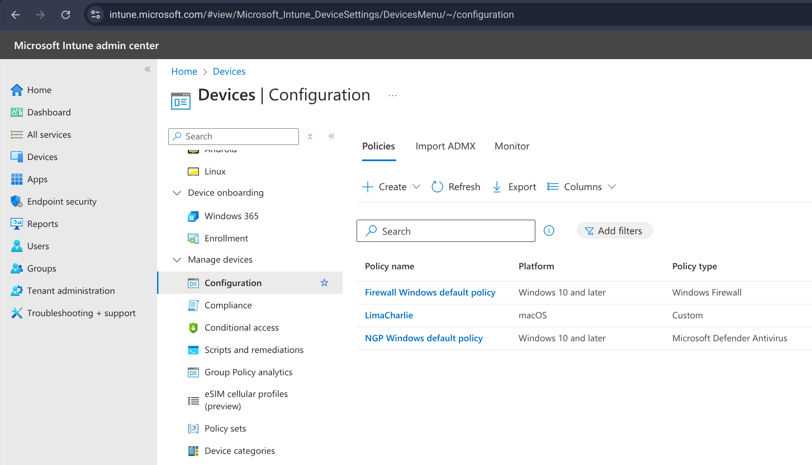
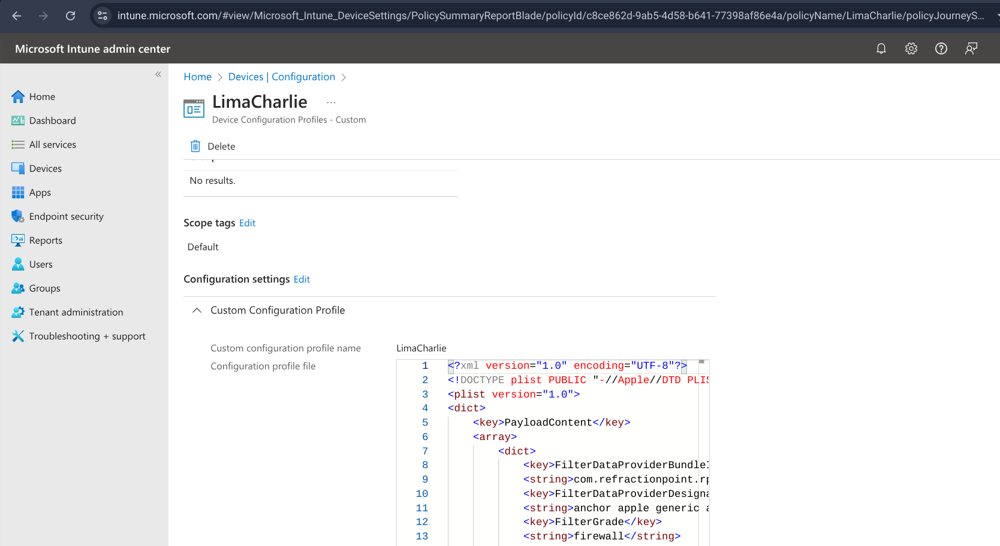
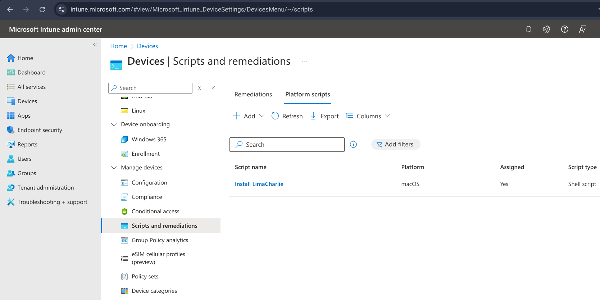
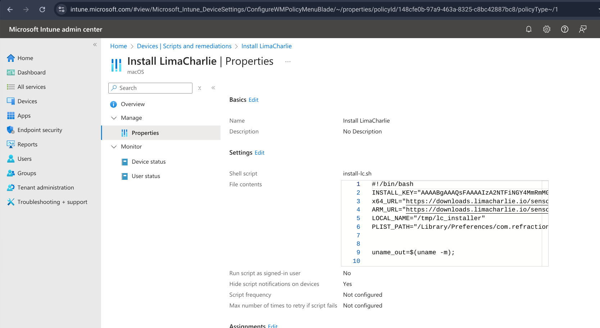

# macOS Agent Installation via Microsoft Intune

You can deploy the LimaCharlie Sensor for macOS with the MDM provider that you choose. These instructions show how to deploy the LimaCharlie Sensor for macOS with Microsoft Intune.

## MDM Profile

Set up the installation script with these steps:

1. In the [Microsoft Intune admin center](https://intune.microsoft.com/), go to Devices → Manage Devices → Configuration.

    

2. Choose [Policies](https://intune.microsoft.com/?ref=AdminCenter#view/Microsoft_Intune_DeviceSettings/DevicesMenu/~/configuration), click the Create button, and choose New Policy.

    1. Set the Platform to macOS.

    2. Set the Profile Type to Templates, then choose the template name "Custom".

    3. Click Create.

3. Enter the custom policy details as follows:

    1. Name: LimaCharlie

    2. Custom configuration profile name: LimaCharlie

    3. Deployment channel: Device channel

    4. Configuration profile file: Download and use the [LimaCharlie MDM profile](https://storage.googleapis.com/limacharlie-io/doc/sensor-installation/macOS/MDM_profiles/LimaCharlie.mobileconfig.zip).

Set the Assignments to include all users that need the profile.

## Installation Script

Set up the installation script with these steps:

1. In the [Microsoft Intune admin center](https://intune.microsoft.com/), go to Devices → Manage Devices → Scripts and remediations.

    

2. Choose [Platform scripts](https://intune.microsoft.com/?ref=AdminCenter#view/Microsoft_Intune_DeviceSettings/DevicesMenu/~/scripts), click the Add button, and choose macOS.

3. Set up the script with these parameters:

    Name: Install LimaCharlie

    Shell script: Download the [template shell script](https://storage.googleapis.com/limacharlie-io/doc/sensor-installation/macOS/MDM_profiles/sample-install-limacharlie.sh). Edit it to add your Installation Key before you upload it in MS Intune.

    Run script as signed-in user: No

    Hide script notifications on devices: Yes

    Script frequency: Not configured

    Max number of times to retry if script fails: 3

    Assignments: To install the application for all users, set the `Included groups` to `All Users`. To install it for some users, select the correct group.

