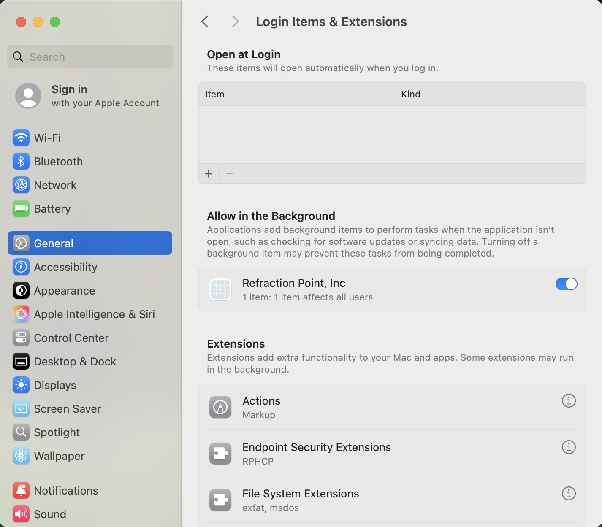
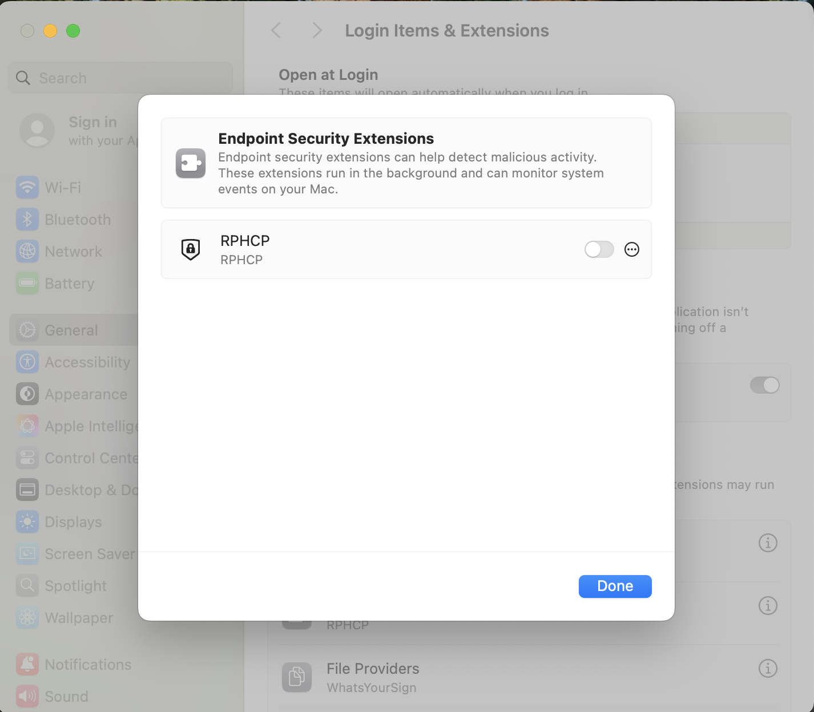
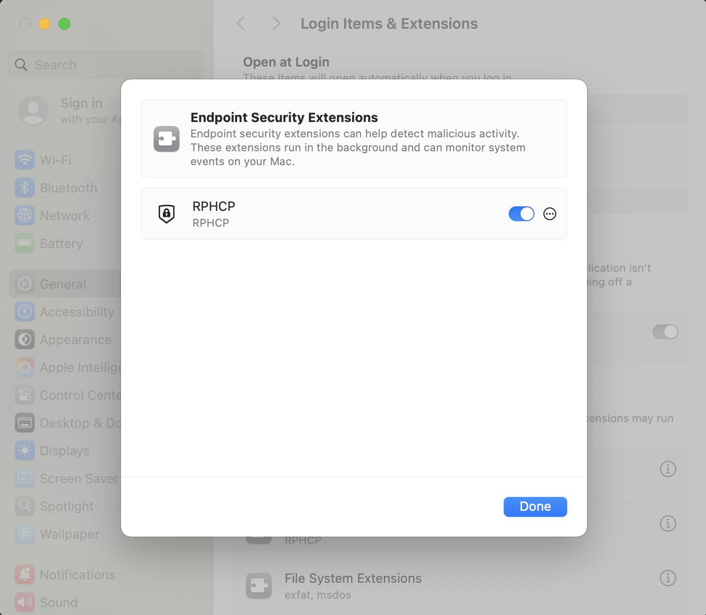
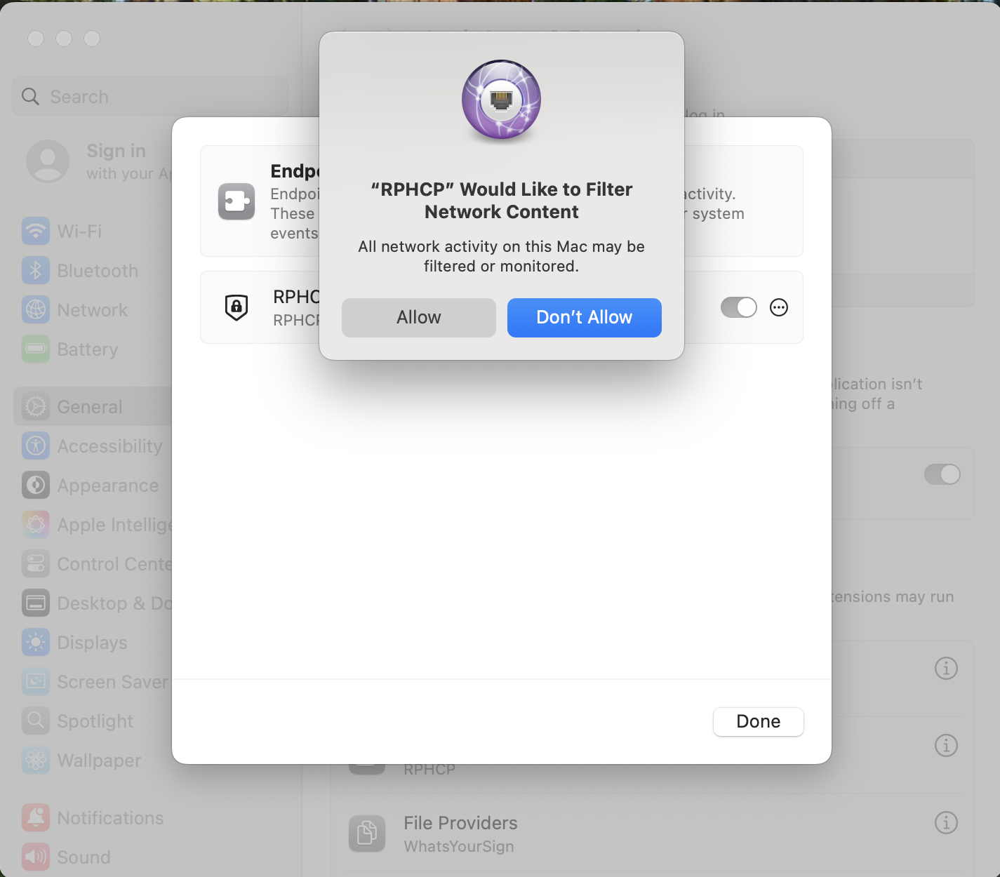
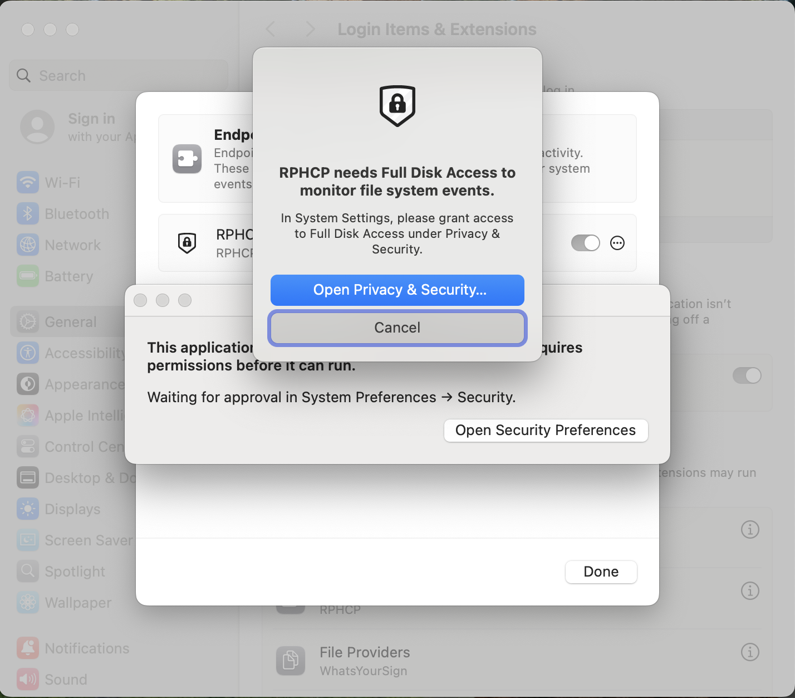
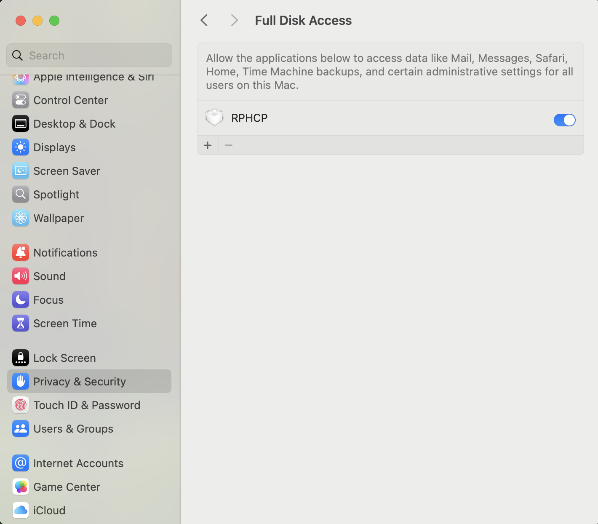

# macOS Agent Installation - Latest Versions (macOS 15 Sequoia and newer)

This document explains how to install, check, and uninstall the LimaCharlie Endpoint Agent on macOS (version 15 Sequoia). Separate documentation covers older versions.

## Installer Options

When you run the installer from the command line, you can pass these arguments:

```text
-v: verbose logging output.
-V: display the sensor build version.
-d <INSTALLATION_KEY>: the installation key to use to enroll, no permanent installation.
-i <INSTALLATION_KEY>: install executable as a service with deployment key.
-r: uninstall executable as a service.
-c: uninstall executable as a service and delete identity files.
-H: verify sensor health and write a diagnostic report.
-w: executable is running as a macOS service.
-h: displays the list of accepted arguments.
```

For the complete list of options, environment variables, and local files, see the [Agent CLI & Environment Reference](../cli-reference.md).

## Installation Flow

1. Download the sensor installer file. Use the installer for [Intel Mac](https://downloads.limacharlie.io/sensor/mac/64) or [Apple Silicon Mac](https://downloads.limacharlie.io/sensor/mac/arm64).
2. Add execute permission to the installer file from the command line.

    > chmod +x lc\_sensor

3. Run the installer from the command line. Pass the argument -i and your Installation Key.

    > sudo ./lc\_sensor -i YOUR\_INSTALLATION\_KEY\_GOES\_HERE

    Get the installation key from the [Installation Keys](../../installation-keys.md) section of the LimaCharlie web application.

    The installer installs the sensor as a launchctl service. The installation starts the enrollment of the sensor with the LimaCharlie cloud.

    

4. Wait for the application (`RPHCP.app`) to install in the /Applications folder and start. This can take a few minutes after the installation.

    macOS asks you to grant permission to install system extensions. Click the "**Open System Settings**" button.

    

5. Set the toggle for "Allow in the Background" next to "Refraction Point, Inc." to On.

    

6. Click the "i" info icon next to "Endpoint Security Extensions", then set the toggle next to "RPHCP" to on.

    

    

7. Click the "Allow" button after you set that toggle. This lets RPHCP filter network content.

    

8. Select the checkbox next to the RPHCP app in System Preferences -> Privacy -> Full Disk Access. macOS asks you to grant Full Disk Access.

    

    

The installation is complete. A message shows that the installation was successful.


## Verifying Installation

To check that the sensor installed correctly, log in to the LimaCharlie web application and look for the device in the Sensors section. You can also check the device itself.

In a Terminal, run the command:

> sudo launchctl list | grep com.refractionpoint.rphcp


If the sensor runs, the command returns records as shown above.

You can also open the /Applications folder and start RPHCP.app.


To confirm that the network filter is installed and enabled, go to System Settings → Network → VPN & Filters. "RPHCP" shows in the list with the status Enabled.

.png)

The application shows a message that tells you if the necessary permissions are granted.


Keep the RPHCP.app application in the /Applications folder, as the dialog describes. The application does not continue to operate correctly in another folder.

### A note on permissions

Apple designed the installation of extensions on macOS to need several clicks. LimaCharlie uses these extensions. The first time that you install the sensor on a macOS system, you must grant permissions in System Preferences.

An Apple-approved MDM solution is the only way to automate the installation. Large organizations often use these solutions to manage a Mac fleet. If you use such a solution, see your vendor's documentation about how to add extensions to the allow list for the full fleet.

LimaCharlie knows that this process is an inconvenience, and hopes that Apple supplies better solutions for security vendors in the future.

## Uninstallation Flow

To uninstall the sensor:

1. Run the installer from the command line. Pass the argument -c.

    > sudo ./hcp\_osx\_x64\_release\_4.23.0 -c

    

2. Enter your password and press OK when macOS asks for credentials to change system extensions.

    

    macOS removes the related system extension and removes `RPHCP.app` from the /Applications folder.

3. Look for the message that shows that the uninstallation was successful.

    

Note: The uninstallation removes the LimaCharlie sensor and the related extensions. macOS needs a reboot to unload and remove the extensions completely.

## Install Using MDM Solutions

For the Mobile Device Management (MDM) Configuration Profile that deploys the LimaCharlie agent to an enterprise fleet, see [macOS Agent Installation with MDM Solutions](mdm-profiles.md).
