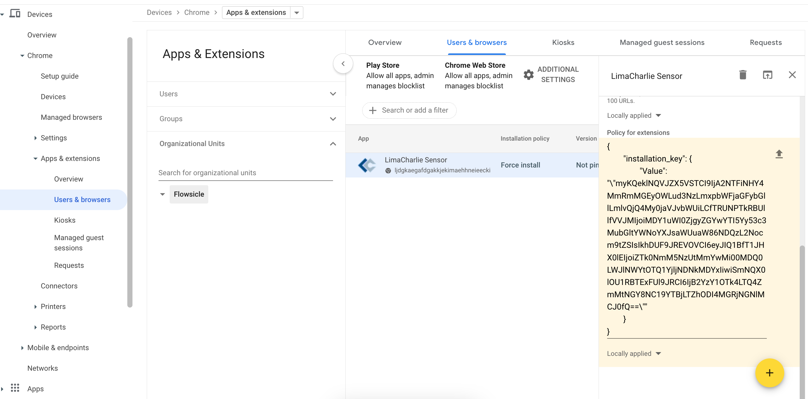
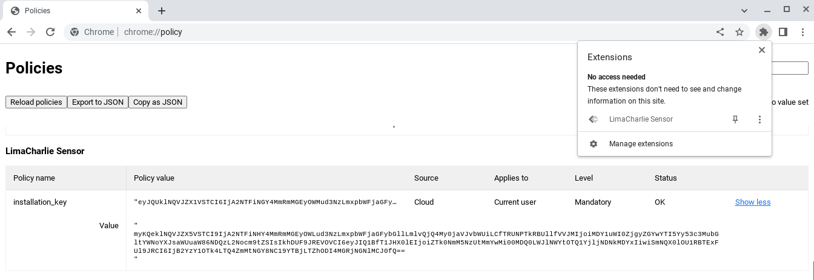

# ChromeOS with Google Chrome Enterprise

You can deploy the LimaCharlie Sensor for ChromeOS to many devices with Google Workspace and [Google Chrome Enterprise](https://chromeenterprise.google/).

## Configuration

1. Log into Google Workspace Admin and go to [Devices -> Chrome -> Apps & extensions -> Users & Browsers](https://admin.google.com/ac/chrome/apps/user).
2. In the **Users & browsers** tab, click the "+" button in the bottom right. Then select "Add from Chrome Web Store".
3. Search for the [LimaCharlie Sensor](https://chrome.google.com/webstore/detail/limacharlie-sensor/ljdgkaegafdgakkjekimaehhneieecki) extension and click Select.
4. Click the LimaCharlie Sensor app to show the installation policy.
5. Set the "Installation Policy" to "Force install".
6. Set the "Policy for extensions" value to this:

    ```json
    {
        "installation_key": {
            "Value": "\"KEY\""
        }
    }
    ```

    IMPORTANT: Replace the text "KEY" with the value of your Installation Key. Use the **Chrome Key**, which you can get from the LimaCharlie web app.

*Example*


## Verifying Configuration

ChromeOS endpoints now show in the sensor list of the related LimaCharlie Organization.

To check that the configuration is correct, examine an individual endpoint.

1. Confirm that the LimaCharlie Sensor extension shows in the list of extensions.
2. Open `chrome://policy` and find the LimaCharlie Sensor.
3. Check that the Policy name is `installation_key` and that the Policy Value is your installation key. The Source is "Cloud".


