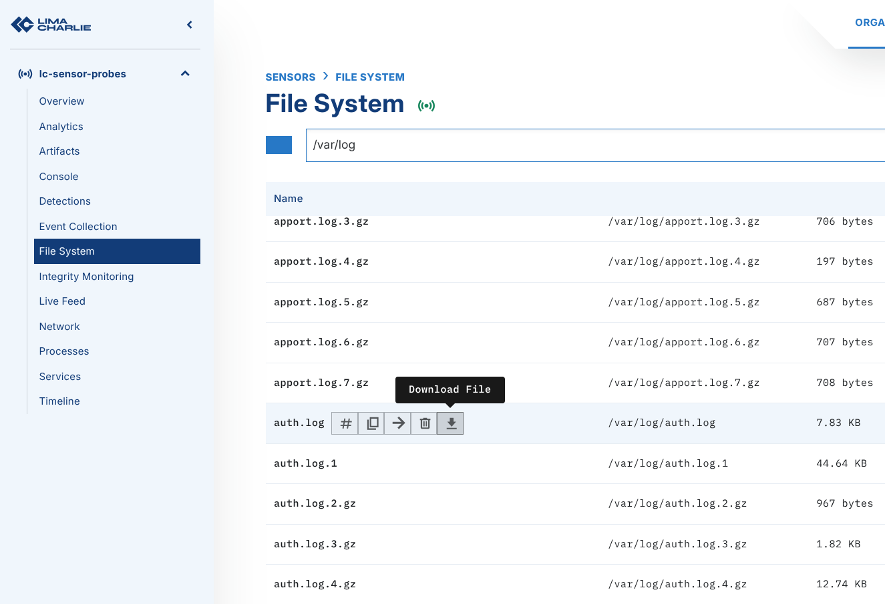
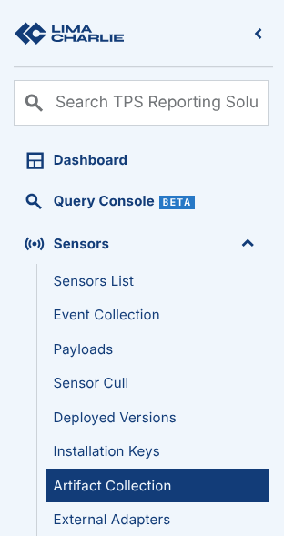
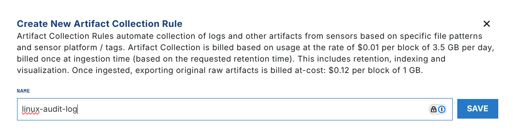
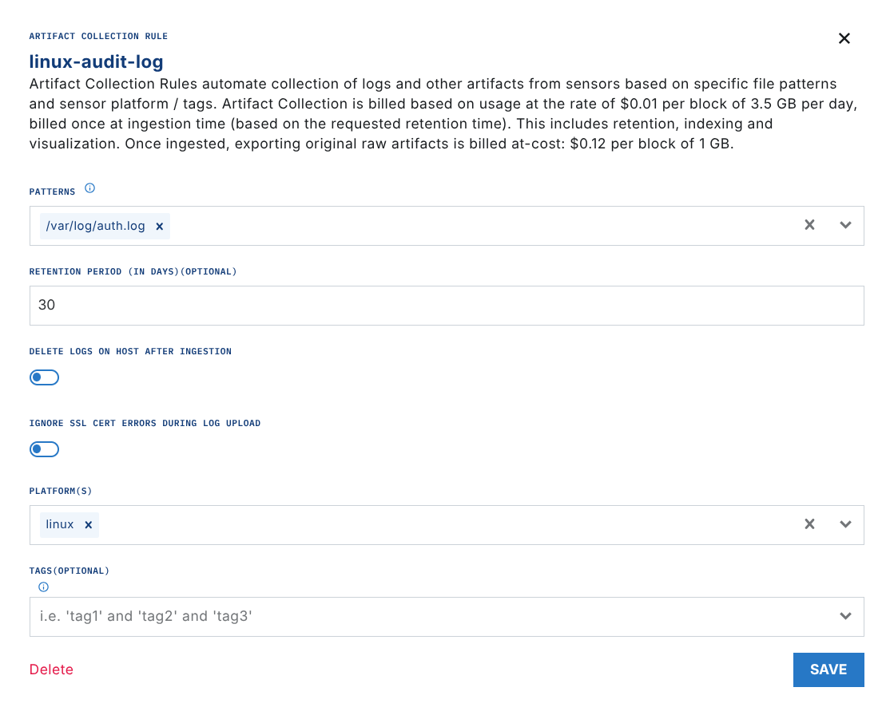

# Ingesting Linux Audit Logs

A common data source on Linux systems is the `audit.log` file. By default, this file stores entries from the Audit system. These entries contain information about logins, privilege escalations, and other events that relate to accounts. See [Audit Log file documentation](https://access.redhat.com/documentation/en-us/red_hat_enterprise_linux/6/html/security_guide/sec-understanding_audit_log_files).

You can ingest Linux Audit logs into LimaCharlie with these techniques:

1. Pull the raw logs with Artifacts or with the File System navigator *(EDR sensors only)*
2. Collect the files with **Artifact Collection.**
3. Stream the raw audit log through a `file` adapter.

This tutorial explains these techniques. You can also configure adapters as syslog listeners. Another tutorial explains that configuration.

## File System Browser

The Windows, Linux, and macOS EDR sensors can navigate the file system. For a single, ad-hoc collection of the `auth.log`, use the File System capability. Navigate to `/var/log` and download `auth.log`.



## Artifact Collection

Artifact collection is the best method if you do not need to stream the Linux Audit logs, but want to keep a copy of them. This technique collects the files automatically, but it does not stream the events to your **Timeline**.

**Step 1:** In the Navigation Pane, select `Artifact Collection`.



**Step 2:** Create an artifact collection rule for `/var/log/auth.log`. This example uses a retention period of 30 days. Choose the correct retention period for your use case.



Click **Save**.



**Step 3:** Save the artifact rule. The cloud sends the rule to the applicable sensors. After the Sensor collects the `auth.log`, the file is shown in the Artifacts menu.

.png)

More logs

To collect more than the most recent `auth.log`, specify a regular expression. The expression captures all archived copies of the log files. Be careful with the retention period, and make sure that you do not duplicate data.

## File Adapter Ingestion

You can also deploy a LimaCharlie [Adapter](../adapters/index.md) that points to `auth.log`. The adapter collects the events and streams them directly. Each Adapter creates a separate telemetry "stream", so combine file types where possible.

**Step 1:** Create an Installation Key for your adapter. Download the applicable binary.

**Step 2:** Deploy the adapter on each system that collects logs. Use a configuration file when you test the adapter, so that you can track changes. The sample file below ingests `auth.log` events as basic text.

```yaml
file:
  client_options:
    identity:
      installation_key: <installation_key>
      oid: <oid>
    platform: text
    sensor_seed_key: audit-log-events
  file_path: /var/log/auth.log
  no_follow: false
```

See [adapter configuration and usage](../adapters/usage.md) for more detail.

**Step 3:** Run the adapter. Give the `file` option and the applicable config file.

`$ ./lc_adapter file /tmp/config.yml`

The adapter loads the config and shows the options in the terminal.

### Note: This is not a persistent install; utilize your operating system's init/systemctl capabilities to create a persistent adapter

**Step 4:** Return to the LimaCharlie web UI. The events start to arrive almost immediately.

.png)

A `text` platform ingests data as basic text. You can use formatting options to parse the fields of your `auth.log` format.
