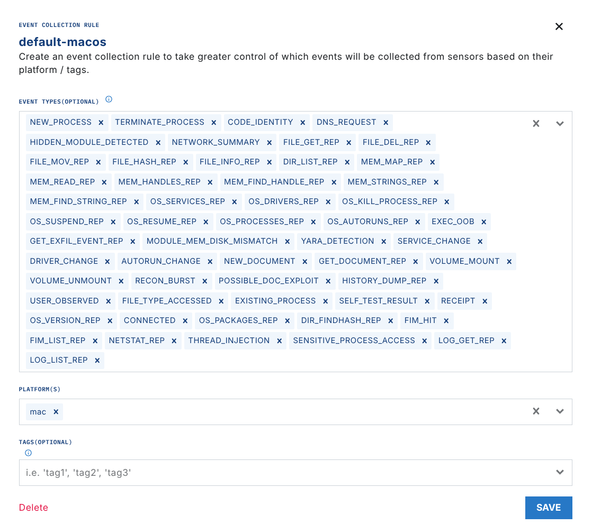
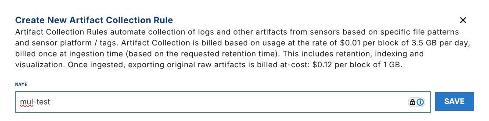
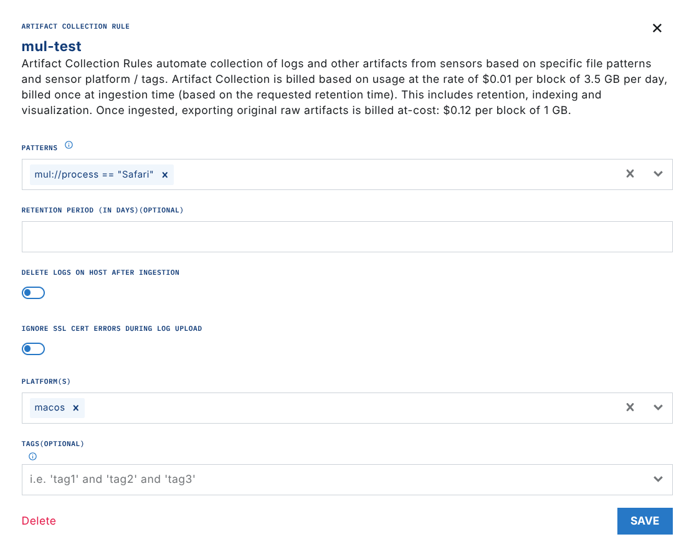

# Ingesting MacOS Unified Logs

You can ingest MacOS Unified Logs (MUL) in real time with the LimaCharlie EDR Sensor.

First, go to the Exfil Control section of LimaCharlie. Make sure that `MUL` events are enabled for your Mac rules.

Next, go to the `Artifact Collection` section. Create an artifact collection rule for the MacOS Unified Logs that you want.

To ingest real-time MUL events in the timeline, use the `mul://[Predicate]` format. The predicate is a standard [MacOS MUL predicate](https://www.macminivault.com/faq/introduction-to-macos-unified-logs/). For example, use this pattern to ingest the Safari logs:

`mul://process == "Safari"`

If you ingest MacOS Unified Logs with a `mul://` pattern, the sensor streams them in real time with the native EDR events. These logs are included in the flat rate price of the sensor.

After you apply these settings, the MacOS Unified Logs data from your endpoints starts to arrive in 10 minutes. To check this, open the Timeline view and select the `MUL` event type.

## Endpoint Detection & Response

Similar to agents, Sensors send telemetry to the LimaCharlie platform as EDR telemetry or as forwarded logs. Sensors are a scalable, serverless solution that connects the endpoints of an organization to the cloud securely.

In LimaCharlie, Exfil (Event Collection) is a configuration extension. It decides which types of events the endpoint agents collect and send to the cloud. It controls the data flow, so that the agents send only the specified events for monitoring and analysis. To capture specific events, enable them in the Exfil or Event Collection settings.

## Related Articles

- [Mac Unified Logging](../adapters/types/mac-unified-logging.md)

## What's Next

- [Log Collection Guide](../log-collection-guide.md)
