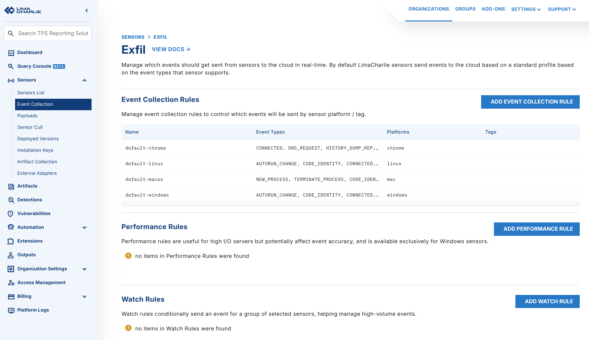
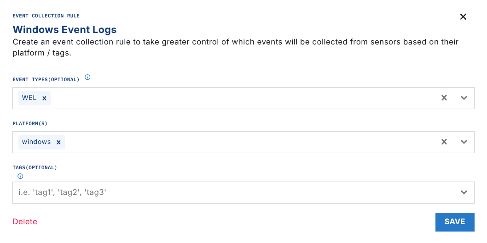
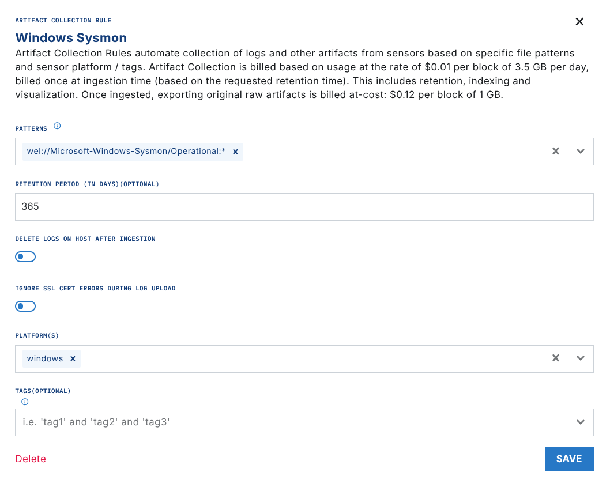

# Ingesting Sysmon Event Logs

Sysmon is a valuable addition to the tools of a defender, because it gives verbose log data. The native EDR capabilities of LimaCharlie collect much of the same telemetry. But you can combine Sysmon and LimaCharlie to get granular coverage of Windows systems.

After you deploy Sysmon, use the native Windows Event Log (WEL) streaming capability of LimaCharlie to bring the logs into the Sensor timeline.

1. Install [Sysmon](https://docs.microsoft.com/en-us/sysinternals/downloads/sysmon) on the endpoint.

   - Do this with the Payload functionality of LimaCharlie, with a rule, or manually.
   - You must restart the LimaCharlie agent before the Sysmon data is shown in the timeline.
   - Example rule that deploys Sysmon with payloads on Windows systems that have the `deploy-sysmon` tag:

     ```powershell
     detect:
       events:
         - CONNECTED
       op: and
       rules:
         - op: is platform
           name: windows
         - op: is tagged
           tag: deploy-sysmon
     respond:
     - action: task
       command: put --payload-name sysmon.exe --payload-path "C:\Windows\Temp\sysmon.exe"
     - action: wait
       duration: 10s
     - action: task
       command: put --payload-name sysmon-config.xml --payload-path "C:\Windows\Temp\sysmon-config.xml"
     - action: wait
       duration: 10s
     - action: task
       command: run --shell-command "C:\Windows\Temp\sysmon.exe -accepteula -i C:\Windows\Temp\sysmon-config.xml"
     - action: wait
       duration: 10s
     - action: task
       command: file_del "C:\Windows\Temp\sysmon.exe"
     - action: task
       command: file_del "C:\Windows\Temp\sysmon-config.xml"
     - action: remove tag
       tag: deploy-sysmon
     - action: task
       command: restart
     ```

2. In the Organization where you want to collect Sysmon data, go to the `Event Collection > Event Collection Rules` section.

    

3. Make sure that `WEL` events are collected for Windows systems.

    

4. Go to the `Artifact Collection` section. Add a new collection rule with this path to bring in all Sysmon events:

    `wel://Microsoft-Windows-Sysmon/Operational:*`

    

    **Note:** You can use tags or other filters to limit the systems that the logs come from.

    Event Filtering

    You can filter events by event ID to import select events. For example:

    `wel://Microsoft-Windows-Sysmon/Operational:16`

    `wel://Microsoft-Windows-Sysmon/Operational:25`

5. Wait up to 10 minutes for the data to arrive in LimaCharlie after you set up a new Artifact Collection rule. After that point, the data flows in real time.
6. Go to the Timeline view of a Sensor to confirm that the Sysmon logs are present. Search for the Event Type `WEL` and for `Microsoft-Windows-Sysmon` to validate the telemetry.

    .png)
