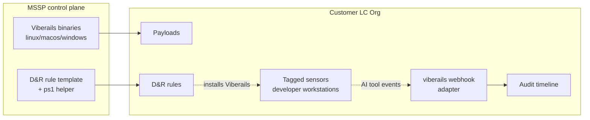

# Deploying Viberails at Scale via Payloads (MSSP Guide)

[Viberails](https://viberails.io) is a control plane for AI coding assistants (Claude Code, Cursor, Gemini CLI, GitHub Copilot CLI, Codex, OpenCode, OpenClaw). It installs lightweight hooks into each tool so every prompt and tool call is audited and authorized through LimaCharlie.

This guide is for MSSPs, MSPs, and MDR providers who **already run LimaCharlie for their customers**: each customer has their own LC organization with the endpoint agent deployed. The goal here is to add Viberails coverage onto those existing organizations so each customer's AI coding assistant activity lands in their own LC org, alongside the rest of their telemetry.

The whole rollout is done through the LimaCharlie tooling you are already using: the [Payloads](../endpoint-agent/payloads.md) feature delivers the Viberails binary, a [D&R rule](../../3-detection-response/index.md) installs it under the developer's user account, and the [Payload Manager](../../5-integrations/extensions/limacharlie/payload-manager.md) extension and/or [Git-Sync](../../5-integrations/extensions/limacharlie/git-sync.md) fan everything out across your customer fleet.

## Why this works well for MSSPs

- **No new infrastructure.** Anywhere the LimaCharlie agent is already deployed, you can ship and execute a payload — no new MDM, no new VPN, no installer to email developers, no new SaaS console.
- **Customer data stays with the customer.** Viberails events flow into the customer's own LC org via a per-org webhook adapter. The MSSP retains the same access it already had — through Organization Groups and RBAC — and nothing about data ownership changes.
- **Fits IaC.** Payloads, installation rules, and D&R rules can all be templated and pushed to many customer organizations through the [Payload Manager](../../5-integrations/extensions/limacharlie/payload-manager.md) extension or [Git-Sync](../../5-integrations/extensions/limacharlie/git-sync.md).
- **Targeted, not fleet-wide.** Sensor tags let you scope the rollout to developer machines only, and the [sensor selector](../../1-getting-started/use-cases/investigation-guide.md) syntax keeps that targeting consistent across customers.

## How it works



For each customer LC org:

1. The MSSP provisions a `viberails` webhook adapter once via `viberails init-team --existing-org <CUSTOMER_OID>`. This creates the per-org team URL that Viberails on the endpoint will report to, and also seeds a set of Viberails-specific D&R rules in the customer's `dr-general` hive.
2. The MSSP uploads the Viberails binaries (one per OS/architecture) and a small PowerShell helper as Payloads in the customer org — normally via the Payload Manager so they stay in sync as Viberails releases new versions.
3. A D&R rule in the customer org fires on `CONNECTED` for sensors tagged `viberails-deploy`, `put`s the right binary, and runs `join-team` + `install --providers all` as the interactively signed-in user.
4. Viberails reports every AI tool prompt and tool call back to the same customer LC org through the webhook adapter. There is no separate "Viberails team" or shared MSSP team in the picture.

## Prerequisites

- One LimaCharlie organization **per customer**, with the endpoint agent already deployed on the developer workstations you want to cover.
- API permissions in each customer org to:
  - read org metadata: `org.get`
  - create the webhook adapter: `cloudsensor.get`, `cloudsensor.set` (the adapter lives in the `cloud_sensor` hive)
  - create its installation key: `ikey.list`, `ikey.set`
  - manage payloads: `payload.ctrl`, `payload.use`
  - manage rules: `dr.list`, `dr.set`, `dr.del`
  - manage tags: `sensor.tag`
- The [Payload Manager](../../5-integrations/extensions/limacharlie/payload-manager.md) extension installed in each target org if you want centralized syncing of payloads.
- A LimaCharlie account that can OAuth into each customer org (interactively) for the one-shot `init-team --existing-org` step. The rest of the rollout is fully scriptable through the LimaCharlie CLI / API.

## Step 1 — Provision Viberails reception in each customer org

Viberails reports its events to a per-org **team URL** of the form `https://<id>.hook.limacharlie.io/<oid>/viberails/<secret>`. The `<oid>` segment is the customer's LimaCharlie OID — so a customer's Viberails events land in that customer's org and nowhere else.

The simplest way to provision this is to install Viberails locally on an MSSP workstation and run `init-team` against each customer's existing org. `--existing-org` skips the "create new team" path:

```bash
# Once per customer org. This will:
#  - create a webhook adapter named `viberails` in the customer's `cloud_sensor` hive
#  - seed a set of Viberails-specific D&R rules in the customer's `dr-general` hive
#  - print the per-customer team URL — record this; you will need it in Step 4
viberails init-team --existing-org <CUSTOMER_OID>
```

The command is interactive (OAuth) but only needs to run once per org. The webhook URL is stable; record it next to the OID in your customer inventory.

If you prefer a fully scripted setup (no interactive OAuth), you can recreate the same artifacts using a non-interactive LimaCharlie credential against each customer org:

1. `limacharlie --oid <CUSTOMER_OID> installation-key create --description "viberails webhook adapter" --get` to create the installation key.
2. `limacharlie --oid <CUSTOMER_OID> cloud-adapter set --key viberails --input-file viberails-adapter.json` to create the webhook adapter entry. The adapter JSON references the installation key from step 1, sets `secret` to a freshly generated UUID, and sets the type to `webhook` with `enabled: true`.
3. Fetch the org's hook domain (it varies per datacenter — query the `org urls` endpoint) and assemble the team URL as `https://<hooks_domain>/<CUSTOMER_OID>/viberails/<secret>`.

Recording the team URL in your customer inventory is still the only output you actually need for the rest of this guide.

!!! note "Where Viberails D&R rules come from"
    `init-team` seeds a set of detection rules covering SSH key access, hook-config tampering, binary-tamper, cloud-cred access, suspicious TLDs, and similar primer detections. These are independent of the deployment rule built in Step 4 — they detect things Viberails-instrumented tools do at runtime. If you maintain Viberails rules centrally in Git-Sync, you can disable or override these per-customer.

## Step 2 — Tag developer workstations

Pick a tag that identifies machines where AI coding assistants are used. We will use `viberails-deploy` throughout this guide.

You can tag manually from the Sensors view, with the CLI, or automatically based on installed software. A common pattern is to add the tag at install time via the [installation key](../installation-keys.md), so any new developer workstation enrolling under that key inherits the tag.

```bash
# Tag a single sensor
limacharlie --oid <CUSTOMER_OID> tag add --sid <SENSOR_ID> --tag viberails-deploy

# Or tag every sensor matching a selector — see `limacharlie tag mass-add --help`
limacharlie --oid <CUSTOMER_OID> tag mass-add --selector 'plat == windows and "developer" in tags' --tag viberails-deploy
```

See [Sensor Tags](../sensor-tags.md) for the full mechanics.

## Step 3 — Upload the Viberails binaries as payloads

Viberails publishes signed binaries for every supported OS/architecture at `get.viberails.io`. Download them once on a trusted host and verify checksums against [release.json](https://get.viberails.io/release.json), then upload each one as a [payload](../endpoint-agent/payloads.md).

```bash
# Download
curl -fsSL -o viberails-linux-x64       https://get.viberails.io/viberails-linux-x64
curl -fsSL -o viberails-linux-arm64     https://get.viberails.io/viberails-linux-arm64
curl -fsSL -o viberails-macos-x64       https://get.viberails.io/viberails-macos-x64
curl -fsSL -o viberails-macos-arm64     https://get.viberails.io/viberails-macos-arm64
curl -fsSL -o viberails-windows-x64.exe https://get.viberails.io/viberails-windows-x64.exe

# Upload to one customer org via the CLI
for f in viberails-linux-x64 viberails-linux-arm64 \
         viberails-macos-x64 viberails-macos-arm64 \
         viberails-windows-x64.exe; do
  limacharlie --oid <CUSTOMER_OID> payload upload --name "$f" --file "./$f"
done

# Also upload the Windows PowerShell helper (defined in Step 4).
limacharlie --oid <CUSTOMER_OID> payload upload --name viberails-install.ps1 --file ./viberails-install.ps1
```

!!! tip "Naming"
    The payload **name** is also the on-disk file name when it lands on the endpoint, and it determines the file extension that the OS uses to decide how to execute it. Keep the `.exe` suffix for Windows so it runs as a native executable.

### Distributing payloads across many customer orgs

For more than a handful of organizations, do not upload payloads one by one. Instead, drive the upload through the [Payload Manager](../../5-integrations/extensions/limacharlie/payload-manager.md):

- Store the binaries in an object store (GCS, S3, an internal artifact registry) keyed by version.
- Configure Payload Manager in each customer org to pull the same set of named payloads from that source.
- Payload Manager re-syncs payloads every 24 hours, so refreshing a Viberails release across the fleet is a single upload at the source.

When you ship a new Viberails release, replace the artifacts at the source URL and the change propagates everywhere.

## Step 4 — Create the deployment D&R rule

The rule below fires when a tagged sensor connects, drops the right binary onto disk, runs Viberails as the **active console user** (so hooks install in that user's home directory rather than `root`/`SYSTEM`), then removes the tag so the rule only fires once per workstation.

Replace `<CUSTOMER_TEAM_URL>` with the URL recorded for **this** customer in Step 1. Each customer gets a different value — when you sync the rule across customers via Git-Sync or templates, parameterize on this URL per org.

### Windows

```yaml
detect:
  event: CONNECTED
  op: and
  rules:
    - op: is platform
      name: windows
    - op: is tagged
      tag: viberails-deploy
respond:
  # 1. Drop the viberails binary.
  - action: task
    command: put --payload-name viberails-windows-x64.exe --payload-path "C:\Windows\Temp\viberails.exe"
  - action: wait
    duration: 10s
  # 2. Drop a small PowerShell helper that does the user-context dance.
  #    Upload this once as a payload named `viberails-install.ps1` (see below).
  - action: task
    command: put --payload-name viberails-install.ps1 --payload-path "C:\Windows\Temp\viberails-install.ps1"
  - action: wait
    duration: 5s
  # 3. Run the helper as SYSTEM; the helper itself launches viberails in the
  #    interactive user's session.
  - action: task
    command: run --shell-command "powershell -ExecutionPolicy Bypass -File C:\Windows\Temp\viberails-install.ps1 -TeamUrl <CUSTOMER_TEAM_URL>"
  - action: wait
    duration: 60s
  - action: task
    command: file_del "C:\Windows\Temp\viberails.exe"
  - action: task
    command: file_del "C:\Windows\Temp\viberails-install.ps1"
  - action: remove tag
    tag: viberails-deploy
  - action: add tag
    tag: viberails-installed
```

The PowerShell helper (`viberails-install.ps1`) — upload once as a payload alongside the binaries:

```powershell
param([Parameter(Mandatory = $true)][string]$TeamUrl)

# Find the active console user by querying the explorer.exe owner.
$explorer = Get-CimInstance Win32_Process -Filter "Name='explorer.exe'" |
    Select-Object -First 1
if (-not $explorer) {
    Write-Error "No interactive user signed in; aborting viberails install."
    exit 1
}
$owner = Invoke-CimMethod -InputObject $explorer -MethodName GetOwner
$runAs = "$($owner.Domain)\$($owner.User)"

# Create a one-shot task that runs viberails as the interactive user and
# self-deletes after the run. /Z deletes the task after completion.
$cmd = "C:\Windows\Temp\viberails.exe join-team `"$TeamUrl`" && " +
       "C:\Windows\Temp\viberails.exe install --providers all"
schtasks /Create /F /TN VRInstall /SC ONCE /ST 00:00 /Z `
    /RU "$runAs" /IT /TR "cmd /c $cmd"
schtasks /Run /TN VRInstall
```

`/IT` makes the task run only when the named user is signed in, and `/Z` deletes the task definition once it completes. Sign and review this script before deploying it across customer orgs.

### macOS

```yaml
detect:
  event: CONNECTED
  op: and
  rules:
    - op: is platform
      name: macos
    - op: is tagged
      tag: viberails-deploy
respond:
  - action: task
    command: put --payload-name viberails-macos-arm64 --payload-path "/var/tmp/viberails"
  - action: wait
    duration: 10s
  - action: task
    command: run --shell-command "chmod +x /var/tmp/viberails"
  # USER/UID are read-only in bash, so use TARGET_USER/TARGET_UID.
  - action: task
    command: >
      run --shell-command
      "TARGET_USER=$(stat -f%Su /dev/console);
       TARGET_UID=$(id -u $TARGET_USER);
       launchctl asuser $TARGET_UID sudo -u $TARGET_USER -H /var/tmp/viberails join-team <CUSTOMER_TEAM_URL>;
       launchctl asuser $TARGET_UID sudo -u $TARGET_USER -H /var/tmp/viberails install --providers all"
  - action: wait
    duration: 30s
  - action: task
    command: file_del "/var/tmp/viberails"
  - action: remove tag
    tag: viberails-deploy
  - action: add tag
    tag: viberails-installed
```

For Intel hardware, swap `viberails-macos-arm64` for `viberails-macos-x64`. If you have a mixed fleet, use two tags (`viberails-deploy-arm`, `viberails-deploy-x64`) applied per host so each rule picks the right payload — there is no `is arch` operator in D&R rules, so architecture must be encoded in the tag (or in the selector at tag-time via `limacharlie tag mass-add --selector 'arch == arm64 and ...'`).

### Linux

```yaml
detect:
  event: CONNECTED
  op: and
  rules:
    - op: is platform
      name: linux
    - op: is tagged
      tag: viberails-deploy
respond:
  - action: task
    command: put --payload-name viberails-linux-x64 --payload-path "/tmp/viberails"
  - action: wait
    duration: 10s
  - action: task
    command: run --shell-command "chmod +x /tmp/viberails"
  # USER is read-only in bash, so use TARGET_USER. `who` returns one row per
  # active login session; this picks the first, which is fine for typical
  # single-developer workstations but should be revisited for multi-user hosts.
  - action: task
    command: >
      run --shell-command
      "TARGET_USER=$(who | awk 'NR==1{print $1}');
       sudo -u $TARGET_USER -H /tmp/viberails join-team <CUSTOMER_TEAM_URL>;
       sudo -u $TARGET_USER -H /tmp/viberails install --providers all"
  - action: wait
    duration: 30s
  - action: task
    command: file_del "/tmp/viberails"
  - action: remove tag
    tag: viberails-deploy
  - action: add tag
    tag: viberails-installed
```

!!! warning "User-context matters"
    Viberails stores its configuration in the **developer's** home directory — `~/.config/viberails/` on Linux, `~/Library/Application Support/viberails/` on macOS, `%APPDATA%\viberails\` on Windows — and installs hooks into per-tool config files there (`~/.claude/`, `~/.cursor/`, etc.). The binary lands at `~/.local/bin/viberails` on every platform. The endpoint agent runs payloads as `root`/`SYSTEM`, so the rules above explicitly drop privileges to the interactively signed-in user. Running Viberails as `root`/`SYSTEM` would install hooks for that account and leave the developer untouched.

    If no user is signed in when the rule fires, the install will fail. The simplest workaround is to fire on a different trigger that implies a user is present, or to leave the `viberails-deploy` tag in place until the rule sees a logged-in user and successfully completes.

## Step 5 — Distribute the rule to every customer org

Manage the rule the same way you manage every other MSSP-wide D&R rule. The two common patterns:

- **Git-Sync.** Commit the rule (and the payload manifest) to your shared infrastructure repo and let [Git-Sync](../../5-integrations/extensions/limacharlie/git-sync.md) push it to each customer org. Parameterize `<CUSTOMER_TEAM_URL>` per-org through the templating mechanism your repo uses.
- **Organization Groups + IaC CLI.** Define the rule once and apply it to every organization in your "developer-coverage" Organization Group via `limacharlie configs push`.

See [Designing Access for MSSPs](../../7-administration/access/designing-access.md) for the recommended Organization Group layout.

## Step 6 — Verify

For each newly tagged endpoint, confirm the install succeeded:

1. **Task results in the sensor timeline.** Each `put` task produces a [`RECEIPT`](../../8-reference/edr-events.md#receipt) event; each `run --shell-command` produces an `EXEC_OOB` event (macOS/Linux) and an audit entry on Windows. Confirm there are no errors. Viberails itself prints `Joined team successfully!` and `Hooks installed successfully!` to STDOUT when invoked correctly.
2. **Tag rotation.** The sensor should now carry `viberails-installed` and no longer carry `viberails-deploy`.
3. **Viberails events flowing.** Watch the same customer org's timeline (or the dedicated Viberails view in the app) for the first AI tool events the next time a developer uses one of the hooked tools — they arrive via the `viberails` webhook adapter you created in Step 1.

If verification fails, enable Viberails debug logging on the affected machine and inspect the debug directory: `~/.local/share/viberails/debug/` on Linux, `~/Library/Application Support/viberails/debug/` on macOS, `%LOCALAPPDATA%\viberails\debug\` on Windows. See [Viberails Troubleshooting](https://github.com/refractionPOINT/viberails#troubleshooting).

## Updating Viberails on the fleet

Viberails auto-upgrades itself by default whenever any hooked tool runs, so a one-shot install is normally enough. If you have disabled `auto_upgrade` per the [Viberails configuration](https://github.com/refractionPOINT/viberails#configuration), or you want to force-roll a version across all customer endpoints, add a second tag (e.g. `viberails-upgrade`) and a companion D&R rule that runs `viberails upgrade` instead of `install`.

## Removing Viberails

Use the same pattern in reverse: tag the targets `viberails-uninstall`, drop the binary as a payload, and run `viberails uninstall-all --yes` in the user's context. The `--yes` flag suppresses the interactive confirmation, which is essential under a non-interactive payload `run`.

---

## See Also

- [Payloads](../endpoint-agent/payloads.md)
- [Payload Manager](../../5-integrations/extensions/limacharlie/payload-manager.md)
- [Git-Sync](../../5-integrations/extensions/limacharlie/git-sync.md)
- [Sensor Tags](../sensor-tags.md)
- [Security Service Providers (MSSP, MSP, MDR)](../../1-getting-started/use-cases/mssp-msp-mdr.md)
- [Designing Access for MSSPs](../../7-administration/access/designing-access.md)
