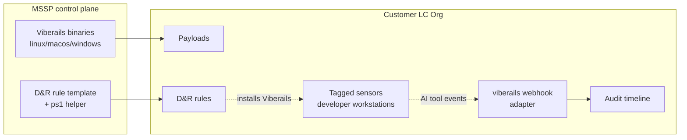

# Deploying Viberails at Scale via Payloads (MSSP Guide)

[Viberails](https://viberails.io) is a control plane for AI coding assistants (Claude Code, Cursor, Gemini CLI, GitHub Copilot CLI, Codex, OpenCode, OpenClaw). It installs hooks into each tool. LimaCharlie then audits and authorizes every prompt and tool call.

This guide is for MSSPs, MSPs, and MDR providers that **already run LimaCharlie for their customers**. Each customer has an LC organization with the sensor deployed. The goal is to add Viberails coverage to those organizations. The AI coding assistant activity of each customer then goes to that customer's own LC org, with the rest of their telemetry.

You do the full rollout with the LimaCharlie tools that you already use. The [Payloads](../endpoint-agent/payloads.md) feature delivers the Viberails binary. A [D&R rule](../../3-detection-response/index.md) installs the binary under the account of the developer. The [Payload Manager](../../5-integrations/extensions/limacharlie/payload-manager.md) extension, [Git-Sync](../../5-integrations/extensions/limacharlie/git-sync.md), or both distribute everything across your customer fleet.

## Why this works well for MSSPs

- **No new infrastructure.** You can send and run a payload on every host where the LimaCharlie sensor is deployed. You do not need a new MDM, a new VPN, an installer to email to developers, or a new SaaS console.
- **Customer data stays with the customer.** Viberails events go to the customer's own LC org through a webhook adapter for each org. The MSSP keeps the same access through Organization Groups and RBAC. Data ownership does not change.
- **Fits IaC.** You can make templates of payloads, installation rules, and D&R rules. You can push these templates to many customer organizations with the [Payload Manager](../../5-integrations/extensions/limacharlie/payload-manager.md) extension or [Git-Sync](../../5-integrations/extensions/limacharlie/git-sync.md).
- **Targeted, not fleet-wide.** Sensor tags let you limit the rollout to developer machines. The [sensor selector](../../1-getting-started/use-cases/investigation-guide.md) syntax keeps the same targets for each customer.

## How it works


```mermaid
flowchart LR
    subgraph MSSP[MSSP control plane]
        BIN[Viberails binaries<br/>linux/macos/windows]
        TPL[D&R rule template<br/>+ ps1 helper]
    end
    subgraph CUST[Customer LC Org]
        ADP[viberails webhook<br/>adapter]
        P[Payloads]
        R[D&R rules]
        S[Tagged sensors<br/>developer workstations]
        T[Audit timeline]
    end
    BIN --> P
    TPL --> R
    R -.installs Viberails.-> S
    S -.AI tool events.-> ADP
    ADP --> T
```

For each customer LC org:

1. The MSSP provisions a `viberails` webhook adapter one time with `viberails init-team --existing-org <CUSTOMER_OID>`. The command creates the team URL for that org, and Viberails on the endpoint reports to this URL. The command also adds a set of Viberails D&R rules to the customer's `dr-general` hive.
2. The MSSP uploads the Viberails binaries (one for each OS and architecture) and a small PowerShell helper as Payloads in the customer org. The MSSP normally does this with the Payload Manager, which keeps the payloads in sync when Viberails releases new versions.
3. A D&R rule in the customer org fires on `CONNECTED` for sensors that have the `viberails-deploy` tag. The rule `put`s the correct binary, then runs `join-team` and `install --providers all` as the interactively signed-in user.
4. Viberails reports every AI tool prompt and tool call to the same customer LC org through the webhook adapter. There is no separate "Viberails team" and no shared MSSP team.

## Prerequisites

- One LimaCharlie organization **per customer**, with the sensor already deployed on the developer workstations that you want to cover.
- API permissions in each customer org to:
  - read org metadata: `org.get`
  - create the webhook adapter: `cloudsensor.get`, `cloudsensor.set` (the adapter lives in the `cloud_sensor` hive)
  - create its installation key: `ikey.list`, `ikey.set`
  - manage payloads: `payload.ctrl`, `payload.use`
  - manage rules: `dr.list`, `dr.set`, `dr.del`
  - manage tags: `sensor.tag`
- The [Payload Manager](../../5-integrations/extensions/limacharlie/payload-manager.md) extension installed in each target org, if you want to sync payloads centrally.
- A LimaCharlie account that can OAuth interactively into each customer org for the single `init-team --existing-org` step. You can script the rest of the rollout with the LimaCharlie CLI or API.

## Step 1 — Provision Viberails reception in each customer org

Viberails reports its events to a **team URL** for each org. The URL has the form `https://<id>.hook.limacharlie.io/<oid>/viberails/<secret>`. The `<oid>` segment is the LimaCharlie OID of the customer, so the Viberails events of a customer go to that customer's org only.

To provision this URL, install Viberails on an MSSP workstation and run `init-team` against the existing org of each customer. The `--existing-org` flag skips the "create new team" path:

```bash
# Once per customer org. This will:
#  - create a webhook adapter named `viberails` in the customer's `cloud_sensor` hive
#  - seed a set of Viberails-specific D&R rules in the customer's `dr-general` hive
#  - print the per-customer team URL — record this; you will need it in Step 4
viberails init-team --existing-org <CUSTOMER_OID>
```

The command is interactive (OAuth), but you run it one time for each org. The webhook URL is stable. Record it next to the OID in your customer inventory.

For a fully scripted setup with no interactive OAuth, create the same artifacts with a non-interactive LimaCharlie credential against each customer org:

1. Run `limacharlie --oid <CUSTOMER_OID> installation-key create --description "viberails webhook adapter" --get` to create the installation key.
2. Run `limacharlie --oid <CUSTOMER_OID> cloud-adapter set --key viberails --input-file viberails-adapter.json` to create the webhook adapter entry. The adapter JSON refers to the installation key from step 1, sets `secret` to a new UUID, and sets the type to `webhook` with `enabled: true`.
3. Get the hook domain of the org. The domain is different for each datacenter, so query the `org urls` endpoint. Then assemble the team URL as `https://<hooks_domain>/<CUSTOMER_OID>/viberails/<secret>`.

The team URL in your customer inventory is still the only output that you need for the rest of this guide.

!!! note "Where Viberails D&R rules come from"
    `init-team` adds a set of detection rules. The rules cover SSH key access, changes to the hook configuration, binary tampering, access to cloud credentials, suspicious TLDs, and similar primer detections. These rules are independent of the deployment rule that you build in Step 4. They detect what Viberails-instrumented tools do at runtime. If you keep Viberails rules centrally in Git-Sync, you can disable or override these rules for each customer.

## Step 2 — Tag developer workstations

Pick a tag that identifies the machines that use AI coding assistants. This guide uses `viberails-deploy`.

You can add the tag manually from the Sensors view, with the CLI, or automatically from the installed software. A common pattern is to add the tag at install time with the [installation key](../installation-keys.md). Each new developer workstation that enrolls with that key then gets the tag.

```bash
# Tag a single sensor
limacharlie --oid <CUSTOMER_OID> tag add --sid <SENSOR_ID> --tag viberails-deploy

# Or tag every sensor matching a selector — see `limacharlie tag mass-add --help`
limacharlie --oid <CUSTOMER_OID> tag mass-add --selector 'plat == windows and "developer" in tags' --tag viberails-deploy
```

See [Sensor Tags](../sensor-tags.md) for the full mechanics.

## Step 3 — Upload the Viberails binaries as payloads

Viberails publishes signed binaries for each supported OS and architecture at `get.viberails.io`. Download the binaries one time on a trusted host and check the checksums against [release.json](https://get.viberails.io/release.json). Then upload each binary as a [payload](../endpoint-agent/payloads.md).

```bash
# Download
curl -fsSL -o viberails-linux-x64       https://get.viberails.io/viberails-linux-x64
curl -fsSL -o viberails-linux-arm64     https://get.viberails.io/viberails-linux-arm64
curl -fsSL -o viberails-macos-x64       https://get.viberails.io/viberails-macos-x64
curl -fsSL -o viberails-macos-arm64     https://get.viberails.io/viberails-macos-arm64
curl -fsSL -o viberails-windows-x64.exe https://get.viberails.io/viberails-windows-x64.exe

# Upload to one customer org via the CLI
for f in viberails-linux-x64 viberails-linux-arm64 \
         viberails-macos-x64 viberails-macos-arm64 \
         viberails-windows-x64.exe; do
  limacharlie --oid <CUSTOMER_OID> payload upload --name "$f" --file "./$f"
done

# Also upload the Windows PowerShell helper (defined in Step 4).
limacharlie --oid <CUSTOMER_OID> payload upload --name viberails-install.ps1 --file ./viberails-install.ps1
```

!!! tip "Naming"
    The payload **name** is also the file name on disk when the payload arrives on the endpoint. The name gives the file extension that the OS uses to run the file. Keep the `.exe` suffix for Windows so the file runs as a native executable.

### Distributing payloads across many customer orgs

Do not upload payloads one by one for more than a few organizations. Use the [Payload Manager](../../5-integrations/extensions/limacharlie/payload-manager.md) instead:

- Store the binaries in an object store (GCS, S3, an internal artifact registry) with a key for each version.
- Configure Payload Manager in each customer org to pull the same set of named payloads from that source.
- Payload Manager re-syncs payloads every 24 hours. One upload at the source therefore updates a Viberails release across the fleet.

When you release a new Viberails version, replace the artifacts at the source URL. The change then propagates everywhere.

## Step 4 — Create the deployment D&R rule

The rule below fires when a tagged sensor connects. The rule writes the correct binary to disk. It then runs Viberails as the **active console user**, so the hooks install in the home directory of that user and not under `root`/`SYSTEM`. The rule then removes the tag, so it fires one time for each workstation.

Replace `<CUSTOMER_TEAM_URL>` with the URL that you recorded for **this** customer in Step 1. Each customer has a different value. When you sync the rule to many customers with Git-Sync or templates, make this URL a parameter for each org.

### Windows

```yaml
detect:
  event: CONNECTED
  op: and
  rules:
    - op: is platform
      name: windows
    - op: is tagged
      tag: viberails-deploy
respond:
  # 1. Drop the viberails binary.
  - action: task
    command: put --payload-name viberails-windows-x64.exe --payload-path "C:\Windows\Temp\viberails.exe"
  - action: wait
    duration: 10s
  # 2. Drop a small PowerShell helper that does the user-context dance.
  #    Upload this once as a payload named `viberails-install.ps1` (see below).
  - action: task
    command: put --payload-name viberails-install.ps1 --payload-path "C:\Windows\Temp\viberails-install.ps1"
  - action: wait
    duration: 5s
  # 3. Run the helper as SYSTEM; the helper itself launches viberails in the
  #    interactive user's session.
  - action: task
    command: run --shell-command "powershell -ExecutionPolicy Bypass -File C:\Windows\Temp\viberails-install.ps1 -TeamUrl <CUSTOMER_TEAM_URL>"
  - action: wait
    duration: 60s
  - action: task
    command: file_del "C:\Windows\Temp\viberails.exe"
  - action: task
    command: file_del "C:\Windows\Temp\viberails-install.ps1"
  - action: remove tag
    tag: viberails-deploy
  - action: add tag
    tag: viberails-installed
```

Upload the PowerShell helper (`viberails-install.ps1`) one time as a payload with the binaries:

```powershell
param([Parameter(Mandatory = $true)][string]$TeamUrl)

# Find the active console user by querying the explorer.exe owner.
$explorer = Get-CimInstance Win32_Process -Filter "Name='explorer.exe'" |
    Select-Object -First 1
if (-not $explorer) {
    Write-Error "No interactive user signed in; aborting viberails install."
    exit 1
}
$owner = Invoke-CimMethod -InputObject $explorer -MethodName GetOwner
$runAs = "$($owner.Domain)\$($owner.User)"

# Create a one-shot task that runs viberails as the interactive user and
# self-deletes after the run. /Z deletes the task after completion.
$cmd = "C:\Windows\Temp\viberails.exe join-team `"$TeamUrl`" && " +
       "C:\Windows\Temp\viberails.exe install --providers all"
schtasks /Create /F /TN VRInstall /SC ONCE /ST 00:00 /Z `
    /RU "$runAs" /IT /TR "cmd /c $cmd"
schtasks /Run /TN VRInstall
```

`/IT` runs the task only when the named user is signed in. `/Z` deletes the task definition after the task completes. Review and sign this script before you deploy it to customer orgs.

### macOS

```yaml
detect:
  event: CONNECTED
  op: and
  rules:
    - op: is platform
      name: macos
    - op: is tagged
      tag: viberails-deploy
respond:
  - action: task
    command: put --payload-name viberails-macos-arm64 --payload-path "/var/tmp/viberails"
  - action: wait
    duration: 10s
  - action: task
    command: run --shell-command "chmod +x /var/tmp/viberails"
  # USER/UID are read-only in bash, so use TARGET_USER/TARGET_UID.
  - action: task
    command: >
      run --shell-command
      "TARGET_USER=$(stat -f%Su /dev/console);
       TARGET_UID=$(id -u $TARGET_USER);
       launchctl asuser $TARGET_UID sudo -u $TARGET_USER -H /var/tmp/viberails join-team <CUSTOMER_TEAM_URL>;
       launchctl asuser $TARGET_UID sudo -u $TARGET_USER -H /var/tmp/viberails install --providers all"
  - action: wait
    duration: 30s
  - action: task
    command: file_del "/var/tmp/viberails"
  - action: remove tag
    tag: viberails-deploy
  - action: add tag
    tag: viberails-installed
```

For Intel hardware, replace `viberails-macos-arm64` with `viberails-macos-x64`. For a mixed fleet, use two tags (`viberails-deploy-arm`, `viberails-deploy-x64`) and apply one tag to each host, so that each rule selects the correct payload. D&R rules have no `is arch` operator, so you must put the architecture in the tag, or in the selector when you add the tag with `limacharlie tag mass-add --selector 'arch == arm64 and ...'`.

### Linux

```yaml
detect:
  event: CONNECTED
  op: and
  rules:
    - op: is platform
      name: linux
    - op: is tagged
      tag: viberails-deploy
respond:
  - action: task
    command: put --payload-name viberails-linux-x64 --payload-path "/tmp/viberails"
  - action: wait
    duration: 10s
  - action: task
    command: run --shell-command "chmod +x /tmp/viberails"
  # USER is read-only in bash, so use TARGET_USER. `who` returns one row per
  # active login session; this picks the first, which is fine for typical
  # single-developer workstations but should be revisited for multi-user hosts.
  - action: task
    command: >
      run --shell-command
      "TARGET_USER=$(who | awk 'NR==1{print $1}');
       sudo -u $TARGET_USER -H /tmp/viberails join-team <CUSTOMER_TEAM_URL>;
       sudo -u $TARGET_USER -H /tmp/viberails install --providers all"
  - action: wait
    duration: 30s
  - action: task
    command: file_del "/tmp/viberails"
  - action: remove tag
    tag: viberails-deploy
  - action: add tag
    tag: viberails-installed
```

!!! warning "User-context matters"
    Viberails stores its configuration in the home directory of the **developer**: `~/.config/viberails/` on Linux, `~/Library/Application Support/viberails/` on macOS, and `%APPDATA%\viberails\` on Windows. It installs hooks into the configuration file of each tool in that directory (`~/.claude/`, `~/.cursor/`, and others). The binary goes to `~/.local/bin/viberails` on every platform. The sensor runs payloads as `root`/`SYSTEM`, so the rules above drop privileges to the interactively signed-in user. Viberails as `root`/`SYSTEM` installs the hooks for that account and leaves the developer without hooks.

    If no user is signed in when the rule fires, the install fails. Use a different trigger that shows that a user is present. As an alternative, keep the `viberails-deploy` tag until the rule finds a signed-in user and completes.

## Step 5 — Distribute the rule to every customer org

Manage the rule in the same way as every other MSSP-wide D&R rule. There are two common patterns:

- **Git-Sync.** Commit the rule and the payload manifest to your shared infrastructure repo. [Git-Sync](../../5-integrations/extensions/limacharlie/git-sync.md) then pushes them to each customer org. Make `<CUSTOMER_TEAM_URL>` a parameter for each org with the template mechanism that your repo uses.
- **Organization Groups + IaC CLI.** Define the rule one time. Apply it to every organization in your "developer-coverage" Organization Group with `limacharlie configs push`.

See [Designing Access for MSSPs](../../7-administration/access/designing-access.md) for the recommended Organization Group layout.

## Step 6 — Verify

For each newly tagged endpoint, confirm that the install was successful:

1. **Task results in the sensor timeline.** Each `put` task produces a [`RECEIPT`](../../8-reference/edr-events.md#receipt) event. Each `run --shell-command` produces an `EXEC_OOB` event on macOS and Linux, and an audit entry on Windows. Confirm that there are no errors. Viberails prints `Joined team successfully!` and `Hooks installed successfully!` to STDOUT when the command is correct.
2. **Tag rotation.** The sensor now has the `viberails-installed` tag and no longer has the `viberails-deploy` tag.
3. **Viberails events flowing.** Watch the timeline of the same customer org, or the Viberails view in the app. The first AI tool events arrive when a developer next uses one of the hooked tools. The events come through the `viberails` webhook adapter that you created in Step 1.

If the check fails, enable Viberails debug logging on the affected machine and examine the debug directory: `~/.local/share/viberails/debug/` on Linux, `~/Library/Application Support/viberails/debug/` on macOS, `%LOCALAPPDATA%\viberails\debug\` on Windows. See [Viberails Troubleshooting](https://github.com/refractionPOINT/viberails#troubleshooting).

## Updating Viberails on the fleet

By default, Viberails upgrades itself when a hooked tool runs, so one install is normally enough. If you disabled `auto_upgrade` in the [Viberails configuration](https://github.com/refractionPOINT/viberails#configuration), or you want to force a version onto all customer endpoints, add a second tag (for example, `viberails-upgrade`). Also add a companion D&R rule that runs `viberails upgrade` and not `install`.

## Removing Viberails

Use the same pattern in reverse:

1. Tag the targets `viberails-uninstall`.
2. Send the binary as a payload.
3. Run `viberails uninstall-all --yes` in the context of the user.

The `--yes` flag removes the interactive confirmation. A non-interactive payload `run` needs this flag.

---

## See Also

- [Payloads](../endpoint-agent/payloads.md)
- [Payload Manager](../../5-integrations/extensions/limacharlie/payload-manager.md)
- [Git-Sync](../../5-integrations/extensions/limacharlie/git-sync.md)
- [Sensor Tags](../sensor-tags.md)
- [Security Service Providers (MSSP, MSP, MDR)](../../1-getting-started/use-cases/mssp-msp-mdr.md)
- [Designing Access for MSSPs](../../7-administration/access/designing-access.md)
