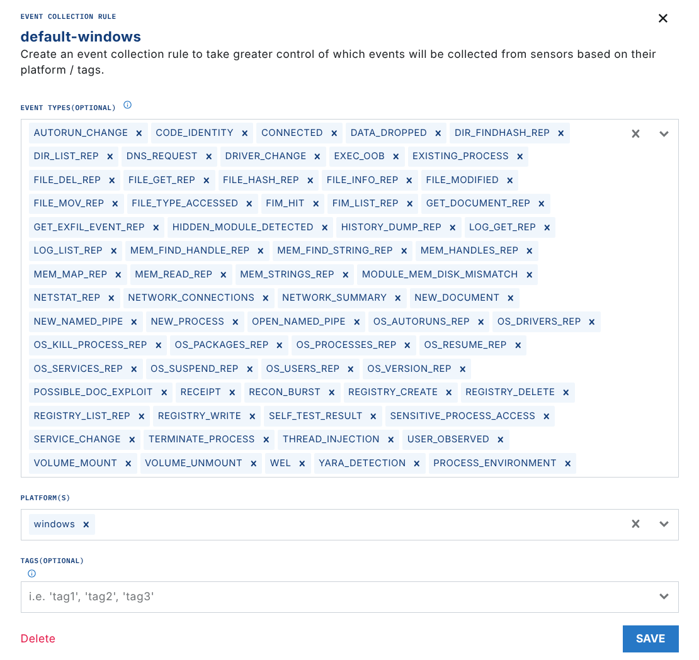
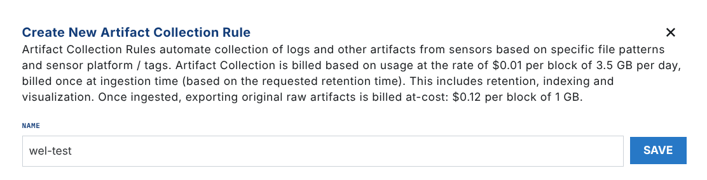
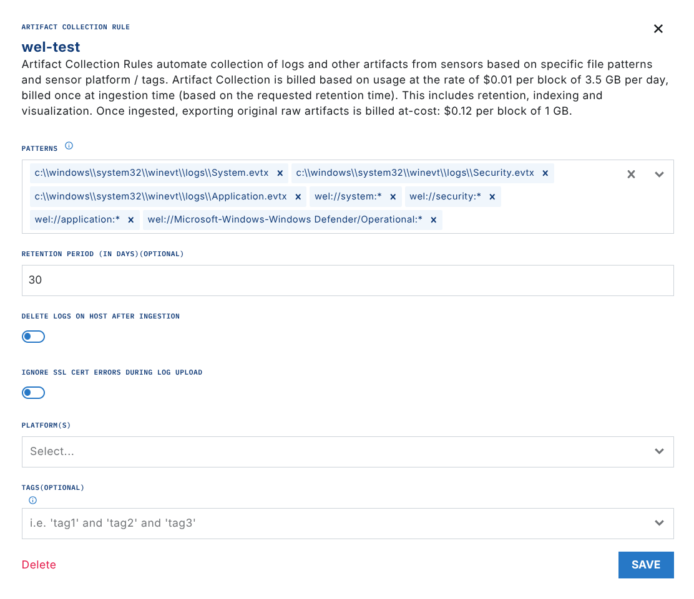
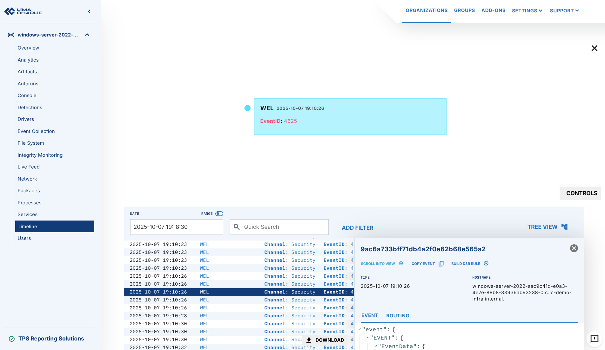

# Ingesting Windows Event Logs

You can enable real-time ingestion of Windows Event Logs (WEL) with the LimaCharlie EDR Sensor.

1. Go to the Exfil Control section of LimaCharlie. Make sure that `WEL` events are enabled for your Windows rules.

    

2. Go to the `Artifact Collection` section. Add an artifact collection rule for each Windows Event Log that you want.

    

3. To ingest WEL real-time events in the timeline, use the `wel://[Log Name]` format. For example, use this pattern for the System event log:

    `wel://system:*`

    

Difference between `.evtx` versus `wel://` ingestion

If you specify the file on disk with the `evtx` file extension, as in the image above, LimaCharlie uploads the full Windows Event Log file from disk. The file becomes a collected artifact, not real-time events on the timeline of the sensor. This method has the regular artifact ingestion costs for "Telemetry Sources" on the [pricing](https://limacharlie.io/pricing) page.

If you ingest Windows Event Logs with a `wel://` pattern, the sensor streams them in real time with the native EDR events. The flat rate price of the sensor includes them.

After you apply these settings, the Windows Event Log data from your endpoints starts to arrive. To check this, open the Timeline view and select the `WEL` event type.

