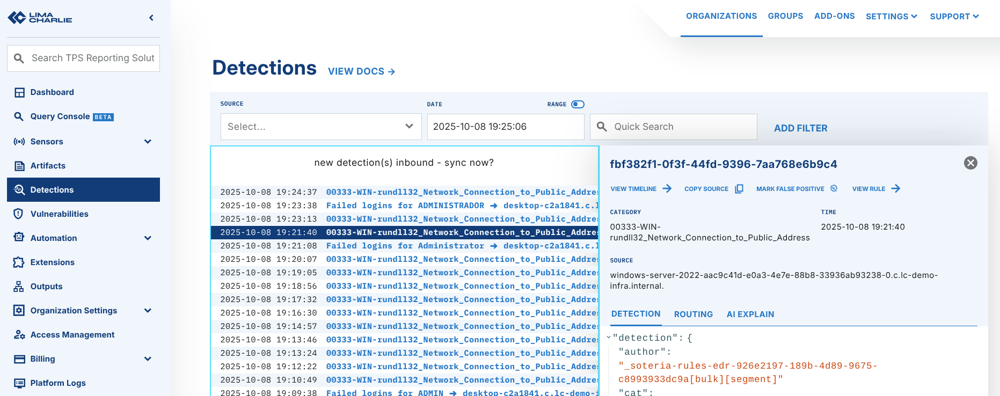
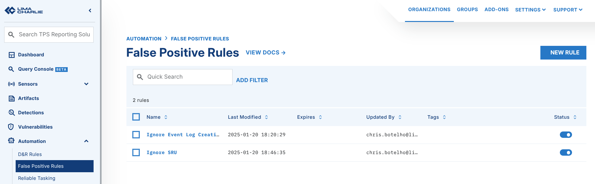
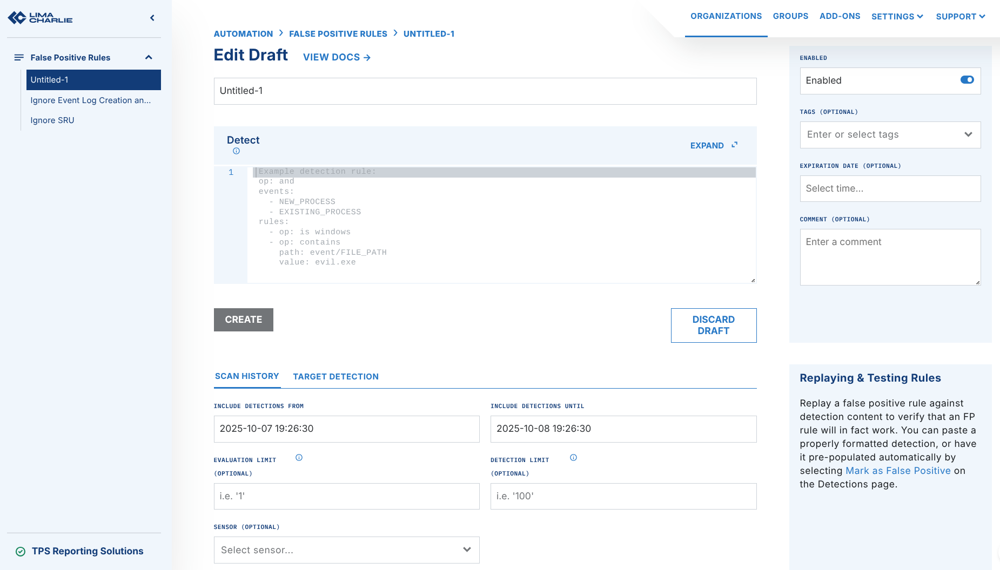

# False Positive Rules

To reduce the number of false positives, create false positive (FP) rules. FP rules filter out the detections that the `report` action of detection & response (D&R) rules generates. These rules apply globally to all rule namespaces and targets.

You can create a false positive rule in the LimaCharlie web app in more than one way.

Consider the case of more than one organization.

LimaCharlie creates false positive rules for each organization, the same as D&R rules. To apply the same rule to more than one organization, do one of these:

- create the same rule again in each organization, or
- push your FP rules to many organizations with the infrastructure as code functionality.

## Use Cases

FP rules add exceptions for detections. Use them for cross-cutting exceptions, for example to ignore all detections from one host. Use them for exceptions that are specific to an organization, for example to ignore alerts about custom software. Use them also to suppress errors from managed rules that you cannot access directly.

## Structure

A false positive rule has about the same structure as the detection part of a D&R rule. The difference is that the rule applies to the content of a detection, not to an event. The **Detections** section of the web app shows this content.

The `detect` path still gives access to the event that caused the detection. To ignore something because of the event content, add `detect/` to the front of the `path`. For an example, see [ignore detections for a specific file name](#ignore-detections-for-specific-file-name).

## Create a False Positive Rule From Detections

This is the fastest and the most common way to create an FP rule. On every detection, click the `Mark False Positive` button.



The button fills in the details of the event and generates a draft false positive rule. You can edit the draft before you save it.

After you save the rule, it appears in the **False Positives Rules** section. You can edit or delete it there.

## Create a False Positive rule from scratch

You do not need to wait for a detection before you create an FP rule. The `False Positive Rules` section under `Automation` lets you create a false positive rule from scratch.

To create a new false positive rule, click the `New Rule` button.



The rule editor opens, where you create the new rule.



An FP rule uses the same format as the detection component of a D&R rule. The difference is that the rule applies to the content of a detection. The Detections section of the web app shows this content.

You can set a rule name and an optional **Expiry Date**. An expiry date makes the rule expire at a set time.

Set expiry times in the preferred time of the user, not in UTC.

## Examples

The button fills in the details of the event and generates a draft false positive rule. You can edit the draft before you save it. The technical documentation gives the details about the structure of false positive rules.

### Suppress a Specific Detection

Stop a specific detection:

```yaml
op: is
path: cat
value: my-detect-name
```

### Ignore Detections for Specific File Name

Ignore any detection that relates to a file name in any path.

```yaml
op: ends with
path: detect/event/FILE_PATH
value: this_is_fine.exe
```

### Ignore Detections on a Specific Host

This rule ignores every detection that comes from a specific host.

```yaml
op: is
path: routing/hostname
value: web-server-2
```

## Programmatic Management

!!! info "Prerequisites"
    You need a valid API key with `dr.list` and `dr.set` permissions.
    See [API Keys](../7-administration/access/api-keys.md) for setup instructions.

### List FP Rules

=== "REST API"

    ```bash
    curl -s -X GET "https://api.limacharlie.io/v1/hive/fp/YOUR_OID" \
      -H "Authorization: Bearer $LC_JWT"
    ```

=== "Python"

    ```python
    from limacharlie.client import Client
    from limacharlie.sdk.organization import Organization
    from limacharlie.sdk.hive import Hive

    client = Client(oid="YOUR_OID", api_key="YOUR_API_KEY")
    org = Organization(client)
    hive = Hive(org, "fp")
    rules = hive.list()
    for name, record in rules.items():
        print(name, record.enabled)
    ```

=== "Go"

    ```go
    import limacharlie "github.com/refractionPOINT/go-limacharlie/limacharlie"

    client, _ := limacharlie.NewClient(limacharlie.ClientOptions{
        OID:    "YOUR_OID",
        APIKey: "YOUR_API_KEY",
    }, nil)
    org, _ := limacharlie.NewOrganization(client)
    hc := limacharlie.NewHiveClient(org)
    records, _ := hc.List(limacharlie.HiveArgs{
        HiveName:     "fp",
        PartitionKey: org.GetOID(),
    })
    for name, record := range records {
        fmt.Println(name, record.UsrMtd.Enabled)
    }
    ```

=== "CLI"

    ```bash
    limacharlie fp list
    ```

### Get an FP Rule

=== "REST API"

    ```bash
    curl -s -X GET "https://api.limacharlie.io/v1/hive/fp/YOUR_OID/RULE_NAME/data" \
      -H "Authorization: Bearer $LC_JWT"
    ```

=== "Python"

    ```python
    hive = Hive(org, "fp")
    rule = hive.get("my-fp-rule")
    print(rule.data)
    ```

=== "Go"

    ```go
    hc := limacharlie.NewHiveClient(org)
    record, _ := hc.Get(limacharlie.HiveArgs{
        HiveName:     "fp",
        PartitionKey: org.GetOID(),
        Key:          "my-fp-rule",
    })
    fmt.Println(record.Data)
    ```

=== "CLI"

    ```bash
    limacharlie fp get --key my-fp-rule
    ```

### Create or Update an FP Rule

=== "REST API"

    ```bash
    curl -s -X POST "https://api.limacharlie.io/v1/hive/fp/YOUR_OID/suppress-known-app/data" \
      -H "Authorization: Bearer $LC_JWT" \
      -H "Content-Type: application/x-www-form-urlencoded" \
      -d 'data={"op":"is","path":"cat","value":"known-benign-detection"}' \
      -d 'usr_mtd={"enabled":true}'
    ```

=== "Python"

    ```python
    from limacharlie.sdk.hive import Hive, HiveRecord

    hive = Hive(org, "fp")
    hive.set(HiveRecord(
        name="suppress-known-app",
        data={
            "op": "is",
            "path": "cat",
            "value": "known-benign-detection",
        },
        enabled=True,
    ))
    ```

=== "Go"

    ```go
    enabled := true
    hc := limacharlie.NewHiveClient(org)
    hc.Add(limacharlie.HiveArgs{
        HiveName:     "fp",
        PartitionKey: org.GetOID(),
        Key:          "suppress-known-app",
        Data: limacharlie.Dict{
            "op":    "is",
            "path":  "cat",
            "value": "known-benign-detection",
        },
        Enabled: &enabled,
    })
    ```

=== "CLI"

    ```bash
    # Save your FP rule to a file, then:
    # (--enabled is required — new hive records are disabled by default.)
    limacharlie fp set --key suppress-known-app --input-file fp-rule.yaml --enabled
    ```

### Delete an FP Rule

=== "REST API"

    ```bash
    curl -s -X DELETE "https://api.limacharlie.io/v1/hive/fp/YOUR_OID/suppress-known-app" \
      -H "Authorization: Bearer $LC_JWT"
    ```

=== "Python"

    ```python
    hive = Hive(org, "fp")
    hive.delete("suppress-known-app")
    ```

=== "Go"

    ```go
    hc := limacharlie.NewHiveClient(org)
    hc.Remove(limacharlie.HiveArgs{
        HiveName:     "fp",
        PartitionKey: org.GetOID(),
        Key:          "suppress-known-app",
    })
    ```

=== "CLI"

    ```bash
    limacharlie fp delete --key suppress-known-app --confirm
    ```

### Enable / Disable an FP Rule

=== "REST API"

    ```bash
    # 1. Read current metadata to preserve tags, expiry, comment:
    CURRENT=$(curl -s -X GET \
      "https://api.limacharlie.io/v1/hive/fp/YOUR_OID/suppress-known-app/mtd" \
      -H "Authorization: Bearer $LC_JWT")

    # 2. Merge and update (set enabled to false, keep other fields):
    curl -s -X POST "https://api.limacharlie.io/v1/hive/fp/YOUR_OID/suppress-known-app/mtd" \
      -H "Authorization: Bearer $LC_JWT" \
      -H "Content-Type: application/x-www-form-urlencoded" \
      -d 'usr_mtd={"enabled":false,"expiry":0,"tags":[],"comment":""}'
    ```

    !!! warning
        The API **replaces** all of `usr_mtd`. If you send only `{"enabled":false}`, the API resets tags, expiry, and comment to their defaults. Always read the current metadata first, then send all fields again.

=== "Python"

    ```python
    hive = Hive(org, "fp")
    # Read-modify-write to preserve other metadata:
    record = hive.get_metadata("suppress-known-app")
    record.enabled = False  # or True to re-enable
    hive.set(record)
    ```

=== "Go"

    ```go
    hc := limacharlie.NewHiveClient(org)
    // Read current metadata first to preserve tags, expiry, comment.
    existing, _ := hc.GetMTD(limacharlie.HiveArgs{
        HiveName:     "fp",
        PartitionKey: org.GetOID(),
        Key:          "suppress-known-app",
    })
    enabled := false
    hc.Add(limacharlie.HiveArgs{
        HiveName:     "fp",
        PartitionKey: org.GetOID(),
        Key:          "suppress-known-app",
        Enabled:      &enabled,
        Tags:         existing.UsrMtd.Tags,
        Expiry:       &existing.UsrMtd.Expiry,
        Comment:      &existing.UsrMtd.Comment,
    })
    ```

=== "CLI"

    ```bash
    # Disable an FP rule (reads metadata first to preserve other fields):
    limacharlie fp disable --key suppress-known-app
    # Re-enable:
    limacharlie fp enable --key suppress-known-app
    # Or using the generic hive command:
    limacharlie hive disable --hive-name fp --key suppress-known-app
    ```

---

## See Also

- [D&R Rules Overview](index.md)
- [Writing Rules](tutorials/writing-testing-rules.md)
