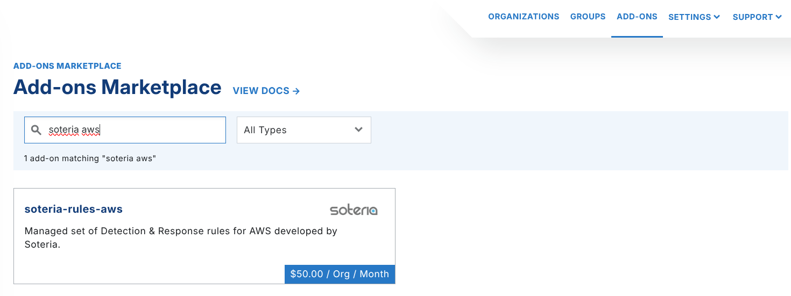
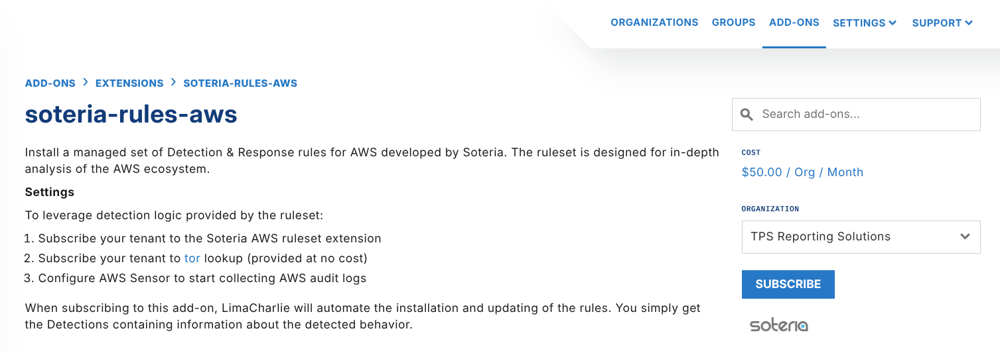
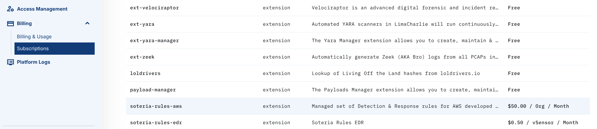

# Soteria AWS Rules

The Soteria AWS ruleset covers many AWS telemetry streams. These include:

- [AWS CloudTrail](https://aws.amazon.com/cloudtrail/)
- [AWS GuardDuty](https://aws.amazon.com/guardduty/)

## Data Access

Soteria does not get access to your data, and you cannot see or edit the Soteria rules. LimaCharlie is the broker between the two parties.

To use the detection logic of the ruleset:

1. Subscribe your organization to the Soteria AWS [ruleset extension](https://app.limacharlie.io/add-ons/extension-detail/soteria-rules-aws).
2. Subscribe your organization to the [tor](../../../5-integrations/extensions/limacharlie/lookup-manager.md) lookup, which has no cost.
3. Configure the [AWS CloudTrail](../../../2-sensors-deployment/adapters/types/aws-cloudtrail.md) and [AWS GuardDuty](../../../2-sensors-deployment/adapters/types/aws-guardduty.md) adapters to collect AWS audit logs.

## Enabling Soteria's AWS Rules

You can activate the Soteria AWS rules in two ways.

### Activating via the Web UI

To enable the Soteria AWS ruleset, open the **Extensions** section of the **Add-On Marketplace**. Search for Soteria. You can also select `soteria-rules-aws` directly.

#### Please note: Pricing may reflect when the screenshot was taken, not the actual pricing

Under the Organization dropdown, select the organization that you want to subscribe to **soteria-rules-aws**. Click **Subscribe**.

You can also manage add-ons from the **Subscriptions** menu under **Billing**.

### Infrastructure as Code

To manage organizations and LimaCharlie functions at scale, you can also use the Infrastructure as Code functionality.

In LimaCharlie, an Organization is a tenant in the Agentic SecOps Workspace. It is a self-contained environment where you manage security data, configurations, and assets independently. Each Organization has its own sensors, detection rules, data sources, and outputs, which gives you full control of security operations. This structure supports multi-tenant setups for managed security providers, or for enterprises that manage many departments or clients.
