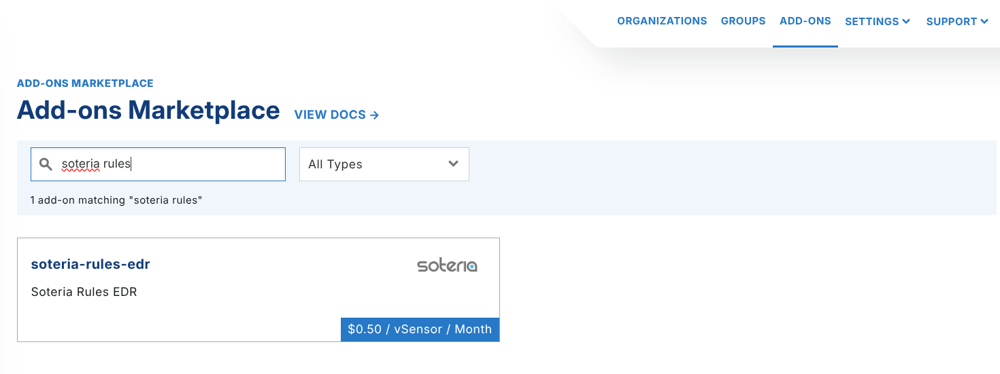
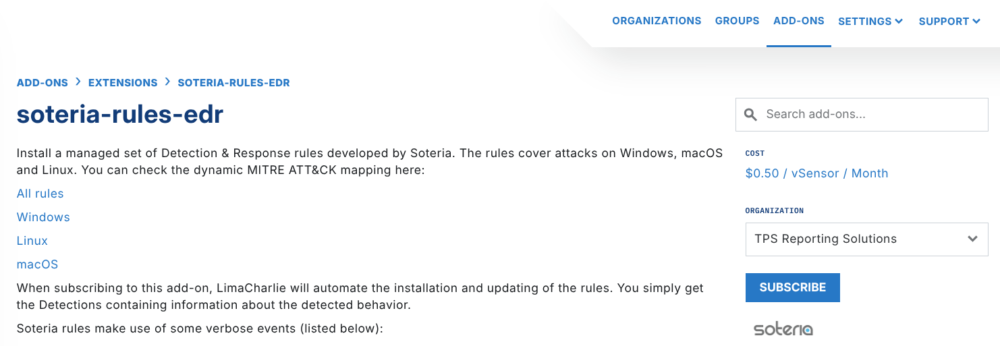
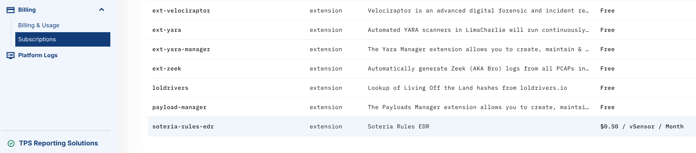

# Soteria EDR Rules

The Soteria EDR ruleset covers Windows, Linux, and macOS. The dynamic MITRE ATT&CK mapping is available at these links:

- [All rules](https://mitre-attack.github.io/attack-navigator/#layerURL=https%3A%2F%2Fstorage.googleapis.com%2Fsoteria-detector-mapping%2F%2Fall.json)
- [Windows](https://mitre-attack.github.io/attack-navigator/#layerURL=https://storage.googleapis.com/soteria-detector-mapping//windows.json)
- [Linux](https://mitre-attack.github.io/attack-navigator/#layerURL=https://storage.googleapis.com/soteria-detector-mapping//linux.json)
- [macOS](https://mitre-attack.github.io/attack-navigator/#layerURL=https://storage.googleapis.com/soteria-detector-mapping//mac.json)

## Data access

Soteria does not get access to your data, and you cannot see or edit the Soteria rules. LimaCharlie is the broker between the two parties.

The Soteria rules use the events below. Make sure that these events are configured in your Organization:

- `CODE_IDENTITY`
- `DNS_REQUEST`
- `EXISTING_PROCESS`
- `FILE_CREATE`
- `FILE_MODIFIED`
- `MODULE_LOAD`
- `NETWORK_CONNECTIONS`
- `NEW_DOCUMENT`
- `NEW_NAMED_PIPE`
- `NEW_PROCESS`
- `REGISTRY_WRITE`
- `REGISTRY_CREATE`
- `SENSITIVE_PROCESS_ACCESS`
- `THREAD_INJECTION`

You can also do this in the Add-ons Marketplace.

## Enabling Soteria's EDR Rules

You can activate the Soteria EDR rules in two ways.

### Activating via the Web UI

To enable the Soteria EDR ruleset, open the **Extensions** section of the Add-On Marketplace. Search for Soteria. You can also select `soteria-rules-edr` directly.

#### Please note: Pricing may reflect when the screenshot was taken, not the actual pricing

Under the Organization dropdown, select the organization that you want to subscribe to the Soteria rules. Click **Subscribe**.

You can also manage add-ons from the **Subscriptions** menu under **Billing**.

### Infrastructure as Code

To manage organizations and LimaCharlie functions at scale, you can also use the Infrastructure as Code functionality.
