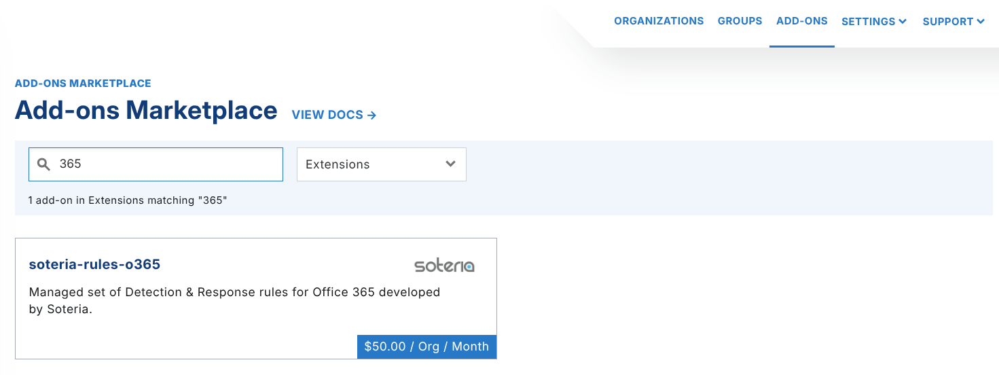
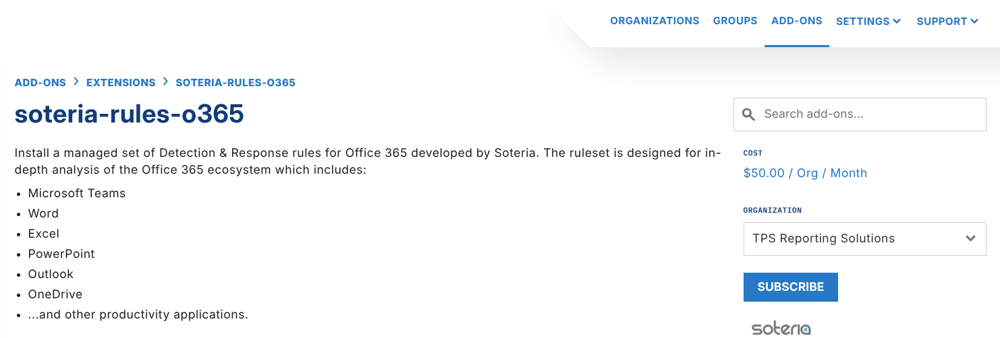
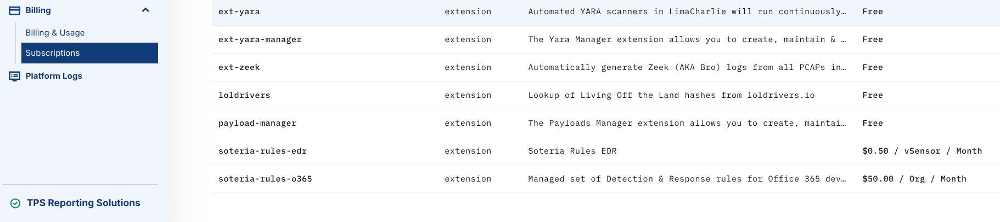

# Soteria M365 Rules

The Soteria O365 ruleset gives coverage of O365 (also known as M365) telemetry streams. The ruleset analyzes the Office 365 ecosystem in depth. The ecosystem includes:

- Teams
- Word
- Excel
- PowerPoint
- Outlook
- OneDrive
- ...and other productivity applications.

Data access

Soteria does not get access to your data, and you cannot see or edit the Soteria rules. LimaCharlie is the broker between the two parties.

To use the detection logic in the ruleset:

1. Subscribe your organization to the [Soteria Office 365 ruleset extension](https://app.limacharlie.io/add-ons/extension-detail/soteria-rules-o365).
2. Subscribe your organization to the [tor](https://app.limacharlie.io/add-ons/detail/tor-ips) lookup. This lookup has no cost.
3. Configure the Office 365 Sensor to collect [Office 365 audit logs](../../../2-sensors-deployment/adapters/types/microsoft-365.md).

## Enabling Soteria's O365 Rules

You can enable the Soteria O365 rules in two ways.

### Activating via the Web UI

To enable the Soteria O365 ruleset, go to the Extensions section of the Add-On Marketplace and search for Soteria. You can also select `soteria-rules-o365` directly.

#### Please note: Pricing may reflect when the screenshot was taken, not the actual pricing

In the Organization dropdown, select the organization that you want to subscribe to the Soteria O365 rules. Click **Subscribe**.

You can also manage add-ons in the **Subscriptions** menu under **Billing**.

### Infrastructure as Code

To manage organizations and LimaCharlie features at scale, you can use the Infrastructure as Code functionality instead.

Sensors send telemetry to the cloud as EDR telemetry or as forwarded logs, in the same way as agents. A sensor is a scalable and serverless way to connect the endpoints of an organization to the cloud securely.

LimaCharlie Extensions let users expand and customize their security environments. An extension can integrate a third-party tool, automate a workflow, or add a new capability. An organization subscribes to an extension, and the extension gets specific permissions to use the infrastructure of that organization. An extension can be private for tailored use, or public to share with the community. This framework supports scale, flexibility, and secure and repeatable deployments.

In LimaCharlie, an Organization is a tenant in the Agentic SecOps Workspace. It is a self-contained environment where you manage security data, configurations, and assets independently. Each Organization has its own sensors, detection rules, data sources, and outputs, and gives you full control of security operations. This structure supports flexible multi-tenant setups for managed security providers, and for enterprises that manage many departments or clients.

Infrastructure as Code (IaC) uses code to automate the management and provisioning of IT infrastructure. Code makes it easier to scale, maintain, and deploy resources consistently. In LimaCharlie, IaC lets security teams deploy and manage sensors, rules, and other security infrastructure programmatically. The result is repeatable configurations and faster response times, with the best practices of infrastructure as code in cybersecurity operations.
