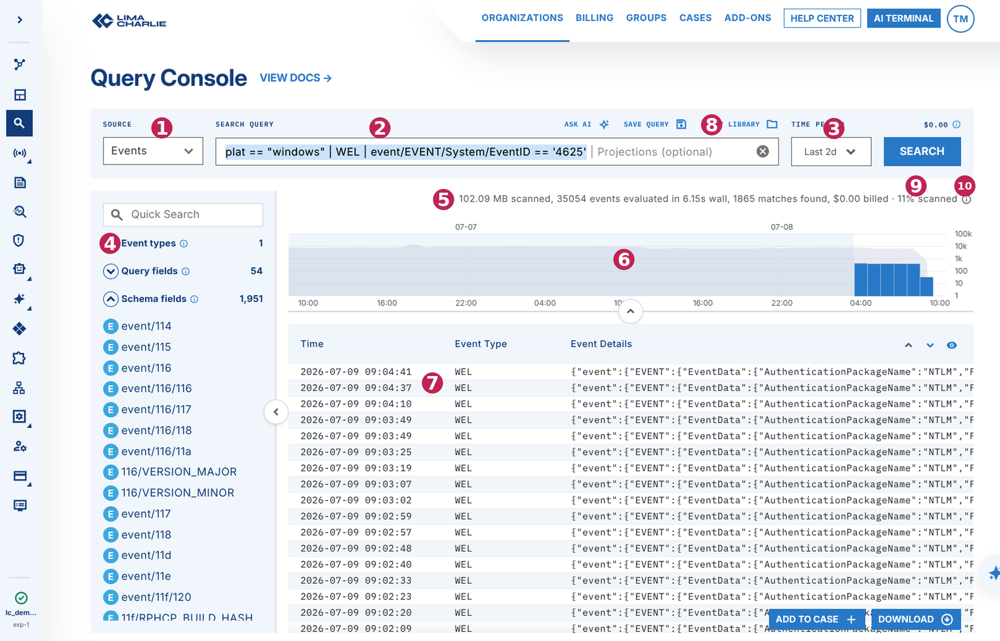
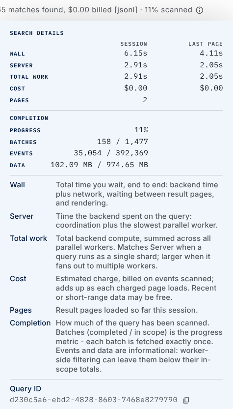

You need these permissions to see and use the Query Console:

- `insight.evt.get` to search
- `org.get` to use the schema service
- `query.set` to save queries
- `query.get` to read a list of queries (if you do not have this permission, an error tells you that you need `query.get.mtd`, but `query.get` is the permission that you need)
- `query.del` to edit or delete queries (an edit creates a new query and removes the old one)

### UI Element Overview

1. **Source:** Select the data source for the search: Events (all data that comes from endpoints and XDR sources, the default), Detections, or Platform Audit events.

2. **Query editor:** Enter a LimaCharlie Query Language (LCQL) query. The query includes:

    1. *Sensor Selector -* define the exact sensors that produced the events that you want.
    2. *Event Type* - filter the results to only specific types of events.
    3. Filter - the query filter. It uses individual fields and operations on those fields.
    4. Projections (optional) - control the output columns, sort the results with `ORDER BY`, and aggregate the data with `GROUP BY`, `COUNT`, `COUNT_UNIQUE`, and more. See the LCQL reference and Examples for details.

3. **Time period:** Set the time period to search. There are three options: last [time period], around [time frame], and absolute "from start→to finish".

    .png)

    - Enter a time `16:00`, or a day and time `2025-01-16 08:52:54`. The field accepts most common time formats. For example:

        - From `33m` to `now` - last 33 minutes
        - Around `2025-01-16 08:52:54` +- `15 minutes` - 15 minutes before and after the given time stamp
        - From `10am` to `1:30pm`

        **Note:** All times use the timezone that you select in User Settings.

4. **Available Fields:** Managed data exploration

    1. Schema fields - a list of all the fields in ingested events.
    2. Event types - the event types in the part of the results that the query returned. More event types can appear as the query churns more data to complete the selected time frame.
    3. Query fields - the event fields in the *part of the result that the query fetched*, with a count of total occurrences. Click an event field to open a details panel. In this panel, you can add a term to the query.

        .png)

    4. Table columns: control the columns that Table View shows.

    Note: The schema fields are always available. But the event types and query fields show only the part of the time frame *searched so far*. As the query churns more data in the background (to complete your selected time frame), more event types and fields can appear.

5. **Query status:** Shows the state of your query in real time. It shows syntax errors, or a cost estimate if the query is correct.

    When the query runs, the status shows the progress, the query status, and a running total of the cost.

    *Query cost estimation:* The charge for a query depends on the amount of data churned. LimaCharlie measures and bills this for each 200,000 events evaluated. The estimate shows the maximum cost of a query for the selected time range. Only retrieved data is chargeable.

    *Performance tuning:* A better tuned query is faster and costs less. Use the Sensor Selector and the Event Type to target the exact telemetry that you want. This increases the search speed and lowers the cost.

6. **Histogram:**

    When you run a search, a histogram appears below the query field. The histogram shows the distribution of events over time. The part with the vertical bars shows the results that the search retrieved so far. The part without bars shows the total number of events in the selected time frame. The histogram shows the progress of the search through the time frame. When you paginate through the search, the query evaluates more events and more bars appear.

7. **Search results:** Shows the results in two views, **timeline** and **table**. Timeline view shows the matching events with the most recent at the top. Table view sorts the results into the columns that you want. Find the field in Query Fields, then use the `pin` icon to add it as a column.

    1. A **Tab Columns** section appears in the **Fields** sidebar when you select table view. In this section, you can see or remove the columns.
    2. **Event Details** lets you click an event and do the event actions that apply, such as **Build a D&R Rule**.
    3. **Download** all the events that you retrieved in the [.ndjson format](https://github.com/ndjson/ndjson-spec). The automatic download of the full time range is coming soon.

    .png)

8. **Saving Queries and Query Library.** You can save a query in your private user library, or share it through an org library. Use the library to browse queries and load the one that you want into the query editor.

9. **Progress indicator:** The status line shows how much of the query is complete (for example, `11% scanned`). For whole-timeline queries such as aggregations, sorting, and other stateful operations, this value increases as the query processes more of the selected time range. See [Query Limits & Performance](query-limits-and-performance.md#query-progress-and-cost-reporting) for details about how progress and cost are reported.

10. **Search details (info icon):** Hold the pointer on the info icon at the end of the status line to open a **Search Details** panel. The panel shows per-session and per-page timings (wall, server, total work, cost, and pages). It also shows a completion breakdown (progress, batches completed compared to batches in scope, events, and data). The panel also shows the **Query ID** of the query. Copy the Query ID and send it to LimaCharlie support when you report a problem with a query, so that troubleshooting is faster.

    

---

### What's Next

- [LimaCharlie Query Language](lcql-examples.md)
- [Query Limits & Performance](query-limits-and-performance.md)
