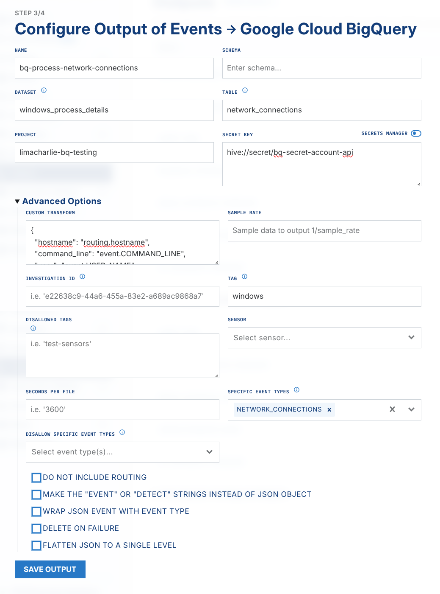
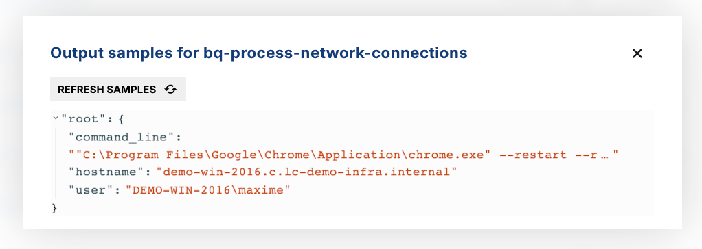

# Building Reports with BigQuery + Looker Studio

LimaCharlie does not include reporting by default. Output options send data to any destination, and you use third-party tools for reporting. This tutorial sends a subset of LimaCharlie EDR telemetry to [BigQuery](https://cloud.google.com/bigquery), then analyzes the data with Google [Looker Studio](https://lookerstudio.google.com/). This tutorial uses the web app, but you can also do the same work with the API.

This example aggregates and analyzes Windows processes that make network connections.

## Preparing BigQuery

In your project, create a new dataset. This tutorial uses a dataset named `windows_process_details`. In this dataset, create a table named `network_connections`.

This is the hierarchy:

```text
├── limacharlie-bq-testing    # project
│   ├── windows_process_details    # dataset
│   │   ├── network_connections    # table
```

This hierarchy lets you build more than one table of process details in the same dataset. You can then link and analyze those tables. This tutorial uses only the `network_connections` data, but you can export other process details into the same dataset.

.png)

In the Google Cloud Console, create a Service Account and get an API key. For more detail, see the Google Cloud [service account creation guide](https://cloud.google.com/iam/docs/service-accounts-create).

Copy the API key and keep it in a safe place. You configure it in the output.

## Creating the BigQuery Output

To create an Output in LimaCharlie:

1. In the web app, go to `Outputs`.
2. Select `Add Output`.
3. Select `Events`.

Note:

This output exports raw events. Filters send only the events of interest to BigQuery.

In the Output Destination menu, select `Google Cloud BigQuery`. A configuration menu opens. Expand the `Advanced Options`, because this tutorial also uses those options.

The Output needs these values:

- Name (choose your own name)
- Dataset (from the previous section)
- Table (from the previous section)
- Project (from the previous section)
- Secret Key (the API key from the GCP service account)

Where to Store the Secret?

You can put the secret key directly in the web app helper. LimaCharlie recommends that you keep secrets in the [Secret hive](../../7-administration/config-hive/secrets.md) for central management.

In the `Advanced Options`, supply these details:

- Custom Transform - this output does not need *all* the details from the `NETWORK_CONNECTIONS` event. It needs the processes that make network connections and the users of those processes. Apply this transform to reduce the fields:

```json
{
  "hostname": "routing.hostname",
  "command_line": "event.COMMAND_LINE",
  "user": "event.USER_NAME"
}
```

In the `Specific Event Types` field, specify only `NETWORK_CONNECTIONS`. This is another way to reduce the number of events that LimaCharlie processes and exports.

Also specify a tag of `windows`, to capture only Windows systems. This tag matches the tagging in this example; your tags can be different. This screenshot shows the Output configuration with these values, without the API key:



Save the output details. Then select `View Samples` in the Outputs menu to check that events arrive.



## Analyzing Events in BigQuery + Looker Studio

Go back to BigQuery. The first events arrive:

.png)

Go to Looker Studio. Create a Blank Report. Select `BigQuery` in the `Connect to Data` menu.

.png)

Select the Project, Dataset, and Table. Click `Add`.

.png)

Looker Studio can ask you about the permissions of connected data. After the connection is complete, a starter table shows aggregate details from the `network_connections` table.

.png)

You can now change and move the data. You can also blend the data with another table to combine more data points.

You can also style reports and generate more statistics. This example uses the same exported data to show other insights:

.png)
