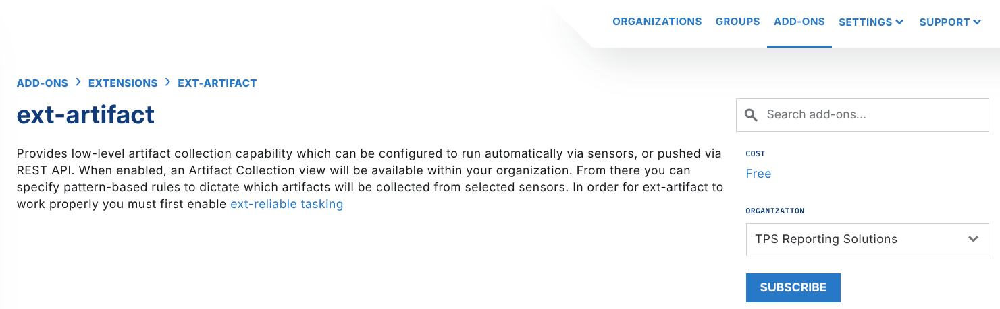
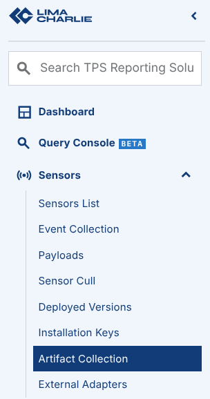
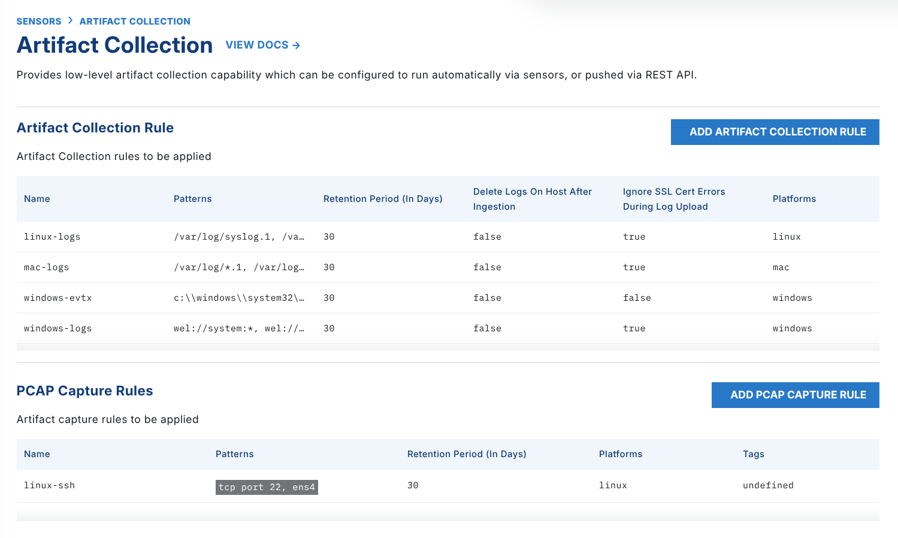

# Artifact

The Artifact Extension gives low-level collection capabilities. You can configure these collections to run automatically from Detection & Response rules or Sensor collections, or push them through the REST API. When you enable the extension, an Artifact Collection menu is available in the LimaCharlie web app.

> Billing for Artifacts
>
> The Artifact extension is free to enable, but ingested artifacts do incur a charge. Refer to the pricing details for the costs of Artifact ingestion and retention.

## Enabling the Artifact Extension

To enable the Artifact extension, do these steps:

1. Go to the [Artifact extension page](https://app.limacharlie.io/add-ons/extension-detail/ext-artifact) in the marketplace.
2. Select the Organization that you want to enable the extension for.
3. Select **Subscribe.**

    

After you select **Subscribe**, the Artifact extension is available almost immediately.

> Enable the [Reliable Tasking extension](reliable-tasking.md) first. The Artifact extension needs it.

## Using the Artifact Extension

When you enable the extension, an **Artifact Collection** option shows under the **Sensors** menu for that organization.

On the Artifact Collection page, you can configure:

- Artifact collection rules for files.
- Artifact collection rules to stream Windows Event Log (WEL) events.
- Artifact collection rules to stream Mac Unified Log (MUL) events.
- PCAP capture rules to capture network traffic (Only available on Linux)

The screenshot below shows examples of how to capture Windows Security and Sysmon Windows Event Logs with Artifact Collection. The `wel://` pattern captures WEL events without an adapter. It adds the events to the sensor telemetry and makes a real-time stream of Windows Event Log data. You can also specify the pattern to collect the specific `.evtx` files.

More information about Artifact collections is below.

