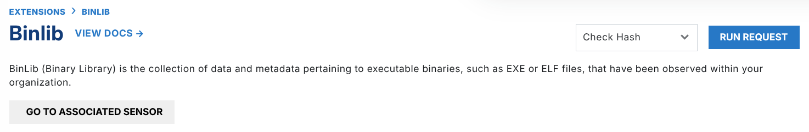
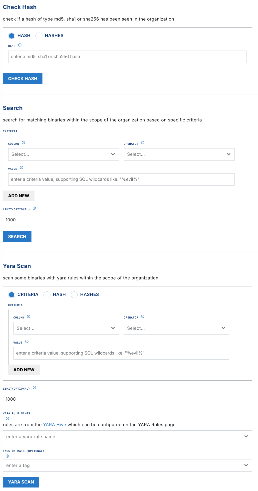
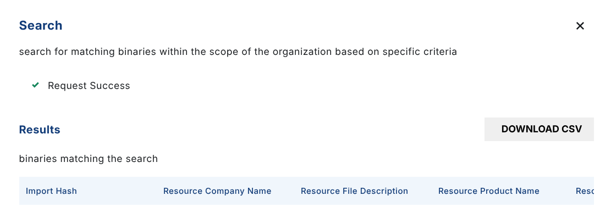
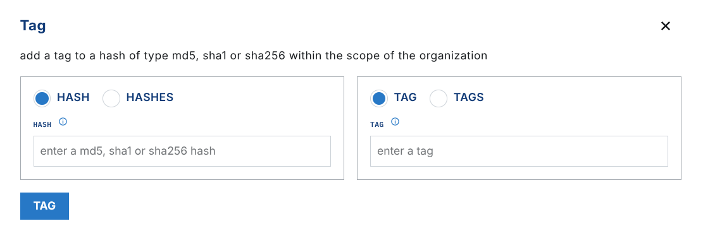
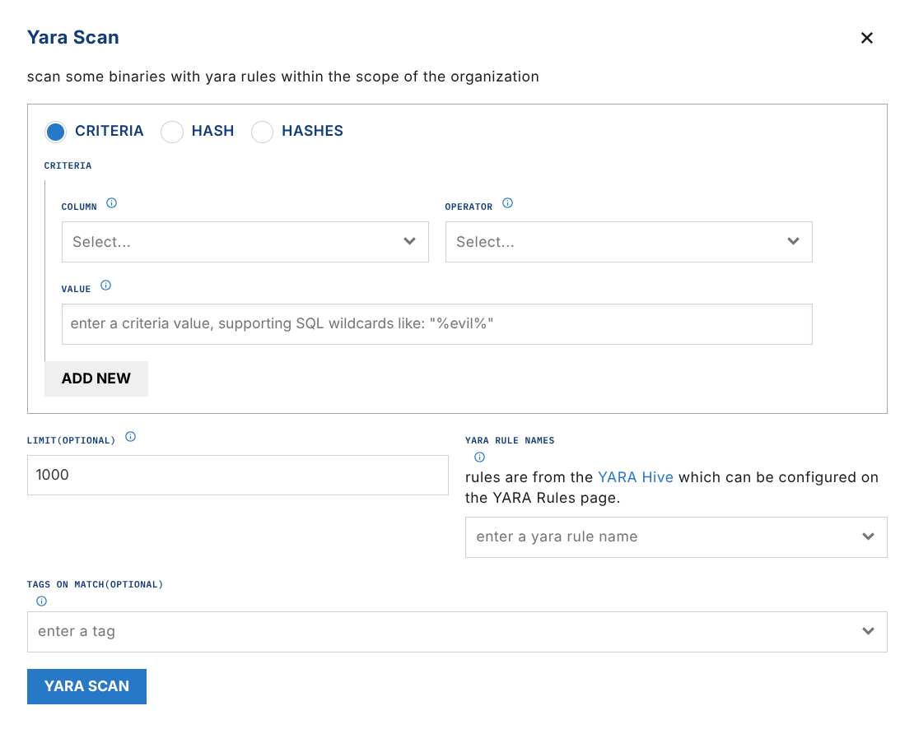

# BinLib

Binary Library, or "BinLib", is a collection of executable binaries, such as EXE or ELF files, that are observed in your environment. If you enable this Extension, it builds your own private collection of the observed executables. You can then analyze and search that collection.

When LimaCharlie observes a binary and path for the first time, it generates a `CODE_IDENTITY` event. The metadata from this event is stored in `binlib`. You can search it, tag it, and download it. You can also run [YARA](../third-party/yara.md) scans against observed binaries.

## Enabling BinLib

BinLib needs a subscription to the `ext-reliable-tasking` Extension to work correctly. Enable that Extension [in the Add-ons marketplace](https://app.limacharlie.io/add-ons/extension-detail/ext-reliable-tasking).

BinLib adds to your detection and response capabilities. Analysts can:

- Look for historical evidence of malicious binaries
- Tag previously-observed files for data enrichment (for example, [MITRE ATT&CK Techniques](https://attack.mitre.org/matrices/enterprise/))
- Compare observed hashes to known good or known bad lists
- [YARA scan](../third-party/yara.md) and auto-tag for integration in detection & response rules

## Usage

First, subscribe your organization to the [BinLib](https://app.limacharlie.io/add-ons/extension-detail/binlib) extension.



To do one of the operations below against your own library, choose the command and select **Run Request.**

The BinLib page in the web app gives you the main requests of the extension: Check Hash, Search, and Yara Scan.



### check_hash

#### Accepted Values: MD5, SHA1, SHA256

The `check_hash` operation shows you if a hash was observed in your Organization. The output includes a boolean that shows if the hash was found. It also includes three hash values, if they are available.

Sample Output:

```json
{
  "data": {
    "found": true,
    "md5": "e977bded5d4198d4895ac75150271158",
    "sha1": "9e2b05f142c35448c9bc48c40a732d632485c719",
    "sha256": "2f5d0c6159b194d6f0f2eae0b7734708368a23aebf9af4db9293865b57ffcaeb"
  }
}
```

### get_hash_data

#### Accepted Values: MD5, SHA1, SHA256

#### Careful Downloading Binaries

Be careful when you download a file that can be malicious. LimaCharlie does not filter the binaries that your organization observes. Download binaries that can be malicious to an isolated analysis system.

The `get_hash_data` operation gives a link to the raw data for the hash. Use the link to download the binary file, if the file was observed before in your environment.

Sample Output:

```json
{
  "data": {
    "download_url": "https://storage.googleapis.com/lc-library-bin/b_2f5d0c...",
    "found": true,
    "md5": "e977bded5d4198d4895ac75150271158",
    "sha1": "9e2b05f142c35448c9bc48c40a732d632485c719",
    "sha256": "2f5d0c6159b194d6f0f2eae0b7734708368a23aebf9af4db9293865b57ffcaeb"
  }
}
```

### get_hash_metadata

#### Accepted Values: MD5, SHA1, SHA256

The `get_hash_metadata` operation gets the metadata for a hash. The metadata includes signing details, the file type, and more hashes.

```json
{
  "data": {
    "found": true,
    "md5": "e977bded5d4198d4895ac75150271158",
    "metadata": {
      "imp_hash": "c105252faa9163fd63fb81bb334c61bf",
      "res_company_name": "Google LLC",
      "res_file_description": "Google Chrome Installer",
      "res_product_name": "Google Chrome Installer",
      "res_product_version": "113.0.5672.127",
      "sha256": "2f5d0c6159b194d6f0f2eae0b7734708368a23aebf9af4db9293865b57ffcaeb",
      "sig_authentihash": "028f24e2c1fd42a3edaf0dcf8a59afe39201fa7d3bb5804dca8559fde41b3f34",
      "sig_issuer": "US, DigiCert Trusted G4 Code Signing RSA4096 SHA384 2021 CA1",
      "sig_serial": "0e4418e2dede36dd2974c3443afb5ce5",
      "sig_subject": "US, California, Mountain View, Google LLC, Google LLC",
      "size": 5155608,
      "type": "pe"
    },
    "sha1": "9e2b05f142c35448c9bc48c40a732d632485c719",
    "sha256": "2f5d0c6159b194d6f0f2eae0b7734708368a23aebf9af4db9293865b57ffcaeb"
  }
}
```

### search

The `search` operation searches the library for data points of binaries. The data points can include a known hash, or they can be *other than* a known hash.

Searchable fields include:

- imp_hash
- res_company_name
- res_file_description
- res_product_name
- sha256
- sig_authentihash
- sig_hash
- sig_issuer
- sig_subject
- size
- type

The search criteria are ANDed. A binary must meet ALL criteria before the search returns it.

You can download the search results as a CSV.



### tag

The `tag` operation adds one or more tags to a hash. The tags give more classification in binlib.

The example below tags the Google Installer with the `google` tag.



A successful tag operation gives an `updated` event:

```json
{
  "data": {
    "found": true,
    "md5": "e977bded5d4198d4895ac75150271158",
    "sha1": "9e2b05f142c35448c9bc48c40a732d632485c719",
    "sha256": "2f5d0c6159b194d6f0f2eae0b7734708368a23aebf9af4db9293865b57ffcaeb",
    "updated": true
  }
}
```

### untag

The `untag` operation removes a tag from a binary.

### YARA scan

The `yara_scan` operation runs YARA scans across observed files. A scan needs:

- Criteria or hash to filter files to be scanned
- [Rule name(s)](../../../7-administration/config-hive/yara.md) or rule(s)

You can also tag the files that match.

The search criteria are ANDed. A binary must meet ALL criteria before the search returns it.



## Automating

These example rules automate interactions with Binlib.

### Scan all acquired files with Yara

This rule scans all acquired files in binlib with a Yara rule:

```yaml
detect:

event: acquired
op: is tagged
tag: ext:binlib

respond:

- action: report
  name: binlib-test
- action: extension request
  extension action: yara_scan
  extension name: binlib
  extension request:
    hash: '{{ .event.sha256 }}'
    rule_names:
      - yara_rule_name_here
```

This rule alerts on matches:

```yaml
detect:

event: yara_scan
op: exists
path: event/matches/hash

respond:

- action: report
  name: YARA Match via Binlib
```
