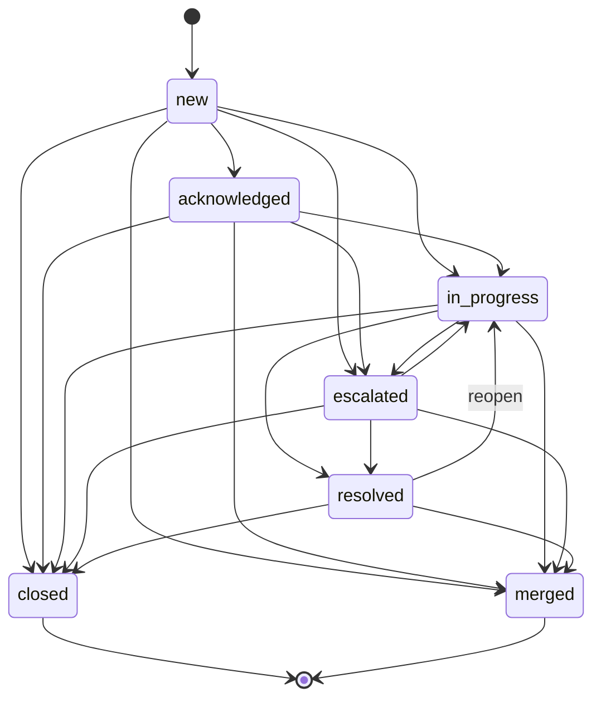

# Cases

!!! warning "Closed Beta"
    Cases is currently in closed beta. Please contact LimaCharlie to request access.

The Cases extension is a purpose-built SOC triage system that automatically converts LimaCharlie detections into trackable cases with SLA enforcement, investigation tooling, and performance reporting. It is designed for high-volume environments where every detection needs to be acknowledged, investigated, classified, and resolved within measurable timeframes.

Once subscribed, detections from the organization are ingested and converted into cases. By default all detections are ingested automatically; alternatively, [Tailored mode](#ingestion-mode) lets you select which detections create cases via D&R rules. Analysts work the case queue through a defined lifecycle, attach investigation evidence, and classify outcomes. SOC managers get real-time dashboards and MTTA/MTTR reports.

## Enabling the Extension

Navigate to the [Cases extension page](https://app.limacharlie.io/add-ons/extension-detail/ext-cases) in the marketplace. Select the organization you wish to enable it for, and select **Subscribe**.

On subscription, the extension automatically:

1. Installs D&R rules that forward detections to the cases system via extension requests
2. Initializes the organization with default configuration (severity mapping, SLA targets, retention)

No additional setup is required to begin receiving cases. Detections start flowing immediately.

The full API specification is available as an OpenAPI document at [cases.limacharlie.io/openapi](https://cases.limacharlie.io/openapi).

!!! info "Permissions"
    The cases extension uses LimaCharlie's existing RBAC permissions. Analysts need `investigation.get` to view cases and reports, and `investigation.set` to update cases, add notes, and manage investigation data. Configuration management requires `org.conf.get` to read and `org.conf.set` to update organization settings.

## How Cases Are Created

Every detection generated by D&R rules in a subscribed organization automatically becomes a case. The mapping is one detection to one case by default.

Each case captures from the detection:

- **Severity** (derived from the detection priority via the configured severity mapping)
- **Detection count** (number of linked detections)

The individual detection fields (detection category, source, priority, sensor ID, hostname, and detection ID) are stored on the linked **CaseDetection** records, not on the case itself. When listing cases, aggregated fields `detection_cats` (unique detection categories) and `sensor_ids` (unique sensor IDs) are populated from linked detections.

Duplicate detections (same `detection_id`) are silently dropped to prevent case duplication.

### Auto-Grouping

When auto-grouping is enabled in the organization configuration, detections that share the same category and sensor within a one-hour window are automatically grouped into a single case instead of creating separate cases. This significantly reduces case volume for noisy rules.

When a detection is grouped into an existing case:

- The case's `detection_count` increments
- The severity may be upgraded if the new detection has a higher priority
- An event is recorded in the case's audit trail

## Case Lifecycle

Cases follow a defined state machine that tracks progress from creation through resolution.



### Status Definitions

| Status | Description |
|--------|-------------|
| `new` | Case created, not yet reviewed by an analyst |
| `acknowledged` | Analyst has seen and accepted the case. Records MTTA timestamp |
| `in_progress` | Active investigation underway |
| `escalated` | Escalated to a senior analyst or specialized team |
| `resolved` | Investigation complete, findings documented. Records MTTR timestamp |
| `closed` | Case fully closed. Terminal state |
| `merged` | Case was merged into another case. Terminal state |

### Key Timestamps

- **`created_at`** -- Set when the case is created from a detection
- **`acknowledged_at`** -- Set on first transition to `acknowledged` (used for MTTA calculation)
- **`resolved_at`** -- Set on first transition to `resolved` (used for MTTR calculation)
- **`closed_at`** -- Set on transition to `closed`

## Severity and SLA

### Severity Mapping

LimaCharlie detection priorities (integer 0--10) are mapped to four severity levels. The thresholds are configurable per organization. A fifth level, `info`, exists for manual use only.

| Severity | Default Priority Range | Description |
|----------|----------------------|-------------|
| `critical` | 8--10 | Requires immediate response |
| `high` | 5--7 | Urgent, handle promptly |
| `medium` | 3--4 | Standard priority |
| `low` | 0--2 | Informational, handle when available |
| `info` | _(manual only)_ | Non-actionable; lets analysts associate activity without implying a real problem |

`info` is never assigned automatically from detection priority. It can only be set explicitly when creating or updating a case.

### SLA Targets

Each severity level has two SLA targets:

- **MTTA (Mean Time To Acknowledge)** -- Maximum time from case creation to first acknowledgement
- **MTTR (Mean Time To Resolve)** -- Maximum time from case creation to resolution

Default SLA targets:

| Severity | MTTA Target | MTTR Target |
|----------|-------------|-------------|
| `critical` | 15 minutes | 4 hours |
| `high` | 15 minutes | 12 hours |
| `medium` | 1 hour | 24 hours |
| `low` | 100 minutes | ~47 hours |
| `info` | 8 hours | 7 days |

SLA breaches are tracked in the dashboard and reporting views.

## Configuration

Each organization has its own configuration that controls severity mapping, SLA targets, retention, and optional features.

### Configuration Options

| Setting | Type | Default | Description |
|---------|------|---------|-------------|
| `severity_mapping.critical_min` | int | `8` | Minimum detection priority for `critical` severity |
| `severity_mapping.high_min` | int | `5` | Minimum detection priority for `high` severity |
| `severity_mapping.medium_min` | int | `3` | Minimum detection priority for `medium` severity |
| `sla_config.critical.mtta_minutes` | int | `15` | MTTA target for critical cases (minutes) |
| `sla_config.critical.mttr_minutes` | int | `240` | MTTR target for critical cases (minutes) |
| `sla_config.high.mtta_minutes` | int | `15` | MTTA target for high cases (minutes) |
| `sla_config.high.mttr_minutes` | int | `720` | MTTR target for high cases (minutes) |
| `sla_config.medium.mtta_minutes` | int | `60` | MTTA target for medium cases (minutes) |
| `sla_config.medium.mttr_minutes` | int | `1440` | MTTR target for medium cases (minutes) |
| `sla_config.low.mtta_minutes` | int | `100` | MTTA target for low cases (minutes) |
| `sla_config.low.mttr_minutes` | int | `2800` | MTTR target for low cases (minutes) |
| `sla_config.info.mtta_minutes` | int | `480` | MTTA target for info cases (minutes) |
| `sla_config.info.mttr_minutes` | int | `10080` | MTTR target for info cases (minutes) |
| `retention_days` | int | `90` | Days to retain resolved/closed cases before archival |
| `auto_close_resolved_after_days` | int | `7` | Automatically close resolved cases after this many days. Set to `0` to disable |
| `auto_grouping_enabled` | bool | `false` | Enable auto-grouping of related detections into single cases |
| `ingestion_mode` | string | `"all"` | Controls which detections create cases. `"all"` forwards every detection; `"tailored"` only creates cases for detections explicitly sent via D&R rules (see [Ingestion Mode](#ingestion-mode)) |

### Get Configuration

=== "REST API"

    ```bash
    curl -s -X GET \
      "https://cases.limacharlie.io/api/v1/config/YOUR_OID" \
      -H "Authorization: Bearer $LC_JWT"
    ```

=== "CLI"

    ```bash
    limacharlie case config-get
    ```

### Update Configuration

=== "REST API"

    ```bash
    curl -s -X PUT \
      "https://cases.limacharlie.io/api/v1/config/YOUR_OID" \
      -H "Authorization: Bearer $LC_JWT" \
      -H "Content-Type: application/json" \
      -d '{
        "severity_mapping": {
          "critical_min": 8,
          "high_min": 5,
          "medium_min": 3
        },
        "sla_config": {
          "critical": {"mtta_minutes": 15, "mttr_minutes": 240},
          "high": {"mtta_minutes": 30, "mttr_minutes": 480},
          "medium": {"mtta_minutes": 60, "mttr_minutes": 1440},
          "low": {"mtta_minutes": 120, "mttr_minutes": 2880},
          "info": {"mtta_minutes": 480, "mttr_minutes": 10080}
        },
        "retention_days": 90,
        "auto_close_resolved_after_days": 7,
        "auto_grouping_enabled": true
      }'
    ```

=== "CLI"

    ```bash
    limacharlie case config-set --input-file config.yaml
    ```

## Working with Cases

### Creating a Case

While detections are automatically converted to cases, you can also create cases manually via the CLI or SDK. This is useful for ad-hoc investigations or when integrating with external detection sources. You can also create empty investigation cases (without linking a detection) by omitting the detection ID.

=== "CLI"

    ```bash
    # Create from a detection ID
    limacharlie case create --detection-id DETECTION_ID

    # Create with full metadata
    limacharlie case create --detection-id DETECTION_ID \
        --detection-cat "lateral_movement" --severity high \
        --sensor-id SENSOR_ID --hostname DESKTOP-001
    ```

=== "Python"

    ```python
    from limacharlie.sdk.cases import Cases
    from limacharlie.sdk.organization import Organization
    from limacharlie.client import Client

    client = Client(oid="YOUR_OID")
    org = Organization(client)
    c = Cases(org)

    result = c.create_case(
        "DETECTION_ID",
        detection_cat="lateral_movement",
        severity="high",
        sensor_id="SENSOR_ID",
        hostname="DESKTOP-001",
    )
    print(result["case_number"])
    ```

### Listing Cases

Query the case queue with filtering, sorting, and pagination. Supports cross-organization queries for multi-tenant SOCs.

=== "REST API"

    ```bash
    # List open cases, most recent first
    curl -s -X GET \
      "https://cases.limacharlie.io/api/v1/cases?oids=YOUR_OID&status=new,acknowledged&sort=created_at&order=desc&page_size=50" \
      -H "Authorization: Bearer $LC_JWT"
    ```

=== "CLI"

    ```bash
    limacharlie case list --status new --status acknowledged --sort created_at --order desc
    limacharlie case list --severity critical --severity high --search "mimikatz"
    ```

Available query parameters:

| Parameter | Description |
|-----------|-------------|
| `oids` | Organization IDs (comma-separated, required) |
| `status` | Filter by status (comma-separated: `new`, `acknowledged`, `in_progress`, `escalated`, `resolved`, `closed`) |
| `severity` | Filter by severity (comma-separated: `critical`, `high`, `medium`, `low`, `info`) |
| `classification` | Filter by classification (comma-separated: `pending`, `true_positive`, `false_positive`) |
| `assignee` | Filter by assigned analyst email |
| `search` | Search text (matches against detection category and hostname across linked detections) |
| `sensor_id` | Filter to cases with detections from this sensor ID |
| `tag` | Filter by tags (comma-separated, AND logic: all specified tags must be present) |
| `sort` | Sort field (`created_at`, `severity`, `case_number`) |
| `order` | Sort order (`asc`, `desc`) |
| `page_size` | Page size, 1--200 (default 50) |
| `page_token` | Pagination token from previous response |

### Getting a Case

=== "REST API"

    ```bash
    curl -s -X GET \
      "https://cases.limacharlie.io/api/v1/cases/42?oid=YOUR_OID" \
      -H "Authorization: Bearer $LC_JWT"
    ```

=== "CLI"

    ```bash
    limacharlie case get --id 42
    ```

Returns the full case including the event timeline (audit trail of all changes).

### Exporting a Case

Export a case with all its components (case record, event timeline, detections, entities, telemetry, and artifacts) in a single JSON object.

=== "CLI"

    ```bash
    # Export as JSON to stdout
    limacharlie case export --id 42

    # Export with full data (detection records, telemetry events,
    # artifact binaries) to a local directory
    limacharlie case export --id 42 --with-data ./case-export
    ```

=== "Python"

    ```python
    c = Cases(org)
    data = c.export_case(42)
    # data contains: case, events, detections, entities, telemetry, artifacts
    ```

Without `--with-data`, the combined metadata JSON is printed to stdout. With `--with-data <DIR>`, the command creates a directory containing:

- `case.json` -- case record, event timeline, entities
- `detections/` -- one JSON file per linked detection (fetched from Insight)
- `telemetry/` -- one JSON file per linked telemetry event (fetched by atom+sid)
- `artifacts/` -- downloaded artifact binaries

Fetches that fail (e.g. expired or retained data) emit a warning and are skipped.

### Updating a Case

=== "REST API"

    ```bash
    curl -s -X PATCH \
      "https://cases.limacharlie.io/api/v1/cases/42?oid=YOUR_OID" \
      -H "Authorization: Bearer $LC_JWT" \
      -H "Content-Type: application/json" \
      -d '{
        "status": "acknowledged",
        "assignee": "analyst@example.com"
      }'
    ```

=== "CLI"

    ```bash
    limacharlie case update --id 42 --status acknowledged --assignee analyst@example.com
    limacharlie case update --id 42 --status resolved \
        --classification true_positive --conclusion "Contained via network isolation"
    ```

Updatable fields:

| Field | Type | Description |
|-------|------|-------------|
| `status` | string | New status (must be a valid transition) |
| `severity` | string | Case severity: `critical`, `high`, `medium`, `low`, or `info` |
| `assignee` | string | Analyst to assign the case to |
| `classification` | string | `true_positive`, `false_positive`, or `pending` |
| `escalation_group` | string | Team or group to escalate to |
| `investigation_id` | string | Link to a LimaCharlie [Investigation](../../../7-administration/config-hive/investigation.md) |
| `summary` | string | Investigation summary narrative (max 8192 characters) |
| `conclusion` | string | Final conclusion (max 8192 characters) |
| `tags` | string[] | Arbitrary tags for categorization (see [Tags](#tags)) |

### Bulk Updates

Update multiple cases at once, useful for bulk-closing false positives or reassigning workload.

=== "REST API"

    ```bash
    curl -s -X POST \
      "https://cases.limacharlie.io/api/v1/cases/bulk-update" \
      -H "Authorization: Bearer $LC_JWT" \
      -H "Content-Type: application/json" \
      -d '{
        "oid": "YOUR_OID",
        "case_numbers": [1, 2, 3],
        "update": {
          "status": "closed",
          "classification": "false_positive"
        }
      }'
    ```

=== "CLI"

    ```bash
    limacharlie case bulk-update --numbers 1,2,3 \
        --status closed --classification false_positive
    limacharlie case bulk-update --input-file case_numbers.txt --status resolved
    ```

Up to 200 cases can be updated in a single bulk operation.

### Tags

Cases support arbitrary string tags for custom categorization and workflow organization (e.g., "phishing", "ransomware", "shift-b").

**Constraints:**

| Constraint | Value |
|-----------|-------|
| Max tag length | 128 characters |
| Max tags per case | 50 |
| Case sensitivity | Case-preserved, case-insensitive deduplication |
| Allowed characters | Any printable character (no control characters) |

#### Setting Tags

Tags are set by replacing the full tag array on the case.

=== "REST API"

    ```bash
    curl -s -X PATCH \
      "https://cases.limacharlie.io/api/v1/cases/42?oid=YOUR_OID" \
      -H "Authorization: Bearer $LC_JWT" \
      -H "Content-Type: application/json" \
      -d '{"tags": ["phishing", "urgent"]}'
    ```

=== "CLI"

    ```bash
    limacharlie case update --id 42 --tag phishing --tag urgent --oid YOUR_OID
    ```

=== "Python"

    ```python
    c = Cases(org)
    c.update_case(42, tags=["phishing", "urgent"])
    ```

#### Tag Management CLI

The CLI provides convenience commands for adding or removing individual tags without replacing the full array.

```bash
# Replace all tags
limacharlie case tag set --id 42 --tag phishing --tag urgent --oid YOUR_OID

# Add a tag (preserves existing tags)
limacharlie case tag add --id 42 --tag new-label --oid YOUR_OID

# Remove a tag
limacharlie case tag remove --id 42 --tag old-label --oid YOUR_OID
```

#### Filtering by Tag

Filter the case list to only cases that have all specified tags (AND logic).

=== "REST API"

    ```bash
    curl -s -X GET \
      "https://cases.limacharlie.io/api/v1/cases?oids=YOUR_OID&tag=phishing,urgent" \
      -H "Authorization: Bearer $LC_JWT"
    ```

=== "CLI"

    ```bash
    limacharlie case list --tag phishing --tag urgent --oid YOUR_OID
    ```

=== "Python"

    ```python
    c = Cases(org)
    c.list_cases(tag=["phishing", "urgent"])
    ```

Tag changes create a `tags_updated` event in the case's audit trail with old and new tag values in the event metadata.

### Classification

Cases are classified to track detection accuracy. Classification can be set at any status.

| Classification | Description |
|---------------|-------------|
| `pending` | Not yet classified (default) |
| `true_positive` | Confirmed malicious or policy-violating activity |
| `false_positive` | Benign activity incorrectly flagged |

Classification rates are tracked in reports and feed into detection rule tuning.

## Detections

Each case is created from a detection and can have additional detections linked to it (for example, when auto-grouping is enabled or when manually associating related detections).

### Link a Detection

=== "REST API"

    ```bash
    curl -s -X POST \
      "https://cases.limacharlie.io/api/v1/cases/42/detections?oid=YOUR_OID" \
      -H "Authorization: Bearer $LC_JWT" \
      -H "Content-Type: application/json" \
      -d '{
        "detection_id": "DETECTION_ID",
        "detection_cat": "lateral-movement",
        "detection_source": "dr-general",
        "detection_priority": 7,
        "sensor_id": "550e8400-e29b-41d4-a716-446655440000",
        "hostname": "DESKTOP-001"
      }'
    ```

=== "CLI"

    ```bash
    limacharlie case detection add --case 42 \
        --detection-id DETECTION_ID --detection-cat lateral-movement
    ```

### List Linked Detections

=== "REST API"

    ```bash
    curl -s -X GET \
      "https://cases.limacharlie.io/api/v1/cases/42/detections?oid=YOUR_OID" \
      -H "Authorization: Bearer $LC_JWT"
    ```

=== "CLI"

    ```bash
    limacharlie case detection list --case 42
    ```

### Unlink a Detection

=== "REST API"

    ```bash
    curl -s -X DELETE \
      "https://cases.limacharlie.io/api/v1/cases/42/detections/DETECTION_ID?oid=YOUR_OID" \
      -H "Authorization: Bearer $LC_JWT"
    ```

=== "CLI"

    ```bash
    limacharlie case detection remove --case 42 --detection-id DETECTION_ID
    ```

## Investigation

Each case supports structured investigation evidence that creates a documented chain of analysis.

### Entities (IOCs)

Attach indicators of compromise and other artifacts of interest to a case.

=== "REST API"

    ```bash
    # Add an entity
    curl -s -X POST \
      "https://cases.limacharlie.io/api/v1/cases/42/entities?oid=YOUR_OID" \
      -H "Authorization: Bearer $LC_JWT" \
      -H "Content-Type: application/json" \
      -d '{
        "entity_type": "ip",
        "entity_value": "203.0.113.50",
        "name": "Suspected C2 Server",
        "verdict": "malicious",
        "context": "Outbound connections observed from compromised host"
      }'
    ```

=== "CLI"

    ```bash
    limacharlie case entity add --case 42 \
        --type ip --value "203.0.113.50" --verdict malicious \
        --context "Outbound connections observed from compromised host"
    limacharlie case entity list --case 42
    limacharlie case entity update --case 42 --entity-id ENTITY_ID --verdict benign
    limacharlie case entity remove --case 42 --entity-id ENTITY_ID
    ```

Supported entity types: `ip`, `domain`, `hash`, `url`, `user`, `email`, `file`, `process`, `registry`, `other`

Verdict values: `malicious`, `suspicious`, `benign`, `unknown`, `informational`

### Cross-Case Entity Search

Find all cases containing a specific indicator. This is critical for understanding the blast radius of an IOC across the organization.

=== "REST API"

    ```bash
    curl -s -X GET \
      "https://cases.limacharlie.io/api/v1/entities/search?oids=YOUR_OID&entity_type=ip&entity_value=203.0.113.50" \
      -H "Authorization: Bearer $LC_JWT"
    ```

=== "CLI"

    ```bash
    limacharlie case entity search --type ip --value "203.0.113.50"
    ```

### Telemetry References

Link specific LimaCharlie events to the case by their atom and sensor ID. This creates a direct reference back to the raw telemetry for forensic review.

=== "REST API"

    ```bash
    curl -s -X POST \
      "https://cases.limacharlie.io/api/v1/cases/42/telemetry?oid=YOUR_OID" \
      -H "Authorization: Bearer $LC_JWT" \
      -H "Content-Type: application/json" \
      -d '{
        "atom": "abc123def456",
        "sid": "550e8400-e29b-41d4-a716-446655440000",
        "event_type": "NEW_PROCESS",
        "event_summary": "powershell.exe launched with encoded command",
        "verdict": "malicious",
        "relevance": "Initial payload execution"
      }'
    ```

=== "CLI"

    ```bash
    limacharlie case telemetry add --case 42 \
        --atom abc123def456 --sid SENSOR_ID \
        --event-type NEW_PROCESS --verdict malicious
    limacharlie case telemetry list --case 42
    ```

### Artifacts

Attach references to forensic artifacts such as memory dumps, packet captures, or disk images.

=== "REST API"

    ```bash
    curl -s -X POST \
      "https://cases.limacharlie.io/api/v1/cases/42/artifacts?oid=YOUR_OID" \
      -H "Authorization: Bearer $LC_JWT" \
      -H "Content-Type: application/json" \
      -d '{
        "artifact_type": "memory_dump",
        "description": "Full memory dump of PID 4832 from DESKTOP-001",
        "verdict": "malicious"
      }'
    ```

=== "CLI"

    ```bash
    limacharlie case artifact add --case 42 \
        --type memory_dump --description "Full memory dump of PID 4832" --verdict malicious
    limacharlie case artifact list --case 42
    ```

### Notes

Add structured notes to document analysis, remediation steps, and handoff information.

=== "REST API"

    ```bash
    curl -s -X POST \
      "https://cases.limacharlie.io/api/v1/cases/42/notes?oid=YOUR_OID" \
      -H "Authorization: Bearer $LC_JWT" \
      -H "Content-Type: application/json" \
      -d '{
        "content": "Confirmed lateral movement to DESKTOP-002 via PsExec. Isolating both endpoints.",
        "note_type": "analysis",
        "is_public": false
      }'
    ```

=== "CLI"

    ```bash
    limacharlie case add-note --id 42 --type analysis \
        --content "Confirmed lateral movement to DESKTOP-002 via PsExec."
    echo "Handoff notes" | limacharlie case add-note --id 42 --type handoff
    ```

Note types:

| Type | Description |
|------|-------------|
| `general` | General-purpose note |
| `analysis` | Analysis findings and observations |
| `remediation` | Remediation steps taken or planned |
| `escalation` | Escalation context and rationale |
| `handoff` | Shift or team handoff information |
| `to_stakeholder` | Communication sent to external stakeholders (customers, management) |
| `from_stakeholder` | Communication received from external stakeholders |

Notes support an optional `is_public` boolean field. When set to `true`, the note is marked as visible and shareable to external stakeholders. Defaults to `false`.

## Case Merging

Related cases can be merged when multiple detections are part of the same incident. Merging consolidates the investigation into a single primary case.

=== "REST API"

    ```bash
    curl -s -X POST \
      "https://cases.limacharlie.io/api/v1/cases/merge" \
      -H "Authorization: Bearer $LC_JWT" \
      -H "Content-Type: application/json" \
      -d '{
        "oid": "YOUR_OID",
        "target_case_number": 10,
        "source_case_numbers": [11, 12]
      }'
    ```

=== "CLI"

    ```bash
    limacharlie case merge --target 10 --sources 11,12
    ```

Up to 20 source cases can be merged at once.

When cases are merged:

- The target case inherits all detections from source cases
- Merged cases transition to the `merged` status (terminal)
- The `merged_into_case_id` field on merged cases references the primary case
- Merge events are recorded in the audit trail of all affected cases

## Escalation

Cases can be escalated to specialized teams or senior analysts by setting the `escalation_group` field and transitioning to `escalated` status.

=== "REST API"

    ```bash
    curl -s -X PATCH \
      "https://cases.limacharlie.io/api/v1/cases/42?oid=YOUR_OID" \
      -H "Authorization: Bearer $LC_JWT" \
      -H "Content-Type: application/json" \
      -d '{
        "status": "escalated",
        "escalation_group": "tier-3-malware"
      }'
    ```

=== "CLI"

    ```bash
    limacharlie case update --id 42 --status escalated \
        --escalation-group tier-3-malware
    ```

Escalation rates are tracked in reports.

## Assignees

List all unique assignee emails across your accessible organizations. Useful for populating assignment dropdowns.

=== "REST API"

    ```bash
    curl -s -X GET \
      "https://cases.limacharlie.io/api/v1/assignees" \
      -H "Authorization: Bearer $LC_JWT"
    ```

=== "CLI"

    ```bash
    limacharlie case assignees
    ```

## D&R Rule Integration

The cases extension exposes request handlers that can be used in D&R rule response actions. This enables automated case management based on detection logic.

### Ingestion Mode

The `ingestion_mode` configuration controls how detections become cases:

- **`all`** (default) -- Every detection in the organization automatically creates a case. No D&R rules are required.
- **`tailored`** -- Only detections explicitly forwarded via D&R rules using the `ingest_detection` action create cases. This gives you fine-grained control over which detections enter the case queue.

To forward a specific detection to the cases system in tailored mode, create a D&R rule:

```yaml
# Change 'my-detection-name' to the detection category you want to track.
detect:
  target: detection
  event: my-detection-name
  op: exists
  path: detect

respond:
  - action: extension request
    extension name: ext-cases
    extension action: ingest_detection
    extension request:
      detect_id: detect_id
      cat: cat
      source: source
      routing: routing
      detect: detect
      detect_mtd: detect_mtd
```

The extension configuration page includes a sample D&R rule template for tailored mode that you can copy and modify.

### Create a Case Manually

Create a case from a D&R rule response action. The `create_case` action accepts an optional `detection` object containing the full detection data, and an optional `severity` override. If `detection` is omitted, an empty investigation case is created.

```yaml
respond:
  - action: extension request
    extension name: ext-cases
    extension action: create_case
    extension request:
      detection:
        detect_id: detect_id
        cat: cat
        source: source
        routing: routing
        detect_mtd: detect_mtd
```

!!! note "Value resolution"
    Values in `extension request` are resolved as gjson paths against the triggering event. Bare names like `detect_id` extract the actual field value, preserving nested object structure for fields like `routing`. Do not use Go template syntax (`{{ }}`), as it stringifies objects.

| Parameter | Type | Description |
|-----------|------|-------------|
| `detection` | object | Optional. Full LC detection object. Fields `detect_id`, `cat`, `source`, `routing`, and `detect_mtd` are extracted automatically. Omit to create an empty investigation case. |
| `severity` | string | Optional. Severity override: `critical`, `high`, `medium`, `low`, `info`. Defaults to the severity derived from the detection priority. When calling from the REST API or SDK, pass as a top-level string field. |

### Query Open Case Count

The `get_case_count` extension action returns the number of cases matching optional status and severity filters. It is available as an extension request via the REST API or SDK and is useful for building automation and monitoring workflows.

=== "REST API"

    ```bash
    curl -s -X POST \
      "https://api.limacharlie.io/v1/extension/request/ext-cases" \
      -H "Authorization: Bearer $LC_JWT" \
      -d oid="YOUR_OID" \
      -d action="get_case_count" \
      -d data='{"status": "new,acknowledged,in_progress", "severity": "critical,high"}'
    ```

| Parameter | Type | Description |
|-----------|------|-------------|
| `status` | string | Optional. Comma-separated status filter (e.g. `new,acknowledged,in_progress`) |
| `severity` | string | Optional. Comma-separated severity filter (e.g. `critical,high`) |

## Dashboard

The dashboard provides real-time visibility into the case queue.

=== "REST API"

    ```bash
    curl -s -X GET \
      "https://cases.limacharlie.io/api/v1/dashboard/counts?oids=YOUR_OID" \
      -H "Authorization: Bearer $LC_JWT"
    ```

=== "CLI"

    ```bash
    limacharlie case dashboard
    ```

Returns:

- Case counts by status
- Case counts by severity
- SLA breach counts (cases exceeding MTTA or MTTR targets)

## Reporting

SOC performance reports provide aggregated metrics for measuring team effectiveness and detection quality.

### Summary Report

=== "REST API"

    ```bash
    curl -s -X GET \
      "https://cases.limacharlie.io/api/v1/reports/summary?oids=YOUR_OID&from=2025-01-01T00:00:00Z&to=2025-02-01T00:00:00Z" \
      -H "Authorization: Bearer $LC_JWT"
    ```

=== "CLI"

    ```bash
    limacharlie case report \
        --from 2025-01-01T00:00:00Z --to 2025-02-01T00:00:00Z
    ```

Query parameters:

| Parameter | Description |
|-----------|-------------|
| `oids` | Organization IDs (comma-separated) |
| `from` | Start of reporting period (RFC 3339 timestamp) |
| `to` | End of reporting period (RFC 3339 timestamp) |

The summary report includes per-organization and aggregate metrics:

- **MTTA** -- Average and median time to acknowledge, with SLA compliance
- **MTTR** -- Average and median time to resolve, with SLA compliance
- **Volume** -- Total case counts, true positives, and false positives
- **Classification rates** -- True positive vs false positive percentages

## Webhook Notifications

The extension automatically sends webhook notifications for case events via LimaCharlie's extension hooks mechanism. These are delivered as gzip-compressed HTTP POST requests to the organization's configured webhook adapter endpoint.

Events forwarded via webhook include: case creation, status changes, assignments, escalations, classifications, notes, and investigation updates.

Each webhook payload includes:

- `action` -- The event type (e.g. `created`, `status_changed`, `assigned`)
- `case_id` -- The affected case ID
- `case_number` -- The human-readable case number
- `oid` -- The organization ID
- `by` -- The user who performed the action
- `ts` -- Timestamp of the event
- `metadata` -- Event-specific details (e.g. old/new status values)

## Real-Time Updates (WebSocket)

The cases API provides a WebSocket endpoint for real-time case event delivery at `GET /api/v1/ws`.

To connect:

1. Open a WebSocket connection to `wss://cases.limacharlie.io/api/v1/ws`
2. Authenticate by sending `{"type": "auth", "token": "<LC_JWT>"}`
3. Subscribe to case updates by sending `{"type": "subscribe", "case_id": "<CASE_ID>"}`

The server pushes `case_event` messages as changes occur, including status transitions, assignments, notes, and investigation updates. Presence tracking shows which users are currently viewing a case.

## Rate Limiting

The API enforces a rate limit of 20 requests per second (sustained) with a burst allowance of 50 requests per user. Requests exceeding the limit receive a `429 Too Many Requests` response.

## Audit Trail

Every action on a case is recorded as an immutable event in the case's timeline. This provides a complete chain of custody for compliance and review.

Tracked event types:

| Event | Description |
|-------|-------------|
| `created` | Case created from detection |
| `acknowledged` | Case first acknowledged |
| `status_changed` | Status transition |
| `assigned` | Analyst assigned |
| `escalated` | Case escalated to a group |
| `classified` | True positive / false positive classification set |
| `resolved` | Case resolved |
| `closed` | Case closed |
| `reopened` | Resolved case reopened |
| `note_added` | Note added to case |
| `investigation_linked` | LimaCharlie investigation linked |
| `detection_added` | Detection grouped into case |
| `detection_removed` | Detection removed from case |
| `severity_upgraded` | Severity increased due to higher-priority detection |
| `merged_into` | Case merged into another case |
| `merged_from` | Case received merge from another case |
| `entity_added` | IOC/entity attached |
| `entity_updated` | Entity verdict or context updated |
| `entity_removed` | Entity removed |
| `telemetry_added` | Telemetry reference linked |
| `telemetry_updated` | Telemetry metadata updated |
| `telemetry_removed` | Telemetry reference removed |
| `artifact_added` | Forensic artifact attached |
| `artifact_removed` | Artifact removed |
| `tags_updated` | Tags modified (old and new values in metadata) |
| `summary_updated` | Investigation summary edited |
| `conclusion_updated` | Investigation conclusion edited |

## Data Retention

Resolved and closed cases are retained for the configured `retention_days` (default 90 days). After the retention period, cases are archived to long-term storage and removed from the active case store.

Archived data is retained for 2 years in long-term storage for compliance and historical reporting.

## Unsubscribing

Unsubscribing from the extension removes the detection-forwarding D&R rules and deletes all case data for the organization. This action is irreversible.

---

## See Also

- [Investigation](../../../7-administration/config-hive/investigation.md) -- Investigation records that can be linked to cases
- [D&R Rules Overview](../../../3-detection-response/index.md) -- Detection rules that generate the detections ingested as cases
- [Response Actions](../../../8-reference/response-actions.md) -- The `extension request` action used for D&R rule integration
- [Using Extensions](../using-extensions.md) -- General extension subscription and management
