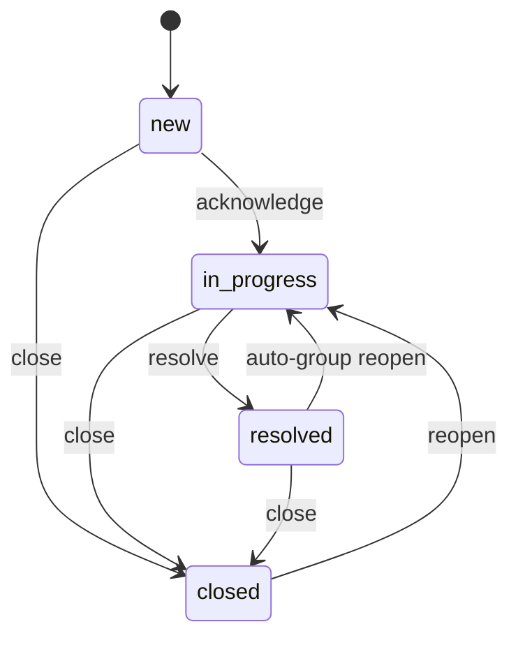

# Cases

!!! warning "Public Beta"
    Cases is in Public Beta. It will change without a warning, and there is no backward compatibility.

The Cases extension is a SOC triage system. It converts LimaCharlie detections into cases that you can track, and it adds SLA enforcement, investigation tools, and performance reports. It is made for environments with a high volume of detections. In these environments, an analyst must acknowledge, investigate, classify, and resolve every detection in a measurable time.

After you subscribe, the extension ingests the detections of the organization and converts them into cases. By default, it ingests all detections. With [Tailored mode](#ingestion-mode), you select which detections create cases through D&R rules. Analysts work the case queue through a defined lifecycle, attach investigation evidence, and classify outcomes. SOC managers get real-time dashboards and MTTA/MTTR reports.

## Enabling the Extension

Open the [Cases extension page](https://app.limacharlie.io/add-ons/extension-detail/ext-cases) in the marketplace. Select the organization that you want to enable it for, then select **Subscribe**.

When you subscribe, the extension automatically:

1. Installs D&R rules that forward detections to the cases system through extension requests
2. Initializes the organization with default configuration (severity mapping, SLA targets, retention)

No more setup is necessary before you receive cases. Detections start immediately.

The full API specification is available as an OpenAPI document at [cases.limacharlie.io/openapi](https://cases.limacharlie.io/openapi).

!!! info "Permissions"
    The cases extension uses the existing RBAC permissions of LimaCharlie. Analysts need `investigation.get` to see cases and reports. They need `investigation.set` to update cases, add notes, and manage investigation data. To read the organization settings, you need `org.conf.get`. To update them, you need `org.conf.set`.

## How Cases Are Created

Every detection that D&R rules generate in a subscribed organization becomes a case. By default, one detection maps to one case.

Each case captures from the detection:

- **Severity** (comes from the detection priority through the configured severity mapping)
- **Detection count** (number of linked detections)

The linked **CaseDetection** records store the individual detection fields, not the case. These fields are the detection category, source, priority, sensor ID, hostname, and detection ID. When you list cases, the linked detections fill the aggregated fields `detection_cats` (unique detection categories) and `sids` (unique SIDs).

The extension drops duplicate detections (same `detect_id`) to stop duplicate cases.

### Auto-Grouping

If auto-grouping is enabled in the organization configuration, a new detection can attach to an open case instead of a new case. This reduces the number of cases for noisy rules.

You configure the grouping behavior in two ways:

**Group key** -- which identity values must match before detections group together:

- `auto_grouping_include_sensor` (default `true`) -- only detections from the same sensor group together.
- `auto_grouping_include_category` (default `false`) -- only detections of the same category group together.

If both are disabled, all detections in the org group into one case during the window. If both are enabled, detections must match on both sensor and category.

**Time window** -- how far apart in time detections can be and still group:

- `auto_grouping_window_minutes` (default `1440`, range `1`--`10080`) -- maximum time span used to group detections.
- `auto_grouping_window_mode` (default `sliding`):
  - `sliding` -- the window resets on each new detection. The case continues to group new detections while matching detections arrive in the window after its most recent activity.
  - `fixed` -- the extension puts detections into buckets with wall-clock boundaries of size `window_minutes`. Two detections group only if they are in the same bucket.

**Reopening closed cases** -- `auto_grouping_reopen_closed` (default `true`) controls if a matching detection can reopen a `resolved` or `closed` case. If it is true, the extension reopens the case and adds a `case_reopened` event with `source=auto_grouping` to its audit trail. If it is false, a matching detection against a closed case creates a new case.

When the extension groups a detection into an existing case:

- The case's `detection_count` increments
- The severity can increase if the new detection has a higher priority
- The extension records an event in the case's audit trail

## Case Lifecycle

Cases obey a defined state machine. The state machine tracks progress from creation to resolution.


```mermaid
stateDiagram-v2
    [*] --> new
    new --> in_progress: acknowledge
    new --> closed: close
    in_progress --> resolved: resolve
    in_progress --> closed: close
    resolved --> closed: close
    resolved --> in_progress: auto-group reopen
    closed --> in_progress: reopen
```

A manual update can move a case from `resolved` only to `closed`. If `auto_grouping_reopen_closed` is enabled, auto-grouping can also move a `resolved` or `closed` case back to `in_progress` when a matching detection arrives. An auto-grouping reopen clears the stale `resolved_at` / `closed_at` timestamps and `ttr_seconds`, so the next resolution calculates TTR correctly.

### Status Definitions

| Status | Description |
|--------|-------------|
| `new` | Case created, not yet reviewed by an analyst |
| `in_progress` | An analyst investigates the case. Records the TTA timestamp on first entry |
| `resolved` | Investigation complete, findings documented. Records the TTR timestamp |
| `closed` | Case fully closed. Terminal state |

### Key Timestamps

- **`created_at`** -- Set when the case is created from a detection
- **`acknowledged_at`** -- Set on first transition to `in_progress` (used for TTA calculation)
- **`resolved_at`** -- Set on first transition to `resolved` (used for TTR calculation)
- **`closed_at`** -- Set on transition to `closed`

## Severity and SLA

### Severity Mapping

The extension maps LimaCharlie detection priorities (integer 0--10) to four severity levels. You configure the thresholds for each organization. A fifth level, `info`, is for manual use only.

| Severity | Default Priority Range | Description |
|----------|----------------------|-------------|
| `critical` | 8--10 | Needs an immediate response |
| `high` | 5--7 | Urgent, handle quickly |
| `medium` | 3--4 | Standard priority |
| `low` | 0--2 | Informational, handle when you have time |
| `info` | _(manual only)_ | Not actionable; lets analysts link activity without a statement of a real problem |

The extension never assigns `info` automatically from the detection priority. You can set it only when you create or update a case.

### SLA Targets

Each severity level has two SLA targets:

- **MTTA (Mean Time To Acknowledge)** -- Maximum time from case creation to first acknowledgement
- **MTTR (Mean Time To Resolve)** -- Maximum time from case creation to resolution

Default SLA targets:

| Severity | MTTA Target | MTTR Target |
|----------|-------------|-------------|
| `critical` | 15 minutes | 4 hours |
| `high` | 15 minutes | 12 hours |
| `medium` | 1 hour | 24 hours |
| `low` | 100 minutes | ~47 hours |
| `info` | 8 hours | 7 days |

The dashboard and the reporting views track SLA breaches.

## Configuration

Each organization has its own configuration that controls severity mapping, SLA targets, retention, and optional features.

### Configuration Options

You set the settings below through the REST API (`GET/PUT /api/v1/config/{oid}`):

| Setting | Type | Default | Description |
|---------|------|---------|-------------|
| `severity_mapping.critical_min` | int | `8` | Minimum detection priority for `critical` severity |
| `severity_mapping.high_min` | int | `5` | Minimum detection priority for `high` severity |
| `severity_mapping.medium_min` | int | `3` | Minimum detection priority for `medium` severity |
| `sla_config.critical.mtta_minutes` | int | `15` | MTTA target for critical cases (minutes) |
| `sla_config.critical.mttr_minutes` | int | `240` | MTTR target for critical cases (minutes) |
| `sla_config.high.mtta_minutes` | int | `15` | MTTA target for high cases (minutes) |
| `sla_config.high.mttr_minutes` | int | `720` | MTTR target for high cases (minutes) |
| `sla_config.medium.mtta_minutes` | int | `60` | MTTA target for medium cases (minutes) |
| `sla_config.medium.mttr_minutes` | int | `1440` | MTTR target for medium cases (minutes) |
| `sla_config.low.mtta_minutes` | int | `100` | MTTA target for low cases (minutes) |
| `sla_config.low.mttr_minutes` | int | `2800` | MTTR target for low cases (minutes) |
| `sla_config.info.mtta_minutes` | int | `480` | MTTA target for info cases (minutes) |
| `sla_config.info.mttr_minutes` | int | `10080` | MTTR target for info cases (minutes) |
| `retention_days` | int | `90` | Days to keep resolved/closed cases before archival |
| `auto_close_resolved_after_days` | int | `7` | Close resolved cases automatically after this many days. Set to `0` to disable |
| `auto_grouping_enabled` | bool | `false` | Group related detections into single cases automatically (see [Auto-Grouping](#auto-grouping)) |
| `auto_grouping_include_sensor` | bool | `true` | Only applies when auto-grouping is enabled. When true, only detections from the same sensor group together |
| `auto_grouping_include_category` | bool | `false` | Only applies when auto-grouping is enabled. When true, only detections of the same category group together |
| `auto_grouping_window_minutes` | int | `1440` | Only applies when auto-grouping is enabled. Maximum time span used to group detections (1--10080 minutes) |
| `auto_grouping_window_mode` | string | `"sliding"` | Only applies when auto-grouping is enabled. `"sliding"` resets the window on each new detection; `"fixed"` groups by wall-clock boundaries |
| `auto_grouping_reopen_closed` | bool | `true` | Only applies when auto-grouping is enabled. When true, a matching detection reopens a resolved/closed case instead of a new case |

You manage the settings below on the extension configuration page in the LimaCharlie web app, not through the REST API:

| Setting | Type | Default | Description |
|---------|------|---------|-------------|
| `ingestion_mode` | string | `"all"` | Controls which detections create cases. `"all"` forwards every detection; `"tailored"` creates cases only for the detections that D&R rules send (see [Ingestion Mode](#ingestion-mode)) |

### Get Configuration

=== "REST API"

    ```bash
    curl -s -X GET \
      "https://cases.limacharlie.io/api/v1/config/YOUR_OID" \
      -H "Authorization: Bearer $LC_JWT"
    ```

=== "CLI"

    ```bash
    limacharlie case config-get
    ```

### Update Configuration

=== "REST API"

    ```bash
    curl -s -X PUT \
      "https://cases.limacharlie.io/api/v1/config/YOUR_OID" \
      -H "Authorization: Bearer $LC_JWT" \
      -H "Content-Type: application/json" \
      -d '{
        "severity_mapping": {
          "critical_min": 8,
          "high_min": 5,
          "medium_min": 3
        },
        "sla_config": {
          "critical": {"mtta_minutes": 15, "mttr_minutes": 240},
          "high": {"mtta_minutes": 30, "mttr_minutes": 480},
          "medium": {"mtta_minutes": 60, "mttr_minutes": 1440},
          "low": {"mtta_minutes": 120, "mttr_minutes": 2880},
          "info": {"mtta_minutes": 480, "mttr_minutes": 10080}
        },
        "retention_days": 90,
        "auto_close_resolved_after_days": 7,
        "auto_grouping_enabled": true,
        "auto_grouping_include_sensor": true,
        "auto_grouping_include_category": false,
        "auto_grouping_window_minutes": 1440,
        "auto_grouping_window_mode": "sliding",
        "auto_grouping_reopen_closed": true
      }'
    ```

=== "CLI"

    ```bash
    limacharlie case config-set --input-file config.yaml
    # Or pipe from stdin
    echo '{"retention_days": 60}' | limacharlie case config-set
    ```

## Working with Cases

### Creating a Case

The extension converts detections to cases automatically, but you can also create cases manually with the CLI or the SDK. Manual cases are useful for ad-hoc investigations, or when you integrate an external source of detections. To create an empty investigation case, with no linked detection, omit the `--detection` flag.

=== "CLI"

    ```bash
    # Create an empty investigation case (--summary is required)
    limacharlie case create --summary "Investigating lateral movement"

    # Create from a full detection object with severity override
    limacharlie case create --detection '<full detection JSON>' \
        --severity high --summary "High severity lateral movement"
    ```

=== "Python"

    ```python
    from limacharlie.sdk.cases import Cases
    from limacharlie.sdk.organization import Organization
    from limacharlie.client import Client

    client = Client(oid="YOUR_OID")
    org = Organization(client)
    c = Cases(org)

    result = c.create_case(
        detection={"detect_id": "DETECTION_ID", "cat": "lateral_movement", ...},
        severity="high",
        summary="High severity lateral movement",
    )
    print(result["case_number"])
    ```

### Listing Cases

Query the case queue with filters, sort options, and pagination. A query can cross organizations, for a SOC that manages many organizations.

=== "REST API"

    ```bash
    # List open cases, most recent first
    curl -s -X GET \
      "https://cases.limacharlie.io/api/v1/cases?oids=YOUR_OID&status=new&sort=created_at&order=desc&page_size=50" \
      -H "Authorization: Bearer $LC_JWT"
    ```

=== "CLI"

    ```bash
    limacharlie case list --status new --sort created_at --order desc --limit 20
    limacharlie case list --severity critical --severity high --search "mimikatz"
    limacharlie case list --sid SENSOR_ID --status new
    ```

Query parameters that you can use:

| Parameter | Description |
|-----------|-------------|
| `oids` | Organization IDs (comma-separated, required) |
| `status` | Filter by status (comma-separated: `new`, `in_progress`, `resolved`, `closed`) |
| `severity` | Filter by severity (comma-separated: `critical`, `high`, `medium`, `low`, `info`) |
| `classification` | Filter by classification (comma-separated: `pending`, `true_positive`, `false_positive`) |
| `assignee` | Filter by assigned analyst email |
| `search` | Search text (matches against detection category and hostname across linked detections) |
| `sid` | Filter to cases with detections from this SID |
| `tag` | Filter by tags (comma-separated, AND logic: all specified tags must be present) |
| `sort` | Sort field (`created_at`, `severity`, `case_number`) |
| `order` | Sort order (`asc`, `desc`) |
| `page_size` | Page size, 1--200 (default 50) |
| `page_token` | Pagination token from previous response |

### Getting a Case

=== "REST API"

    ```bash
    curl -s -X GET \
      "https://cases.limacharlie.io/api/v1/cases/42?oid=YOUR_OID" \
      -H "Authorization: Bearer $LC_JWT"
    ```

=== "CLI"

    ```bash
    limacharlie case get --case-number 42
    ```

Returns the full case with the event timeline (the audit trail of all changes).

### Exporting a Case

Export a case with all its parts in a single JSON object. The parts are the case record, the event timeline, detections, entities, telemetry, and artifacts.

=== "CLI"

    ```bash
    # Export as JSON to stdout
    limacharlie case export --case-number 42

    # Export with full data (detection records, telemetry events,
    # artifact binaries) to a local directory
    limacharlie case export --case-number 42 --with-data ./case-export
    ```

=== "Python"

    ```python
    c = Cases(org)
    data = c.export_case(42)
    # data contains: case, events, detections, entities, telemetry, artifacts
    ```

Without `--with-data`, the command prints the combined metadata JSON to stdout. With `--with-data <DIR>`, the command creates a directory that contains:

- `case.json` -- case record, event timeline, entities
- `detections/` -- one JSON file for each linked detection (fetched from Insight)
- `telemetry/` -- one JSON file for each linked telemetry event (fetched by atom+sid)
- `artifacts/` -- downloaded artifact binaries

A fetch that fails (for example, expired or retained data) gives a warning. The command skips it.

### Updating a Case

=== "REST API"

    ```bash
    curl -s -X PATCH \
      "https://cases.limacharlie.io/api/v1/cases/42?oid=YOUR_OID" \
      -H "Authorization: Bearer $LC_JWT" \
      -H "Content-Type: application/json" \
      -d '{
        "status": "in_progress",
        "assignees": ["analyst@example.com"]
      }'
    ```

=== "CLI"

    ```bash
    limacharlie case update --case-number 42 --status in_progress --assignees analyst@example.com
    limacharlie case update --case-number 42 --status resolved \
        --classification true_positive --conclusion "Contained via network isolation"
    ```

Updatable fields:

| Field | Type | Description |
|-------|------|-------------|
| `status` | string | New status (must be a valid transition) |
| `severity` | string | Case severity: `critical`, `high`, `medium`, `low`, or `info` |
| `assignees` | string[] | Analysts to assign the case to |
| `classification` | string | `true_positive`, `false_positive`, or `pending` |
| `summary` | string | Investigation summary text (max 8192 characters, Markdown supported) |
| `conclusion` | string | Final conclusion (max 8192 characters, Markdown supported) |
| `tags` | string[] | Arbitrary tags for categorization (see [Tags](#tags)) |

### Bulk Updates

Update many cases at the same time. This is useful when you close many false positives, or when you reassign work.

=== "REST API"

    ```bash
    curl -s -X POST \
      "https://cases.limacharlie.io/api/v1/cases/bulk-update" \
      -H "Authorization: Bearer $LC_JWT" \
      -H "Content-Type: application/json" \
      -d '{
        "oid": "YOUR_OID",
        "case_numbers": [1, 2, 3],
        "update": {
          "status": "closed",
          "classification": "false_positive"
        }
      }'
    ```

=== "CLI"

    ```bash
    limacharlie case bulk-update --numbers 1,2,3 \
        --status closed --classification false_positive
    limacharlie case bulk-update --input-file case_numbers.txt --status resolved
    ```

One bulk operation can update a maximum of 200 cases. A bulk update supports only the `status` and `classification` fields. For other fields, such as severity, assignees, and tags, update each case separately.

### Tags

Cases support arbitrary string tags for custom categorization and workflow organization (for example, "phishing", "ransomware", "shift-b").

**Constraints:**

| Constraint | Value |
|-----------|-------|
| Max tag length | 128 characters |
| Max tags for each case | 50 |
| Case sensitivity | Case-preserved, case-insensitive deduplication |
| Allowed characters | Any printable character (no control characters) |

#### Setting Tags

To set tags, replace the full tag array on the case.

=== "REST API"

    ```bash
    curl -s -X PATCH \
      "https://cases.limacharlie.io/api/v1/cases/42?oid=YOUR_OID" \
      -H "Authorization: Bearer $LC_JWT" \
      -H "Content-Type: application/json" \
      -d '{"tags": ["phishing", "urgent"]}'
    ```

=== "CLI"

    ```bash
    limacharlie case update --case-number 42 --tag phishing --tag urgent --oid YOUR_OID
    ```

=== "Python"

    ```python
    c = Cases(org)
    c.update_case(42, tags=["phishing", "urgent"])
    ```

#### Tag Management CLI

The CLI has commands that add or remove one tag. These commands do not replace the full array.

```bash
# Replace all tags
limacharlie case tag set --case-number 42 --tag phishing --tag urgent --oid YOUR_OID

# Add a tag (preserves existing tags)
limacharlie case tag add --case-number 42 --tag new-label --oid YOUR_OID

# Remove a tag
limacharlie case tag remove --case-number 42 --tag old-label --oid YOUR_OID
```

#### Filtering by Tag

Filter the case list to the cases that have all the specified tags (AND logic).

=== "REST API"

    ```bash
    curl -s -X GET \
      "https://cases.limacharlie.io/api/v1/cases?oids=YOUR_OID&tag=phishing,urgent" \
      -H "Authorization: Bearer $LC_JWT"
    ```

=== "CLI"

    ```bash
    limacharlie case list --tag phishing --tag urgent --oid YOUR_OID
    ```

=== "Python"

    ```python
    c = Cases(org)
    c.list_cases(tag=["phishing", "urgent"])
    ```

A tag change creates a `case_tags_updated` event in the case's audit trail. The event metadata contains the old and the new tag values.

### Classification

You classify cases to track detection accuracy. You can set the classification at any status.

| Classification | Description |
|---------------|-------------|
| `pending` | Not yet classified (default) |
| `true_positive` | Confirmed malicious or policy-violating activity |
| `false_positive` | Benign activity that a rule flagged incorrectly |

Reports track the classification rates. Use the rates to tune the detection rules.

## Detections

Each case is created from a detection. More detections can link to the case, for example when auto-grouping is enabled, or when you link related detections manually.

### Link a Detection

=== "REST API"

    ```bash
    curl -s -X POST \
      "https://cases.limacharlie.io/api/v1/cases/42/detections?oid=YOUR_OID" \
      -H "Authorization: Bearer $LC_JWT" \
      -H "Content-Type: application/json" \
      -d '{
        "detection": {
          "detect_id": "DETECTION_ID",
          "cat": "lateral-movement",
          "source": "dr-general",
          "routing": {
            "sid": "550e8400-e29b-41d4-a716-446655440000",
            "hostname": "DESKTOP-001"
          },
          "detect_mtd": {
            "level": "high"
          }
        }
      }'
    ```

    The `detection` field accepts a full LC detection object. The extension extracts the fields `detect_id`, `cat`, `source`, `routing` (with `sid` and `hostname`), and `detect_mtd` (with `level`) automatically.

=== "CLI"

    ```bash
    limacharlie case detection add --case 42 \
        --detection '<full detection JSON>'
    ```

### List Linked Detections

=== "REST API"

    ```bash
    curl -s -X GET \
      "https://cases.limacharlie.io/api/v1/cases/42/detections?oid=YOUR_OID" \
      -H "Authorization: Bearer $LC_JWT"
    ```

=== "CLI"

    ```bash
    limacharlie case detection list --case 42
    ```

### Unlink a Detection

=== "REST API"

    ```bash
    curl -s -X DELETE \
      "https://cases.limacharlie.io/api/v1/cases/42/detections/DETECTION_ID?oid=YOUR_OID" \
      -H "Authorization: Bearer $LC_JWT"
    ```

=== "CLI"

    ```bash
    limacharlie case detection remove --case 42 --detection-id DETECTION_ID
    ```

## Investigation

Each case supports structured investigation evidence that creates a documented chain of analysis.

### Entities (IOCs)

Attach indicators of compromise and other artifacts of interest to a case.

=== "REST API"

    ```bash
    # Add an entity
    curl -s -X POST \
      "https://cases.limacharlie.io/api/v1/cases/42/entities?oid=YOUR_OID" \
      -H "Authorization: Bearer $LC_JWT" \
      -H "Content-Type: application/json" \
      -d '{
        "entity_type": "ip",
        "entity_value": "203.0.113.50",
        "verdict": "malicious",
        "note": "Outbound connections observed from compromised host"
      }'
    ```

=== "CLI"

    ```bash
    limacharlie case entity add --case 42 \
        --type ip --value "203.0.113.50" --verdict malicious \
        --note "Outbound connections observed from compromised host"
    limacharlie case entity list --case 42
    limacharlie case entity update --case 42 --entity-id ENTITY_ID --verdict benign
    limacharlie case entity remove --case 42 --entity-id ENTITY_ID
    ```

Supported entity types: `ip`, `domain`, `hash`, `url`, `user`, `email`, `file`, `process`, `registry`, `other`

Verdict values: `malicious`, `suspicious`, `benign`, `unknown`, `informational`

### Cross-Case Entity Search

Find all cases that contain a specific indicator. The result shows how far an IOC extends across the organization.

=== "REST API"

    ```bash
    curl -s -X GET \
      "https://cases.limacharlie.io/api/v1/entities/search?oids=YOUR_OID&entity_type=ip&entity_value=203.0.113.50" \
      -H "Authorization: Bearer $LC_JWT"
    ```

=== "CLI"

    ```bash
    limacharlie case entity search --type ip --value "203.0.113.50"
    ```

### Telemetry References

Link specific LimaCharlie events to the case. Each link is a direct reference to the raw telemetry for forensic review.

#### Add Telemetry

=== "REST API"

    ```bash
    curl -s -X POST \
      "https://cases.limacharlie.io/api/v1/cases/42/telemetry?oid=YOUR_OID" \
      -H "Authorization: Bearer $LC_JWT" \
      -H "Content-Type: application/json" \
      -d '{
        "event": {
          "routing": {
            "this": "abc123def456",
            "sid": "550e8400-e29b-41d4-a716-446655440000",
            "event_type": "NEW_PROCESS"
          }
        },
        "verdict": "malicious",
        "note": "Initial payload execution"
      }'
    ```

    The `event` field accepts a full LC event object. The extension extracts the `routing.this` (atom), `routing.sid`, and `routing.event_type` fields automatically.

=== "CLI"

    ```bash
    limacharlie case telemetry add --case 42 \
        --event '<full LC event JSON>' \
        --verdict malicious --note "Initial payload execution"
    ```

#### List Telemetry

=== "REST API"

    ```bash
    curl -s -X GET \
      "https://cases.limacharlie.io/api/v1/cases/42/telemetry?oid=YOUR_OID" \
      -H "Authorization: Bearer $LC_JWT"
    ```

=== "CLI"

    ```bash
    limacharlie case telemetry list --case 42
    ```

#### Update Telemetry

=== "REST API"

    ```bash
    curl -s -X PATCH \
      "https://cases.limacharlie.io/api/v1/cases/42/telemetry/TELEMETRY_ID?oid=YOUR_OID" \
      -H "Authorization: Bearer $LC_JWT" \
      -H "Content-Type: application/json" \
      -d '{"verdict": "benign", "note": "Confirmed legitimate process"}'
    ```

#### Remove Telemetry

=== "REST API"

    ```bash
    curl -s -X DELETE \
      "https://cases.limacharlie.io/api/v1/cases/42/telemetry/TELEMETRY_ID?oid=YOUR_OID" \
      -H "Authorization: Bearer $LC_JWT"
    ```

### Artifacts

Attach references to forensic artifacts such as memory dumps, packet captures, or disk images.

#### Add Artifact

=== "REST API"

    ```bash
    curl -s -X POST \
      "https://cases.limacharlie.io/api/v1/cases/42/artifacts?oid=YOUR_OID" \
      -H "Authorization: Bearer $LC_JWT" \
      -H "Content-Type: application/json" \
      -d '{
        "artifact_type": "memory_dump",
        "path": "/artifacts/pid4832_memdump.raw",
        "source": "DESKTOP-001",
        "verdict": "malicious",
        "note": "Full memory dump of PID 4832 from DESKTOP-001"
      }'
    ```

=== "CLI"

    ```bash
    limacharlie case artifact add --case 42 \
        --type memory_dump --path "/artifacts/pid4832_memdump.raw" \
        --source DESKTOP-001 --verdict malicious \
        --note "Full memory dump of PID 4832"
    ```

#### List Artifacts

=== "REST API"

    ```bash
    curl -s -X GET \
      "https://cases.limacharlie.io/api/v1/cases/42/artifacts?oid=YOUR_OID" \
      -H "Authorization: Bearer $LC_JWT"
    ```

=== "CLI"

    ```bash
    limacharlie case artifact list --case 42
    ```

#### Remove Artifact

=== "REST API"

    ```bash
    curl -s -X DELETE \
      "https://cases.limacharlie.io/api/v1/cases/42/artifacts/ARTIFACT_ID?oid=YOUR_OID" \
      -H "Authorization: Bearer $LC_JWT"
    ```

### Notes

Add structured notes that record analysis, remediation steps, and handoff information. The content of a note supports Markdown format (headers, bullet lists, tables, code blocks).

=== "REST API"

    ```bash
    curl -s -X POST \
      "https://cases.limacharlie.io/api/v1/cases/42/notes?oid=YOUR_OID" \
      -H "Authorization: Bearer $LC_JWT" \
      -H "Content-Type: application/json" \
      -d '{
        "content": "Confirmed lateral movement to DESKTOP-002 via PsExec. Isolating both endpoints.",
        "note_type": "analysis",
        "is_public": false
      }'
    ```

=== "CLI"

    ```bash
    limacharlie case add-note --case-number 42 --type analysis \
        --content "Confirmed lateral movement to DESKTOP-002 via PsExec."
    echo "Handoff notes" | limacharlie case add-note --case-number 42 --type handoff
    ```

Note types:

| Type | Description |
|------|-------------|
| `general` | General-purpose note |
| `analysis` | Analysis findings and observations |
| `remediation` | Remediation steps taken or planned |
| `recommendation` | Recommended actions or next steps for reviewers |
| `escalation` | Escalation context and rationale |
| `handoff` | Shift or team handoff information |
| `to_stakeholder` | Communication sent to external stakeholders (customers, management) |
| `from_stakeholder` | Communication received from external stakeholders |

Notes support an optional `is_public` boolean field. If it is `true`, the note is visible to external stakeholders and you can share it with them. The default is `false`.

#### Updating Note Visibility

After you create a note, you can change its `is_public` flag:

=== "REST API"

    ```bash
    curl -s -X PATCH \
      "https://cases.limacharlie.io/api/v1/cases/42/notes/EVENT_ID?oid=YOUR_OID" \
      -H "Authorization: Bearer $LC_JWT" \
      -H "Content-Type: application/json" \
      -d '{"is_public": true}'
    ```

=== "CLI"

    ```bash
    limacharlie case update-note --case-number 42 --event-id EVENT_ID --is-public
    limacharlie case update-note --case-number 42 --event-id EVENT_ID --no-is-public
    ```

The `EVENT_ID` is the `event_id` that the API returns when you create the note.

## Case Merging

You can merge related cases when many detections are part of the same incident. A merge combines the investigation into one primary case.

=== "REST API"

    ```bash
    curl -s -X POST \
      "https://cases.limacharlie.io/api/v1/cases/merge" \
      -H "Authorization: Bearer $LC_JWT" \
      -H "Content-Type: application/json" \
      -d '{
        "oid": "YOUR_OID",
        "target_case_number": 10,
        "source_case_numbers": [11, 12]
      }'
    ```

=== "CLI"

    ```bash
    limacharlie case merge --target 10 --sources 11,12
    ```

One merge can include a maximum of 20 source cases.

When you merge cases:

- The target case inherits all detections from the source cases
- The source cases close with `merged_into_case_id` set to the target case
- The extension records merge events in the audit trail of all affected cases

## Assignees

List all unique assignee emails in the organizations that you can access. Use the list to fill assignment dropdowns.

=== "REST API"

    ```bash
    curl -s -X GET \
      "https://cases.limacharlie.io/api/v1/assignees?oids=YOUR_OID" \
      -H "Authorization: Bearer $LC_JWT"
    ```

=== "CLI"

    ```bash
    limacharlie case assignees
    ```

## Subscribed Organizations

List all organizations that subscribe to the Cases extension and that you can access.

```bash
curl -s -X GET \
  "https://cases.limacharlie.io/api/v1/orgs" \
  -H "Authorization: Bearer $LC_JWT"
```

Returns `{"oids": ["oid1", "oid2", ...]}`. Needs the `investigation.get` permission. The list shows which of your organizations have Cases enabled, so you do not check each organization separately.

## D&R Rule Integration

The cases extension has request handlers that you can use in D&R rule response actions. These handlers give automatic case management that is based on detection logic.

### Ingestion Mode

The `ingestion_mode` configuration controls how detections become cases:

- **`all`** (default) -- Every detection in the organization creates a case automatically. No D&R rules are necessary. The extension excludes internal detections (categories that start with `__`) automatically.
- **`tailored`** -- Only the detections that D&R rules forward with the `ingest_detection` action create cases. This gives you fine-grained control over which detections enter the case queue.

To forward a specific detection to the cases system in tailored mode, create a D&R rule:

```yaml
# Change 'my-detection-name' to the detection category you want to track.
detect:
  target: detection
  event: my-detection-name
  op: exists
  path: detect

respond:
  - action: extension request
    extension name: ext-cases
    extension action: ingest_detection
    extension request:
      detect_id: detect_id
      cat: cat
      source: source
      routing: routing
      detect: detect
      detect_mtd: detect_mtd
```

The extension configuration page includes a sample D&R rule template for tailored mode. You can copy the template and change it.

### Create a Case Manually

Create a case from a D&R rule response action. The `create_case` action accepts an optional `detection` object that contains the full detection data, and an optional `severity` override. If you omit `detection`, the extension creates an empty investigation case.

```yaml
respond:
  - action: extension request
    extension name: ext-cases
    extension action: create_case
    extension request:
      detection:
        detect_id: detect_id
        cat: cat
        source: source
        routing: routing
        detect_mtd: detect_mtd
```

!!! note "Value resolution"
    The extension resolves the values in `extension request` as gjson paths against the event that triggers the rule. Bare names such as `detect_id` extract the field value and keep the nested object structure for fields such as `routing`. Do not use Go template syntax (`{{ }}`). It converts objects into strings.

| Parameter | Type | Description |
|-----------|------|-------------|
| `detection` | object | Optional. Full LC detection object. The extension extracts the fields `detect_id`, `cat`, `source`, `routing`, and `detect_mtd` automatically. Omit to create an empty investigation case. |
| `severity` | string | Optional. Severity override: `critical`, `high`, `medium`, `low`, `info`. The default is the severity that comes from the detection priority. When you call from the REST API or the SDK, pass it as a top-level string field. |

### Query Open Case Count

The `get_case_count` extension action returns the number of open cases for each status. You send it as an extension request through the REST API or the SDK. Use it to build automation and monitoring workflows.

=== "REST API"

    ```bash
    curl -s -X POST \
      "https://api.limacharlie.io/v1/extension/request/ext-cases" \
      -H "Authorization: Bearer $LC_JWT" \
      -d oid="YOUR_OID" \
      -d action="get_case_count" \
      -d data='{}'
    ```

Returns a count for each status and a `total` field, for example: `{"new": 5, "in_progress": 3, "resolved": 2, "closed": 10, "total": 20}`.

## Dashboard

The dashboard shows the case queue in real time.

=== "REST API"

    ```bash
    curl -s -X GET \
      "https://cases.limacharlie.io/api/v1/dashboard/counts?oids=YOUR_OID" \
      -H "Authorization: Bearer $LC_JWT"
    ```

=== "CLI"

    ```bash
    limacharlie case dashboard
    ```

Returns:

- Case counts by status
- Case counts by severity
- SLA breach counts (cases that exceed the MTTA or MTTR targets)

## Reporting

SOC performance reports give aggregated metrics. Use the metrics to measure team effectiveness and detection quality.

### Summary Report

=== "REST API"

    ```bash
    curl -s -X GET \
      "https://cases.limacharlie.io/api/v1/reports/summary?oids=YOUR_OID&from=2025-01-01T00:00:00Z&to=2025-02-01T00:00:00Z" \
      -H "Authorization: Bearer $LC_JWT"
    ```

=== "CLI"

    ```bash
    limacharlie case report \
        --from 2025-01-01T00:00:00Z --to 2025-02-01T00:00:00Z
    ```

Query parameters:

| Parameter | Description |
|-----------|-------------|
| `oids` | Organization IDs (comma-separated) |
| `from` | Start of reporting period (RFC 3339 timestamp) |
| `to` | End of reporting period (RFC 3339 timestamp) |

The summary report includes metrics for each organization and aggregate metrics:

- **MTTA** -- Average and median time to acknowledge, with SLA compliance
- **MTTR** -- Average and median time to resolve, with SLA compliance
- **Volume** -- Total case counts, true positives, and false positives
- **Classification rates** -- True positive vs false positive percentages

## Webhook Notifications

The extension sends webhook notifications for case events automatically. It uses the extension hooks mechanism of LimaCharlie. The notifications are gzip-compressed HTTP POST requests to the webhook adapter endpoint that you configure for the organization.

The webhook forwards these events: case creation, status changes, assignments, classifications, notes, and investigation updates.

Each webhook payload includes:

- `action` -- The event type (e.g. `created`, `status_changed`, `assigned`)
- `case_id` -- The affected case ID
- `case_number` -- The human-readable case number
- `oid` -- The organization ID
- `by` -- The user who did the action
- `ts` -- Timestamp of the event
- `metadata` -- Event-specific details (e.g. old/new status values)

## Real-Time Updates (WebSocket)

The cases API has a WebSocket endpoint for real-time delivery of case events at `GET /api/v1/ws`.

To connect:

1. Open a WebSocket connection to `wss://cases.limacharlie.io/api/v1/ws`
2. Send `{"type": "auth", "token": "<LC_JWT>"}` to authenticate
3. Send `{"type": "subscribe", "case_id": "<CASE_ID>"}` to subscribe to case updates

The server pushes `case_event` messages when changes occur. The messages include status transitions, assignments, notes, and investigation updates. Presence tracking shows which users look at a case now.

## Rate Limiting

The API enforces a rate limit of 20 requests each second (sustained), with a burst allowance of 50 requests for each user. A request above the limit gets a `429 Too Many Requests` response.

Detection ingestion has a separate rate limit for each organization of 100 detections each minute. Organizations on the free tier (a sensor quota of 2 or fewer) have a limit of 5 detections each minute.

## Audit Trail

The extension records every action on a case as an immutable event in the case's timeline. The timeline gives a complete chain of custody for compliance and review.

Tracked event types:

| Event | Description |
|-------|-------------|
| `case_created` | Case created from detection |
| `case_acknowledged` | First transition to `in_progress` (TTA milestone) |
| `case_status_changed` | Status transition |
| `case_assigned` | Analyst assigned |
| `case_classified` | True positive / false positive classification set |
| `case_severity_changed` | Severity manually changed |
| `case_resolved` | Case resolved |
| `case_closed` | Case closed |
| `case_reopened` | Closed case reopened |
| `case_note_added` | Note added to case |
| `case_note_visibility_changed` | Public visibility of the note changed |
| `case_detection_added` | Detection grouped into case |
| `case_detection_removed` | Detection removed from case |
| `case_severity_upgraded` | Severity increased because of a detection with a higher priority |
| `case_merged_into` | Case merged into another case |
| `case_merged_from` | Case received merge from another case |
| `case_entity_added` | IOC/entity attached |
| `case_entity_updated` | Entity verdict or note updated |
| `case_entity_removed` | Entity removed |
| `case_telemetry_added` | Telemetry reference linked |
| `case_telemetry_updated` | Telemetry metadata updated |
| `case_telemetry_removed` | Telemetry reference removed |
| `case_artifact_added` | Forensic artifact attached |
| `case_artifact_removed` | Artifact removed |
| `case_tags_updated` | Tags changed (old and new values in metadata) |
| `case_summary_updated` | Investigation summary edited |
| `case_conclusion_updated` | Investigation conclusion edited |
| `case_config_updated` | Organization configuration updated |
| `cases_deleted` | Cases deleted (retention) |

## Data Retention

The extension keeps resolved and closed cases for the configured `retention_days` (default 90 days). After the retention period, the extension moves the cases to long-term storage and removes them from the active case store.

Long-term storage keeps the archived data for 2 years, for compliance and historical reports.

## Unsubscribing

When you unsubscribe from the extension, it removes the D&R rules that forward detections. It also deletes all case data for the organization. You cannot undo this action.

---

## See Also

- [D&R Rules Overview](../../../3-detection-response/index.md) -- Detection rules that generate the detections ingested as cases
- [Response Actions](../../../8-reference/response-actions.md) -- The `extension request` action for D&R rule integration
- [Using Extensions](../using-extensions.md) -- General extension subscription and management
- [Compliance Case-Reviewer Agent](../../../9-ai-sessions/compliance/case-reviewer-agent.md) -- AI agents for each framework (PCI, HIPAA, CMMC, SOC 2, NIST 800-53, ISO 27001, CIS v8). They classify in-scope cases against control citations on `case_created` events, and write audit-grade documentation into the case record
- [Compliance Plugin Overview](../../../9-ai-sessions/compliance/index.md) -- Installation and capabilities of the `lc-compliance` Claude Code plugin
