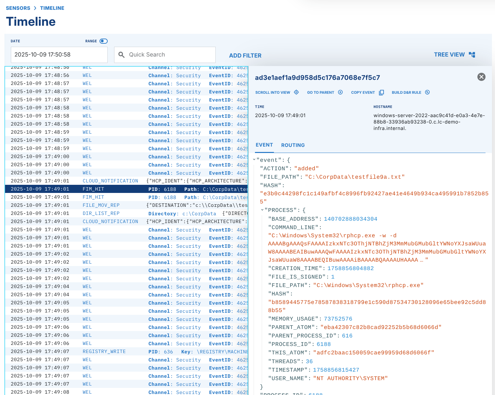

# Integrity

The Integrity Extension helps you manage file integrity monitoring (FIM) and registry integrity monitoring (RIM). The extension automates integrity checks of file system values and registry values with pattern-based rules.

## Enabling the Integrity Extension

To enable the Integrity extension, do these steps:

1. Open the [Integrity extension page](https://app.limacharlie.io/add-ons/extension-detail/ext-integrity) in the marketplace.
2. Select the Organization that you want to enable the extension for.
3. Select **Subscribe**.

.png "image(242).png")

After you select **Subscribe**, the Infrastructure extension becomes available almost immediately.

## Using the Integrity Extension

After you enable the extension, a **File/Reg Integrity** option shows under **Automation** in the LimaCharlie web app.

.png")

Select this option to customize **File & Registry Integrity Monitoring** rules. The screenshot below shows this page.

.png")

Select **Add Monitoring Rule** to create a FIM or RIM rule. For each rule, specify a platform, Tag(s), and pattern(s).

.png")

### Rule Patterns

Patterns are file patterns or registry patterns. They support the wildcards \*, ?, and +. You must escape Windows directory separators (backslash, `"\"`) with a double-slash `"\\"`.

When a FIM or RIM rule triggers, a `FIM_HIT` event shows in the Sensor(s) timeline.



### Example Rule Patterns

#### Windows **File Monitoring**

| **Monitor a specific directory on all drives** | **Monitor a specific file on a specific drive** |
| --- | --- |
| ?:\\Windows\\System32\\drivers | C:\\Windows\\System32\\specialfile.exe |
| ?:\\inetpub\\wwwroot |  |

#### Windows Registry Monitoring

> Every registry monitoring pattern MUST begin with **\\REGISTRY**. After that, give the hive and then the path or value to monitor.

| Monitor for changes to system Run and RunOnce | Monitor all users for additions to a user's Run |
| --- | --- |
| \\REGISTRY\\MACHINE\\Software\\Microsoft\\Windows\\CurrentVersion\\Run\* | \\REGISTRY\\USER\S-\*\\Software\\Microsoft\\Windows\\CurrentVersion\\Run\* |
| \\REGISTRY\\MACHINE\\Software\\Microsoft\\Windows\\CurrentVersion\\RunOnce\* |  |

#### Linux

| **Monitor for changes to root's authorized\_keys** | **Monitor for changes to all user private ssh directories** |
| --- | --- |
| /root/.ssh/authorized\_keys | /home/\*/.ssh/\* |

#### macOS

| Monitor for changes to user keychains | Monitor for changes to system keychains |
| --- | --- |
| /Users/\*/Library/Keychains/\* | /Library/Keychains |

### Linux Support

LimaCharlie supports FIM on Linux systems. The level of support can change with the Linux distribution and the software.

#### Linux with eBPF Support

Linux hosts that can run [eBPF](https://ebpf.io/) have the same file notification capabilities and FIM capabilities as Windows and macOS.

#### Legacy Support

Systems without eBPF have partial FIM support. `inotify` actively monitors the file expressions that you specify. macOS and Windows use passive kernel monitoring instead. Because of the limits of [inotify](https://man7.org/linux/man-pages/man7/inotify.7.html), paths with wildcards are less efficient. They monitor a maximum of 20 sub-directories under the wildcard. Also, a path expression must end with the `*` wildcard when you must monitor all files under a directory. If you omit the final `*`, LimaCharlie monitors only the top-level directory.

## Actions via REST API

Send these REST API actions to the Integrity extension:

### List Rules

```json
{
  "action": "list_rules"
}
```

### Add Rule

```json
{
  "action": "add_rule",
  "name": "linux-root-ssh-configs",
  "patterns": [
    "/root/.ssh/*"
  ],
  "tags": [
    "vip",
    "workstation"
  ],
  "platforms": [
    "linux"
  ]
}
```

### Remove Rule

```json
{
  "action": "remove_rule",
  "name": "linux-ssh-configs"
}
```

## Related Articles

- [Reference: Endpoint Agent Commands](../../../8-reference/endpoint-commands.md)
- [Detection and Response Examples](../../../3-detection-response/examples.md)
- [Compliance Frameworks](../../../9-ai-sessions/compliance/frameworks.md) -- FIM rules are part of the recommended baseline of every framework (PCI DSS Req 11.5.x, HIPAA §164.312(c)(1), CMMC SI.L2-3.14.1, etc.). The `compliance-baseline-deploy` skill of the Compliance plugin deploys these rules into `ext-integrity` automatically.
- [Compliance Gap Analysis](../../../9-ai-sessions/compliance/gap-analysis.md) -- Shows the missing FIM rules for each framework, and flags when `ext-integrity` is not subscribed.
