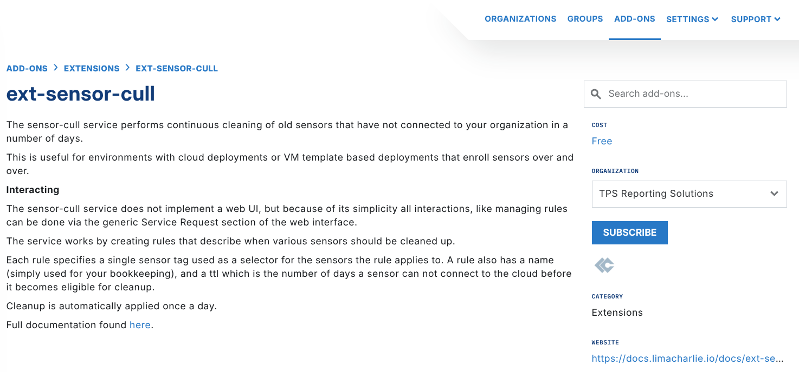
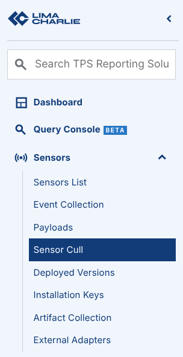
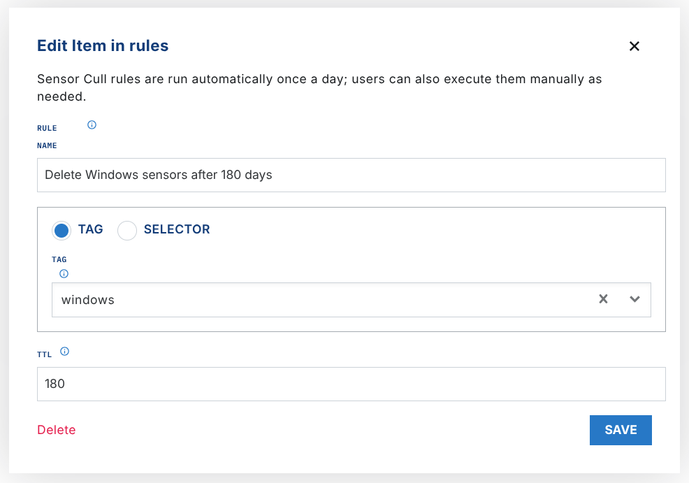

# Sensor Cull

The Sensor Cull Extension cleans up "old" sensors continuously. A sensor is old when it did not connect to an Organization in a set period of time. The extension is useful for cloud deployments, and for deployments that use VMs or templates, where sensors can enroll many times and for a short period of time.

The extension uses rules that describe when to clean up the specified sensors.

## Enabling the Sensor Cull Extension

To enable the Sensor Cull extension, open the [Sensor Cull extension page](https://app.limacharlie.io/add-ons/extension-detail/ext-sensor-cull) in the LimaCharlie marketplace.



After you select **Subscribe**, the Sensor Cull extension becomes available almost immediately.

## Using the Sensor Cull Extension

After you enable the extension, a **Sensor Cull** option shows under **Sensors** in the LimaCharlie web app. You can also use the extension through the REST API.



In the Sensor Cull module, you can create rules. The extension runs Sensor Cull rules automatically one time each day. You can edit the rules when necessary.



Each rule specifies one sensor `tag`. The tag selects the sensors that the rule applies to. A rule also has a `name`, which is only for your bookkeeping, and a `ttl`. The `ttl` is the number of days that a sensor can stay unconnected to LimaCharlie before the extension can clean it up.

## Actions via REST API

You can send these REST API actions to the Sensor Cull extension:

### get_rules

Get the list of existing rules

```json
{
  "action": "get_rules"
}
```

### run

Do an ad-hoc cleanup.

```json
{
  "action": "run"
}
```

### add_rule

This example creates a rule named `my new rule`. The rule applies to all sensors with the `vip` Tag, and cleans them up when they did not connect in 30 days.

```json
{
  "action": "add_rule",
  "name": "my new rule",
  "tag": "vip",
  "ttl": 30
}
```

### del_rule

Delete an existing rule by name.

```json
{
  "action": "del_rule",
  "name": "my new rule"
}
```
