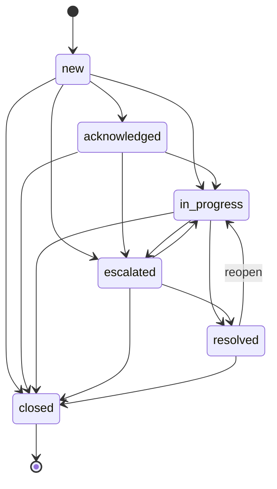

# Ticketing

The Ticketing extension is a purpose-built SOC triage system that automatically converts LimaCharlie detections into trackable tickets with SLA enforcement, investigation tooling, and performance reporting. It is designed for high-volume environments where every detection needs to be acknowledged, investigated, classified, and resolved within measurable timeframes.

Once subscribed, all detections from the organization are automatically ingested and converted into tickets. Analysts work the ticket queue through a defined lifecycle, attach investigation evidence, and classify outcomes. SOC managers get real-time dashboards and MTTA/MTTR reports.

## Enabling the Extension

Navigate to the [Ticketing extension page](https://app.limacharlie.io/add-ons/extension-detail/ext-ticketing) in the marketplace. Select the organization you wish to enable it for, and select **Subscribe**.

On subscription, the extension automatically:

1. Creates a detection output that forwards all detections to the ticketing system
2. Initializes the organization with default configuration (severity mapping, SLA targets, retention)

No additional setup is required to begin receiving tickets. Detections start flowing immediately.

!!! info "Permissions"
    The ticketing extension uses LimaCharlie's existing `investigation.get` and `investigation.set` permissions. Analysts need `investigation.get` to view tickets and reports, and `investigation.set` to update tickets, add notes, and manage configuration.

## How Tickets Are Created

Every detection generated by D&R rules in a subscribed organization automatically becomes a ticket. The mapping is one detection to one ticket by default.

Each ticket captures from the detection:

- **Detection category** (the D&R rule name)
- **Detection source** (the rule namespace)
- **Detection priority** (mapped to severity)
- **Sensor ID** and **hostname** of the affected endpoint
- **Detection ID** (used for deduplication)

Duplicate detections (same `detection_id`) are silently dropped to prevent ticket duplication.

### Auto-Grouping

When auto-grouping is enabled in the organization configuration, detections that share the same category and sensor within a one-hour window are automatically grouped into a single ticket instead of creating separate tickets. This significantly reduces ticket volume for noisy rules.

When a detection is grouped into an existing ticket:

- The ticket's `detection_count` increments
- The severity may be upgraded if the new detection has a higher priority
- An event is recorded in the ticket's audit trail

## Ticket Lifecycle

Tickets follow a defined state machine that tracks progress from creation through resolution.



### Status Definitions

| Status | Description |
|--------|-------------|
| `new` | Ticket created, not yet reviewed by an analyst |
| `acknowledged` | Analyst has seen and accepted the ticket. Records MTTA timestamp |
| `in_progress` | Active investigation underway |
| `escalated` | Escalated to a senior analyst or specialized team |
| `resolved` | Investigation complete, findings documented. Records MTTR timestamp |
| `closed` | Ticket fully closed. Terminal state |
| `merged` | Ticket was merged into another ticket. Terminal state |

### Key Timestamps

- **`created_at`** -- Set when the ticket is created from a detection
- **`acknowledged_at`** -- Set on first transition to `acknowledged` (used for MTTA calculation)
- **`resolved_at`** -- Set on first transition to `resolved` (used for MTTR calculation)
- **`closed_at`** -- Set on transition to `closed`

## Severity and SLA

### Severity Mapping

LimaCharlie detection priorities (integer 0--10) are mapped to four severity levels. The thresholds are configurable per organization.

| Severity | Default Priority Range | Description |
|----------|----------------------|-------------|
| `critical` | 8--10 | Requires immediate response |
| `high` | 5--7 | Urgent, handle promptly |
| `medium` | 3--4 | Standard priority |
| `low` | 0--2 | Informational, handle when available |

### SLA Targets

Each severity level has two SLA targets:

- **MTTA (Mean Time To Acknowledge)** -- Maximum time from ticket creation to first acknowledgement
- **MTTR (Mean Time To Resolve)** -- Maximum time from ticket creation to resolution

Default SLA targets:

| Severity | MTTA Target | MTTR Target |
|----------|-------------|-------------|
| `critical` | 15 minutes | 4 hours |
| `high` | 15 minutes | 12 hours |
| `medium` | 1 hour | 24 hours |
| `low` | 100 minutes | ~47 hours |

SLA breaches are tracked in the dashboard and reporting views.

## Configuration

Each organization has its own configuration that controls severity mapping, SLA targets, retention, and optional features.

### Configuration Options

| Setting | Type | Default | Description |
|---------|------|---------|-------------|
| `severity_mapping.critical_min` | int | `8` | Minimum detection priority for `critical` severity |
| `severity_mapping.high_min` | int | `5` | Minimum detection priority for `high` severity |
| `severity_mapping.medium_min` | int | `3` | Minimum detection priority for `medium` severity |
| `sla_config.critical.mtta_minutes` | int | `15` | MTTA target for critical tickets (minutes) |
| `sla_config.critical.mttr_minutes` | int | `240` | MTTR target for critical tickets (minutes) |
| `sla_config.high.mtta_minutes` | int | `15` | MTTA target for high tickets (minutes) |
| `sla_config.high.mttr_minutes` | int | `720` | MTTR target for high tickets (minutes) |
| `sla_config.medium.mtta_minutes` | int | `60` | MTTA target for medium tickets (minutes) |
| `sla_config.medium.mttr_minutes` | int | `1440` | MTTR target for medium tickets (minutes) |
| `sla_config.low.mtta_minutes` | int | `100` | MTTA target for low tickets (minutes) |
| `sla_config.low.mttr_minutes` | int | `2800` | MTTR target for low tickets (minutes) |
| `retention_days` | int | `90` | Days to retain resolved/closed tickets before archival |
| `auto_close_resolved_after_days` | int | `7` | Automatically close resolved tickets after this many days |
| `auto_grouping_enabled` | bool | `false` | Enable auto-grouping of related detections into single tickets |
| `notification_webhook` | string | | URL to receive webhook notifications for ticket events |

### Get Configuration

=== "REST API"

    ```bash
    curl -s -X GET \
      "https://ticketing.limacharlie.io/api/v1/config/YOUR_OID" \
      -H "Authorization: Bearer $LC_JWT"
    ```

### Update Configuration

=== "REST API"

    ```bash
    curl -s -X PUT \
      "https://ticketing.limacharlie.io/api/v1/config/YOUR_OID" \
      -H "Authorization: Bearer $LC_JWT" \
      -H "Content-Type: application/json" \
      -d '{
        "severity_mapping": {
          "critical_min": 8,
          "high_min": 5,
          "medium_min": 3
        },
        "sla_config": {
          "critical": {"mtta_minutes": 15, "mttr_minutes": 240},
          "high": {"mtta_minutes": 30, "mttr_minutes": 480},
          "medium": {"mtta_minutes": 60, "mttr_minutes": 1440},
          "low": {"mtta_minutes": 120, "mttr_minutes": 2880}
        },
        "retention_days": 90,
        "auto_close_resolved_after_days": 7,
        "auto_grouping_enabled": true,
        "notification_webhook": "https://hooks.slack.com/services/..."
      }'
    ```

## Working with Tickets

### Listing Tickets

Query the ticket queue with filtering, sorting, and pagination. Supports cross-organization queries for multi-tenant SOCs.

=== "REST API"

    ```bash
    # List open tickets, most recent first
    curl -s -X GET \
      "https://ticketing.limacharlie.io/api/v1/tickets?oid=YOUR_OID&status=new,acknowledged&sort=created_at&order=desc&limit=50" \
      -H "Authorization: Bearer $LC_JWT"
    ```

Available query parameters:

| Parameter | Description |
|-----------|-------------|
| `oid` | Organization ID (supports multiple, comma-separated) |
| `status` | Filter by status (comma-separated: `new`, `acknowledged`, `in_progress`, `escalated`, `resolved`, `closed`) |
| `severity` | Filter by severity (`critical`, `high`, `medium`, `low`) |
| `assignee` | Filter by assigned analyst |
| `classification` | Filter by classification (`pending`, `true_positive`, `false_positive`) |
| `escalation_group` | Filter by escalation group |
| `sort` | Sort field (`created_at`, `severity`, `status`) |
| `order` | Sort order (`asc`, `desc`) |
| `limit` | Page size (default 50) |
| `cursor` | Pagination cursor from previous response |

### Getting a Ticket

=== "REST API"

    ```bash
    curl -s -X GET \
      "https://ticketing.limacharlie.io/api/v1/tickets/TICKET_ID?oid=YOUR_OID" \
      -H "Authorization: Bearer $LC_JWT"
    ```

Returns the full ticket including the event timeline (audit trail of all changes).

### Updating a Ticket

=== "REST API"

    ```bash
    curl -s -X PATCH \
      "https://ticketing.limacharlie.io/api/v1/tickets/TICKET_ID?oid=YOUR_OID" \
      -H "Authorization: Bearer $LC_JWT" \
      -H "Content-Type: application/json" \
      -d '{
        "status": "acknowledged",
        "assignee": "analyst@example.com"
      }'
    ```

Updatable fields:

| Field | Type | Description |
|-------|------|-------------|
| `status` | string | New status (must be a valid transition) |
| `assignee` | string | Analyst to assign the ticket to |
| `classification` | string | `true_positive`, `false_positive`, or `pending` |
| `escalation_group` | string | Team or group to escalate to |
| `investigation_id` | string | Link to a LimaCharlie [Investigation](../../../7-administration/config-hive/investigation.md) |
| `summary` | string | Investigation summary narrative (max 8192 characters) |
| `conclusion` | string | Final conclusion (max 8192 characters) |

### Bulk Updates

Update multiple tickets at once, useful for bulk-closing false positives or reassigning workload.

=== "REST API"

    ```bash
    curl -s -X POST \
      "https://ticketing.limacharlie.io/api/v1/tickets/bulk-update?oid=YOUR_OID" \
      -H "Authorization: Bearer $LC_JWT" \
      -H "Content-Type: application/json" \
      -d '{
        "ticket_ids": ["TICKET_1", "TICKET_2", "TICKET_3"],
        "update": {
          "status": "closed",
          "classification": "false_positive"
        }
      }'
    ```

### Classification

Tickets are classified to track detection accuracy. Classification can be set at any status.

| Classification | Description |
|---------------|-------------|
| `pending` | Not yet classified (default) |
| `true_positive` | Confirmed malicious or policy-violating activity |
| `false_positive` | Benign activity incorrectly flagged |

Classification rates are tracked in reports and feed into detection rule tuning.

## Investigation

Each ticket supports structured investigation evidence that creates a documented chain of analysis.

### Entities (IOCs)

Attach indicators of compromise and other artifacts of interest to a ticket.

=== "REST API"

    ```bash
    # Add an entity
    curl -s -X POST \
      "https://ticketing.limacharlie.io/api/v1/tickets/TICKET_ID/entities?oid=YOUR_OID" \
      -H "Authorization: Bearer $LC_JWT" \
      -H "Content-Type: application/json" \
      -d '{
        "entity_type": "ip",
        "entity_value": "203.0.113.50",
        "name": "Suspected C2 Server",
        "verdict": "malicious",
        "context": "Outbound connections observed from compromised host"
      }'
    ```

Supported entity types: `ip`, `domain`, `hash`, `url`, `user`, `email`, `file`, `process`, `registry`, `other`

Verdict values: `malicious`, `suspicious`, `benign`, `unknown`, `informational`

### Cross-Ticket Entity Search

Find all tickets containing a specific indicator. This is critical for understanding the blast radius of an IOC across the organization.

=== "REST API"

    ```bash
    curl -s -X GET \
      "https://ticketing.limacharlie.io/api/v1/entities/search?oid=YOUR_OID&entity_type=ip&entity_value=203.0.113.50" \
      -H "Authorization: Bearer $LC_JWT"
    ```

### Telemetry References

Link specific LimaCharlie events to the ticket by their atom and sensor ID. This creates a direct reference back to the raw telemetry for forensic review.

=== "REST API"

    ```bash
    curl -s -X POST \
      "https://ticketing.limacharlie.io/api/v1/tickets/TICKET_ID/telemetry?oid=YOUR_OID" \
      -H "Authorization: Bearer $LC_JWT" \
      -H "Content-Type: application/json" \
      -d '{
        "atom": "abc123def456",
        "sid": "550e8400-e29b-41d4-a716-446655440000",
        "event_type": "NEW_PROCESS",
        "event_summary": "powershell.exe launched with encoded command",
        "verdict": "malicious",
        "relevance": "Initial payload execution"
      }'
    ```

### Artifacts

Attach references to forensic artifacts such as memory dumps, packet captures, or disk images.

=== "REST API"

    ```bash
    curl -s -X POST \
      "https://ticketing.limacharlie.io/api/v1/tickets/TICKET_ID/artifacts?oid=YOUR_OID" \
      -H "Authorization: Bearer $LC_JWT" \
      -H "Content-Type: application/json" \
      -d '{
        "artifact_type": "memory_dump",
        "description": "Full memory dump of PID 4832 from DESKTOP-001",
        "verdict": "malicious"
      }'
    ```

### Notes

Add structured notes to document analysis, remediation steps, and handoff information.

=== "REST API"

    ```bash
    curl -s -X POST \
      "https://ticketing.limacharlie.io/api/v1/tickets/TICKET_ID/notes?oid=YOUR_OID" \
      -H "Authorization: Bearer $LC_JWT" \
      -H "Content-Type: application/json" \
      -d '{
        "content": "Confirmed lateral movement to DESKTOP-002 via PsExec. Isolating both endpoints.",
        "note_type": "analysis"
      }'
    ```

Note types: `general`, `analysis`, `remediation`, `escalation`, `handoff`

## Ticket Merging

Related tickets can be merged when multiple detections are part of the same incident. Merging consolidates the investigation into a single primary ticket.

=== "REST API"

    ```bash
    curl -s -X POST \
      "https://ticketing.limacharlie.io/api/v1/tickets/merge?oid=YOUR_OID" \
      -H "Authorization: Bearer $LC_JWT" \
      -H "Content-Type: application/json" \
      -d '{
        "primary_ticket_id": "TICKET_PRIMARY",
        "merge_ticket_ids": ["TICKET_2", "TICKET_3"]
      }'
    ```

When tickets are merged:

- The primary ticket inherits all detections from merged tickets
- Merged tickets transition to the `merged` status (terminal)
- The `merged_into_ticket_id` field on merged tickets references the primary ticket
- Merge events are recorded in the audit trail of all affected tickets

## Escalation

Tickets can be escalated to specialized teams or senior analysts by setting the `escalation_group` field and transitioning to `escalated` status.

=== "REST API"

    ```bash
    curl -s -X PATCH \
      "https://ticketing.limacharlie.io/api/v1/tickets/TICKET_ID?oid=YOUR_OID" \
      -H "Authorization: Bearer $LC_JWT" \
      -H "Content-Type: application/json" \
      -d '{
        "status": "escalated",
        "escalation_group": "tier-3-malware"
      }'
    ```

Tickets can be filtered by `escalation_group` in the listing endpoint. Escalation rates are tracked in reports.

## D&R Rule Integration

The ticketing extension exposes request handlers that can be used in D&R rule response actions. This enables automated ticket management based on detection logic.

### Create a Ticket Manually

Create a ticket from a D&R rule response action, useful for rules that need tickets for specific scenarios beyond the default auto-ticketing.

```yaml
respond:
  - action: extension request
    extension name: ext-ticketing
    extension action: create_ticket
    extension request:
      detection_cat: '{{ .cat }}'
      detection_source: manual
      detection_priority: 5
      sensor_id: '{{ .routing.sid }}'
      hostname: '{{ .routing.hostname }}'
```

### Query Open Ticket Count

Use as a condition in D&R rules to trigger actions based on ticket volume. For example, escalate when a sensor has too many open tickets.

```yaml
detect:
  event: detection
  op: extension
  extension name: ext-ticketing
  extension action: get_ticket_count
  extension request:
    sensor_id: '{{ .routing.sid }}'
    status: new,acknowledged,in_progress
  path: count
  value: 10
  op: is greater than
```

### Auto-Close Tickets

Automatically close tickets from D&R rules, for example when a false positive rule matches.

```yaml
respond:
  - action: extension request
    extension name: ext-ticketing
    extension action: close_ticket
    extension request:
      detection_id: '{{ .detect.routing.detection_id }}'
      classification: false_positive
```

## Dashboard

The dashboard provides real-time visibility into the ticket queue.

=== "REST API"

    ```bash
    curl -s -X GET \
      "https://ticketing.limacharlie.io/api/v1/dashboard/counts?oid=YOUR_OID" \
      -H "Authorization: Bearer $LC_JWT"
    ```

Returns:

- Ticket counts by status
- Ticket counts by severity
- SLA breach counts (tickets exceeding MTTA or MTTR targets)

## Reporting

SOC performance reports provide aggregated metrics for measuring team effectiveness and detection quality.

### Summary Report

=== "REST API"

    ```bash
    curl -s -X GET \
      "https://ticketing.limacharlie.io/api/v1/reports/summary?oid=YOUR_OID" \
      -H "Authorization: Bearer $LC_JWT"
    ```

The summary report includes:

- **MTTA by severity** -- Average time to acknowledge, broken down by severity level
- **MTTR by severity** -- Average time to resolve, broken down by severity level
- **Classification rates** -- True positive vs false positive percentages
- **Volume by severity** -- Ticket counts by severity level
- **Top detection categories** -- Most frequently triggered detection rules
- **Repeat offenders** -- Sensors or hosts generating the most tickets
- **Escalation rate** -- Percentage of tickets requiring escalation

### MTTA Report

=== "REST API"

    ```bash
    curl -s -X GET \
      "https://ticketing.limacharlie.io/api/v1/reports/mtta?oid=YOUR_OID" \
      -H "Authorization: Bearer $LC_JWT"
    ```

### MTTR Report

=== "REST API"

    ```bash
    curl -s -X GET \
      "https://ticketing.limacharlie.io/api/v1/reports/mttr?oid=YOUR_OID" \
      -H "Authorization: Bearer $LC_JWT"
    ```

## Webhook Notifications

When a `notification_webhook` is configured, the extension sends HTTP POST requests for ticket events. This enables integration with external systems like Slack, PagerDuty, or custom dashboards.

Events forwarded via webhook include: ticket creation, status changes, assignments, escalations, classifications, notes, and investigation updates.

## Audit Trail

Every action on a ticket is recorded as an immutable event in the ticket's timeline. This provides a complete chain of custody for compliance and review.

Tracked event types:

| Event | Description |
|-------|-------------|
| `created` | Ticket created from detection |
| `acknowledged` | Ticket first acknowledged |
| `status_changed` | Status transition |
| `assigned` | Analyst assigned |
| `escalated` | Ticket escalated to a group |
| `classified` | True positive / false positive classification set |
| `resolved` | Ticket resolved |
| `closed` | Ticket closed |
| `reopened` | Resolved ticket reopened |
| `note_added` | Note added to ticket |
| `investigation_linked` | LimaCharlie investigation linked |
| `detection_added` | Detection grouped into ticket |
| `detection_removed` | Detection removed from ticket |
| `severity_upgraded` | Severity increased due to higher-priority detection |
| `merged_into` | Ticket merged into another ticket |
| `merged_from` | Ticket received merge from another ticket |
| `entity_added` | IOC/entity attached |
| `entity_updated` | Entity verdict or context updated |
| `entity_removed` | Entity removed |
| `telemetry_added` | Telemetry reference linked |
| `telemetry_updated` | Telemetry metadata updated |
| `telemetry_removed` | Telemetry reference removed |
| `artifact_added` | Forensic artifact attached |
| `artifact_removed` | Artifact removed |
| `summary_updated` | Investigation summary edited |
| `conclusion_updated` | Investigation conclusion edited |

## Data Retention

Resolved and closed tickets are retained for the configured `retention_days` (default 90 days). After the retention period, tickets are archived to long-term storage and removed from the active ticket store.

Archived data is retained for 2 years in long-term storage for compliance and historical reporting.

## Unsubscribing

Unsubscribing from the extension removes the detection output and deletes all ticket data for the organization. This action is irreversible.

---

## See Also

- [Investigation](../../../7-administration/config-hive/investigation.md) -- Investigation records that can be linked to tickets
- [D&R Rules Overview](../../../3-detection-response/index.md) -- Detection rules that generate the detections ingested as tickets
- [Response Actions](../../../8-reference/response-actions.md) -- The `extension request` action used for D&R rule integration
- [Using Extensions](../using-extensions.md) -- General extension subscription and management
