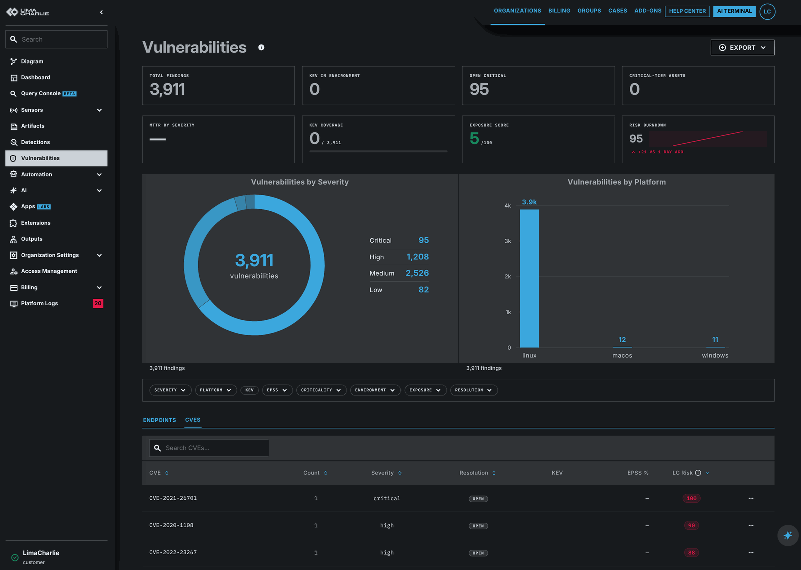

# Vulnerability Reporting

The Vulnerability Reporting extension (`ext-vulnerability-reporting`) collects the software inventory of each endpoint and resolves it against the LimaCharlie CVE database. It enriches each finding with CISA KEV and FIRST EPSS data and scores the finding with an environment-aware risk score. It tracks the resolution of each finding across rescans. It shows the results in the LimaCharlie web app and through the extension API.

It is the first consumer of the canonical [`lc:asset:*` tag namespace](../../../2-sensors-deployment/asset-tags.md). The extension reads the asset criticality, exposure, environment, owner, and compliance tags directly from the sensors. It uses these tags to prioritize findings and to scope filters.

## What it does

1. **Inventory collection.** A scheduled `os_packages` task runs once a day on each Windows, macOS, and Linux EDR sensor and reports the set of installed software. The default `scheduled` mode installs both the schedule and an ingest D&R rule that forwards only the tracked responses for analysis. Before the extension looks up a package, it drops the inventory entries that can never resolve to a CVE. This keeps out noise. See [Inventory collection](#inventory-collection).
2. **CVE resolution.** The extension sends inventories to `cve.limacharlie.io`, which maps each `(package_name, package_version)` pair to the set of CVEs that affect it.
3. **Enrichment.** The extension joins each CVE against CISA KEV and FIRST EPSS through `cve.limacharlie.io/enrich`. KEV, EPSS, and the criticality multiplier become a 0-100 [LC Risk](#lc-risk) score that the extension keeps on every finding row.
4. **Resolutions.** Every finding is implicitly **open** unless an operator records a resolution: `mitigated`, `accepted`, or `false_positive`. A deterministic [fingerprint](#finding-fingerprint) keys each resolution, so the resolutions survive rescans.
5. **Daily scans.** A daily tick for each org runs three jobs: emission of KEV matches, a snapshot of open findings for the burndown tile, and a snapshot of EPSS percentiles. The EPSS snapshot supplies the sparkline that shows the history of each CVE.
6. **Surfacing.** The Vulnerabilities page of the LimaCharlie web app shows the findings. The page has a KPI strip, trend tiles, a filter chip-bar, KEV/EPSS columns, the LC Risk score, lifecycle chips, CVE and asset detail pages, and exec, compliance, and remediation reports. The extension API also exposes the findings ([API Actions](#api-actions)).

The extension is stateless, except for two stores. It uses the per-org Spanner-backed tables (`vuln_reports`, `vuln_finding_state`, `vuln_daily_snapshots`, `vuln_epss_history`, and rollup tables) and a small `org_value` keyed at `ext_vuln_kev_known_set`.

## Setup

1. Go to the [Vulnerability Reporting extension page](https://app.limacharlie.io/add-ons/extension-detail/ext-vulnerability-reporting) in the marketplace.
2. Select the organization.
3. Click **Subscribe**.

When you subscribe, the extension reconciles the D&R rules that it owns to match the configured `scan_mode`:

- **`scheduled` (default):** installs the daily `os_packages` schedule for each sensor (`ext-vuln-mgmt-schedule`) and the ingest rule that forwards tracked responses to `process_packages` (`ext-vuln-mgmt-os-packages`). This is the correct default for almost every customer.
- **`manual`:** installs no D&R rules. The operator drives the tasking and the forwarding. Use this mode when the scan cadence must match another scheduler.
- **`all`:** installs only the ingest rule, but the rule forwards every `os_packages_rep` event, even when the response has no tracking marker from the extension. Use this mode when another cadence already collects `os_packages`.

Reconciliation is idempotent. When you change the mode on an existing subscription, the extension removes each rule that the new mode does not own. It then upserts the rules that the new mode owns. When you unsubscribe, the extension removes all rules that it owns and drops every `vuln_reports` row for the org.

The extension provisions a dedicated webhook adapter automatically, so the [emitted events](#events-emitted) have a destination on the event stream.

!!! info "Permissions"
    The extension uses the existing RBAC of LimaCharlie. To read findings, you need `extension.use` on `ext-vulnerability-reporting`. To subscribe and to edit the configuration, you need the standard permissions to manage extensions.

## Configuration

You edit the configuration on the extension page in the LimaCharlie web app. All fields are optional. The defaults match the table below.

| Field | Type | Default | Description |
|-------|------|---------|-------------|
| `scan_mode` | enum | `scheduled` | One of `scheduled`, `manual`, `all`. See [Setup](#setup). |
| `criticality_tag_overrides` | object | `{}` | Map of `{your-tag → canonical-bucket}` for organizations that already use their own taxonomy of asset tags. See [Asset Metadata](#asset-metadata). |

### Example

```json
{
  "scan_mode": "scheduled",
  "criticality_tag_overrides": {
    "crown-jewel": "critical",
    "tier-1": "high",
    "tier-3": "low"
  }
}
```

The extension uses `criticality_tag_overrides` only when a sensor carries no canonical `lc:asset:criticality:*` tag. Explicit canonical tags always win, so an organization can migrate step by step. Override values must be canonical buckets. The extension rejects any other value at write time.

## Asset metadata

The extension reads sensor tags in the [`lc:asset:*` namespace](../../../2-sensors-deployment/asset-tags.md) and uses them to:

- **Prioritize findings.** `lc:asset:criticality:*` is the multiplier in the LC Risk score.
- **Scope filters.** `lc:asset:env:*` and `lc:asset:exposure:*` fill the filter chips on the Vulnerabilities page.
- **Surface compliance views.** `lc:asset:compliance:*` holds more than one value, so an asset can carry several regimes.
- **Route assignments.** The asset detail page shows `lc:asset:owner:*`, so downstream workflows (Cases, Outputs to Slack, Jira, and others) have the routing target available.

When you pass `include_tags=true` to `query_endpoints` or `query_cve_vuln_hosts`, each row carries an `asset_metadata` projection of the parsed tags:

```json
{
  "sid": "550e8400-e29b-41d4-a716-446655440000",
  "hostname": "web-edge-001",
  "asset_metadata": {
    "criticality": "critical",
    "exposure": "internet-facing",
    "env": "prod",
    "owner": "platform-team",
    "compliance": ["pci"]
  }
}
```

The parser drops tags with malformed values for the closed-set fields (`criticality`, `exposure`, `env`). See [Asset Tag Namespace](../../../2-sensors-deployment/asset-tags.md) for the full schema.

## Inventory collection

Each daily `os_packages` scan returns the full set of installed software for a sensor, but not every entry is a useful target for a vulnerability. The extension applies two passes between the raw inventory and the CVE database. It **filters** the entries that cannot give a useful CVE, and for Linux it makes the match **distro-aware**.

### Package filtering

Some inventory entries can never resolve to a CVE. They have no public product identifier, or their reported "version" is not an upstream version. Without an upstream version, the extension cannot compare the entry against the affected ranges of a CVE. A query for these entries only adds noise and slows scans, so the extension skips them before the lookup. For this reason, the number of findings on a host is usually lower than its raw count of installed packages.

The skip classes are:

| Class | Examples | Rationale |
|-------|----------|-----------|
| **macOS Apple installer receipts** | `com.apple.pkg.CLTools_SDK_macOS13`, `com.apple.pkg.XProtectPlistConfigData…` (any `pkgutil` entry named `com.apple.*`) | Reverse-DNS bundle IDs for Apple system components. These are not real installable products, and their version slot is a build timestamp. The extension **keeps** third-party `pkgutil` receipts (for example `org.wireshark.*`, `com.microsoft.*`) by design. |
| **Linux distro-internal packages** | `base-files`, `lsb-base`, `ca-certificates`, `apt-utils`, `init-system-helpers`, `filesystem`, `setup`, `redhat-release`, … | Configuration packages that the distribution marks as essential or required. They have no upstream product entry and never will. |
| **Windows inventory noise** | Tanium software-catalog rows (`tvcappstor-…`, `tvcfixedde-…`), hardware driver INF receipts (`Windows Driver Package - …`), .NET build toolchain / SDK / templates / targeting packs (`Microsoft .NET Toolset …`, `Microsoft.NET.Sdk.…`), Nuance TTS voice packs (`Vocalizer Expressive …`) | Either the name has no product identifier, or the version slot is an installer counter and not the upstream version. No comparison against a CVE range can succeed. |

The extension does **not** skip the runtime components that do ship vulnerable code — for example `Microsoft .NET Runtime` and `Microsoft Windows Desktop Runtime`. It skips only build-time artifacts and pure configuration entries. The extension logs the skipped count one time for each batch, and not for each package.

### Linux distro-aware matching

Linux distributions frequently **backport** security fixes. The vendor patches a CVE in the packaged build but keeps the upstream version number unchanged. A match of such a package against upstream CVE ranges alone flags it as vulnerable, although the distribution already shipped the fix. To stop these false positives, the extension identifies the distribution and the release of the endpoint. It sends them with each lookup of a Linux package. Distro-specific backport data can then correct the verdict.

The extension detects the distro and the release in this order of priority:

1. **`lc:asset:os:<distro>-<release>` sensor tag** (authoritative). For example, `lc:asset:os:debian-11` or `lc:asset:os:redhat-enterprise-9`. The extension splits the value on the **last** `-`, so a distro name that contains a dash stays intact. This tag gives the most reliable results.
2. **Marker-package version.** When there is no tag, the extension infers the release from a marker package of the distribution. For Debian, this is the major version of `base-files` (10 = buster, 11 = bullseye, 12 = bookworm, 13 = trixie). For RHEL, CentOS, Rocky, and AlmaLinux, this is the version of the `*-release` or `fedora-release` package.
3. **Package source, no release.** As a last resort, the package source pins the distro family only (`dpkg` → Debian, `rpm` → RHEL). With no release, the match falls back to upstream-only verdicts (fail-open) and does not guess.

Endpoints that the extension cannot pin to a release still get upstream CVE matching, but they do not get the backport correction. To get accurate, backport-aware results on Linux, tag your Linux fleet with `lc:asset:os:*`. For example, use `limacharlie tag mass-add` keyed on an installation key or a hostname pattern.

## Concepts

### Lifecycle states

A finding has exactly one of two postures: **open** (the default, because there is no resolution row) or **resolved** (a row exists in `vuln_finding_state` and carries one of three resolutions). A [fingerprint](#finding-fingerprint) keys each resolution, so resolutions survive rescans.

| Posture | `resolution` | Description |
|---------|--------------|-------------|
| open | — (no row) | New finding. Implicit; the extension persists nothing. |
| resolved | `mitigated` | A compensating control is in place, and the finding no longer counts as exploitable. Sets `resolved_at`, which MTTR uses. |
| resolved | `accepted` | The business formally accepted the risk as an exception, with an optional `expires_at`. The finding returns to the open count when `expires_at` is in the past. |
| resolved | `false_positive` | Confirmed not applicable. For example, the resolver mapped the package incorrectly. |

The resolution row carries six columns: `resolution`, `expires_at`, `case_number`, `resolved_at`, `resolved_by`, `updated_at`. There is no audit log for each finding. A second call to `set_finding_resolution` overwrites the row in place. To **reopen** a finding, call `set_finding_resolution` with `resolution: null`. This deletes the row.

`case_number` is reserved for an upcoming linkage to ext-cases. It is plumbed end-to-end, but the UI does not show it today. When an operator opens a case from a finding, the extension will keep the case number here. The resolution row then points at the case that carries the richer metadata.

#### Lapsed acceptance

`accepted` is the only resolution that supports an `expires_at`. When `expires_at` is in the past at read time, the UI derives a **lapsed acceptance** signal. The UI renders the row with the same urgency as an open finding and shows it in the views for lapsed exceptions. The extension does **not** change the Spanner row. The lapsed signal is only a `resolution === 'accepted' && expires_at < now` check at read time. Auditors can therefore still see when the exception was granted and why.

#### Scope (org vs host)

The extension writes resolution rows at one of two scopes:

- **`org`** — applies to every host that carries the same `(cve, normalized_package_name)`. Use this scope when the suppression covers a package everywhere ("we accept this CVE for `openssl` everywhere until the next quarterly upgrade").
- **`host`** — applies to one `(cve, normalized_package_name, sid)`. Use this scope when the rationale is specific to one host ("this dev workstation is allowed to keep the older `curl` until reimage").

Precedence in the read overlay: a host-scope row beats an org-scope row for the matching row. Both scopes use the same fingerprint algorithm, but the host fingerprint also mixes in the `sid`.

### Finding fingerprint

A fingerprint is a SHA-256 hex digest that gives a finding a stable identity across rescans, reboots, and partial reinstalls. NUL characters separate the inputs:

- **Org scope:** `SHA-256(cve + "\x00" + normalized_package_name)`
- **Host scope:** `SHA-256(cve + "\x00" + sid + "\x00" + normalized_package_name)`

`normalized_package_name` is the canonical product name of the resolver. For example, both "Google - Chrome" and "Google Chrome" normalize to `chrome`, so an org-scope mark "accept this risk for chrome" applies to both. Clients never compute fingerprints. The backend derives them from the canonical inputs and echoes them on the response. A frontend that already has a fingerprint can pass it back in directly.

### LC Risk

LC Risk is a composite score from 0 to 100. The extension uses it as the canonical key to prioritize findings across the Vulnerabilities surface. The extension computes the score at scan time during `ApplySensorReports`, when it writes the resolved CVE set of a sensor to `vuln_reports`. It keeps the score on the row, so sorts and filters in the list view do not compute it again on every read.

#### Inputs

- The CVSS severity of the row (`critical` / `high` / `medium` / `low`).
- The EPSS percentile of the CVE, fetched from `/enrich`.
- The KEV membership of the CVE, also from `/enrich`.
- The `lc:asset:criticality:*` multiplier of the host. The extension parses it from the sensor tags in the canonical [`lc:asset:*` namespace](../../../2-sensors-deployment/asset-tags.md).

#### Formula

```text
base = SEVERITY_RANK[severity] / 4 * 60     // 0..60
base += epss_percentile * 25                // 0..25 (epss in [0,1])
base += 15 if in_kev else 0                 // flat bump
lc_risk = clamp(round(base * criticality_mult), 0, 100)

SEVERITY_RANK: critical=4, high=3, medium=2, low=1, unknown=0
CRITICALITY_MULT (backend): critical=1.6, high=1.3, medium=1.0, low=0.6, unknown=1.0
```

A row whose host has no canonical `lc:asset:criticality:*` tag, and whose org has no matching override, uses the multiplier `1.0`.

!!! warning "Frontend / backend `low` multiplier mismatch"
    The `low` multiplier of the backend is `0.6`. The hardcoded preview formula of the frontend, in `src/utils/lcRisk.ts`, uses `0.8`. The persisted `lc_risk` and `max_lc_risk` columns are authoritative, and API responses and sorted UI columns read them. The frontend constant is important only for previews on the client when the persisted value is missing.

#### Persistence

- **Per-host:** `vuln_reports.lc_risk` (one int for each `(sensor, package, CVE)` row).
- **Org rollup:** `vuln_cve_counts.max_lc_risk` (the maximum across all hosts for one CVE in the org). `query_cves` rows return it as `max_lc_risk`.

#### Buckets

The web app gives the score a colour bucket for badges:

| Bucket | LC Risk |
|--------|---------|
| critical | ≥ 80 |
| high | 60-79 |
| medium | 40-59 |
| low | < 40 |

### KEV (CISA Known Exploited Vulnerabilities)

The extension shows the CISA KEV catalogue for each CVE. These fields come from `cve.limacharlie.io/enrich`:

| Field | Type | Description |
|-------|------|-------------|
| `in_kev` | bool | True when the CVE is in the catalogue. |
| `added` | string (YYYY-MM-DD) | The date when CISA added the CVE. |
| `due` | string (YYYY-MM-DD) | The remediation deadline that CISA mandates (federal civilian agencies). |
| `vendor` | string | The vendor as CISA lists it. |
| `product` | string | The product as CISA lists it. |
| `name` | string | The name of the vulnerability as CISA lists it. |
| `ransomware` | bool | `true` if and only if CISA flagged "Known" ransomware-campaign use. |

The `vulnerability-db` ingest job refreshes the KEV dataset daily. The data lives in Redis under the `kev:*` namespace. A refresh does not invalidate the result cache of the resolver. The extension fetches KEV and EPSS on the side through `/enrich` and does not fold them into `/cves`.

### EPSS (FIRST Exploit Prediction Scoring System)

FIRST.org's EPSS model also scores every CVE. These fields are exposed:

| Field | Type | Description |
|-------|------|-------------|
| `score` | float [0,1] | The probability of exploitation in the wild in the next 30 days. |
| `percentile` | float [0,1] | The rank among all CVEs scored on this date. |

EPSS is also refreshed daily.

### EPSS history (90-day series)

The EPSS percentile drifts as new exploit telemetry arrives. The extension captures a daily snapshot for each CVE that has at least one finding in the org. It persists the snapshot to `vuln_epss_history`, keyed by `(oid, cve, snapshot_date)`. The capture happens during the daily Update tick (see [Daily Update tick](#daily-update-tick)).

The CVE detail page of the frontend renders a 90-day sparkline next to the live percentile, backed by `query_epss_history`. The default window of 90 days matches the sparkline. Pass a larger `days` value (up to 365) to backfill a longer view for reports.

The extension does not keep CVEs that the org never had a finding on, because there is no historical series to query for them. CVEs whose findings are all closed keep the snapshots that the extension captured while the findings were open.

### Daily snapshots

`vuln_daily_snapshots` holds the count of open findings for each day, by severity. The daily Update tick streams every `vuln_reports` row for the org and applies the resolution overlay. The overlay suppresses each row that has a resolution row that is **not** a lapsed acceptance. The tick then writes one row for each `(snapshot_date, severity)` pair, which carries:

- `open_count` — the total of open findings in the bucket.
- `kev_count` — the subset of `open_count` whose CVE is in KEV at the time of capture.

On a quiet day, the extension still writes a bucket that has zero findings, so the burndown sparkline is continuous. The design excludes resolved findings, because the snapshot shows what the operator still owes, and not every CVE that the resolver ever returned. Lapsed acceptances, where `expires_at` is in the past, flip back into the open count.

### Daily Update tick

The platform scheduler (the `ext-update-event` cron of `legion_extension_manager` / `legion_scheduler`) fires `EventTypes.Update` once a day for each subscribed org. `MultiplexOID` spreads the ticks across 24h. The handler runs three scans in sequence with an independent timeout of 10 minutes for each scan. A failure of one scan does not suppress the others.

| Order | Scan | Output |
|-------|------|--------|
| 1 | `kev_match` | Emits `vuln_finding.kev_match` for each CVE that newly entered KEV AND for which the org still has open findings. The extension diffs against a "previously-known KEV set" in `org_value`. |
| 2 | `daily_snapshot` | Writes the open and KEV counts for each severity for today (see [Daily snapshots](#daily-snapshots)). |
| 3 | `epss_history` | Writes one EPSS row for each distinct org CVE for today (see [EPSS history](#epss-history-90-day-series)). |

The handler also reconciles the D&R rules again. Reconciliation is idempotent, so a change to the configuration takes effect on the next tick and you do not have to subscribe again.

The 24h spread means that events and snapshots are **not** real-time. When CISA publishes a KEV addition at 09:00 UTC, it surfaces to org A at about 14:00 UTC. It surfaces to org B at about 03:00 UTC the next day. This is by design: the shard across the day keeps the load of the cron steady. Customers that need KEV matching in less than a day must subscribe to the upstream CISA RSS feed directly.

### KEV / EPSS enrichment at read time

The extension augments every CVE with KEV and EPSS data at read time through `cve.limacharlie.io/enrich` (POST `{"cves": [...]}`, returns `{"results": {"<cve>": {kev?, epss?, exploit_refs?}, ...}}`, capped at 200 CVEs for each call).

Enrichment is opt-in for each request through `include_enrichment`, which defaults to `true` for actions that face the user. Set it to `false` for cheap admin queries that do not need the merged view.

When enrichment is included:

- **KEV match:** each affected CVE in the response carries a `kev` block.
- **EPSS score:** each CVE carries an `epss` block.
- **Exploit references:** `query_cve` (the detail of a single CVE) returns an `exploit_refs` array (`source` ∈ `exploit-db` / `metasploit` / `packetstorm` / `github-poc` / `vendor-or-other`; `tier` ∈ `weaponized` / `poc`). The list-view actions omit exploit refs by design, to keep the page payloads small.

## API actions

Invoke all actions through the standard request endpoint for extensions:

```bash
curl -s -X POST \
  "https://api.limacharlie.io/v1/extension/request/ext-vulnerability-reporting" \
  -H "Authorization: Bearer $LC_JWT" \
  -d oid="YOUR_OID" \
  -d action="<action>" \
  -d data='<json-body>'
```

The full schemas for requests and responses live in the `requestSchema()` declaration of the extension in [`refractionPOINT/ext-vulnerability-reporting`](https://github.com/refractionPOINT/ext-vulnerability-reporting). The Vulnerabilities page of the web app is a reference consumer for every action listed below.

### Read actions

| Action | Purpose |
|--------|---------|
| `query_cves` | Paginated CVE rollup across the org. Sort by `cve` / `count` / `severity` / `lc_risk`. Returns `max_lc_risk` for each row, plus optional KEV and EPSS data. |
| `query_endpoints` | Paginated endpoint rollup with counts of vulnerabilities. Returns `asset_metadata` when `include_tags=true`. |
| `query_dashboard` | Counts based on indexes (severity, platform_string) that drive the donut chart and the bar chart. |
| `query_host_vuln_packages` | All vulnerable packages and their CVEs for one sensor. Sort by `cve` / `score` / `severity` / `lc_risk` / `package_name` / `package_name_package_version_cve`. Returns `lc_risk` and `fix_version` for each row. |
| `query_cve_vuln_hosts` | All endpoints that one CVE affects. |
| `query_cve_vuln_packages` | All `(package_name, package_version)` pairs in the org that one CVE affects, with the count of distinct sensors for each pair. |
| `query_cve` | Detail blob for a single CVE. With `include_enrichment=true`, returns the merged view of KEV, EPSS, and exploit refs. |
| `query_epss_history` | Time series of EPSS percentile and score for one CVE. |
| `query_daily_snapshots` | Counts of open findings for each day (and the KEV subset) for the burndown tile. |
| `list_finding_resolutions` | Page through `vuln_finding_state` for the org, with optional filters for scope and resolution. |

### Write actions

| Action | Purpose |
|--------|---------|
| `scan_packages` | Start an out-of-band `os_packages` scan against one sensor. |
| `set_finding_resolution` | Set or clear the resolution of a finding. Pass `resolution: null` to reopen the finding and delete the row. |
| `bulk_set_finding_resolution` | Apply a resolution change to a maximum of 100 findings in one call. |
| `reset_asset_findings` | Wipe every stored finding for one sensor (for a reformat, reimage, or decommission). Org-scope fingerprints that were only on this sensor fire `vuln_finding.closed`. |

### Internal action

| Action | Purpose |
|--------|---------|
| `process_packages` | Internal callback that the ingest D&R rule fires. Not user-facing. |

### Action reference

#### `query_cves`

Request:

```json
{
  "cursor": "",
  "limit": 100,
  "sort_by": "lc_risk",
  "sort_asc": false,
  "filters": { "severity": ["critical", "high"] },
  "search": { "field": "cve", "op": "contains", "value": "2024" },
  "include_tags": false,
  "include_enrichment": true,
  "filter_via_state": true
}
```

Response:

```json
{
  "results": [
    {
      "cve": "CVE-2024-12345",
      "count": 42,
      "severity": "critical",
      "max_lc_risk": 92,
      "kev": { "in_kev": true, "added": "2024-08-12", "due": "2024-09-02", "vendor": "Acme", "product": "Foo", "name": "...", "ransomware": false },
      "epss": { "score": 0.92, "percentile": 0.99 },
      "resolution": null
    }
  ],
  "next_cursor": "100",
  "total_return_count": 1
}
```

Supported filters: `severity`, `kev_only`, `epss_min`, `resolution`, `criticality`, `env`, `exposure`. `kev_only` and `epss_min` force-enable `include_enrichment`. `filter_via_state` (default `true`) suppresses each CVE whose org-scope rollup is fully resolved.

#### `query_endpoints`

Request:

```json
{
  "limit": 50,
  "sort_by": "hostname",
  "sort_asc": true,
  "filters": { "platform_string": ["linux"], "criticality": ["critical"] },
  "include_tags": true
}
```

Response:

```json
{
  "endpoints": [
    {
      "sid": "550e8400-...",
      "hostname": "web-edge-001",
      "platform_string": "linux",
      "platform": 1,
      "count": 17,
      "severity": "critical",
      "asset_metadata": { "criticality": "critical", "exposure": "internet-facing", "env": "prod", "owner": "platform-team", "compliance": ["pci"] }
    }
  ],
  "cursor": "",
  "total_return_count": 1
}
```

#### `query_host_vuln_packages`

Request:

```json
{
  "sid": "550e8400-...",
  "sort_by": "lc_risk",
  "sort_asc": false,
  "limit": 100,
  "filters": { "severity": ["critical", "high"] }
}
```

Response (one row per `(package_name, package_version, cve)`):

```json
{
  "packages": [
    {
      "cve": "CVE-2024-12345",
      "package_name": "openssl",
      "package_name_package_version_cve": "openssl 3.0.2 CVE-2024-12345",
      "normalized_package_name": "openssl",
      "score": 9.8,
      "severity": "critical",
      "fix_version": "3.0.13",
      "lc_risk": 87,
      "kev": { "in_kev": true, "...": "..." },
      "epss": { "score": 0.81, "percentile": 0.98 },
      "resolution": null
    }
  ],
  "cursor": "",
  "total": 1
}
```

#### `query_cve_vuln_hosts`

Request:

```json
{
  "cve": "CVE-2024-12345",
  "normalized_package_name": "openssl",
  "include_tags": true,
  "limit": 100
}
```

Pass `normalized_package_name` so the resolution overlay can compute host-scope fingerprints. Without it, only org-scope resolution hits land. Supported filters: `platform`, `platform_string`, `criticality`, `env`, `exposure`, `resolution`.

#### `query_cve`

Request:

```json
{ "cve_id": "CVE-2024-12345", "include_enrichment": true }
```

Response:

```json
{
  "cve": { "id": "...", "descriptions": [...], "metrics": {...}, "references": [...], "configurations": [...] },
  "kev": { "in_kev": true, "..." : "..." },
  "epss": { "score": 0.92, "percentile": 0.99 },
  "exploit_refs": [
    { "source": "exploit-db", "url": "https://...", "tier": "weaponized" }
  ]
}
```

`exploit_refs` is the only place that returns exploit references. The list-view actions omit them by design.

#### `query_epss_history`

Request:

```json
{ "cve": "CVE-2024-12345", "days": 90 }
```

`days` defaults to `90` and is capped at `365`. The CVE must start with `CVE-`. The response is ordered `snapshot_date ASC`, so you can plot it directly:

```json
{
  "history": [
    { "snapshot_date": "2026-02-08", "score": 0.0123, "percentile": 0.42 },
    { "snapshot_date": "2026-02-09", "score": 0.0145, "percentile": 0.45 }
  ]
}
```

CVEs with no historical coverage in the requested window return `{ "history": [] }`.

#### `query_daily_snapshots`

Request:

```json
{ "days": 30, "severities": ["critical"] }
```

`days` defaults to `30` and is capped at `365`. `severities` defaults to all four canonical buckets. The response is ordered `(snapshot_date ASC, severity ASC)`:

```json
{
  "snapshots": [
    { "snapshot_date": "2026-04-30", "severity": "critical", "open_count": 42, "kev_count": 5 },
    { "snapshot_date": "2026-05-01", "severity": "critical", "open_count": 39, "kev_count": 5 }
  ]
}
```

#### `set_finding_resolution`

Request:

```json
{
  "scope": "host",
  "cve": "CVE-2024-12345",
  "normalized_package_name": "openssl",
  "sid": "550e8400-...",
  "resolution": "accepted",
  "expires_at": "2026-06-15T00:00:00Z",
  "case_number": 12345
}
```

Field rules:

- `scope` (`org` | `host`) is required.
- Supply either `fingerprint` OR `(cve, normalized_package_name)`. `sid` is required when `scope=host`.
- `resolution` is one of `mitigated` / `accepted` / `false_positive`, or `null` to **reopen** the finding (this deletes the row).
- `expires_at` (RFC3339) is valid only when `resolution=accepted`. It is optional. An accepted resolution with no `expires_at` never lapses.
- `case_number` is optional. It is reserved for an upcoming linkage to ext-cases. The field is plumbed end-to-end, but the UI does not use it today.

Response:

```json
{
  "data": {
    "fingerprint": "a3f2…",
    "scope": "host",
    "resolution": "accepted",
    "expires_at": "2026-06-15T00:00:00Z",
    "case_number": 12345,
    "resolved_at": "2026-05-10T18:30:00Z",
    "resolved_by": "alice@example.com",
    "updated_at": "2026-05-10T18:30:00Z"
  }
}
```

When you pass `resolution=null`, the extension deletes the row. The response carries `resolution: null` and the metadata fields that are now cleared. The extension sets `resolved_at` to the wall-clock time when the resolution becomes `mitigated`. MTTR therefore comes from `(resolved_at - first_seen_at)`. `first_seen_at` comes from the matching `vuln_reports` row.

#### `bulk_set_finding_resolution`

Apply **one** resolution (with an optional `expires_at` and `case_number`) to a maximum of 100 targets in one call. `resolution`, `expires_at`, and `case_number` are top-level fields. Each target identifies a finding: a scope plus either a `fingerprint` OR a `cve` and a `normalized_package_name` (plus `sid` for host scope). The extension commits each item independently and reports a partial success for each item.

```json
{
  "resolution": "mitigated",
  "targets": [
    { "scope": "org", "cve": "CVE-2024-12345", "normalized_package_name": "openssl" },
    { "scope": "host", "cve": "CVE-2024-22222", "normalized_package_name": "openssl", "sid": "550e8400-..." }
  ]
}
```

To reopen a batch of findings, pass `"resolution": null` with the same shape of targets.

Response:

```json
{
  "data": {
    "applied": 2,
    "results": [
      { "index": 0, "row": { "fingerprint": "a3f2…", "scope": "org", "resolution": "mitigated", "resolved_at": "2026-05-10T18:30:00Z", "resolved_by": "alice@example.com", "updated_at": "2026-05-10T18:30:00Z" } },
      { "index": 1, "row": { "fingerprint": "b771…", "scope": "host", "resolution": "mitigated", "resolved_at": "2026-05-10T18:30:00Z", "resolved_by": "alice@example.com", "updated_at": "2026-05-10T18:30:00Z" } }
    ],
    "errors": []
  }
}
```

Each entry in `results` carries the original `index` plus the materialized `row`, which has the same shape as the response of `set_finding_resolution`. A failure for one target lands in `errors` as `{ index, error }` instead. The extension rejects a call with more than 100 targets.

#### `list_finding_resolutions`

Page through the resolution rows in the org. The list returns **only resolved rows**, because open findings have no row to enumerate. All filters are optional and stack as AND.

```json
{
  "scope": "host",
  "resolutions": ["accepted", "mitigated"],
  "limit": 100,
  "cursor": ""
}
```

Response:

```json
{
  "data": {
    "resolutions": [
      {
        "fingerprint": "a3f2…",
        "scope": "host",
        "resolution": "accepted",
        "expires_at": "2026-06-15T00:00:00Z",
        "case_number": null,
        "resolved_at": "2026-05-10T18:30:00Z",
        "resolved_by": "alice@example.com",
        "updated_at": "2026-05-10T18:30:00Z"
      }
    ],
    "next_cursor": "..."
  }
}
```

`limit` defaults to 100, and the response is ordered `(scope ASC, fingerprint ASC)`. Lapsed acceptances come back with `resolution=accepted` and an `expires_at` in the past. The lapsed signal is a derived check in the UI (`resolution === 'accepted' && expires_at < now`), and not a separate enum value.

#### `scan_packages`

Start an out-of-band scan for one sensor:

```json
{ "sid": "550e8400-..." }
```

The call returns immediately. The scan completes asynchronously when the sensor reports back through the ingest D&R rule.

#### `reset_asset_findings`

Wipe every stored finding for one sensor. Use this action when the host was reformatted, reimaged, or decommissioned and the existing findings no longer reflect reality. The next legitimate package scan repopulates the findings from scratch.

```json
{ "sid": "550e8400-..." }
```

The response carries the number of org-scope fingerprints that the reset cleared from the org entirely. One `vuln_finding.closed` event fires for each cleared fingerprint:

```json
{ "data": { "sid": "550e8400-...", "closed": 17 } }
```

Side effect: the extension stamps `vuln_endpoint_scans.last_scan_at` with the time of the reset, which matches the semantic "operator declared this asset clean at this time". The next real package scan overwrites it.

## Events emitted

The extension emits the following events through the standard webhook adapter of LimaCharlie. Customers route them with Outputs to Jira, Slack, Cases, PagerDuty, and other systems.

| Event | When fired | Notable fields |
|-------|-----------|----------------|
| `vuln_finding.created` | A new finding lands for an asset. The write path of the rescan detected a new `(oid, fingerprint)` tuple. | `cve`, `severity`, `score`, `sid`, `hostname`, `kev`, `epss`, `first_seen` |
| `vuln_finding.closed` | The last sensor that held `(cve, normalized_package_name)` cleared it on a rescan, so the org-scope fingerprint is gone. This event also fires for each cleared fingerprint when `reset_asset_findings` wipes a host. | `cve`, `severity`, `score`, `sid`, `hostname`, `fingerprint` |
| `vuln_finding.kev_match` | A CVE newly entered CISA KEV AND the org still has at least one open finding for it. | `cve`, `kev`, `epss` |
| `vuln_finding.state_changed` | `set_finding_resolution` or `bulk_set_finding_resolution` succeeded. This includes reopens, where the embedded resolution row carries `scope` + `fingerprint` + `updated_at` and the resolution-related fields are nil. | `fingerprint`, embedded `resolution` row (`scope`, `resolution`, `expires_at`, `case_number`, `resolved_at`, `resolved_by`, `updated_at`) |

Every event carries `event_type`, `oid`, and an optional `fingerprint`. Event delivery is best-effort. The extension logs a failed webhook at warn level and does not roll back the underlying state mutation.

### Example output configuration

The same Outputs surface that routes detections can route vulnerability events. The events ride the standard event stream, so use `event_white_list` to filter by `event_type`. To send `vuln_finding.kev_match` to Slack:

```yaml
name: vuln-kev-to-slack
module: slack
type: event
slack_api_token: hive://secret/slack-webhook
slack_channel: "#vuln-priority"
event_white_list: |
  vuln_finding.kev_match
```

`event_white_list` is the standard newline-separated whitelist that [Output stream structures](../../outputs/stream-structures.md#event-type-filtering) documents. To fan out one Output to more than one `vuln_finding.*` subtype, list the other event types on their own lines.

## Web UI

After you subscribe to the extension, a new **Vulnerabilities** section appears in the left sidebar of the LimaCharlie web app.



The Vulnerabilities section of the web app is the primary surface. It mirrors the API:

- **KPI strip** — Total findings, KEV in environment, Open critical, Critical assets.
- **Trend tiles** — MTTR by severity (driven by `resolved_at`), KEV coverage, and Exposure score. There is also a 30-day burndown sparkline of open critical findings, backed by `query_daily_snapshots`.
- **Filter chip-bar** — multi-select chips for severity, criticality, exposure, environment, KEV-only, EPSS bucket (`top-1` / `top-5` / `top-10` / `any`), and resolution (`open` / `mitigated` / `accepted` / `false_positive` / lapsed-accepted).
- **Charts** — a donut by severity and a bar chart by platform. Both charts obey the active filter when you set one.
- **Endpoints / CVEs tabs** — sortable columns that include `lc_risk`, a KEV badge, an EPSS badge, a resolution chip, and a cell with asset metadata. On the CVEs tab, bulk-select opens the resolution modal for batch resolution changes.
- **CVE detail page** — affected hosts, affected packages, the full CVE description, references, the merged KEV/EPSS view, exploit references, and a 90-day EPSS sparkline backed by `query_epss_history`. The page also shows the current resolution row, if there is one, and a one-click "Run a hunt" that opens an LCQL hunt deeplinked to the CVE.
- **Asset detail page** — a per-sensor view of vulnerable packages and the asset metadata projection. The page also shows the top recommendation for a fix version with a hunt deeplink, and the resolutions currently in effect for the host.
- **Header exports** — PDF (current view), CSV (current view), full-bundle ZIP, Executive PDF, Compliance pack PDF, Remediation plan CSV.

## Workflows

Concrete playbooks for operators. Each workflow is a numbered sequence. Substitute `<oid>`, `<sid>`, and the other values as appropriate. The examples use the `limacharlie` CLI or a `curl` call against the request endpoint of the extension.

### 1. First-time setup

1. Subscribe to the extension on the [marketplace page](https://app.limacharlie.io/add-ons/extension-detail/ext-vulnerability-reporting). The default is `scan_mode: scheduled`.
2. Tag your sensors. Set `lc:asset:criticality:*` as a minimum, and also `exposure`, `env`, `owner`, and `compliance`. To mass-tag by selector:

    ```bash
    limacharlie tag mass-add \
        --selector 'plat == "linux" and "edge" in tags' \
        --tag lc:asset:criticality:critical
    limacharlie tag mass-add \
        --selector 'plat == "linux" and "edge" in tags' \
        --tag lc:asset:exposure:internet-facing
    ```

3. Wait for the first scheduled scan (in less than 24h), or start an out-of-band scan for one representative host:

    ```bash
    curl -s -X POST "$LC_API/v1/extension/request/ext-vulnerability-reporting" \
      -H "Authorization: Bearer $LC_JWT" \
      -d oid="$OID" -d action="scan_packages" \
      -d data='{"sid":"<sid>"}'
    ```

4. Open the Vulnerabilities page. The KPI strip and the donut chart populate first. The trend tiles and the burndown sparkline populate after the first daily Update tick, in less than 24h after you subscribe.

### 2. Triage a critical finding

1. Open the Vulnerabilities page, select the CVEs tab, and sort by **LC Risk DESC** (the default).
2. Click the row to open the side drawer. Review:
    - The KEV block — check whether exploitation is observed.
    - The EPSS percentile, and the 90-day trend on the CVE detail page (`query_epss_history`) — check whether it climbs.
    - The affected hosts (`query_cve_vuln_hosts`) — check the mix of asset criticality and exposure.
3. On the CVE detail page, click **Run a hunt**. The deeplink seeds an LCQL hunt with the CVE context for live investigation.
4. Decide:
    - If a compensating control is in place, select **Set resolution → mitigated**. The extension stamps `resolved_at` and the finding drops out of the open count.
    - If the operator patches the finding actively, leave it as `open` with no resolution row. The burndown sparkline tracks the remediation by attrition, because the rescan removes the row when the patch lands.
    - If the business formally accepted the risk, select **Set resolution → accepted** with an optional `expires_at`.

### 3. Track remediation progress

1. The burndown sparkline on the dashboard is the daily total of open critical findings (`query_daily_snapshots`, `severities=["critical"]`, `days=30`). The slope is the operational signal.
2. The MTTR tile reads `resolved_at - first_seen_at` for each severity. It populates only after the first finding is set to `mitigated`.
3. For rolling exports for steering committees, open the header. Select **Executive PDF** for an exec audience, or **Remediation plan (CSV)** for output that is ready to import into tickets.

### 4. Risk acceptance

Use this workflow when a finding cannot be patched in time and the business formally accepts the risk:

1. On the CVE row, select **Set resolution → accepted**.
2. Set `expires_at` (RFC3339, in the future) if necessary. An accepted resolution with no `expires_at` never lapses.
3. The finding drops out of the open count until `expires_at`. When `expires_at` is in the past, the UI derives a **lapsed acceptance** signal at read time. The row renders with the same urgency as an open finding, so the operator knows to revisit it. The daily snapshot counts it back as open.
4. To extend the acceptance, call `set_finding_resolution` again with a new `expires_at`. The extension upserts the row in place and refreshes `resolved_at` and `resolved_by`.
5. To close the finding formally, change the resolution to `mitigated` after the patch lands. To reopen the finding, pass `resolution: null`, which deletes the row.

For richer context on each finding (rationale, evidence, sign-off by several parties, comments), open a case from the finding. The upcoming linkage to ext-cases will record the case number on the resolution row.

```bash
curl -s -X POST "$LC_API/v1/extension/request/ext-vulnerability-reporting" \
  -H "Authorization: Bearer $LC_JWT" \
  -d oid="$OID" -d action="set_finding_resolution" \
  -d data='{
    "scope": "org",
    "cve": "CVE-2024-12345",
    "normalized_package_name": "openssl",
    "resolution": "accepted",
    "expires_at": "2026-09-01T00:00:00Z"
  }'
```

### 5. Compliance evidence export

1. In the page header, select **Export ▾** → **Compliance pack**.
2. The frontend pre-fetches the packages of each host with a severity ≥ High (bounded 4-way concurrency). It then renders a multi-page evidence pack that maps to the SOC 2 / ISO 27001 control vocabulary.
3. The pack includes the resolution evidence for each finding. `accepted` rows surface as "Risk accepted", with `expires_at` if it is set. `mitigated` rows surface with `resolved_at` and `resolved_by`.
4. The `lc:asset:compliance:*` tag drives the breakdown for each framework. A host tagged `lc:asset:compliance:pci` shows up under PCI, and a host with several tags appears in each framework.

### 6. Host-centric review

1. Open the Vulnerabilities page and select the Endpoints tab. Filter by `criticality:critical` or `exposure:internet-facing` to focus.
2. Click a row. The side drawer shows the asset metadata, the findings for the host, and the top recommendation for a fix version with a hunt deeplink.
3. On the asset detail page, bulk-select rows in the table of host vulnerabilities. Set the resolution to `mitigated` at host scope for the findings that the host patched individually.

### 7. EPSS trend monitoring

1. Open the CVE detail page. The 90-day EPSS sparkline is at the top right, next to the badge with the live percentile.
2. A climbing slope is the early warning that a CVE becomes dangerous before it lands in KEV. Promote each CVE whose EPSS percentile climbs fast and that has no resolution row yet.
3. For longer reports, raise `days` (capped at 365):

    ```json
    { "cve": "CVE-2024-12345", "days": 365 }
    ```

### 8. Bulk operations

1. On the CVEs tab, multi-select rows.
2. Select the bulk action **Set resolution**. The resolution modal opens with the selected fingerprints as targets. The maximum is 100 for each call.
3. The extension commits each item independently. The response carries the `applied` count and the errors for each item, so a typo on row 7 does not roll back rows 1-6.
4. The frontend uses the `results[]` array of the response directly. No second call to `list_finding_resolutions` is needed.

## Best practices

### Choosing a resolution

| Situation | Resolution |
|-----------|------------|
| Detected, no work yet started | (leave the implicit `open` posture — no row) |
| Patching is in flight | (leave as `open`; the rescan removes the row when the patch lands) |
| Compensating control blocks exploitation; finding no longer counts as exploitable | `mitigated` |
| Patch lands, rescan confirms gone | (no action — the row drops out of `vuln_reports` on the next scan) |
| Cannot patch in the desired window, business-accepted exception | `accepted` (optional `expires_at`) |
| Resolver false positive (wrong product / wrong version) | `false_positive` |

Do not use `mitigated` for a patch that is in progress. The extension stamps `resolved_at` on entry, which skews MTTR. Leave the finding open until the patch lands or until you document a compensating control.

### Per-finding audit and collaboration

The audit detail for each finding is minimal by design. `resolved_at`, `resolved_by`, and `updated_at` are the only timestamps that the extension records, and an update overwrites the row in place. For richer collaboration (assignee, comments, evidence, classification, sign-off by several parties), use the upcoming **ext-cases** linkage. The `case_number` field on the resolution row of a finding is reserved for this. After that integration ships, a case that you open from a finding populates `case_number`. The case then carries the audit history that the resolution row deliberately does not.

### Tagging sensors meaningfully

Suggested tag combos for common environments:

- **DMZ web server:** `lc:asset:criticality:critical`, `lc:asset:exposure:internet-facing`, `lc:asset:env:prod`, `lc:asset:owner:platform-team`, `lc:asset:compliance:pci`.
- **Internal worker:** `lc:asset:criticality:high`, `lc:asset:exposure:internal`, `lc:asset:env:prod`, `lc:asset:owner:platform-team`.
- **Dev workstation:** `lc:asset:criticality:low`, `lc:asset:exposure:internal`, `lc:asset:env:dev`, `lc:asset:owner:it-help`.
- **Build runner / CI:** `lc:asset:criticality:medium`, `lc:asset:exposure:internal`, `lc:asset:env:dev`, `lc:asset:owner:platform-team`.

Drive these tags with `limacharlie tag mass-add`, keyed on existing infrastructure tags or installation keys, so a newly-enrolled sensor lands already classified. See [Asset Tag Namespace](../../../2-sensors-deployment/asset-tags.md#sample-real-world-tagging) for a fuller pattern.

For **Linux** sensors, also set `lc:asset:os:<distro>-<release>` (for example `lc:asset:os:debian-11`). It is the most reliable input for [distro-aware matching](#linux-distro-aware-matching), which suppresses the CVEs that the distribution already fixed with a backport. Without the tag, the extension still infers the distro from a marker package or the package source, but an explicit tag is authoritative.

### LC Risk vs raw CVSS

CVSS severity is blind to the environment: a CVSS 9.8 critical scores the same on a dev laptop and on the customer-facing API gateway. LC Risk corrects for that. It multiplies in the bucket of asset criticality — a `low` host caps about half the score, and a `critical` host inflates it by 60%. Sort by LC Risk first, and fall back to CVSS only when you explain the score externally.

### Tracking remediation deadlines

The extension does not enforce a built-in remediation SLA. There is no configuration for an SLA window, no deadline for each criticality on a finding, and no event for an SLA breach. These signals **are** available to track the cadence:

- `vuln_finding.created` — to stamp a target deadline at ingest in your ticketing system.
- `first_seen_at` (returned on every finding row) — the basis that any external SLA calculation must key off.
- `vuln_finding.closed` and `vuln_finding.state_changed` events with a `mitigated` resolution — to close the loop and to compute MTTR externally.

If you need deadline alerts, wire the clock for each criticality in your downstream system (Jira / Linear / PagerDuty). Use `first_seen_at` and `criticality` from the event payload.

### "Near-real-time" expectations

The daily Update tick runs for each org and is spread across 24h. KEV-match alerts and snapshot writes can lag by a full day for one org. This is deliberate, because it keeps the load of the cron steady rather than spiking. If you need KEV detection in less than an hour, subscribe to the upstream CISA RSS feed in addition to this extension.

### Integrating with downstream Outputs

Route the `vuln_finding.*` events to your existing alerting pipeline. A typical wiring:

- `vuln_finding.kev_match` → Slack `#vuln-priority`, and page the on-call operator.
- `vuln_finding.created` → ticketing system (Jira, Linear), so each new finding gets a tracked owner. The volume is high on the first scan, and this event is often filtered to `severity=critical` only.
- `vuln_finding.state_changed` → SIEM. Each event carries the full resolution row, so a downstream consumer can rebuild the change feed without a second read.
- `vuln_finding.closed` → ticketing system (to auto-resolve the matching ticket) and SIEM.

## Glossary

| Term | Meaning |
|------|---------|
| **CVE** | Common Vulnerabilities and Exposures — public catalogue of disclosed vulnerabilities (`CVE-YYYY-NNNN`). Maintained by MITRE. |
| **NVD** | National Vulnerability Database — NIST's CVE feed with CVSS scores, CPEs, and references. The primary data source of the resolver. |
| **CVSS** | Common Vulnerability Scoring System — 0-10 numeric severity score plus a `low`/`medium`/`high`/`critical` bucket. |
| **CPE** | Common Platform Enumeration — structured product identifier that NVD configurations use to express which software a CVE applies to. |
| **KEV** | The Known Exploited Vulnerabilities catalogue of CISA. About 1500 entries; refreshed daily. |
| **EPSS** | FIRST.org's Exploit Prediction Scoring System. Per-CVE probability and percentile of exploitation in the wild in the next 30 days. |
| **LC Risk** | The environment-aware risk score of LimaCharlie, from 0 to 100. Persisted for each finding; see [LC Risk](#lc-risk). |
| **MTTR** | Mean Time To Remediation. Computed from `(resolved_at - first_seen_at)` for each severity bucket. |
| **Criticality** | Asset importance bucket (`critical`/`high`/`medium`/`low`). Source: `lc:asset:criticality:*` or the configured override map. |
| **Exposure** | Network reachability bucket (`internet-facing`/`dmz`/`internal`). Source: `lc:asset:exposure:*`. |
| **Env** | Environment bucket (`prod`/`staging`/`dev`/`test`). Source: `lc:asset:env:*`. |
| **Distro / release** | The Linux distribution and version of an endpoint, used for backport-aware CVE matching. Source: `lc:asset:os:*` tag, a marker package, or the package source. See [Linux distro-aware matching](#linux-distro-aware-matching). |
| **Backport** | A distribution ships a security fix in a packaged build but does not change the upstream version number. Distro-aware matching stops these packages from being flagged as still-vulnerable. |
| **Fingerprint** | SHA-256 hex of the canonical inputs that identify a finding across rescans. See [Finding fingerprint](#finding-fingerprint). |
| **Scope** | `org` (per-package, applies to every host) or `host` (per-package-per-sensor). Resolution precedence: host beats org. |
| **Resolution** | Replaces the older `state` term. A finding is either implicitly **open** (no row) or **resolved** with `resolution ∈ { mitigated, accepted, false_positive }`. See [Lifecycle states](#lifecycle-states). |
| **Lapsed acceptance** | An `accepted` resolution whose `expires_at` is in the past. The UI derives it as `resolution === 'accepted' && expires_at < now`; the row is **not** mutated. |
| **Daily Update tick** | The cron that fires the three daily scans, one time each day for each org. Spread across 24h. See [Daily Update tick](#daily-update-tick). |
| **KEV match** | The event that fires when a CVE newly entered KEV AND the org still has an open finding for it. |
| **Case number** | Optional integer on a resolution row, reserved for an upcoming linkage to ext-cases. Plumbed through the API today; the UI does not show it yet. |

## Reachability (deferred)

"Reachability" is **deferred**. Wiz, CrowdStrike, and similar tools use the term for a check of the vulnerable code path in a flagged package. The check finds whether that code path is loaded into a running process. It needs sensor-side telemetry that the EDR does not expose today, such as live tracking of module loads and call-graph coverage at symbol level.

Until reachability is available, the `lc:asset:criticality:*` multiplier of LC Risk is the closest proxy in the product for triage prioritization. It lets the score reflect "this CVE on a high-value host" against "this CVE on a development box". The score does not need the signal about the loaded code path.

## See Also

- [`lc:asset:*` Tag Namespace](../../../2-sensors-deployment/asset-tags.md) — Asset metadata convention that this extension consumes
- [Sensor Tags](../../../2-sensors-deployment/sensor-tags.md) — General tagging mechanism, API, and CLI
- [Outputs](../../outputs/index.md) — Routing the `vuln_finding.*` events to external systems
- [Cases](cases.md) — Optional consumer of `vuln_finding.kev_match` for triage
- [Using Extensions](../using-extensions.md) — General extension subscription and management
