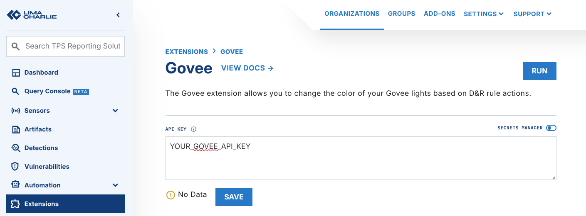

# Govee

The Govee Extension lets you change the color of your [supported Govee lights](https://developer.govee.com/docs/support-product-model) with a response action in a rule. You must configure a Govee API key in the extension.

## Setup

1. Request an API key from Govee. Obey the [Apply for a Govee API key instructions](https://developer.govee.com/reference/apply-you-govee-api-key).
2. Get the Device ID (device) and the model (sku) of the device that you want to target. Request the list of your supported devices from the Govee API:

    ```bash
    curl --location 'https://openapi.api.govee.com/router/api/v1/user/devices' --header 'Govee-API-Key: YOUR_GOVEE_API_KEY'
    ```

3. Decide which RGB colors you want to use. By default, the extension alerts with red (`255,0,0`). It then returns to white (`255,255,255`) when the alert `duration` ends.
4. Add your Govee API key to the extension configuration:
    

### Usage

When the extension is enabled, you can configure the response of a D&R rule to trigger a Govee event. This example shows a response rule:

```yaml
- action: extension request
  extension action: run
  extension name: ext-govee
  extension request:
    device_id: '{{ "YOUR_GOVEE_DEVICE" }}'
    device_model: '{{ "YOUR_GOVEE_DEVICE_SKU" }}'
    alert_color: '{{ "255,0,0" }}'
    alert_brightness: '{{ "100" }}'
    revert_color: '{{ "255,255,255" }}'
    revert_brightness: '{{ "10" }}'
    duration: '{{ "30" }}'
  suppression:
    is_global: true
    keys:
      - Govee
    max_count: 1
    period: 1m
```

The only required fields are `device_id` and `device_model`. The values in the example are the defaults.

#### Parameters

**Required parameters:**

- `device_id`: the Govee API returns this value, see the example response below
- `device_model`: the Govee API returns this value, see the example response below

**Optional parameters:**

- `alert_color`: color of the light when the alert starts, in [RGB format](https://htmlcolorcodes.com/color-picker/), default `255,0,0` (red)
- `revert_color`: color that the light returns to after the alert, in [RGB format](https://htmlcolorcodes.com/color-picker/), default `255,255,255` (white)
- `alert_brightness`: brightness of the light, default `100`
- `revert_brightness`: brightness that the light returns to after the alert, default `10`
- `duration`: length of the alert in seconds. The light keeps `alert_color` for this time, then changes to `revert_color`, default `30`

**Govee API sample request and response:**

```bash
curl --location 'https://openapi.api.govee.com/router/api/v1/user/devices' --header 'Govee-API-Key: YOUR_GOVEE_API_KEY'
```

```json
{
    "code": 200,
    "message": "success",
    "data": [
        {
            "sku": "H6008",                           # use in `device_model` parameter
            "device": "AA:BB:00:11:22:33:44:55",      # use in `device_id` parameter
            "deviceName": "DetectionLight",
            "type": "devices.types.light",
            "capabilities": [
                ...
            ]
        }
    ]
}
```
