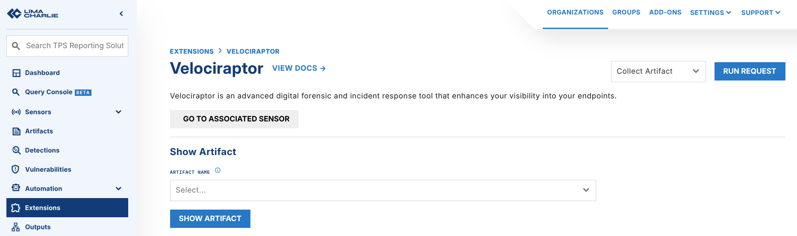
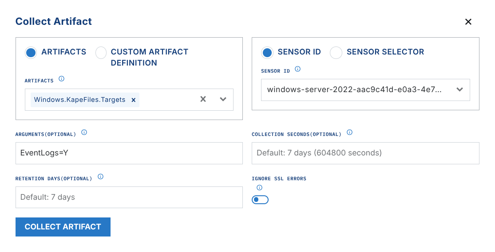

# Hayabusa

Hayabusa Extension Pricing

The Hayabusa extension is free to enable, but downloaded and processed artifacts have a price: $0.02/GB for the original artifact, and $0.5/GB to generate the Hayabusa artifact.

The [Hayabusa](https://github.com/Yamato-Security/hayabusa) extension lets you run Hayabusa against one event log (.evtx) or a collection of event logs (.zip).

Hayabusa is a fast forensics tool for Windows event logs. It generates timelines and helps you hunt for threats. The Yamato Security group in Japan created it.

LimaCharlie starts the analysis automatically from the artifact ID in a rule action. You can also run the analysis by hand from the extension.

## Configuration

After you enable the extension, you can configure the response of a D&R rule to run a Hayabusa analysis against an artifact event. See this example D&R rule:

**Detect:**

```yaml
event: ingest
op: exists
path: /
target: artifact_event
artifact type: wel
```

**Respond:**

```yaml
- action: extension request
  extension action: generate
  extension name: ext-hayabusa
  extension request:
       artifact_id: '{{ .routing.log_id }}'
       send_to_timeline: true
       profile: '{{ "timesketch-verbose" }}'
       min_rule_level: '{{ "informational" }}'
```

The only required field is `artifact_id`. The other values in the example are the defaults.

## Results

```bash
hayabusa update-rules

hayabusa csv-timeline -f /path/to/your/artifact --RFC-3339 -p timesketch-$profile --min-level $min_rule_level --no-wizard --quiet -o $artifact_id.csv -U
```

Hayabusa generates a CSV file when it runs. The CSV file is uploaded as a LimaCharlie artifact.

The CSV is compatible with Timesketch, and you can import it [as a timeline](https://timesketch.org/guides/user/upload-data/).

You can also output your data to Google BigQuery. For the steps, see [Hayabusa to BigQuery](../../tutorials/hayabusa-bigquery.md).

These events are sent to the `ext-hayabusa` Sensor timeline:

- `hayabusa_results`: contains the summary of the results from the Hayabusa output
- `hayabusa_artifact`: contains the `artifact_id` of the CSV file that was uploaded to LimaCharlie
- `hayabusa_event`: contains the raw contents of the Hayabusa CSV output in JSON format. If you set the checkbox or the parameter for `Send to timeline`, many of these events go to the timeline

## Arguments

- `artifact_id`: ID of the LimaCharlie artifact to process
- `profile`: either `minimal`, `standard`, `verbose`, `all-field-info`, `all-field-info-verbose`, `super-verbose`, `timesketch-minimal`, or `timesketch-verbose`

  - Default: `timesketch-verbose`
  - [Hayabusa timesketch-minimal profile output](https://github.com/Yamato-Security/hayabusa?tab=readme-ov-file#7-timesketch-minimal-profile-output)
- `min_rule_level`: `informational`, `low`, `medium`, `high`, or `critical`, see [Hayabusa DFIR timeline commands](https://github.com/Yamato-Security/hayabusa?tab=readme-ov-file#dfir-timeline-commands-1)

  - Default: `informational`
- `send_to_timeline`: boolean that controls if the Hayabusa results are ingested into the sensor timeline as events, default `true`

## Usage

If you use the LimaCharlie Velociraptor extension, you can trigger a Hayabusa analysis when LimaCharlie ingests a Velociraptor KAPE files artifact.

Go to Extensions / Velociraptor. Run the Collect Artifact request.



Start a `Windows.KapeFiles.Targets` artifact collection in the LimaCharlie Velociraptor extension

**Argument options:**

- `EventLogs=Y`
   
- `KapeTriage=Y` - this is also an option. The extension takes all .evtx files out of the triage collection, sends them through Hayabusa, and ignores the rest. This adds more overhead than `EventLogs=Y`.

Configure a D&R rule to look for these events at ingestion, and then trigger the Hayabusa extension:

**Detect:**

```yaml
op: and
target: artifact_event
rules:
    - op: is
      path: routing/log_type
      value: velociraptor
    - op: is
      not: true
      path: routing/event_type
      value: export_complete
```

**Respond:**

```yaml
- action: extension request
  extension action: generate
  extension name: ext-hayabusa
  extension request:
      artifact_id: '{{ .routing.log_id }}'
      send_to_timeline: true    # `false` if you only want the CSV artifact
```

## Generate LC Detections from Hayabusa Output

Note

This capability needs the parameter that sends the Hayabusa output to the sensor timeline: `send_to_timeline: true`

To send Hayabusa detections of a given `Level` or severity directly to your LimaCharlie detections stream, use this D&R rule:

**Detect:**

```yaml
event: hayabusa_event
op: and
rules:
  - op: is
    path: routing/hostname
    value: ext-hayabusa
  - op: matches
    path: event/results/Level
    re: (med|high|crit)
```

**Respond:**

```yaml
- action: report
  name: >-
    Hayabusa - {{ .event.results.Level }} - {{ .event.results.message }}
```

The detection looks like this:

```json
{
  "action": "report",
  "data": {
    "cat": "Hayabusa - med - Failed Logon From Public IP",
    "detect": {
      "event": {
        "artifact_id": "eb39c3b4-6312-41c8-8b6e-e0b46b2f870e",
        "artifact_type": "evtx",
        "event": "hayabusa_event",
        "job_id": "2e904fda-6d3f-4ce1-bf82-ede97f3c0d17",
        "results": {
          "Channel": "Sec",
          "Computer": "windows-server-2022-01304add-3354-4cca-b574-b0a54d7bb6f4-0",
          "Details": "Type: 3 - NETWORK ¦ TgtUser: 4cca ¦ SrcComp: WIN-S2Q2306JU66 ¦ SrcIP: 185.161.248.147 ¦ AuthPkg: NTLM ¦ Proc: -",
          "EventID": "4625",
          "EvtxFile": "/tmp/triage_1078055872.evtx",
          "ExtraFieldInfo": "FailureReason: BAD USER OR PW ¦ IpPort: 0 ¦ KeyLength: 0 ¦ LogonProcessName: NtLmSsp ¦ ProcessId: 0 ¦ Status: BAD USER OR PW ¦ SubStatus: UNKNOWN USER ¦ SubjectLogonId: 0x0 ¦ SubjectUserSid: S-1-0-0 ¦ TargetDomainName: windows-server-2022-01304add-3354-4cca-b574-b0a54d7bb6f4-0 ¦ TargetUserSid: S-1-0-0",
          "Level": "med",
          "MitreTactics": "InitAccess ¦ Persis",
          "MitreTags": "T1078 ¦ T1190 ¦ T1133",
          "OtherTags": "",
          "RecordID": "681128",
          "RuleFile": "win_security_susp_failed_logon_source.yml",
          "datetime": "2024-03-20 21:50:55.930385+00:00",
          "message": "Failed Logon From Public IP",
          "timestamp_desc": "hayabusa"
        }
      },
      "routing": {
        "arch": 9,
        "did": "",
        "event_id": "0a6989a1-af71-4583-a8bc-e766bd2a81d8",
        "event_time": 1711071722721,
        "event_type": "hayabusa_event",
        "ext_ip": "internal",
        "hostname": "ext-hayabusa",
        "iid": "bfac2d1f-5d8c-4115-9df2-633a4f1d062b",
        "int_ip": "",
        "moduleid": 6,
        "oid": "01304add-3354-4cca-b574-b0a54d7bb6f4",
        "plat": 2415919104,
        "sid": "3109b3c7-c5ca-4029-b493-4d4e6766c4d3",
        "tags": [
          "ext:ext-hayabusa",
          "lc:system"
        ],
        "this": "76088a58bb99484c82cf9e9065fce1ea"
      },
      "ts": "2024-03-22 01:42:02"
    },
    "detect_id": "90609b8b-c2b8-4537-b17e-5d1665fd8717",
    "gen_time": 1711114007077,
    "link": "https://app.limacharlie.io/orgs/01304add-3354-4cca-b574-b0a54d7bb6f4/sensors/3109b3c7-c5ca-4029-b493-4d4e6766c4d3/timeline?time=1711071722&selected=76088a58bb99484c82cf9e9065fce1ea",
    "mtd": null,
    "routing": {
      "arch": 9,
      "did": "",
      "event_id": "0a6989a1-af71-4583-a8bc-e766bd2a81d8",
      "event_time": 1711071722721,
      "event_type": "hayabusa_event",
      "ext_ip": "internal",
      "hostname": "ext-hayabusa",
      "iid": "bfac2d1f-5d8c-4115-9df2-633a4f1d062b",
      "int_ip": "",
      "moduleid": 6,
      "oid": "01304add-3354-4cca-b574-b0a54d7bb6f4",
      "plat": 2415919104,
      "sid": "3109b3c7-c5ca-4029-b493-4d4e6766c4d3",
      "tags": [
        "ext:ext-hayabusa",
        "lc:system"
      ],
      "this": "76088a58bb99484c82cf9e9065fce1ea"
    },
    "source": "01304add-3354-4cca-b574-b0a54d7bb6f4.bfac2d1f-5d8c-4115-9df2-633a4f1d062b.3109b3c7-c5ca-4029-b493-4d4e6766c4d3.90000000.9",
    "source_rule": "replay-rule"
  }
}
```
