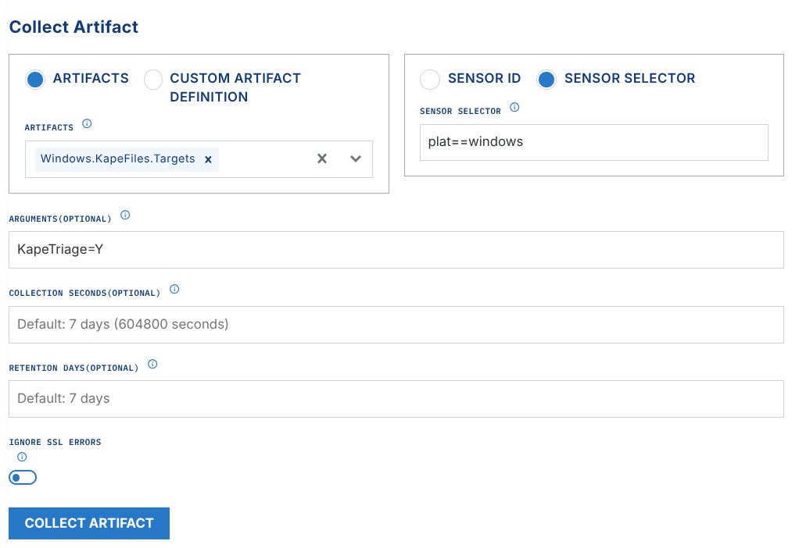
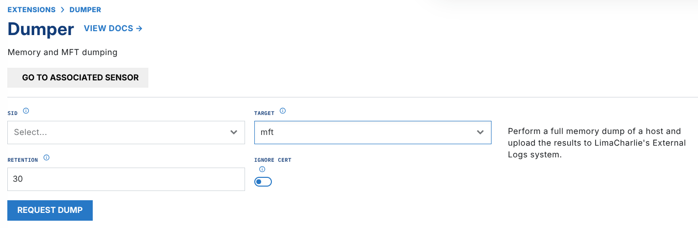

# Plaso

Plaso Extension Pricing

The Plaso extension is free to enable, but there is a charge for the original downloaded artifact and for the processed (Plaso) artifacts -- $0.02/GB for the original downloaded artifact, and $1.0/GB to generate the processed artifacts.

## About

[Plaso](https://plaso.readthedocs.io/) is a suite of tools in Python. It creates analysis timelines from forensic artifacts that you acquire from an endpoint.

Digital forensic investigators and analysts use these timelines to correlate the large quantities of information in an intrusion investigation. This information is in logs and in many different forensic artifacts.

The primary tools in the Plaso suite used for this process are [log2timeline](https://plaso.readthedocs.io/en/latest/sources/user/Using-log2timeline.html), [psort](https://plaso.readthedocs.io/en/latest/sources/user/Using-psort.html), and [psteal](https://plaso.readthedocs.io/en/latest/sources/user/Using-psteal.html).

- `log2timeline` - bulk forensic artifact parser
- `psort` - builds timelines from the output of `log2timeline`
- `psteal` - a wrapper for `log2timeline` and `psort`

The `ext-plaso` extension in LimaCharlie runs `log2timeline` and `psort` (with the `psteal` wrapper) against artifacts from an endpoint, such as event logs, registry hives, and other forensic artifacts. Plaso parses and extracts information from each acquired evidence artifact that it supports. For the full list of supported parsers, see the [Plaso parsers and plugins reference](https://plaso.readthedocs.io/en/latest/sources/user/Parsers-and-plugins.html).

## Extension Configuration

Long Execution Times

For a larger triage collection, the plaso generation can take **several minutes**. After it completes, the results are in the `ext-plaso` Sensor timeline, and the uploaded artifacts are on the Artifacts page.

The `ext-plaso` extension runs `psteal` (`log2timeline` + `psort`) against the acquired evidence with these commands:

1. ```bash
   psteal.py --source /path/to/artifact -o dynamic --storage-file $artifact_id.plaso -w $artifact_id.csv
   ```

`psteal.py` generates a `.plaso` file and a `.csv` file. The extension uploads both as LimaCharlie artifacts.

- The `.plaso` file contains the raw output of `log2timeline.py`
- The `.csv` file contains the contents of the `.plaso` file in CSV format

1. ```bash
   pinfo.py $artifact_id.plaso -w $artifact_id_pinfo.json --output_format json
   ```

After `psteal.py` runs, the `pinfo.py` utility collects information from the `.plaso` file. The extension sends this information to the `ext-plaso` sensor timeline as a `pinfo` event. The event gives a detailed summary with metrics of the processing, and the related errors.

The extension sends these events to the `ext-plaso` sensor timeline:

- `job_queued`: shows that `ext-plaso` received a request to process data and put it in the queue
- `job_started`: shows that `ext-plaso` started to process the data
- `job_failed`: shows that the processing job failed; the `error` field contains the reason
- `pinfo`: contains the `pinfo.py` output that summarizes the results of the plaso file generation
- `plaso`: contains the `artifact_id` of the plaso file that the extension uploaded to LimaCharlie
- `csv`: contains the `artifact_id` of the CSV file that the extension uploaded to LimaCharlie; if timeline ingestion is enabled, it also reports `events_sent_to_timeline` and `rows_skipped`
- `plaso_event`: one event for each row of the generated timeline, only if timeline ingestion is enabled (see [Timeline Ingestion](#timeline-ingestion))

## Timeline Ingestion

By default, the generated timeline is available only as downloadable `.plaso` and `.csv` artifacts. Set the optional `send_to_timeline` parameter to `true` on a `generate` request. The extension then also ingests each row of the generated CSV timeline as one `plaso_event` event on the `ext-plaso` sensor timeline.

Each `plaso_event` carries the timeline columns under `results`. These columns include the forensic timestamp (`results/datetime`), the plaso parser that made the entry, and the event message. The extension ingests the rows in chronological order, as sorted by `psort`. You can then search the full forensic timeline with LCQL and use it in D&R rules. With the automation below, the full triage workflow stays in LimaCharlie: collection, timeline generation, and detection.

Ingestion Volume

A Plaso timeline for a full triage collection can contain hundreds of thousands of rows, or millions of rows. If you enable `send_to_timeline`, the extension ingests all of them as events. LimaCharlie bills this as regular event ingestion volume.

If a row of the CSV cannot be parsed, the extension skips the row and the job continues. The final `csv` status event reports the number of ingested events (`events_sent_to_timeline`) and the number of skipped rows (`rows_skipped`).

## Usage & Automation

LimaCharlie can start evidence processing with Plaso automatically, from the artifact ID in a rule action. You can also run the processing manually from the extension.

### Velociraptor Triage Acquisition Processing

If you use the LimaCharlie [Velociraptor](velociraptor.md) extension, one use of `ext-plaso` is to start Plaso evidence processing when LimaCharlie ingests a Velociraptor KAPE files artifact collection.

1. Configure a D&R rule to watch for Velociraptor collection events at ingestion. The rule then triggers the Plaso extension:

   **Detect:**

   ```yaml
   op: and
   target: artifact_event
   rules:
       - op: is
         path: routing/log_type
         value: velociraptor
       - op: is
         not: true
         path: routing/event_type
         value: export_complete
   ```

   **Respond:**

   ```yaml
   - action: extension request
     extension action: generate
     extension name: ext-plaso
     extension request:
         artifact_id: '{{ .routing.log_id }}'
         send_to_timeline: true
   ```

   The `send_to_timeline` parameter is optional. If you set it to `true`, the extension also ingests the timeline rows as `plaso_event` events (see [Timeline Ingestion](#timeline-ingestion)).

2. Start a `Windows.KapeFiles.Targets` artifact collection in the LimaCharlie Velociraptor extension. Velociraptor then collects all endpoint artifacts that [the KAPE Target file](https://github.com/EricZimmerman/KapeFiles/blob/master/Targets/Compound/KapeTriage.tkape) defines.

   **Argument options:**

   - `EventLogs=Y` - EventLogs only, faster processing time for a proof of concept
   - `KapeTriage=Y` - full [KapeTriage](https://github.com/EricZimmerman/KapeFiles/blob/master/Targets/Compound/KapeTriage.tkape) files collection 
3. After Velociraptor collects, zips, and uploads the evidence, the D&R rule that you created sends the triage `.zip` to `ext-plaso` for processing. For the status, watch the `ext-plaso` sensor timeline. For the `.plaso` & `.csv` output files, watch the Artifacts page. See [Working with the Output](#working-with-the-output).

### MFT Processing

If you use the LimaCharlie [Dumper](../limacharlie/dumper.md) extension, one use of `ext-plaso` is to start Plaso evidence processing when LimaCharlie ingests an MFT CSV artifact.

1. Configure a D&R rule to watch for MFT collection events at ingestion. The rule then triggers the Plaso extension:

   **Detect:**

   ```yaml
   op: and
   target: artifact_event
   rules:
       - op: is
         path: routing/log_type
         value: mftcsv
       - op: is
         not: true
         path: routing/event_type
         value: export_complete
   ```

   **Respond:**

   ```yaml
   - action: extension request
     extension action: generate
     extension name: ext-plaso
     extension request:
         artifact_id: '{{ .routing.log_id }}'
   ```

2. Start an MFT dump in the LimaCharlie Dumper extension.
   
3. After the dumper completes and uploads the evidence, the D&R rule that you created sends the zipped MFT CSV to `ext-plaso` for processing. For the status, watch the `ext-plaso` sensor timeline. For the `.plaso` & `.csv` output files, watch the Artifacts page. See [Working with the Output](#working-with-the-output).

## Working with the Output

The extension generates these outputs:

.png)

- `pinfo` on `ext-plaso` sensor timeline
   After `ext-plaso` completes a processing job, analyze the `pinfo` event on the `ext-plaso` sensor timeline first. The event gives a detailed summary with metrics of the processing, and the related errors.

  - Examine fields such as `warnings_by_parser` or `warnings_by_path_spec`. These fields can show parser errors.
  - This sample output of `pinfo` shows the counts of parsed artifacts under `storage_counters`. The counts show which events are in your CSV timeline, and how many.

```text
"amcache": 986,
"appcompatcache": 4096,
"bagmru": 29,
"chrome_27_history": 29,
"chrome_66_cookies": 246,
"explorer_mountpoints2": 2,
"explorer_programscache": 1,
"filestat": 3495,
"lnk": 160,
"mft": 4790977,
"mrulist_string": 2,
"mrulistex_shell_item_list": 3,
"mrulistex_string": 5,
"mrulistex_string_and_shell_item": 5,
"mrulistex_string_and_shell_item_list": 1,
"msie_webcache": 143,
"msie_zone": 60,
"networks": 4,
"olecf_automatic_destinations": 37,
"olecf_default": 5,
"recycle_bin": 3,
"shell_items": 297,
"total": 5840430,
"user_access_logging": 34,
"userassist": 44,
"utmp": 13,
"windows_boot_execute": 8,
"windows_run": 10,
"windows_sam_users": 16,
"windows_services": 2004,
"windows_shutdown": 8,
"windows_task_cache": 835,
"windows_timezone": 4,
"windows_typed_urls": 3,
"windows_version": 6,
"winevtx": 382674,
"winlogon": 8,
"winreg_default": 654177
```

### Downloadable Artifacts

.png)

- `plaso` artifact
   The downloadable `.plaso` file contains the raw output of `log2timeline.py`. You can [import it into Timesketch](https://timesketch.org/guides/user/upload-data/) as a timeline.
- `csv` artifact
   You can view the downloadable `.csv` file in any CSV viewer. A recommended tool is [Timeline Explorer](https://ericzimmerman.github.io/) from Eric Zimmerman.

### Timeline Events

If the request used `send_to_timeline: true`, the full timeline is also available as `plaso_event` events on the `ext-plaso` sensor timeline. You can examine these events in chronological order, query them with LCQL, and match them with D&R rules. See [Timeline Ingestion](#timeline-ingestion).
