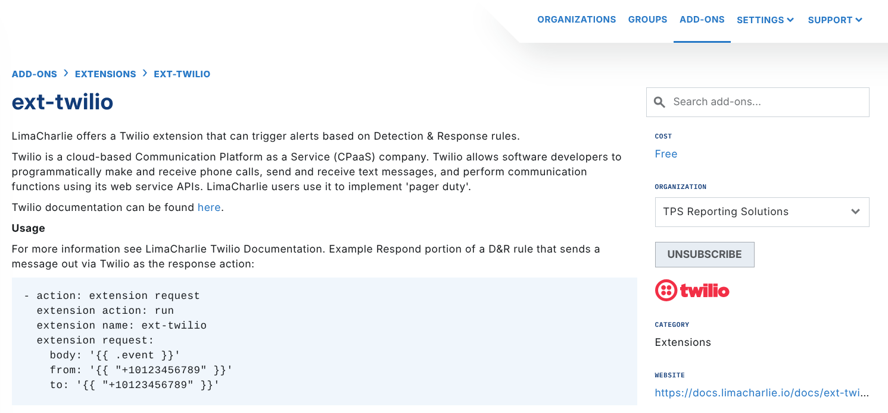

# Twilio

## Overview

The [Twilio](https://www.twilio.com/) Extension lets you send messages with Twilio. You must set up the Twilio authentication in the **Integrations** section of your Organization.

For more detail, see the Twilio [SMS send-messages reference](https://www.twilio.com/docs/sms/send-messages).

## Setup

To use the Twilio extension, first subscribe to the `ext-twilio` add-on in the LimaCharlie **Marketplace**.



After you subscribe to the extension, set up the Twilio authentication in the `Secrets Manager` section of your organization.

Twilio authentication uses two parts: a SID and a token. The LimaCharlie Twilio secret combines both parts in one field, in the form `SID/TOKEN`.

### Detection & Response

This example is the Response part of a rule. The response action sends a message with Twilio:

```yaml
- action: extension request
  extension action: run
  extension name: ext-twilio
  extension request:
    body: '{{ .event }}'
    from: '{{ "+10123456789" }}'
    to: '{{ "+10123456789" }}'
```

*The* `{{ .event }}` *in the example above is the text that the extension sends to the number that you specify.*
