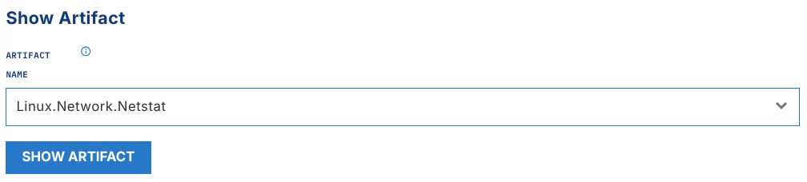
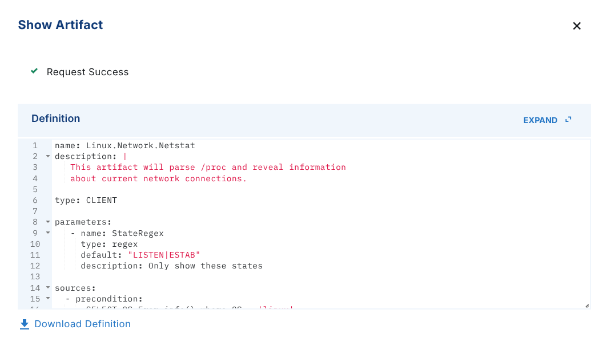
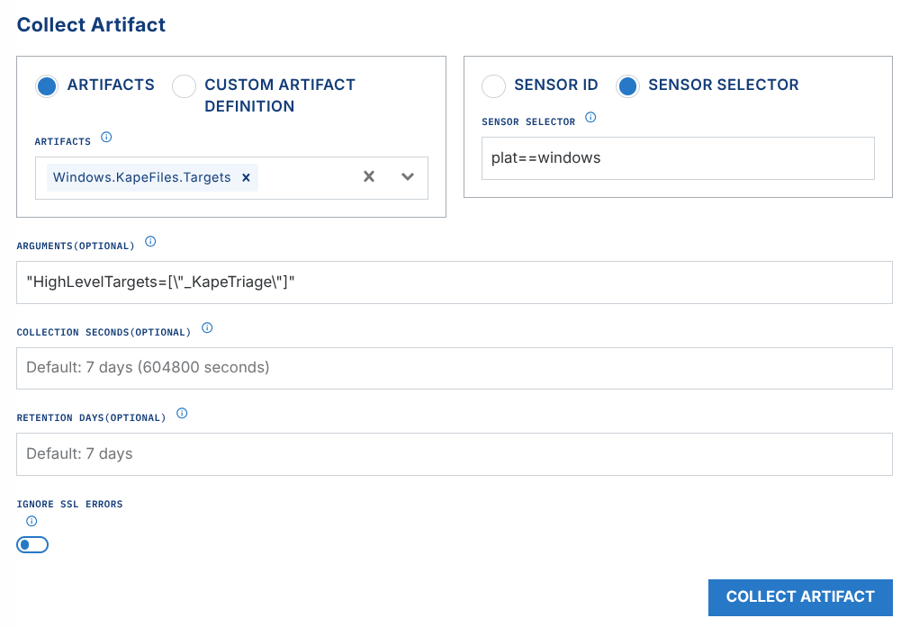
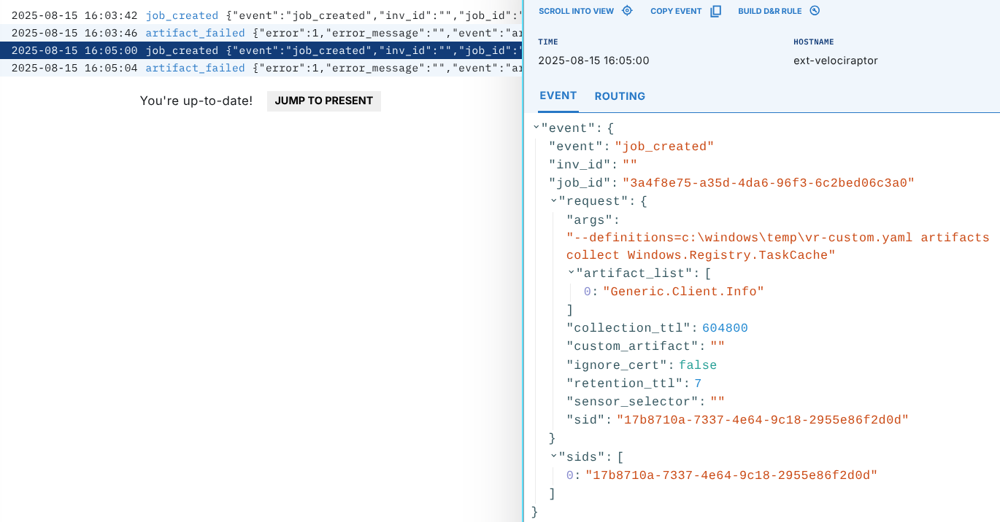
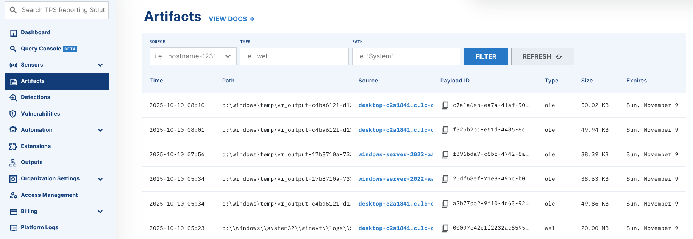

# Velociraptor

## Overview

[Velociraptor](https://github.com/Velocidex/Velociraptor) is an open source endpoint visibility tool. It includes digital forensic, incident response, and incident triage functions. Use LimaCharlie to deploy Velociraptor at scale for artifact collection and incident analysis.

The interface defines 2 main actions:

1. **Show Artifact** - lets you inspect the VQL artifacts that are available for collection
2. **Collect Artifact** - lets you run an artifact collection on one or more endpoints

### Show Artifact

Choose an artifact from the list to inspect its contents.



Result of the action



### Collect Artifact

This action collects one or more Velociraptor [Artifacts](https://docs.velociraptor.app/artifact_references/) from one or more endpoints through the Endpoint Agent.


Velociraptor makes a ZIP file with all the collected data. LimaCharlie ingests the file automatically into its Artifact system, where you can download it.

#### Arguments

- **Artifacts** - Select one or more Velociraptor artifacts to collect
- **Sensor Selector** - Select one sensor by its Sensor ID in the dropdown. You can also use a [Sensor Selector Expression](../../../8-reference/sensor-selector-expressions.md) to target more sensors, such as `plat==windows`
- **Arguments (optional)** - See below
- **Collection Seconds (optional)** - Set the wait time in seconds. The Extension waits for a target endpoint to come online and be processed for collection.
- **Retention Days (optional)** - Set the number of days that the platform keeps the collected artifact.
- **Ignore SSL Errors (optional)** - Tells the endpoint to ignore SSL errors during the collection. Use this option if the endpoint is behind a MITM proxy or a firewall that does SSL interception.

##### Arguments (optional)

The extension passes these optional arguments (or parameters) directly to the Velociraptor Artifact. Use the format `"Key=[\"value\"]"` for list parameters and `"Key=Y"` for boolean parameters.

For example, to run a [Linux.Triage.UAC](https://triage.velocidex.com/docs/linux.triage.uac/) collection for all categories, specify:

```text
"Targets=[\"_All\"]"
```

If `_All` returns more data than you need, set one target instead. For the full list of options, see the [UAC target reference](https://triage.velocidex.com/docs/linux.triage.uac/).

For [Windows.KapeFiles.Targets](https://github.com/Velocidex/velociraptor/blob/master/artifacts/definitions/Windows/KapeFiles/Targets.yaml), you can use `"HighLevelTargets=[\"_KapeTriage\"]"`.

## Monitoring Collections

To track Velociraptor hunts, view the Timeline for the `ext-velociraptor` sensor.



After you see `artifact_uploaded` in the timeline, you can find the artifact on the "Artifacts" screen.



## Correlating a Collection (`job_id` to Artifact)

The `collect` action returns a `job_id`, for example:

```json
{
  "data": {
    "job_id": "bf24a49c-96e5-4c20-98a4-77f33bb7ce34",
    "n_sensors": 1
  }
}
```

This `job_id` is the correlation key of the extension for the collection request. It is **not** a payload or artifact ID. LimaCharlie ingests the collected data as an **Artifact**, which has its own artifact ID. There are two ways to map one ID to the other.

### 1. Webhook events (recommended for automation)

If you configure an `ext-velociraptor` webhook output, the extension sends a set of lifecycle events during the collection. Each event contains the `job_id`:

| Event | Key fields | When |
|-------|------------|------|
| `job_created` | `job_id`, `sids`, `request`, `inv_id` | Request accepted and tasks sent to sensors |
| `artifact_generated` / `artifact_timeout` / `artifact_failed` | `job_id`, `sid` | Collection produced on the endpoint (or timed out / failed) |
| `artifact_uploaded` / `upload_generated` | `job_id`, `sid` | Collection ZIP uploaded to the platform |
| `velociraptor_collection` | `job_id`, `sid`, `collection`, `collection_artifact`, `inv_id` | Collection ingested and parsed |
| `job_finished` | `job_id` | All taskings for the job are complete |

The `collection_artifact` field in the `velociraptor_collection` event is the LimaCharlie **artifact ID** for that `job_id`. This is the definitive map from `job_id` to artifact.

### 2. Artifact `original_path`

The path of the ingested collection ZIP ends in `_<job_id>.zip`. In the Artifact Collection — or in a D&R rule with `{{ .event.original_path }}` — you can match or filter artifacts by their `job_id`.

## Automating Collection Retrieval

You can fetch new Velociraptor collections automatically and send them to another system for storage or processing. Use rules that watch for the artifact upload and send it to a tailored output.

Example D&R rule

```yaml
# Detection
op: is
path: routing/log_type
target: artifact_event
value: velociraptor

# Response
- action: output
  name: artifacts-tailored
  suppression:
    is_global: false
    keys:
        - '{{ .event.original_path }}'
        - '{{ .routing.log_id }}'
    max_count: 1
    period: 1m
- action: report
  name: VR artifact ingested
```

This [open source example](https://github.com/shortstack/lcvr-to-timesketch) shows how to automate the post-processing of Velociraptor triage collections. It sends KAPE Triage acquisitions to a webhook. The webhook then gets the collection, processes it with [Plaso](https://github.com/log2timeline/plaso/), and puts it into [Timesketch](https://github.com/google/timesketch).

To send Velociraptor data to BigQuery for more analysis, see the [Velociraptor to BigQuery tutorial](../../tutorials/velociraptor-bigquery.md).

## Using Velociraptor in D&R Rules

To start a Velociraptor collection as a response to one of your detections, configure an extension request in the respond block of a rule.

This example starts the KAPE files Velociraptor artifact. The artifact collects the event logs from the system in the detection.

```yaml
- action: extension request
  extension action: collect
  extension name: ext-velociraptor
  extension request:
    artifact_list: ['Windows.KapeFiles.Targets']
    sid: '{{ .routing.sid }}' # Use a sensor selector OR a sid, **not both**
    sensor_selector: '' # Use a sensor selector OR a sid, **not both**
    args: '{{ "EventLogs=Y" }}'
    collection_ttl: 3600 # 1 hour - collection_ttl is specified in seconds
    retention_ttl: 7 # retention_ttl is specified in days
    ignore_cert: false
```

### Migrating D&R Rule from legacy Service to new Extension

***Note: LimaCharlie migrated from Services to Extensions. Legacy services are not supported.***

The [Python CLI](https://github.com/refractionPOINT/python-limacharlie) shows if a rule refers to the legacy Velociraptor service. It also previews the change and does the conversion in the "response" part of the rule.

Command line to preview Velociraptor rule conversion:

```bash
limacharlie extension convert_rules --name ext-velociraptor
```

A dry run is the default. It shows the name of the rule that changes, a JSON of the service request rule, and a JSON of the new extension request.

To make the change in the rule, set the `--dry-run` flag to `--no-dry-run`

Command line to execute Velociraptor rule conversion:

```bash
limacharlie extension convert_rules --name ext-velociraptor --no-dry-run
```
