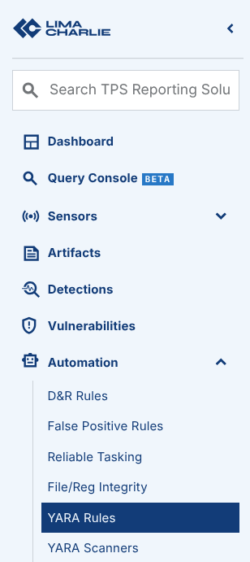
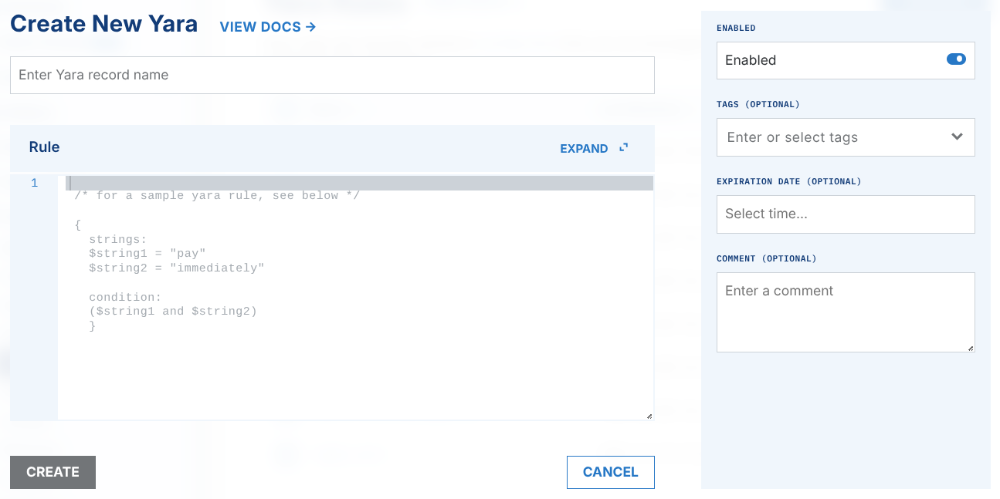

# YARA

The [YARA](https://github.com/Yara-Rules/rules) Extension helps you with all parts of YARA scanning. YARA scanning is usually a manual process in separate steps. The extension gives a framework for the process and automates it. After you configure it, you can run YARA scans on demand for one endpoint, or continuously in the background across your fleet.

Yara configurations are synchronized with sensors every few minutes.

There are three main sections to the YARA job:

- Sources
- Rules
- Scan

## Where Does My YARA Scan?

The automated YARA scanners in LimaCharlie scan all the files that are loaded in memory (for example exe, dll), and the memory itself.

A Sensor command scans the files on disk. To start a manual scan on demand, use one of these methods:

- Click the Run YARA scan button on the sensor details page
- Click the Scan button on the YARA Scanners page
- Use the console
- Use the Response section of a rule (sample below)
- Use the LimaCharlie API

## Rules

In this section you define your YARA rules. Copy your YARA rules into the `Rule` box, or define sources with the [ext-yara-manager](../limacharlie/yara-manager.md). A source is a direct link (URL) to one YARA rule or to a directory of rules, or an [ARL](../../../8-reference/authentication-resource-locator.md) to a YARA rule.





## Scanners

A scanner defines which sets of sensors to scan with which sets of YARA rules.

A sensor matches only if it has ALL of the Filter Tags (AND condition). The platform of the sensor must match one of the platforms in the filter (OR condition).

To scan an endpoint or a set of endpoints with YARA rules, first select the platform or the tags. Then add the YARA rules that you want to run.

## Using Yara in D&R Rules

To start a Yara scan as a response to one of your detections, configure an extension request in the respond block of a rule. A Yara scan request can run with a blank selector OR a blank Sensor ID, but you must specify one of them.

```yaml
- action: extension request
  extension action: scan
  extension name: ext-yara
  extension request:
 sources: [ ]# Specify Yara Rule sources as strings
 selector: ''
        sid: '{{ .routing.sid }}' # Use a sensor selector OR a sid, **not both**
 yara_scan_ttl: 86400 # "Default: 1 day (86,400 seconds)"
```

## Migrating D&R Rule from legacy Service to new Extension

***Note: LimaCharlie migrated from Services to Extensions. Legacy services are not supported.***

The [Python CLI](https://github.com/refractionPOINT/python-limacharlie) shows if a rule refers to the legacy Yara service. It also previews the change and does the conversion in the "response" part of the rule.

Command line to preview Yara rule conversion:

```bash
limacharlie extension convert_rules --name ext-yara
```

A dry run is the default. It shows the name of the rule that changes, a JSON of the service request rule, and a JSON of the new extension request.

To make the change in the rule, set the `--dry-run` flag to `--no-dry-run`

Command line to execute Yara rule conversion:

```bash
limacharlie extension convert_rules --name ext-yara --no-dry-run
```
