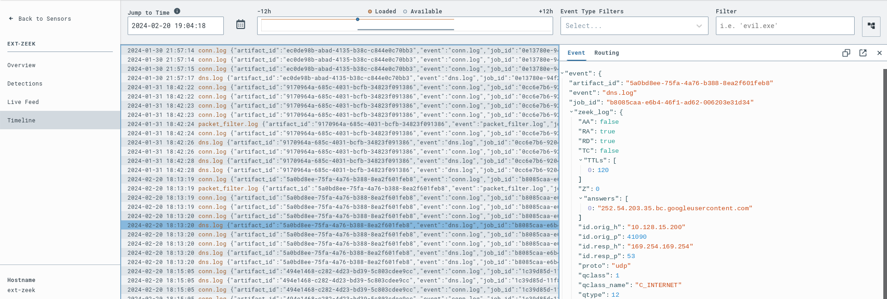
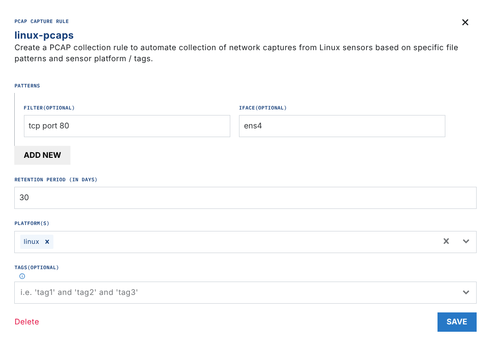

# Zeek

## Zeek Extension Pricing

The Zeek extension is free to enable, but processed PCAPs cost $0.02/GB.

[Zeek](https://zeek.org/) is a platform for network traffic analysis and intrusion detection.

After you enable this extension, it generates Zeek logs from the packet capture (PCAP) files that Artifacts collects. The Zeek log files are then parsed and sent into the `ext-zeek` Sensor timeline as JSON. You can create detection & response rules that act on the Zeek log data.

LimaCharlie starts Zeek automatically for the artifact ID that a rule action gives.

## Configuration

To enable the Zeek extension, go to the [Zeek extension page](https://app.limacharlie.io/add-ons/extension-detail/ext-zeek) in the marketplace. Select the Organization for the extension, then select Subscribe.

After you enable the extension, you can configure the response of a D&R rule to run Zeek on an artifact event. This is an example D&R rule:

**Detect:**

```yaml
artifact type: pcap
event: ingest
op: exists
path: /
target: artifact_event
```

**Respond:**

```yaml
- action: extension request
  extension action: run_on
  extension name: ext-zeek
  extension request:
    artifact_id: '{{ .routing.log_id }}'
    retention: 30
```

## Results

```text
/opt/zeek/bin/zeek -C LogAscii::use_json=T --no-checksums --readfile /path/to/your.pcap
```

Zeek generates several JSON log files. The log files are parsed and sent into the `ext-zeek` sensor timeline.



## Usage

### Via Automatic PCAP Collection

#### Note: This is only available on Linux sensors

Enable PCAP collection on your Linux sensors with a PCAP capture rule in the artifact collection extension.

For example, to collect PCAPs of the network traffic on interface `ens4` on TCP port 80, make this rule.



After about 30MB of traffic is collected, a PCAP is uploaded as an artifact in LimaCharlie. Each new PCAP is uploaded when it reaches the same size limit.

Each uploaded PCAP triggers the [D&R rule below](#dr-rule).

### Via Manual PCAP Upload

If you already generated a PCAP on one or more systems, you can ingest the PCAP as an artifact. Run this command in your sensor console:

```text
artifact_get --file /path/to/your.pcap --type pcap
```

This command triggers the [D&R rule below](#dr-rule).

### D&R Rule

**Detect:**

```yaml
artifact type: pcap
event: ingest
op: exists
path: /
target: artifact_event
```

**Respond:**

```yaml
- action: extension request
  extension action: run_on
  extension name: ext-zeek
  extension request:
    artifact_id: '{{ .routing.log_id }}'
    retention: 30
```

### Migrating D&R Rule from legacy Service to new Extension

***Note: LimaCharlie migrated from Services to Extensions. Legacy services are not supported.***

The [Python CLI](https://github.com/refractionPOINT/python-limacharlie) shows if a rule refers to the legacy zeek service. It also previews the change and does the conversion in the "response" part of the rule.

Command line to preview zeek rule conversion:

```bash
limacharlie extension convert_rules --name ext-zeek
```

A dry run is the default. It shows the name of the rule that changes, a JSON of the service request rule, and a JSON of the new extension request.

To make the change in the rule, set the `--dry-run` flag to `--no-dry-run`

Command line to execute zeek rule conversion:

```bash
limacharlie extension convert_rules --name ext-zeek --no-dry-run
```
