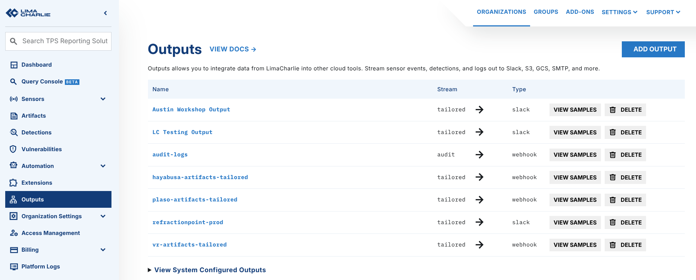
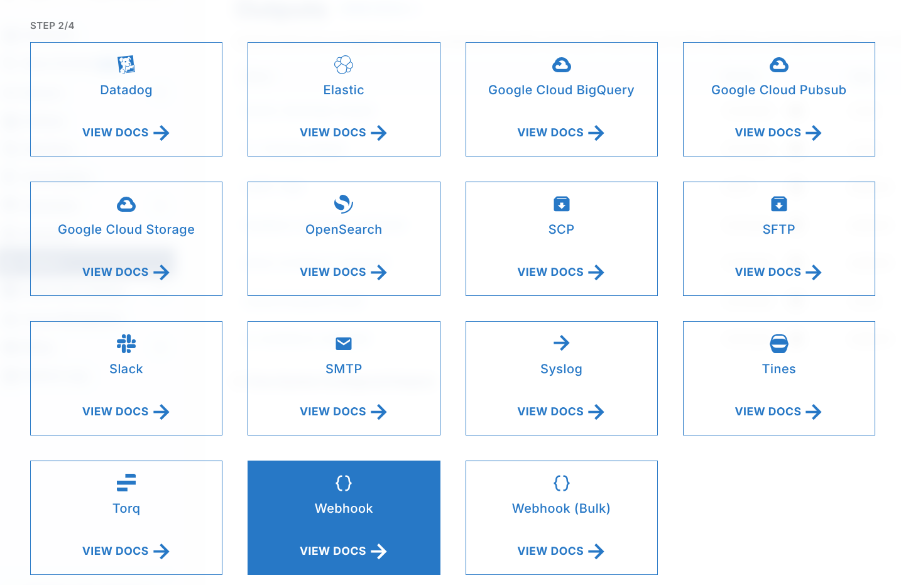
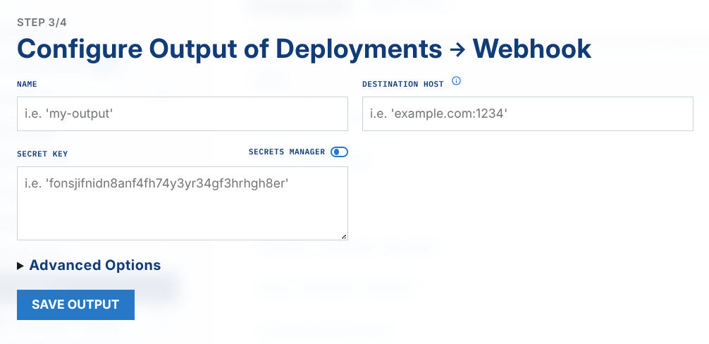
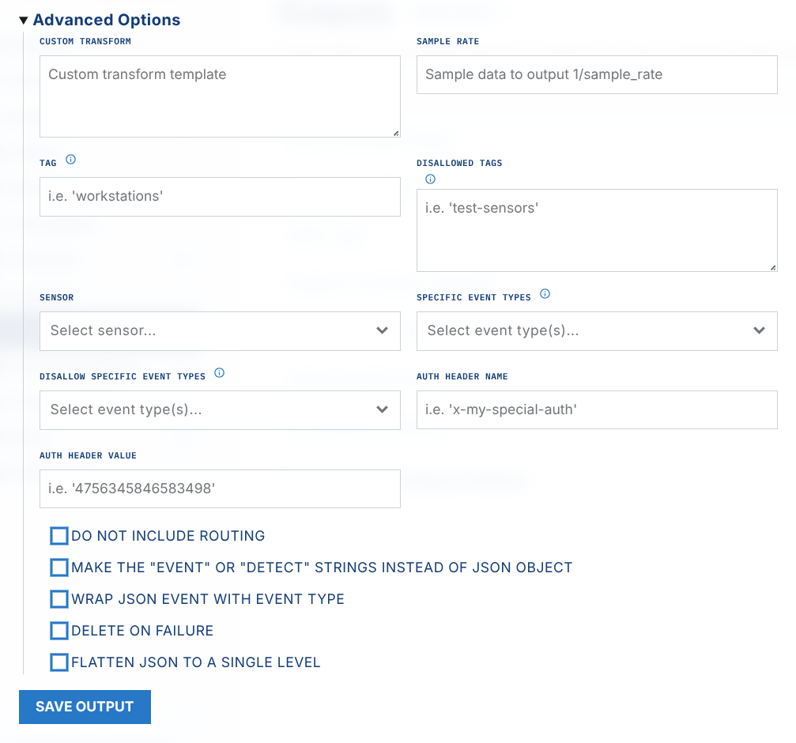

# Splunk

To send data from LimaCharlie to Splunk, configure an output.

LimaCharlie can reduce your Splunk spend.

[Watch the webinar recording](https://www.youtube.com/watch?v=lqPqkDkd7I8) to learn how LimaCharlie reduces spending on Splunk and other security data solutions with high cost.

## Splunk Setup

Obey Splunk's guide to [set up an HEC](https://docs.splunk.com/Documentation/Splunk/8.0.2/Data/UsetheHTTPEventCollector). Set the source type to `_json`.

### LimaCharlie Setup

From the **Outputs** view, click `Add Output`.

Choose the type of stream that you want to output from LimaCharlie.

.png)

Set `Webhook` or `Webhook Bulk` as a destination.

Enter the output name.

Enter the [correct HEC URI](https://docs.splunk.com/Documentation/Splunk/8.0.2/Data/UsetheHTTPEventCollector#Send_data_to_HTTP_Event_Collector) for your Splunk implementation as Destination Host. Use the  /services/collector/event  endpoint. For Splunk Cloud, this is the string from the URL `https://<host>.splunkcloud.com/`.

Here is a sample Splunk HEC configuration:

Destination Host = `https://host.domain.com:8088/services/collector/raw`
 Auth Header Name = Authorization
 Auth Header value = Splunk xxxxxx-xxxx-xxxx-xxxx-xxxxxx

Before you save the output, you can configure the advanced Output settings.

**Tag** - Give a tag name to send only the events from sensors with this tag. You manage tags in the sensor details view.

**Sensor** - choose a sensor ID to send only the events or detections from this sensor.

Flatten flattens the JSON. The email configuration needs no changes.

\*\*Wrap JSON event with Event Type \*\*- by default, LimaCharlie does not add a prefix in front of every record. A prefix is useful when you load data into relational databases. To get an email that a human can read, leave this option unchecked.

**Delete on Failure** - when set to Yes, the system deletes the full output configuration if a failure occurs. Use this for a temporary output that you do not want to remove later.

To send only a specific list of event types, configure an allow list in the **Detection Category** section. To exclude event types, list them in the deny list **(Disallowed Detection Categories)**.

The **Do not include routing** flag sends only the original logs to outputs, without the routing label. This helps when you use LimaCharlie to optimize storage, because the routing label can add large overhead.

