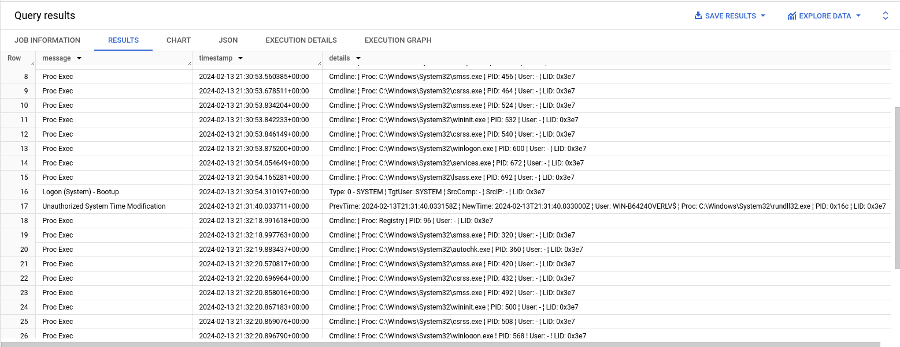

# Hayabusa to BigQuery

## Overview

The BigQuery output sends Hayabusa analysis results to a BigQuery table. You can then run SQL-like queries against the data and analyze very large datasets. To learn how to use Hayabusa in LimaCharlie, see [Hayabusa Extension](../extensions/third-party/hayabusa.md).

To analyze event logs from 10s, 100s, or 1000s of systems with Hayabusa, you have two options:

1. Send the CSV artifact to another platform, such as [Timesketch](https://timesketch.org/), for more analysis. The CSV that Hayabusa creates in LimaCharlie is compatible with Timesketch
2. Run queries in BigQuery against all the data that Hayabusa returns

A BigQuery dataset that contains Hayabusa results:


### Steps to Accomplish

1. Get a Google Cloud project
2. Create a service account in your Google Cloud project

   1. Go to your project
   2. Go to IAM
   3. Go to Service Accounts > Create Service Account
   4. Click the new Service Account and create a new key

      1. .png)
      2. This gives you the secret key in JSON format. You configure this key later in your LimaCharlie output.
   5. In BigQuery, create a Dataset, Table, & Schema like the screenshot below. The names of your dataset and table are arbitrary, but they must match the names that you configure in your output in LimaCharlie.

      1. Project - `your_project_name`
      2. Dataset - `hayabusa`
      3. Table - `hayabusa`
      4. Schema - `computer:STRING, message:STRING, timestamp:STRING, details:STRING, channel:STRING, event_id:STRING, level:STRING, mitre_tactics:STRING, mitre_tags:STRING, extra:STRING`

         1. This can be any of the fields from the Hayabusa event that you want to use. **This schema and transform are based on the CSV output using the** `timesketch-verbose` **profile.**
3. Create the LimaCharlie Events Output

   1. In the side navigation menu, click "Outputs" and add a new output

      1. **Output stream**: Events
      2. **Destination**: Google Cloud BigQuery

         1. **Name**: `hayabusa-bigquery`

            1. You can change this name, but it affects a later step, so note the output name
         2. **schema**: `computer:STRING, message:STRING, timestamp:STRING, details:STRING, channel:STRING, event_id:STRING, level:STRING, mitre_tactics:STRING, mitre_tags:STRING, extra:STRING`

            1. This can be any of the fields from the Hayabusa event that you want to use. **This schema and transform are based on the CSV output using the** `timesketch-verbose` **profile.**
         3. **Dataset**: *the name that you gave your BQ dataset above*
         4. **Table**: *the name that you gave your BQ table above*
         5. **Project**: *your* GCP *project name*
         6. **Secret Key**: *give the JSON secret key for your GCP service account*
         7. **Advanced Options**

            1. **Custom Transform**: paste this JSON

               1. This can be any of the fields from the Hayabusa event that you want to use. **This schema and transform are based on the CSV output using the** `timesketch-verbose` **profile.**

               ```json
               {
               "channel": "event.results.Channel",
               "computer": "event.results.Computer",
               "message": "event.results.message",
               "timestamp": "event.results.datetime",
               "details": "event.results.Details",
               "event_id": "event.results.EventID",
               "level": "event.results.Level",
               "mitre_tactics": "event.results.MitreTactics",
               "mitre_tags": "event.results.MitreTags",
               "extra": "event.results.ExtraFieldInfo",
               }
               ```

            2. **Specific Event Types**: `hayabusa_event`
            3. **Sensor**: `ext-hayabusa`
4. You can now send Hayabusa events to BigQuery
