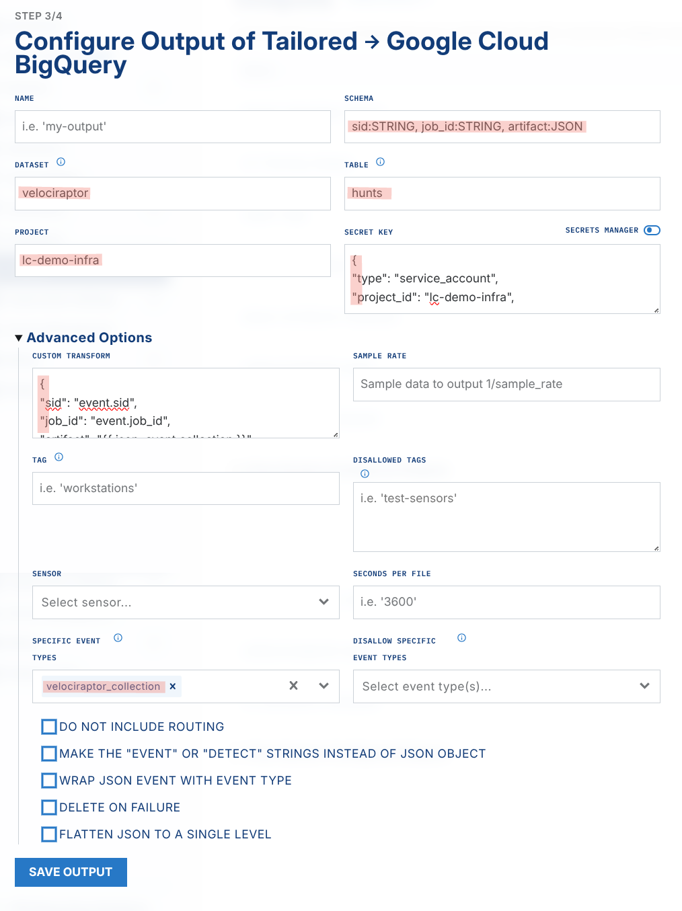

# Velociraptor to BigQuery

## Overview

The BigQuery output sends Velociraptor hunt results to a BigQuery table, where you can run SQL-like queries against the hunt data. This is similar to [Velociraptor notebooks](https://docs.velociraptor.app/docs/vql/notebooks/), and it lets you analyze hunts against very large datasets. To learn how to run Velociraptor hunts with LimaCharlie, see [Velociraptor Extension](../extensions/third-party/velociraptor.md).

You want to get the running processes from 10s, 100s, or 1000s of systems with Velociraptor. You can issue a `Windows.System.Pslist` hunt across these systems, and LimaCharlie pushes Velociraptor to the endpoints and collects the results. To run queries against all the data that the hunts return, you need a database tool. BigQuery is that tool.

A BigQuery dataset that contains Velociraptor hunt results:
.png)

### Prerequisites

1. **A Google Cloud project with billing enabled.** LimaCharlie writes to BigQuery with streaming inserts, which are not available in the free tier (BigQuery sandbox). If billing is not enabled on the project, the output fails with an error like this:

   ```text
   googleapi: Error 403: Access Denied: BigQuery BigQuery: Streaming insert is not allowed in the free tier, accessDenied
   ```

2. **The ability to create service account keys.** Some organizations enforce the `iam.disableServiceAccountKeyCreation` organization policy, which blocks the creation of JSON keys for service accounts. If the key creation fails with a policy error, an administrator must grant an exception for the project (Organization Policies > "Disable service account key creation"). You can also use a project that this policy does not control.

### Steps to Accomplish

1. Create a service account in your Google Cloud project

   1. Go to your project
   2. Go to IAM
   3. Go to Service Accounts > Create Service Account
   4. Click the new Service Account and create a new key

      1. .png)
      2. This gives you the secret key in JSON format. You configure this key later in your LimaCharlie output
   5. In BigQuery, create a Dataset, Table, & Schema like the screenshot below

      1. .png)
   6. Give the service account the **BigQuery Data Editor** role, on the project or on the new dataset

      1. The output needs the `bigquery.tables.get` permission to read the table schema, and `bigquery.tables.updateData` to stream rows in. Roles such as *BigQuery Data Viewer* or *BigQuery Job User* are **not** enough. Without *BigQuery Data Editor*, the output fails with an error like `Permission bigquery.tables.get denied on table <project>:<dataset>.<table> (or it may not exist)`
2. Create the LimaCharlie tailored output

   1. In the side navigation menu, click "Outputs" and add a new output

      1. **Output stream**: Tailored
      2. **Destination**: Google Cloud BigQuery

         1. **Name**: `bigquery-tailored`

            1. You can change this name, but it affects a later step, so note the output name
         2. **Dataset**: *the name that you gave your BQ dataset above*
         3. **Table**: *the name that you gave your BQ table above*

            1. The output streams rows directly into this table. The columns of the table that you defined above, for example `sid:STRING, job_id:STRING, artifact:JSON`, must match the fields from the Custom Transform below. BigQuery rejects rows with fields that do not exist as columns
         4. **Project**: *your GCP project **ID*** (for example `my-project-123456`, not the display name). You can find the ID on the GCP console dashboard or in the resource picker
         5. **Secret Key**: *give the JSON secret key for your GCP service account*
         6. **Advanced Options**

            1. **Custom Transform**: paste this JSON

               ```json
               {
               "sid": "event.sid",
               "job_id": "event.job_id",
               "artifact": "{{ json .event.collection }}"
               }
               ```

            2. **Specific Event Types**: `velociraptor_collection`
      3. 
3. Create a rule that watches for Velociraptor collections and sends them to the new tailored output

   1. Create a new D&R rule

      1. Detection

         ```yaml
         event: velociraptor_collection
         op: exists
         path: event/collection
         ```

      2. Response

         ```yaml
         - action: output
           name: bigquery-tailored # must match the output name you created earlier
         - action: report
           name: Velociraptor hunt sent to BigQuery
         ```

4. You can now send Velociraptor hunts to BigQuery

## Including the Hostname

The `velociraptor_collection` event identifies the endpoint only by its sensor ID (`sid`). The event does not contain the hostname. The extension delivers the event through its webhook adapter, so the `routing` metadata of the output identifies the adapter and not the endpoint. To get the hostname with your hunt results, include the built-in `Generic.Client.Info` artifact in your collections. Its `BasicInformation` source reports the `Hostname` and the `Fqdn` of the endpoint in the collection results.

For example, when you start a collection, use an artifact list like this:

```json
["Generic.Client.Info", "Windows.System.Pslist"]
```

You can then show the hostname in its own BigQuery column. First, add the column to your table (each field that the output sends must exist as a column, or BigQuery rejects the rows):

```sql
ALTER TABLE `velociraptor.hunts` ADD COLUMN hostname STRING
```

Then add a `hostname` field to the Custom Transform of the output. This field comes from the `Generic.Client.Info` results:

```json
{
"sid": "event.sid",
"job_id": "event.job_id",
"hostname": "event.collection.Generic_Client_Info.BasicInformation.0.Hostname",
"artifact": "{{ json .event.collection }}"
}
```

As an alternative, keep the schema and the transform, and extract the hostname from the `artifact` JSON column at query time:

```sql
SELECT
  sid,
  JSON_VALUE(artifact.Generic_Client_Info.BasicInformation[0].Hostname) as Hostname
FROM
  `lc-demo-infra.velociraptor.hunts`
```

## BigQuery Tips

### Query Examples

After the data arrives in BigQuery, it is in three columns: `sid`, `job_id`, and `artifact`. The `artifact` column contains the raw JSON of the hunt results from each sensor that returned results.

.png)

To split all results of a `Windows.System.Pslist` hunt so that each process from each system is in its own row, use this example notebook:

```sql
SELECT
  sid,
  json_extract_scalar(obj, '$.Name') as Name,
  json_extract_scalar(obj, '$.Exe') as Exe,
  json_extract_scalar(obj, '$.CommandLine') as CommandLine,
  json_extract_scalar(obj, '$.Authenticode.Trusted') as Authenticode,
  json_extract_scalar(obj, '$.Hash.SHA256') as SHA256,
  json_extract_scalar(obj, '$.Pid') as Pid,
  json_extract_scalar(obj, '$.Ppid') as Ppid,
  json_extract_scalar(obj, '$.Username') as Username
FROM
  `lc-demo-infra.velociraptor.hunts`,
  UNNEST(json_extract_array(artifact.Windows_System_Pslist)) as obj
LIMIT 1000
```

Replace `lc-demo-infra.velociraptor.hunts` with your own `project.dataset.table` names.

This query gives this view of the data
.png)

To do a stacking analysis that finds the rarest combinations of `Exe` and `CommandLine`, use this query:

```sql
SELECT
  json_extract_scalar(obj, '$.Exe') as Exe,
  json_extract_scalar(obj, '$.CommandLine') as CommandLine,
  COUNT(*) as Count
FROM
  `lc-demo-infra.velociraptor.hunts`,
  UNNEST(json_extract_array(artifact.Windows_System_Pslist)) as obj
GROUP BY
  Exe,
  CommandLine
ORDER BY
  Count ASC
```

This query gives this view of the data
.png)

To find only the processes that are `Authenticode` = `untrusted`, use a query such as this:

```sql
SELECT
  sid,
  json_extract_scalar(obj, '$.Name') as Name,
  json_extract_scalar(obj, '$.Exe') as Exe,
  json_extract_scalar(obj, '$.CommandLine') as CommandLine,
  json_extract_scalar(obj, '$.Authenticode.Trusted') as Authenticode,
  json_extract_scalar(obj, '$.Hash.SHA256') as SHA256,
  json_extract_scalar(obj, '$.Pid') as Pid,
  json_extract_scalar(obj, '$.Ppid') as Ppid,
  json_extract_scalar(obj, '$.Username') as Username
FROM
  `lc-demo-infra.velociraptor.hunts`,
  UNNEST(json_extract_array(artifact.Windows_System_Pslist)) as obj
WHERE
  json_extract_scalar(obj, '$.Authenticode.Trusted') = 'untrusted'
LIMIT 1000
```

### WHERE Filters for Specific Conditions

These are short examples of `WHERE` statements that do specific filtering.

#### String presence

This example checks for the string `mimikatz` at any position in `CommandLine`

```text
WHERE
  STRPOS(json_extract_scalar(obj, '$.CommandLine'), 'mimikatz') > 0 AND
```

#### Compare integers

This example checks for the integer `0` in the numeric field `GroupID`

```text
WHERE
  CAST(json_extract_scalar(obj, '$.GroupID') AS INT64) = 0
```

### Parsing Nested JSON Objects

In the `Windows.System.Pslist` examples above, some columns contain nested JSON, such as `Authenticode` and `Hash`. To expand these objects fully in the related column and row, write a query like this:

```sql
SELECT
  json_extract(obj, '$.Authenticode') as Authenticode, # json_extract to unpack nested json
  json_extract_scalar(obj, '$.Authenticode.Trusted') as Trusted,
  json_extract(obj, '$.Hash') as Hashes, # json_extract to unpack nested json
  json_extract_scalar(obj, '$.Hash.SHA256') as SHA256, # extract a specific field from the nested json
FROM
  `lc-demo-infra.velociraptor.hunts`,
  UNNEST(json_extract_array(artifact.Windows_System_Pslist)) as obj
LIMIT 1000
```

The output of this query is below:
.png)
