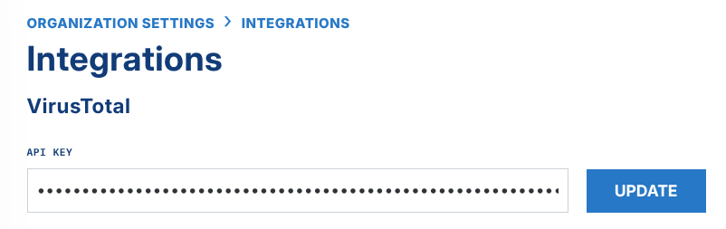

# VirusTotal Integration

You can integrate LimaCharlie with VirusTotal to improve your data enrichment and your detections. You need a VirusTotal API key to use this add-on.

VirusTotal Data Caching

The free tier of VirusTotal allows four lookups each minute through the API. LimaCharlie uses a global cache of VirusTotal requests. The cache can reduce your costs when you make many VirusTotal requests. LimaCharlie keeps VirusTotal requests in the cache for 3 days.

After you get your VirusTotal API key, add the key in the Organization integrations section of the LimaCharlie web app.



After you enter the API key, create a D&R rule that does a lookup of a hash. The rule below matches when at least two VirusTotal engines report a hit on a hash.

```yaml
path: event/HASH
op: lookup
resource: hive://lookup/vt
event: CODE_IDENTITY
metadata_rules:
  path: /
  value: 2
  length of: true
  op: is greater than
```
