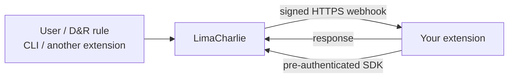

# Building Extensions

An Extension is a small HTTPS service that LimaCharlie calls over webhooks. You host it and own the code; LimaCharlie handles multi-tenancy, credentials, configuration storage and the user interface.

Feel free to reach out on the [community forum](https://community.limacharlie.com/) if you get stuck.

## Why Extensions?

- **Multi-tenancy** — organizations subscribe to your extension, and the same code serves all of them.
- **Credentials handling** — you never store organization credentials. Every callback arrives with a LimaCharlie SDK already authenticated for the relevant organization, scoped to the permissions your extension declared. Third-party credentials are handled through [secrets](schema-data-types.md#secrets), which are resolved into the request for you.
- **Configuration** — LimaCharlie stores a configuration object per organization and asks you to validate changes.
- **User interface** — the schema your extension advertises is rendered into a working UI automatically. You can build your own instead, but you do not have to.

## How It Works



Your service needs to be reachable over HTTPS with a certificate chaining to a public root CA. Anything that can serve HTTP works — Google Cloud Run, Cloud Functions, AWS Lambda, ECS, or your own hardware. We recommend a managed, highly available platform.

The full set of guarantees — timeouts, retries, size limits, signing — is in the [Runtime Contract](runtime-contract.md).

### Public and Private Extensions

Anyone can build an extension. Private extensions require the owner to hold the `billing.ctrl` and `user.ctrl` permissions on an organization in order to subscribe it.

To make an extension public, and optionally monetize it, contact `answers@limacharlie.io`. Once public, it is visible to and subscribable by everyone.

## Install

=== "Go"

    ```bash
    go get github.com/refractionPOINT/lc-extension
    ```

=== "Python"

    ```bash
    pip install lcextension
    ```

The Go SDK is the more complete of the two and is what the examples here use; see the [Python notes](schema-data-types.md#language-references) for the current gaps.

## A Complete Extension

This is a working extension. It exposes one user-facing action that lists sensors matching a selector, stores a small configuration, and reports a billing metric per call.

```go title="main.go"
--8<-- "snippets/golang/extension_basic/main.go"
```

Points worth noticing, because each corresponds to something that bites people later:

- **`buildExtension` is a function.** That is what lets tests construct the same extension the server runs. See [Testing](testing.md).
- **`ErrorHandler` is set.** The Go framework calls it without a nil check — including when a request arrives with a bad signature — so an extension that leaves it unset panics on the first malformed request it receives.
- **The request struct field names match the schema parameter names.** The framework unmarshals request data into a copy of `RequestStruct` using the JSON tags; a mismatch produces a zero value rather than an error.
- **`params.Org` is already authenticated.** No credential handling, no key storage.
- **Permanent errors are marked non-retriable.** Otherwise the platform retries them three times with backoff.
- **Event handlers are what subscribe you to events.** In Go, the advertised event list comes from the `EventHandlers` map, not from the `RequiredEvents` field.

## Registering the Extension

Create the definition from [your published add-ons page](https://app.limacharlie.io/add-ons/published).

| Field | Meaning |
| --- | --- |
| **Destination URL** | The HTTPS URL your extension is reachable at |
| **Shared Secret** | Used to sign webhooks so your extension can verify they came from LimaCharlie. Make it random and at least 32 characters |
| **Permissions** | What your extension may do in each subscribed organization. Use as few as possible |
| **Required Extensions** | Other extensions yours depends on. Users are prompted to subscribe to them |
| **Extension Flairs** | Modifiers, described below |

Once registered, LimaCharlie fetches your schema. Subscribe an organization to it and you will receive a `subscribe` event; from then on that organization can interact with the extension.

!!! note "Heartbeats"
    The protocol defines a heartbeat message, and both SDKs answer it, but LimaCharlie does not currently send heartbeats on a schedule. Do not rely on them as a liveness signal or as a way to keep a serverless instance warm.

### Flairs

The `segment` flair isolates your extension's resources so it can only see and modify the things it created — rules, configurations and so on. It is the right default for most extensions, and you should leave it on unless you specifically need to read or modify resources your extension did not create.

The `bulk` flair marks an extension as expecting a high volume of API calls. Note that extension API keys already receive the platform's highest request quota by virtue of being extension keys, so setting this flair does not currently change the quota an extension gets.

## The Schema

The schema describes your configuration and your actions. It drives the generated UI, and the platform enforces it before your extension is called — unknown parameters are rejected, types are checked, defaults are applied and secrets are resolved.

```json
{
  "config_schema": {
    "fields": { },
    "requirements": null
  },
  "request_schema": {
    "dir_list": {
      "is_impersonated": false,
      "is_user_facing": false,
      "short_description": "directory listing",
      "long_description": "directory listing",
      "parameters": {
        "fields": { },
        "requirements": null
      }
    },
    "refresh": {
      "is_impersonated": false,
      "is_user_facing": true,
      "short_description": "refresh data",
      "long_description": "refresh data",
      "parameters": {
        "fields": { },
        "requirements": null
      }
    }
  },
  "required_events": [
    "subscribe",
    "unsubscribe"
  ]
}
```

When starting out, use the simplest data type that fits each field — `string`, `bool`, `json` — and get the whole thing working end to end. Refine the types afterwards so the UI adapts. Full details are in [Schema & Data Types](schema-data-types.md).

### Config Schema

An optional description of the extension's configuration, stored per organization as a Hive record in `extension_configuration`. Not every extension needs one.

### Request Schema

A map of action name to definition. The important fields:

- **`is_user_facing`** — whether the action appears in the UI. It does not restrict access: an action that is not user-facing is still callable through the API, from a D&R rule, and as a `supported_action`. Use it to hide actions your extension calls on itself.
- **`is_impersonated`** — whether the action runs as the calling user rather than as the extension. See [impersonation](runtime-contract.md#impersonation).
- **`parameters`** — the fields the action accepts.
- **`short_description`**, **`long_description`**, **`label`** — how the action is presented.
- **`messages`** — `in_progress`, `success` and `error` text shown to the user.
- **`response`** — an optional description of what the action returns. Skip it until you are refining the UI.

## Callbacks

**Configuration validation** — called when a user changes the configuration. Return an error to reject the change. This is the only guard users have against a broken configuration, so validate properly rather than accepting everything.

**Events** — platform-generated occurrences: `subscribe`, `unsubscribe`, and `update` (once every 24 hours, per organization). `update` is where extensions reconcile the resources they manage.

**Requests** — the actions users, D&R rules and other extensions invoke. One callback per action.

## Testing

Both halves of an extension can be simulated locally — the platform calling in, and the LimaCharlie API being called out to — so a full lifecycle runs as a unit test with no cloud resources. See [Testing Extensions](testing.md).

## Simplified Frameworks

For common shapes of extension, the Go SDK provides [ready-made frameworks](https://github.com/refractionPOINT/lc-extension/tree/master/simplified) that leave you only the interesting part to write.

### D&R Rules

`dr.go` packages D&R rules as an extension, making it easy to distribute and update rules across many organizations. Implement `GetRules()`, returning `map[namespace]map[ruleName]RuleInfo`; the framework handles subscription, recurring updates and cleanup. It also gives users a configuration for disabling new rules by default and for a global suppression period.

### Lookups

The same idea for Lookups. See the [example](https://github.com/refractionPOINT/lc-extension/blob/master/examples/lookup/main.go).

### CLI

`cli.go` wraps third-party command line tools so they can be driven from LimaCharlie, which is often the fastest way to bring bi-directionality to an integration. Register one or more tools with a handler, a credentials format and an example command, and the framework builds the schema, the UI and the execution plumbing around them.

## Scaling Beyond One Service

For extensions that need isolation between organizations, the [Cloud Run multiplexer](https://github.com/refractionPOINT/lc-extension/tree/master/multiplexer) is itself an extension that provisions a dedicated Cloud Run service per subscribed organization and proxies webhooks to it.

## Next Steps

- [Schema & Data Types](schema-data-types.md) — what the platform enforces, and every data type
- [Building the User Interface](building-ui.md) — layouts and field presentation
- [Testing Extensions](testing.md) — the simulator and mock API
- [Runtime Contract](runtime-contract.md) — timeouts, retries, continuations, metrics, troubleshooting
