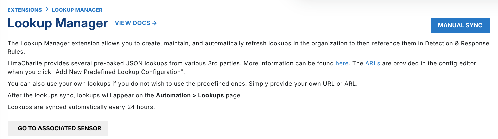
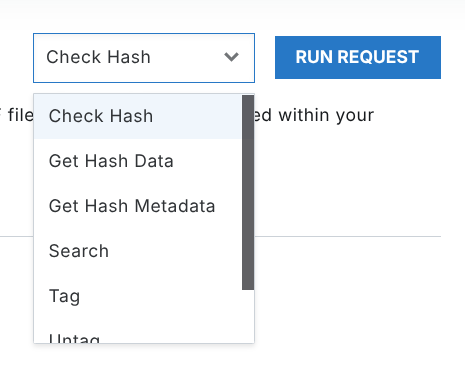
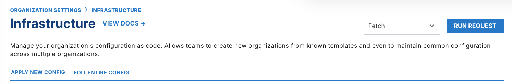

# Building the User Interface

## Auto Generated UI

The Extensions UI uses the information in the schema to determine its UI elements. For most simple extensions, the minimum schema definition is enough. For more complex or specific use cases, you can customize the schema. Adjust the layout, or adjust the details of a specific field.

### Deconstructing the Page

The top of the extension page shows the extension label and its short description. If an "associated sensor" exists for the extension, the page also shows a button for quick access to that sensor.

In the top right, the page shows the actions from your request schema as a dropdown and a button.

This structure has small changes for each layout that you select, but each variation stays close to the general page structure.
 The layout determines the main content of the page.

### Picking Your Layout Type

- `auto` (default layout, it picks one of the layouts below)
- `config` (use this if you have a configuration)
- `editor` (a specific use case, to edit large code blocks such as yaml)
- `action` (use this to prioritize certain actions in the UI)
- `description`
- `key` (a variation of description)

For the action and editor layouts, make sure that you also define one or more default actions. For the action layout, the editor UI shows all the actions in the page, and not as a button in the top right. For the editor layout, the UI runs the default action and shows the results and a supported action.

### Form Data Types

Each field has these optional details to adjust the UI.

- **label**: Add a label to give this field a more 'human-legible' name
- **placeholder**: Placeholder text in the input gives the user an example
- **description**: Add a description for this field. The UI shows it as a tooltip next to the field label
- **display\_index**: The display index starts at 1, not 0, and tells the GUI the order to show the fields. A field with display index 1 shows before a field with display index 2.
- **default\_value**: A default value for the field. The UI fills the field with this value

Other configurations apply only to specific data\_types:

- **filter**: Available on select primitive data\_types.
- **enum\_values**: Details on the available enums, to support the enum data type.
- **complex\_enum\_values**: Details to support the complex enum data type. Supports reference links, and categories.
- **object**: An object that contains nested key-value pairs for more fields. It gives the details of the nested fields.

For the complete list of data types, see the [page on data types](schema-data-types.md).

## Nuanced Usage

If your extension needs it, you can adjust the UI more, to guide the user and to help the user work with your extension.

### Multiple Layouts as Tabs

In the schema, you can define several views that use a combination of layout types. Use several views to guide the user on how to use your extension.

### Setting Supported Actions

The functionality of this field will expand in the future

To stay up to date, ask a question on the [community forum](https://community.limacharlie.com/)

Supported actions are tied to the response of a request (also called an "action"). They let you change the response data and pass it to a follow-up action. Use them for a dry run, or to trigger a workflow.
