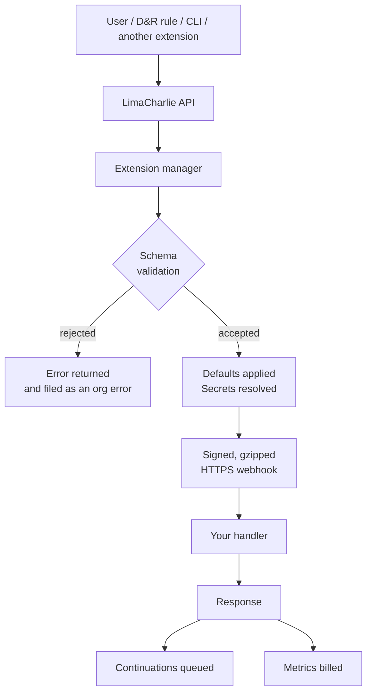

# Runtime Contract

This page describes what the LimaCharlie platform guarantees when it calls your extension, and what it expects back. None of it is optional reading once your extension is handling real traffic: the timeouts, retry behaviour and size limits here are what decide whether a slow or failing extension degrades gracefully or produces duplicate work.

## Request Lifecycle

Every call into an extension follows the same path, whether it was triggered by a user in the web app, a D&R rule, the CLI, or another extension.



The important consequence is in the middle: **a request that fails schema validation never reaches your code.** If your handler is not being called, look at the schema before you look at your handler. See [Schema & Data Types](schema-data-types.md) for exactly what is enforced.

## Transport

| Property | Value |
| --- | --- |
| Protocol | HTTPS only, with a certificate chaining to a public root CA |
| Method | `POST` |
| Body | JSON, always gzip-compressed (`Content-Encoding: gzip`) |
| Signature header | `lc-ext-sig` |
| Signature algorithm | HMAC-SHA256 of the raw request body, keyed with your shared secret, hex-encoded |
| Protocol version | `20221218` |

The protocol also defines a heartbeat message, which both SDKs answer automatically. LimaCharlie does not currently send heartbeats on a schedule, so an extension should not treat them as a liveness check.

A request arriving without an `lc-ext-sig` header is not from LimaCharlie. The SDKs verify the signature for you and return `401` on a mismatch; if you are implementing the protocol yourself, compare using a constant-time function.

Because the body is always compressed, a handler written against a framework that does not decompress transparently will see gzip bytes rather than JSON. Both the Go and Python SDKs handle this.

## Timeouts and Retries

| Property | Value |
| --- | --- |
| Webhook timeout | 2 minutes |
| Retry attempts | 3, including the initial attempt |
| Initial retry delay | 1 second |
| Maximum retry delay | 15 seconds |
| Backoff | Exponential, multiplier 2.0, with ±20% jitter |
| Maximum response body | 100 MB |

Two minutes is a hard ceiling on a single call. Work that can exceed it must be broken up with [continuations](#continuations) rather than left to run long, because a timed-out call is retried and your extension will start the same work again.

### Making retries work for you

The platform retries on a `5xx` and stops on a `4xx`. Your extension controls which it gets, through the `retriable` field on the response:

- **Omitted (the default)** — treated as retriable, returned as HTTP 500. Chosen for backwards compatibility; it is the wrong default for most permanent failures.
- **`true`** — retriable, HTTP 500.
- **`false`** — permanent, HTTP 400. The platform gives up after this attempt.

Mark anything a retry cannot fix as permanent: invalid configuration, malformed input, a rejected credential. Leaving those retriable means every such failure is attempted three times, with backoff, before it settles — and any partial work your handler did is repeated.

```go
// Permanent: retrying will not help.
notRetriable := false
return common.Response{Error: "api_key is not valid", Retriable: &notRetriable}

// Retriable: a transient upstream failure.
return common.Response{Error: "vendor API timed out"}
```

Because retries exist, **handlers must be idempotent.** Every message carries an `idempotency_key` that is stable across the retries of a single logical call; use it to deduplicate work that must not happen twice.

### Where failures surface

A failed call is filed against the organization and appears in the org errors API — for many users this is the first and only place they will see that something is wrong. This includes requests rejected at schema validation, which never reach your extension at all. Errors are debounced, so a request failing on a daily schedule produces one entry rather than one per attempt.

Your extension can also be told about errors the platform encountered on its behalf, through the error callback. In the Go SDK this callback is called without a nil check on several paths, including an invalid signature, so **an extension that does not set it will panic on the first malformed request it receives.** Always set it.

## Continuations

A continuation asks the platform to call your extension again shortly, with state you choose. It is the supported way to do work that does not fit in one webhook call: pagination, polling an external job, or fanning out across many sensors.

```go
return common.Response{
    Data: limacharlie.Dict{"status": "scanning"},
    Continuations: []common.ContinuationRequest{
        {
            InDelaySeconds: 30,
            Action:         "check_results",
            State:          limacharlie.Dict{"scan_id": "abc-123", "page": 2},
        },
    },
}
```

The continuation arrives as an ordinary request for the named action, with `State` as its request data. Its idempotency key is derived from the parent's, in the form `parentKey:level`.

| Limit | Value | Behaviour when exceeded |
| --- | --- | --- |
| Maximum delay | 300 seconds | Clamped to 300, and an error is reported |
| Maximum chain depth | 100 levels | Chain is stopped and an error is reported |
| Maximum per response | 100 | Truncated to 100, and an error is reported |
| Duplicate suppression | 2 hours | Repeat publishes of the same continuation are dropped |

Depth is the constraint to design around: one level is one resume, so a paginating extension that handles 100 records per call advances at most 10,000 records per chain. Size your pages accordingly, or drive the work from a recurring `update` event instead of one very long chain.

Note that the continuation action does not have to be user-facing. Set `is_user_facing: false` on actions that exist only to resume the extension's own work, and they will stay out of the UI while remaining callable.

## Metrics and Billing

An extension reports usage by attaching a metric report to any response. This is the mechanism behind extension monetization.

```go
return common.Response{
    Data: result,
    Metrics: &common.MetricReport{
        IdempotentKey: params.IdempotentKey,
        Metrics: []common.Metric{
            {Sku: "scans", Value: 1},
            {Sku: "bytes_scanned", Value: 4096},
        },
    },
}
```

| Rule | Detail |
| --- | --- |
| SKU namespacing | Recorded as `<extension-name>:<sku>`; you cannot collide with another extension |
| Maximum SKUs per response | 10. A larger report is discarded entirely and an error is reported |
| Negative values | Skipped; the remaining SKUs are still recorded and an error is reported |
| Deduplication | On `IdempotentKey`. Pass the one from the incoming request so a retried call is not billed twice |

Passing the request's idempotency key through is what makes billing safe under retries. Generating a fresh key per response bills every retry of the same call.

## Events

Events are generated by the platform, not by users.

| Event | When |
| --- | --- |
| `subscribe` | An organization subscribes to the extension |
| `unsubscribe` | An organization unsubscribes |
| `update` | Once every 24 hours, per subscribed organization |

`update` is the maintenance hook: it is where extensions that manage D&R rules, lookups or other org resources reconcile them. The platform only sends it to extensions that advertise it, and caches that decision for an hour — so adding the handler to an already-registered extension can take that long to take effect.

!!! warning "Registering an event handler is what subscribes you to the event"
    In the Go SDK, the `RequiredEvents` field on `core.Extension` is **not** what the platform is told. The framework answers the schema request with the keys of the `EventHandlers` map. Adding a handler subscribes you; setting `RequiredEvents` without a handler does nothing. The Python SDK does honour its `requiredEvents` field.

## Pushing Telemetry into an Organization

Callbacks let an organization talk to your extension. The reverse — your extension writing events into an organization's telemetry, where they can be searched, matched by D&R rules, and retained — is done with an extension adapter.

`CreateExtensionAdapter` provisions a webhook cloud sensor and an installation key in the organization, both tagged `lc:system` and with your extension's private tag. `SendToWebhookAdapter` then sends events to it. Create the adapter on `subscribe`, delete it on `unsubscribe`.

This is how an extension that integrates a third-party product gets that product's data into LimaCharlie as first-class telemetry, rather than only returning it in a response body.

## Calling an Extension

Once registered and subscribed, an extension can be invoked from several places.

=== "CLI"

    ```bash
    limacharlie extension request \
      --name my-extension \
      --action list_sensors \
      --data '{"selector": "*"}' \
      --oid <oid> --output yaml
    ```

    Related commands: `limacharlie extension list`, `extension list-available`, `extension schema --name <name>`, `extension subscribe`, `extension unsubscribe`, `extension config-get`, `extension config-set`.

=== "D&R rule"

    ```yaml
    - action: extension request
      extension name: my-extension
      extension action: list_sensors
      extension request:
        selector: '*'
    ```

    See [D&R response actions](../../3-detection-response/tutorials/dr-rule-building-guidebook.md) for the full syntax, including templating request values from the matched event.

Requests made this way go through the same validation, and are billed and retried the same way as requests made from the web app.

## Impersonation

`is_impersonated` decides whose authority an action runs with.

- **`false` (the default)** — the request runs as the extension, using the permissions declared in the extension definition. The extension can do anything it was granted, regardless of who asked.
- **`true`** — the request carries the calling user's JWT, and the extension acts as that user. The extension manager checks the token is present and valid, but does not check its permissions; enforcement happens when the SDK call is actually made.

Use impersonation for actions that should respect the caller's own access, and leave it off for automation that must work without a user present — including anything triggered by a D&R rule or a continuation.

## Troubleshooting

Error messages you may see, and what causes them.

| Message | Cause |
| --- | --- |
| `unknown parameter name: X` | Request included a field the action's schema does not declare. Extra fields are rejected, not ignored |
| `missing one of X, Y` | A `requirements` set was not satisfied |
| `unknown datatype: X` | The schema declares a `data_type` the platform does not validate. See [Schema & Data Types](schema-data-types.md#unsupported-data-types) |
| `invalid value for X: not a string, a float64` | Value type did not match the declared `data_type` |
| `unknown request action: X` | The action is not in the schema the extension advertised. The schema is cached for a minute after a change |
| `unknown event: X` | The platform sent an event with no registered handler |
| `invalid signature` | Shared secret mismatch between the extension definition and the running service |
| `max continuation level reached` | A continuation chain exceeded 100 levels |
| `continuation count N exceeds max 100` | A single response requested more than 100 continuations |
| `too many metrics` | More than 10 SKUs in one metric report |
| `response body size N exceeds limit` | Response exceeded 100 MB |
| `failed initializing sdk` | The JWT in the message could not be used to build an SDK client |

If an extension appears not to be called at all, check in this order: the schema request succeeds (`limacharlie extension schema --name <name>`), the organization is subscribed, the action name matches, and the parameters satisfy the schema.
