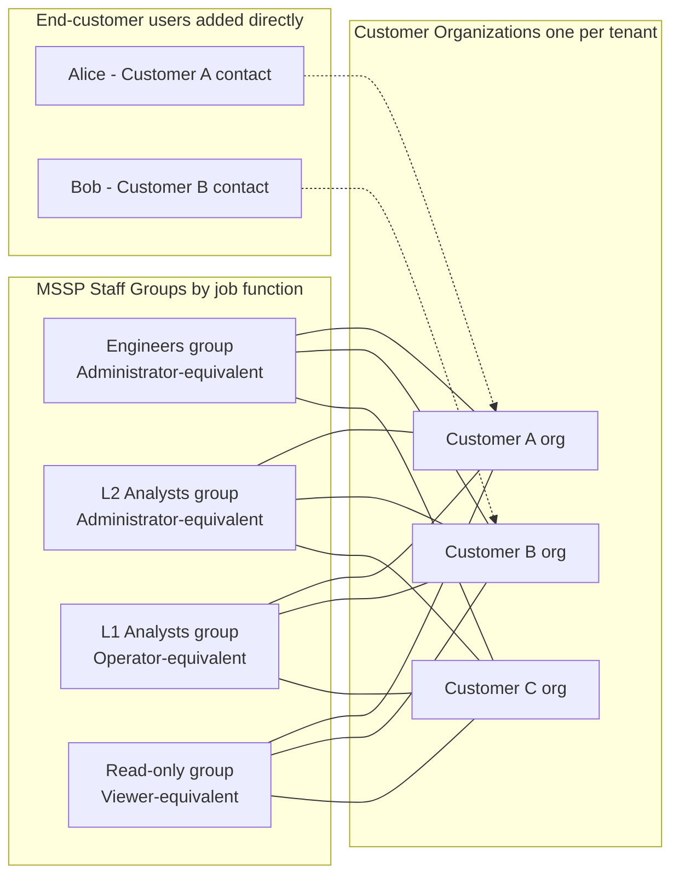

# Designing Access for Multi-Org Deployments

This guide is for administrators who operate more than one organization. These administrators are usually MSSPs, MDRs, or enterprises with many business units. They must give access to two different groups of people:

- **Internal staff** (analysts, engineers, managers) who need access to *many* organizations.
- **End customers** (or business-unit owners) who must see only their *own* organization.

[User Access](user-access.md) documents how to grant and check access. This page describes the architectural decisions that you make *before* you add the first user. These decisions keep the access model safe and manageable when you grow from one customer to fifty.

## Building blocks

Three LimaCharlie primitives make every access model:

| Primitive | Scope | Typical use |
| --- | --- | --- |
| **Organization** | Single tenant (isolated data, sensors, billing) | One for each customer or business unit |
| **Direct user** | One user ↔ one organization | A user who must see only that one org, for example an end-customer contact |
| **Organization Group** | Set of orgs × set of users × set of permissions | A bundle for one job function. Each user in the group gets the same permissions on each org in the group |

These primitives support the model:

- **Predefined roles** (`Owner`, `Administrator`, `Operator`, `Viewer`, `Basic`) — apply a full permission preset in one step. See [Reference: Permissions](../../8-reference/permissions.md).
- **Organization API keys** — machine access, scoped to a set of permissions on one org. See [API Keys](api-keys.md).
- **SSO / Strict SSO** — force users on your domain to authenticate through your IdP only. See [SSO](sso.md).
- **Group owners vs. group members** — owners manage a group. They add users, add orgs, and change permissions, but the group's permissions do **not** apply to them. Members get the permissions but cannot change the group.

## Recommended architecture for an MSSP

This pattern scales from two customers to several hundred, and you do not need to restructure it. Use it as the starting point and change it for your needs.

Three rules keep this architecture coherent:

1. **Use one organization for each customer tenant.** An organization contains its own data, sensors, billing, and configuration. A customer *is* an organization. Do not mix customers in one org.
2. **Give your staff access through Organization Groups, by job function.** Do not add internal staff directly to a customer org. Direct access does not scale, and the permissions drift over time.
3. **Give your customers access directly on their own organization.** Do not add an end-customer user to a group that contains more than one customer org. Groups are additive, and such a group gives the user access to data that the user must not see.

### Optional: an internal "management" organization

Many MSSPs also create an organization for internal use only. It holds templates, the IaC source of truth, and demo or training work. It is not a customer tenant. You can include it in a staff group, but do **not** enrol customer users in it.

## Granting access to your internal staff

Design the groups around job functions, not around customers. This table shows a typical starting set. The last column is the permission level that each group grants. Use the same permission levels as the predefined roles for direct users. The model is then easier to understand.

| Group | Members | Permission level |
| --- | --- | --- |
| `engineers` | Detection engineers, platform admins | Administrator-equivalent |
| `analysts-l2` | Senior analysts, IR leads | Administrator-equivalent |
| `analysts-l1` | Front-line SOC | Operator-equivalent |
| `read-only` | Leadership, auditors | Viewer-equivalent |

Workflow after the groups exist:

1. **Create each group one time.** `limacharlie group create --name <name>`, or use the **Groups** page.
2. **Add every customer org** to each relevant group. `limacharlie group org-add --gid <id> --oid <customer_oid>`.
3. **Set the group's permissions.** In the **Groups** page of the web app, select the permissions for the intended permission level. With the CLI, give the full permission list: `limacharlie group permissions-set --gid <id> --permissions 'sensor.list,sensor.get,dr.list,...'`. The group CLI accepts a raw permission list only. It has no role-preset flag, unlike `limacharlie user permissions set-role` for direct users. Keep the list the same as the direct-user role with the same name. The effective permissions are then easier to understand.
4. **Add a user only to the groups that match their job.** `limacharlie group member-add --gid <id> --email <address>`.
5. **When you onboard a new customer, add the new org to each staff group** (step 2). Each staff member then gets the correct level of access on the new tenant, with no work for each user.

### Separating production from non-production

A common refinement is to split a sensitive group, for example `engineers`, into two groups:

- `engineers-nonprod` — includes sandbox, demo, and pre-prod customer orgs.
- `engineers-prod` — includes live customer orgs. It is limited to senior staff who accepted your change-control process for production.

Membership in `engineers-prod` is then the formal control for access to production. It is also easy to audit: `limacharlie group get --id <engineers-prod>` lists the members, the orgs, and the permissions in one response.

## Granting access to your end customers

End customers must stay inside their own organization. The safe pattern is always the same:

1. **Add the customer's email directly to their own org only.** `limacharlie --oid <customer_oid> user invite --email <address>`, or use the **Users** page of that org.
2. **Assign a predefined role** that matches your service agreement. `limacharlie --oid <customer_oid> user permissions set-role --email <address> --role Viewer` (or `Operator`, `Administrator`, etc.).
3. **Do not add customer users to a staff Organization Group.** A group that contains the orgs of other customers gives the user access to the data of those other customers.

!!! warning "Groups are additive only"
    A group **adds** its permissions to the user's direct permissions on each organization in the group. A group cannot *reduce* or *restrict* what a user can see. Read "membership in a group" as "give every permission in that group, on every org in that group."

A customer can have more than one of their own organizations, for example one org for each business unit. To give the customer access to all of them, use one of two options:

- **Direct users on each org.** This option is easy to audit, and it works well if the customer has few orgs.
- **A customer-specific Organization Group** that contains *only* that customer's orgs and *only* that customer's users. Do not mix tenants in one group.

## Hardening

These controls reduce the risk of a mistake in access control:

- **Strict SSO Enforcement on your own domain.** This control forces each user who authenticates as `@yourcompany.com` to go through your identity provider. When you offboard the user in your IdP, the user loses access to LimaCharlie immediately. See [Strict SSO Enforcement](sso.md#strict-sso-enforcement).
- **Organization API keys instead of user API keys.** An Organization API key is scoped to one organization and to the minimum permissions that the integration needs. A User API key gives the same access as the user, in *every* organization that the user can reach. Use User API keys for interactive work only, never for production automation. See [User API Keys](api-keys.md#user-api-keys).
- **Separate group owners from members.** An engineering manager can be an *owner* of a staff group and add or remove members, but not be a member. The manager can then manage access without access to customer data. This is a separation-of-duties control.
- **Review access at regular intervals.** The companion section [Verifying and Reviewing Access](user-access.md#verifying-and-reviewing-access) shows how to list every user, group, and effective permission on an organization. It also shows how to get the audit trail of access changes.

## New-customer onboarding checklist

After the architecture above is in place, you add a new customer with a short, repeatable list of steps:

1. **Create the customer's organization.** The user who creates the org gets the `Owner` role on it.
2. **Grant `Owner` to a shared internal account also.** Administrative access must not depend on the personal account of the creator. `limacharlie --oid <customer_oid> user permissions set-role --email <shared-account> --role Owner`. A full transfer of billing and legal ownership is a separate support request. See [Can I Transfer Ownership of an Organization?](../../8-reference/faq/account-management.md#can-i-transfer-ownership-of-an-organization).
3. **Add the new org to each staff Organization Group** that must cover it, for example `engineers-prod`, `analysts-l1`, and `read-only`. Staff access is then complete, with no work for each user.
4. **Invite the designated contacts of the customer directly on the new org.** Give them a predefined role. Do not add them to a group.
5. **Configure the rest of the tenant**: installation keys, adapters, D&R rules, and outputs. You can build this configuration from Infrastructure-as-Code templates. See [Infrastructure Extension](../../5-integrations/extensions/limacharlie/infrastructure.md).
6. **Run the [verification checklist](user-access.md#suggested-validation-checklist-for-a-new-production-organization)** before the tenant goes live.

## Anti-patterns to avoid

| Anti-pattern | Why it breaks | What to do instead |
| --- | --- | --- |
| Adding staff directly to each customer org | Does not scale. The permissions drift and become different in each org | Give staff access only through Organization Groups, by job function |
| Putting customer users in a multi-tenant group | Groups are additive. The user then sees every other org in the group | Direct users on the customer's own org only |
| One huge "everyone" staff group with every permission | No separation of duties, and no control for production access | Split groups by role (`Viewer`, `Operator`, `Administrator`) and by scope of impact (`nonprod` and `prod`) |
| Using a user API key for an integration | Gives access to every org that the user can reach. The integration fails when the user leaves | Organization API key scoped to the minimum permissions on that single org |
| Hand-picking permissions for every user | Hard to audit. The permissions drift | Use predefined roles (`set-role`) and change the permissions only when no role fits |

---

## Related

- [User Access](user-access.md) — how to add users and groups, and how to check access.
- [Reference: Permissions](../../8-reference/permissions.md) — full permission catalogue and predefined roles.
- [API Keys](api-keys.md) — machine access, Organization API keys and User API keys.
- [SSO](sso.md) — federated authentication and strict SSO enforcement.
- [Security Service Providers (MSSP, MSP, MDR)](../../1-getting-started/use-cases/mssp-msp-mdr.md) — wider MSSP platform use cases.
