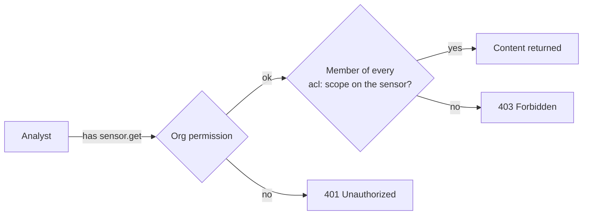

# Resource ACLs

Organization permissions answer "what may this user do?". Resource ACLs answer a
second question: "which sensors and configurations may they do it *to*?"

A resource ACL restricts the **content** of specific sensors and configuration
records to a named group of people, API keys or groups — while everything else
in the organization continues to work exactly as before. The usual reason to
reach for one is a feed that contains data most of the organization should not
read: a mail-security adapter carrying message bodies, an HR endpoint fleet, a
customer environment covered by a separate agreement.

!!! info "Nothing is restricted until you restrict it"
    No LimaCharlie product applies a resource ACL on your behalf. An
    organization that has never tagged a resource behaves precisely as it did
    before this feature existed. You opt in, resource by resource.

## How it works

Two pieces, and both are things you already know how to edit.

**A scope tag** marks a resource as restricted. It is an ordinary tag in a
reserved namespace: `acl:` followed by a scope name, for example
`acl:mailsec`. You put it on sensors, on installation keys, and on
configuration records in the Config Hive.

**A scope record** says who holds that scope. It is a record in the `acl` hive,
named after the scope, listing its members.

A caller may read a restricted resource's content when they pass the normal
permission check for that operation **and** they are a member of every scope the
resource carries.



Two consequences worth internalising before you start:

- **A resource ACL can only take access away, never grant it.** Adding someone
  to a scope does not give them any permission they did not already have. The
  organization permission check runs first, every time.
- **Scope tags combine with AND.** A sensor tagged both `acl:hr` and
  `acl:legal` is readable only by someone who holds *both* scopes.

## What is restricted, and what stays visible

Resource ACLs gate **content**. They do not hide the existence of anything, so
fleet lists, counts and dashboards stay whole and nothing silently vanishes from
a page.

| Everyone with the usual permissions still sees | Only scope members see |
| --- | --- |
| That the sensor exists: hostname, platform, tags, online status, last seen | The sensor's telemetry — timeline, historical events, search and replay results |
| That a configuration record exists: its name, tags, comment, enabled state, expiry | The configuration record's contents |
| Organization-wide counts, dashboards and tag search | Detections from the sensor |
| That an output exists | Artifacts and original logs from the sensor |
| Metadata about an artifact, including which sensor produced it | The ability to task the sensor |

Two of these deserve a plain warning.

!!! warning "Detections from a restricted sensor are hidden, not redacted"
    A non-member does not see a placeholder — the detection is absent from
    listings, from single-detection lookups, from investigations and from
    exports. Per-user detection counts therefore reflect what that user can
    see, and two people can legitimately see different totals for the same
    query.

!!! warning "Tasking a restricted sensor is refused entirely"
    Scope membership is checked per sensor, not per command. On a sensor whose
    scope you do not hold, every command is refused — including harmless ones
    like `os_version`.

## Permissions

| Permission | Grants |
| --- | --- |
| `acl.set` | Create, edit and delete scope records, **and** add or remove any `acl:` tag on any resource |
| `acl.get` | Read scope records and list what a scope covers |

`acl.set` and `acl.get` are both included in the **Owner** and
**Administrator** predefined roles. Operator, Viewer and Basic get neither.
Either can also be granted individually to a user or an API key.

Unlike most Config Hive permissions, these do **not** support a per-record form:
`acl.set.mailsec` does not let someone edit `hive://acl/mailsec`. That is
deliberate — a per-record variant would let a holder grant themselves a scope
without ever holding `acl.set`.

!!! warning "`acl.set` is equivalent to seeing everything"
    Anyone holding `acl.set` can add themselves to any scope, so treat it as
    confidentiality-equivalent to unrestricted read access. That is the intended
    shape — one admin-tier "manage ACLs" permission rather than a permission per
    resource — but it means `acl.set` belongs only with your Owners and
    Administrators. Note the flip side: `acl.set` grants no *implicit* read
    access. An administrator who has not added themselves to a scope sees
    nothing inside it, and adding themselves is a recorded configuration change.

## Setting up a scope

The example below restricts a mail-security feed to a small team. It uses the
CLI; every step has a REST equivalent, and the web app has an **ACL Scopes**
page under Access Management that does the same thing with a member picker and
an "applies to" view of everything carrying the tag. If you do not see that page,
the feature is not yet enabled for your organization — contact support.

### 1. Create the scope record

Write the member list to a file:

```yaml
# mailsec-scope.yaml
members:
  - type: user
    id: 8f2c14b6-1d0e-4b7a-9f33-6c5e0a1d2b44
  - type: user
    id: alice@example.com
  - type: api_key
    id: mailsec-integration
  - type: group
    id: 41d0e2c1-7b8a-4c1f-9e60-2a3b4c5d6e7f
```

Then create it:

```bash
limacharlie hive set --hive-name acl --key mailsec \
    --input-file mailsec-scope.yaml --enabled \
    --comment "Mail security team" --oid <oid>
```

!!! warning "Pass `--enabled` whenever you pass any other metadata flag"
    A disabled scope record resolves to *no members*, which locks every
    resource tagged with it rather than unlocking them. The same is true of an
    expired record.

    A scope record created with **no** metadata flags at all is enabled by
    default. But as soon as you add `--comment`, `--expiry`, `--tag-add` or
    `--tag-rm`, the CLI sends a metadata block, and an omitted `enabled` in that
    block means *disabled*. The command above passes `--comment`, so it must
    also pass `--enabled` — as it does. See
    [Disabling and deleting scopes](#disabling-and-deleting-scopes).

Scope names must be lowercase, and may not contain spaces, commas or `/`.

!!! tip "Consider starting with `warn_only: true`"
    A scope record may carry `warn_only: true`, which stops the scope being
    enforced while still reporting everyone it *would* have blocked. It is the
    safe way to find out what a new ACL breaks before it breaks it — see
    [Trying a scope out first](#trying-a-scope-out-first-warn_only).

### 2. Choose the right member types

| Type | `id` is | Matches |
| --- | --- | --- |
| `user` | the user's UID, or their email address | A user signed in to the web app, or using their personal API key |
| `api_key` | the **name** of an organization API key | Anything authenticating with that key |
| `group` | an organization group ID, from `limacharlie group list` | Any user whose access comes through that group |

!!! tip "Prefer the UID for `user` members"
    A user's *personal* API key authenticates as `<keyname>@<their email>`, so a
    member written as a bare email address does **not** cover that user's
    personal API keys. A member written as their UID does. Use the email form
    only when you deliberately want to cover the web app session alone.

An organization API key is matched on its **name**, not its secret, so renaming
a key silently removes it from every scope that named it.

### 3. Tag the resources

Sensors:

```bash
limacharlie tag add --sid <sid> --tag acl:mailsec --oid <oid>
```

Restrict from enrollment onward by putting the tag on the installation key, so
every sensor that uses it comes up restricted:

```bash
limacharlie installation-key create \
    --description "Mail security adapters" \
    --tags "acl:mailsec,mailsec" --oid <oid>
```

Writing an installation key that carries an `acl:` tag needs `acl.set` on top of
the usual `ikey.set` — and so does *removing* the tag later, because creating a
key replaces its whole tag list rather than applying a delta.

Configuration records — the extension's own configs, its secrets, a lookup
containing sensitive values:

```bash
limacharlie hive set --hive-name extension_config --key ext-mailsec \
    --tag-add acl:mailsec --oid <oid>
```

Used this way — with no `--input-file` — the command reads the record's current
metadata first, so its other tags and its contents are preserved. It therefore
only works on a record that already exists.

### 4. Check your work

List the scopes you have defined:

```bash
limacharlie hive list --hive-name acl --oid <oid>
```

Read one back:

```bash
limacharlie hive get --hive-name acl --key mailsec --oid <oid>
```

List every configuration record a scope covers — this reports metadata only, and
needs `acl.get`:

```bash
limacharlie api "orgs/<oid>/acl/mailsec/resources" --oid <oid>
```

To find restricted **sensors**, search by tag the way you would for any other
tag: `limacharlie tag find --tag acl:mailsec`.

Finally, sign in as somebody who is *not* a member and confirm the sensor's
timeline is empty while the sensor itself is still listed. Testing with an
account that holds `acl.set` proves nothing — check with a real analyst account.

## Trying a scope out first: `warn_only`

The hard part of a resource ACL is not writing it — it is finding out who it will
break. A scope enabled on a Monday morning quietly empties a dashboard for
somebody you forgot about, or cuts a tagged sensor out of the SIEM feed your
on-call rotation depends on.

`warn_only` is the dry run. Set it on the scope record and the scope is **not
enforced at all** — every resource tagged with it behaves exactly as if the tag
were not there, for everybody — while LimaCharlie files an **organization
error** each time somebody reaches content the scope *would* have withheld. Those
are the entries in the web app's **Errors** view, and what `limacharlie org
errors` returns.

```yaml
# mailsec-scope.yaml
members:
  - type: user
    id: 8f2c14b6-1d0e-4b7a-9f33-6c5e0a1d2b44
warn_only: true
```

```bash
limacharlie hive set --hive-name acl --key mailsec \
    --input-file mailsec-scope.yaml --enabled \
    --comment "Mail security team (trial)" --oid <oid>
```

Then tag the resources exactly as you would for real, and leave it alone for a
working day or two — long enough for the shift patterns, the scheduled reports
and the nightly integrations to run. Read what it found:

```bash
limacharlie org errors --oid <oid>
```

Each warn-only scope produces one entry, under the component `acl/<scope name>`,
carrying the most recent thing it would have blocked:

```text
component: acl/mailsec
error: ACL scope "mailsec" is in warn_only mode and is NOT being enforced:
       analyst@example.com would have been denied access to sensor
       4f2e1a7c-... . Add that principal to hive://acl/mailsec, or remove
       warn_only from the scope record to start enforcing it.
```

Work through them: for each one, either add the principal to the scope because
they legitimately need the data, or accept that they will lose access. Then
dismiss the entry and keep watching:

```bash
limacharlie org dismiss-error --component acl/mailsec --oid <oid>
```

When the entry stops coming back, nothing you know about is still relying on the
access the scope will remove. Enforce it by taking the flag out:

```yaml
# mailsec-scope.yaml
members:
  - type: user
    id: 8f2c14b6-1d0e-4b7a-9f33-6c5e0a1d2b44
warn_only: false
```

```bash
limacharlie hive set --hive-name acl --key mailsec \
    --input-file mailsec-scope.yaml --enabled \
    --comment "Mail security team" --oid <oid>
```

### What to expect from the warnings

- **One entry per scope, not one per person.** Organization errors hold a single
  entry per component and each new violation replaces the last, so the entry
  names the most recent principal rather than all of them. Check back over a few
  days — or dismiss the entry and see who turns up next — rather than expecting a
  complete list in one read.
- **Repeats are debounced.** A scope being hit continuously reports about once
  every fifteen minutes, so the timestamp keeps moving while the problem lasts
  without the error list filling up.
- **Members are not reported.** Only somebody the scope would actually have
  blocked produces a warning, so a quiet error list genuinely means "nobody is
  relying on this access".
- **Warnings are best-effort, enforcement is not.** A warning can occasionally be
  dropped under load; the *absence* of enforcement is exact. Treat a clean trial
  as strong evidence, not as a proof.
- **The trial is not free.** A warn-only scope is granted rather than skipped, so
  the organization still does the work of an enforced one. It is a state to pass
  through, not to live in.

### What `warn_only` does not change

- **It does not relax who may edit ACLs.** `acl.set` is still required to add or
  remove an `acl:` tag on a sensor, a configuration record or an installation
  key, and D&R rules still may not write those tags at all.
- **It is not the same as disabling the scope.** A disabled or expired scope
  record locks everything tagged with it (see
  [Disabling and deleting scopes](#disabling-and-deleting-scopes)). `warn_only`
  is the opposite, and it is what you want while you are still deciding.
- **It does not suppress the audit trail.** Setting and clearing the flag are
  ordinary hive writes and appear in the audit log like any other.

## Rules that will surprise you

**Restriction follows the tag, and it applies to history.** Access is decided by
the tags a sensor carries *right now*, not by the tags it carried when an event
was recorded. Tagging a sensor hides its entire past as well as its future;
removing the tag exposes that history again to everyone with the ordinary
permissions. If a sensor collected sensitive data before you tagged it, tagging
it now does cover that data — and untagging it later re-exposes it.

**A scope tag with no scope record locks the resource.** A typo like
`acl:mailsce` is not ignored: nobody is a member of a scope that does not exist,
so the resource becomes unreadable to everyone except LimaCharlie operations.
This is deliberate — the alternative would mean a deleted scope record silently
unlocked data.

**A change can take up to about six minutes to apply everywhere.** Adding or
removing a member, or tagging a sensor, normally takes effect within seconds,
but the guaranteed upper bound is roughly six minutes. **Removing someone from a scope is
not instant revocation.** If you need certainty — an employee leaving under
difficult circumstances, for instance — remove their platform access as well.

**Scope tags cannot be given an expiry.** LimaCharlie refuses a TTL on any
`acl:` tag, because an expiring tag would quietly un-restrict a sensor on a
timer with nobody attached to the change — tag expiry is swept automatically and
leaves no audit record. Time-box the *scope record* instead, using its
expiry — but note that an expired scope record locks its resources rather than
releasing them.

**Detection & Response rules cannot touch `acl:` tags.** An `add tag` or
`remove tag` action naming a reserved tag is rejected and raised as an
organization error. Rules run under a synthesized identity, so there is no
accountable author for such a change. Apply and remove scope tags through the
API, the CLI or the web app.

**Restrict at least one sensor, even if configuration records are your real
target.** Direct reads of a restricted configuration record are gated on their
own. But two paths — expanding an investigation, and what an extension is told
about the request it is handling — only start enforcing once the organization
has at least one sensor carrying an `acl:` tag. If your goal is to compartment a
feed, you are tagging its sensors anyway; if your goal is only to hide a
configuration record, tag the sensor it belongs to as well.

**Deleting a resource is not blocked.** `acl.set` is required to strip a scope
tag, but deleting the whole record only needs the ordinary delete permission.
Resource ACLs protect confidentiality, not availability.

## Outputs

An output receives **no** restricted records by default. Add restricted records
to an output by naming the scopes it may carry, in the `acl_scopes` parameter:

```yaml
# s3-config.yaml
bucket: my-security-logs
key_id: AKIAEXAMPLEKEY
secret_key: wJalrXUtnFEMI/EXAMPLE
region_name: us-east-1
acl_scopes:
  - mailsec
```

```bash
limacharlie output create --name mailsec-archive --module s3 \
    --type event --input-file s3-config.yaml --oid <oid>
```

You may only name scopes you hold yourself. Holding `acl.set` also works here,
since an `acl.set` holder could add themselves to the scope anyway — but note
this means creating an output is a second way to reach restricted content, and
it is the output's creation that appears in the audit trail rather than a change
of scope membership. The check happens once, when the output is saved, so data
delivery stays fast.

A temporary live stream — the kind the web app and `limacharlie stream` open —
inherits the scopes of whoever opened it, so two analysts tailing the same
organization can legitimately see different events. `acl.set` is **not** a
bypass for a live stream: opening one is reading content now, so every scope the
stream asks for must actually be held.

!!! warning "Exporting query results to an output is stricter"
    When you export the results of a historical query or a replay to an output,
    **every** restricted record is dropped, regardless of which scopes you hold
    or which scopes the output names. An export is a shared organization-level
    archive, so it is deliberately built the same way no matter who runs it.

Output **samples** follow the same rule: you must hold every scope the output
names to read them.

!!! tip "`warn_only` covers outputs too"
    A scope in [`warn_only`](#trying-a-scope-out-first-warn_only) mode does not
    withhold anything from an output that has not named it, and reports the
    delivery instead — which is the point, since an ACL quietly removing records
    from a SIEM feed is the effect most likely to catch you out. Outputs are the
    one place where the flag takes a short while to take effect rather than
    applying immediately, so give it a couple of minutes after changing it.

!!! note "Long-term retention outputs are a special case"
    Outputs that feed LimaCharlie's own telemetry retention keep everything,
    including restricted records, so that scope changes still apply correctly
    to historical searches later. Their samples are not readable through the
    ordinary sample view.

## Detection & Response rules

A D&R rule can declare which scopes it operates under, using an `acl_scopes`
field alongside `detect` and `respond`:

```yaml
detect:
  event: NEW_PROCESS
  op: ends with
  path: event/FILE_PATH
  value: /suspicious.exe
respond:
  - action: report
    name: suspicious-binary
acl_scopes:
  - mailsec
```

This is a **guard on what the rule may send out of the platform**, not a note.
Three response actions — `service request`, `extension request` and
`start ai agent` — carry event content to another component, so they run only
when the rule names every `acl:` scope the triggering event carries.

!!! warning "A rule with no `acl_scopes` cannot act on restricted events"
    A rule that declares nothing covers nothing, so those three actions are
    refused on every event from a restricted sensor, and the refusal is raised
    as an organization error. If you restrict a sensor and a rule that fires on
    it calls an extension, you must add the scope to that rule. Every other
    action — `report`, `add tag`, `task`, and the rest — is unaffected.

Changing the list requires `acl.set`, `access.global`, or membership in every
scope in the **new** list — not merely in the ones you are adding. Removing the
last scope is the one case membership cannot satisfy: emptying a non-empty list
needs `acl.set`. Leaving the list untouched requires nothing special, so a
colleague who is not in `mailsec` can still edit the rule's `detect` and
`respond` sections.

!!! danger "Edit scoped rules with `--input-file`"
    `limacharlie dr set --detect ... --respond ...` rebuilds the rule from those
    two fields alone and silently drops `acl_scopes`. Since dropping the last
    scope requires `acl.set`, a colleague editing the rule that way gets a
    refusal they cannot explain — or, if they do hold `acl.set`, quietly removes
    the guard. Use `limacharlie dr set --input-file` on scoped rules.

## Restricted configuration records

When someone outside the scope reads a restricted configuration record, they get
the record back with its name, tags, comment, enabled state and expiry intact,
and its contents replaced by a marker:

```json
{"acl_restricted": true}
```

!!! danger "Never write a redacted record back"
    Editing that marker and saving it would destroy the record's real contents.
    LimaCharlie refuses the write and tells you so, but tooling that reads a
    record, modifies one field and writes the whole thing back will hit this.
    Re-read the record as a scope member before editing it.

Two paths refuse outright instead of returning the marker, because they execute
a record's contents rather than display them: fetching a record for execution,
and the public record-by-GUID endpoint.

!!! warning "Restricting a playbook or an extension's config can break it"
    An extension fetches records using its own organization API key. If you
    tag a playbook or an extension configuration with a scope, add that
    extension's API key name to the scope as an `api_key` member — otherwise
    the extension loses access to its own configuration.

## Searching restricted data

A restricted sensor does not produce an error in search — it produces **fewer
rows**. Historical event queries, detection listings and replays simply omit
records from sensors whose scope you do not hold, and the counts you see are
counts of what you can see. Two analysts running the same query against the same
time range can legitimately get different totals, and neither result is wrong.

The same applies to timelines and to investigation expansion.

## Auditing changes

Every change that affects a resource ACL is recorded in the organization's audit
log:

- Adding or removing an `acl:` tag on a sensor or an installation key.
- Creating, editing, enabling, disabling or deleting a scope record — these are
  ordinary Config Hive writes and carry the usual hive audit trail, including
  who made the change.

Read them with `limacharlie audit list --oid <oid>` or the **Audit** view in the
web app. Reviewing scope membership changes is worth putting on the same cadence
as your [access review](user-access.md#verifying-and-reviewing-access).

## Infrastructure as code

Scope records are syncable like any other Config Hive content. Both
`limacharlie sync pull` and `limacharlie sync push` take `--hive-acl`, and the
`acl` hive is included in `--all`:

```bash
limacharlie sync pull --config-file org.yaml --hive-acl --oid <oid>
limacharlie sync push --config-file org.yaml --hive-acl --oid <oid>
```

The syncing identity needs `acl.set` on top of its usual permissions — both to
write scope membership and to add or remove `acl:` tags on any record it
manages. Pushing installation keys is included in that: a key carrying an `acl:`
tag cannot be written without it.

!!! note "Check your Infrastructure extension version"
    [Infrastructure Extension](../../5-integrations/extensions/limacharlie/infrastructure.md)
    syncs a fixed set of configuration types. Support for the `acl` hive is
    recent: when present, it applies the same rule as every other hive and
    includes scope records only if the identity the extension runs as holds both
    `acl.get` and `acl.set`. On an older version scopes are simply not synced,
    and have to be maintained through the CLI, the API or the web app. Either
    way the `acl:` tags on records the extension already manages are ordinary
    record tags and travel with them.

## What resource ACLs do not restrict

- **LimaCharlie operations.** Platform operations staff hold a separate
  organization-wide access permission that resource ACLs never gate. This is
  what makes support and incident response possible; it is unchanged by anything
  on this page.
- **Deletion.** Covered above — an ACL protects confidentiality, not
  availability.
- **Billing and usage.** Restricted telemetry is ordinary telemetry for
  quota, retention and billing purposes.
- **Indicator and object searches.** Asking which sensors have observed a
  hash, domain or file path reports restricted sensors too. This is consistent
  with the visibility rule — the answer is metadata, not content — but it does
  mean a restricted sensor's *presence* in a result set is not hidden.

## Disabling and deleting scopes

This is the one area where the intuitive expectation is backwards.

| You do this | Result |
| --- | --- |
| Remove a member from the scope | That member loses access. Everyone else keeps it |
| Disable the scope record | **Everything tagged with it locks** — nobody is a member of a disabled scope |
| Let the scope record expire | Same — everything locks |
| Delete the scope record | Same — everything locks |
| Set `warn_only: true` on the scope record | Nothing is restricted, and every access the scope would have blocked is reported as an organization error |
| Remove the `acl:` tag from the resource | The resource becomes unrestricted, including its history |

**To un-restrict something, remove the tag from the resource.** Deleting the
scope record is the opposite of removing a restriction.

## Errors you may see

| Status | Code | What happened |
| --- | --- | --- |
| 403 | `ACL_CONTENT_RESTRICTED` | Your permissions were sufficient, but you are not a member of a scope on the resource. Retrying will not help |
| 401 | `UNAUTHORIZED_ACL_TAG` | You tried to add or remove an `acl:` tag on a **sensor** or an **installation key** without `acl.set` |
| 400 | `UNAUTHORIZED` | The same refusal on a **configuration record's** tags, or a refused change to a rule's `acl_scopes` |
| 400 | `ACL_TAG_TTL_NOT_ALLOWED` | You tried to give an `acl:` tag a TTL |
| 400 | `INVALID` | You tried to save a record whose contents are the redaction marker, or to save it with the etag of a redacted read |
| 400 | `ACL_SCOPE_UNAVAILABLE` / `ACL_SCOPES_UNAVAILABLE` | While saving an output, or a rule's `acl_scopes`, LimaCharlie could not work out which scopes you hold. Temporary — retry |
| 400 | — | The scope record is malformed: an unknown member type, an empty `id`, a duplicate member or an invalid scope name |

Only the 403 and 401 rows carry a machine-readable `error_code` field; the rest
put the code inside the `error` string, so match on the message for those.

Note the asymmetry that matters most when debugging: a **403 is a definite
"no"**, but a failure to *work out* the answer on a read path is not an error at
all. It fails closed silently — you get an empty result or a redacted record
rather than a message. See the troubleshooting note below.

## Worked example: compartmentalising a mail feed

The mail-security team should see mail telemetry. Nobody else in the
organization should, though everyone should still see that the adapters exist
and are healthy.

1. **Create the scope**, with the mail team's users and the mail-security
   extension's API key as members, and `--enabled`.
2. **Tag the installation key** used for the mail adapters with `acl:mailsec`,
   so every adapter enrolled with it is restricted from the start.
3. **Tag the adapters that already exist** — the installation key only affects
   future enrollments.
4. **Tag the extension's configuration records and secrets** with `acl:mailsec`.
5. **Leave the organization's outputs alone.** They now skip mail telemetry
   automatically. Give the mail team their own output with
   `acl_scopes: [mailsec]` if they need one.
6. **Verify as a non-member**: the adapters appear in the fleet list with their
   hostnames, platforms and online status, and their timelines are empty.

## Troubleshooting

**"An analyst suddenly sees nothing at all."** Three causes, in the order worth
checking. First, a scope record that was disabled, deleted or allowed to expire
— all three lock every resource tagged with that scope. Second, a typo in a
scope tag: a tag naming a scope that does not exist locks its resource. Third, a
transient platform problem resolving scope membership, which fails closed
*silently* — you get empty results rather than an error. If the first two check
out and the symptom is organization-wide, contact support rather than assuming a
configuration mistake.

**"I have `acl.set` but still cannot see the data."** `acl.set` lets you manage
scopes; it does not make you a member of one. Add yourself to the scope.

**"I removed someone from the scope and they can still read."** Allow up to six
minutes. If it persists beyond that, remove their platform access and contact
support.

**"An extension stopped working after I tagged its config."** Add the
extension's organization API key to the scope as an `api_key` member, using the
key's name. If the extension is invoked from a D&R rule, that rule also needs
the scope in its `acl_scopes`.

**"Sensors stopped picking up a configuration change."** Some configuration is
served to sensors through an unauthenticated path that cannot evaluate scope
membership, so it refuses a tagged record outright rather than redacting it, and
affected sensors keep their last known-good configuration indefinitely. Do not
put an `acl:` tag on configuration that sensors fetch directly.

**"Some sensors are restricted and some are not, from the same install key."**
The key's tags apply at enrollment. Sensors enrolled before you tagged the key
keep the tags they were given at the time; tag them individually.

**"An output stopped receiving some events."** Outputs exclude restricted
records unless they name the scope in `acl_scopes`.

---

## Related

- [Sensor Tags](../../2-sensors-deployment/sensor-tags.md) — how tags work generally, including the reserved `acl:` namespace.
- [Designing Access for Multi-Org Deployments](designing-access.md) — choosing between separate organizations, groups and resource ACLs.
- [User Access](user-access.md) — adding users, groups and verifying access.
- [Reference: Permissions](../../8-reference/permissions.md) — the full permission catalogue.
- [Config Hive](../config-hive/index.md) — how configuration records and their metadata work.
- [Installation Keys](../../2-sensors-deployment/installation-keys.md) — tagging sensors at enrollment.
