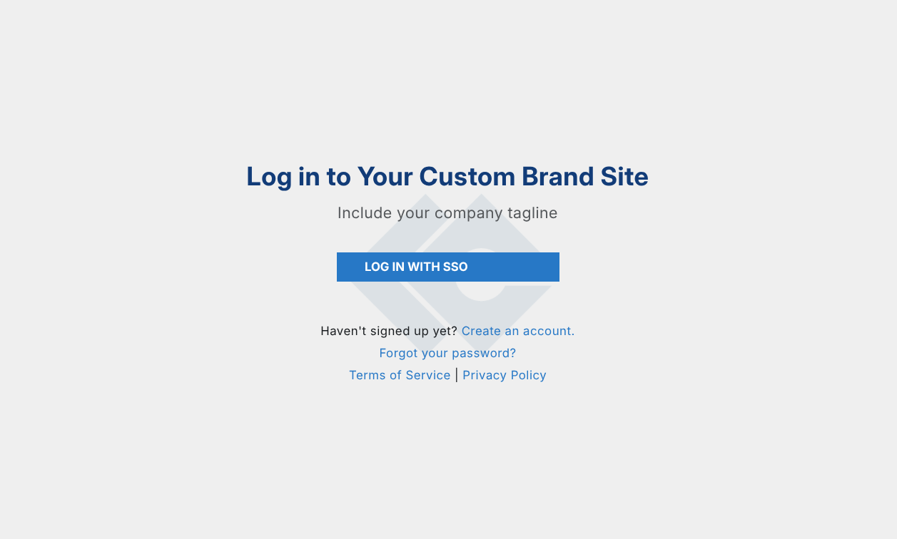
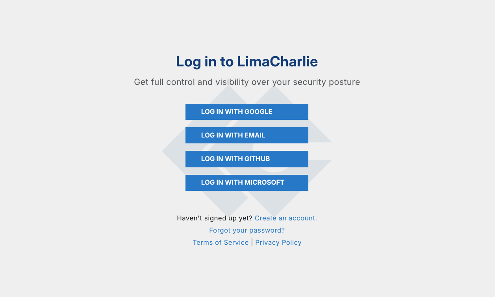

# Single Sign-On

Single sign-on (SSO) has no extra cost for customers who use the custom branded offering of LimaCharlie. If this applies to your Organization and you want to use SSO, submit a [Custom Branding / SSO Request](https://limacharlie.io/custom-branding).

If your organization does not have a custom branded site with LimaCharlie, you can learn the requirements and the costs before you start.

## Strict SSO Enforcement

LimaCharlie can enforce SSO strictly. You can configure SSO as the only authentication option.

For example, you can declare that each user with your email domain @example.com must authenticate through Google. You can then disable the login and password option, the GitHub option, and the Microsoft option for users with your email domain (@example.com). This applies to your custom branded site and to app.limacharlie.io.

## How It Works

Single sign-on lets a company add its own SSO option. The option uses the authentication server of the company instead of Google or another provider. Identity Platform coordinates this exchange. After you configure new Providers in Identity Platform, the app gives only a provider ID. Identity Platform then communicates with the auth server of the company.

## User Experience

The user experience is as follows:

- LimaCharlie enforces SSO for the organizations that select it. A user who opens a custom branded version of the LimaCharlie site sees only the SSO login option, if the domain of the user has the SSO configuration.

    

- The same user on the non-branded site still sees all the other authentication options. But the user can use only the authentication option that is approved for their domain.

    

In LimaCharlie, an Organization is a tenant in the Agentic SecOps Workspace. It is a self-contained environment for security data, configurations, and assets. Each Organization has its own sensors, detection rules, data sources, and outputs. This structure supports multi-tenant setups for managed security providers, and for enterprises with many departments or clients.

## Related Articles

- [User Access](user-access.md)

## What's Next

- [Reference: Permissions](../../8-reference/permissions.md)
