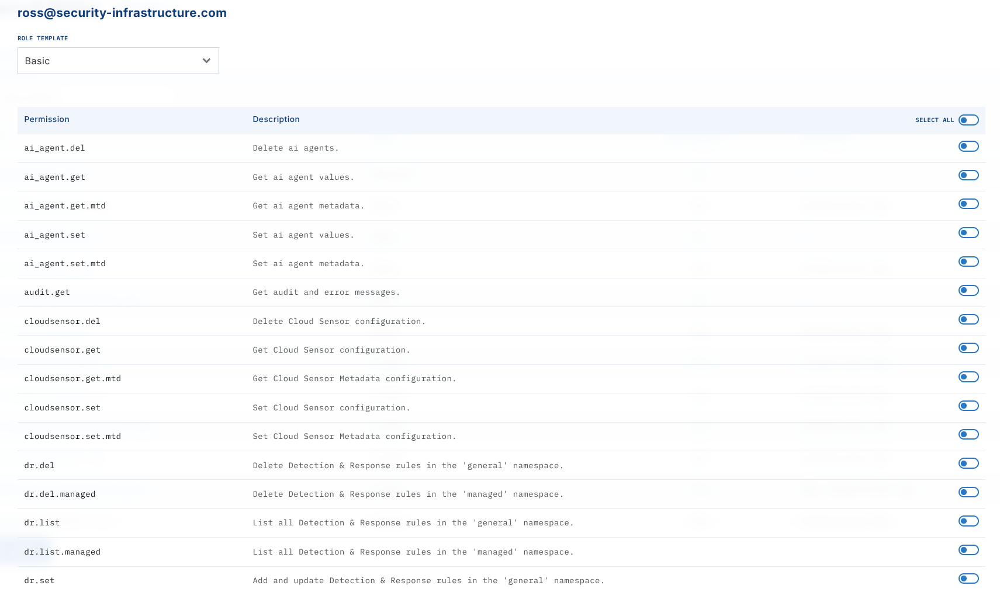
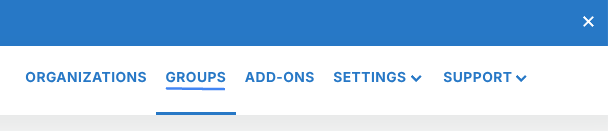
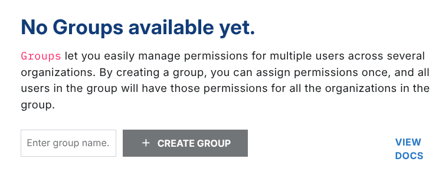
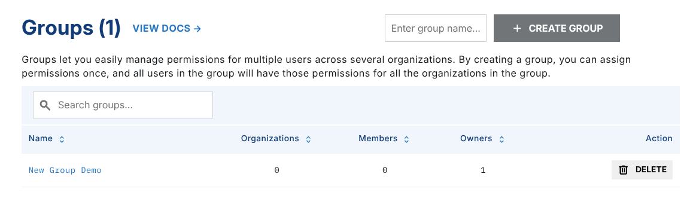
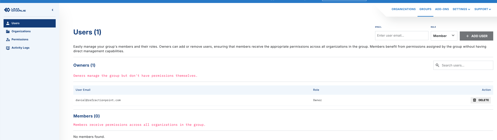
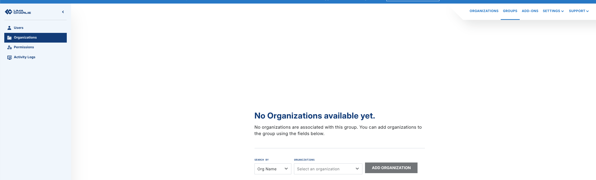
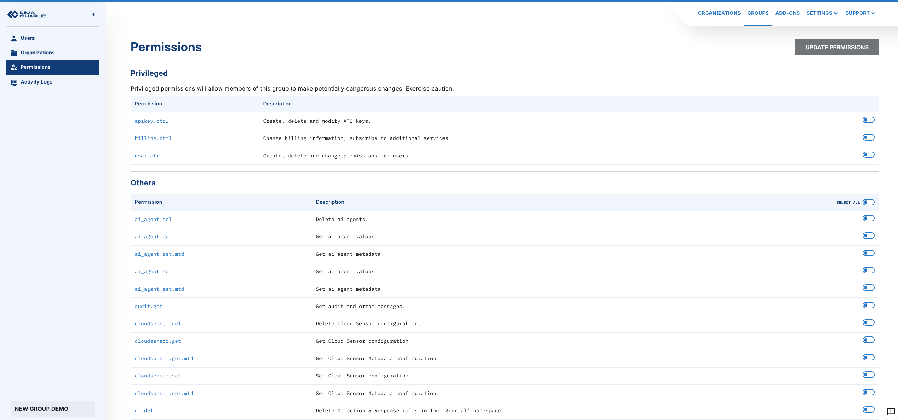

# User Access

!!! tip "Running more than one organization?"
    If you operate multiple organizations — for example as an MSSP, MDR, or an enterprise with several business units — read [Designing Access for Multi-Org Deployments](designing-access.md) first. It explains how to structure organizations, groups, and roles so that the individual steps below compose into a safe, maintainable access model.

To control who has access to an Organization, and what they have access to, go to the "Users" section of the web application.

Adding users is done by email address and requires the user to already have a limacharlie.io account.

The first user of an organization is added with Owner permissions at creation time. Owner permissions give full access to everything.

New users added after the creation of an organization are added with Unset privileges, which means the user is only able to get the most basic information on the organization.

Therefore, the first step after adding a new user should always be to change their permissions by clicking the Edit icon beside their name.

Permissions can be controlled individually, or you can apply pre-set permission schemes by selecting it at the top of the dialog box, clicking Apply, and then clicking the Save button at the bottom.

User Permissions

We offer granular user permissions, allowing you to customize what roles and how much access users should have. For a full list of permissions, see [Reference: Permissions](../../8-reference/permissions.md).

## Access on a per-organization basis

To add a user to an Organization, the new user needs to first create their own LimaCharlie account.

After the new user has created their LimaCharlie account, you can add them by inputting their email account to your Organization.

After adding the user, you have the ability to control what permissions they get in this tenant. To do so, click on their email and adjust their permissions in the modal that opens. (See information about user permissions above).



## Access via Organization Groups

Groups allow you to grant permissions to a set of users on a group of organizations. To get started, navigate to the upper right section of the web app and select groups.



From there, create a new group or click to edit an existing one.



The user who creates a group becomes a group owner. Group owners manage the group but do not have permissions themselves.

You can add multiple group owners.



In the **Users** section (left panel), you can add all existing users who should receive access to the organizations included in this group. Note that if you are a Group Owner and you want the permissions of this group to apply to yourself, you will need to add your email here as well.

Adding Accounts

Note that all accounts will need to be *existing* LimaCharlie users.



Group owners are allowed to manage the group, but are not affected by the permissions. Members are affected by the permissions but cannot modify the group.

Under **Organizations** (left panel), select a list of organizations you have access to. Note that in order to add an organization to the group, you need to have the user.ctrl permission enabled for that organization.



Last, select the permissions you want members of the group to have in the organizations included in this group.

Permissions granted through the group are applied on top of permissions granted at the organization level. The permissions are additive, and a group cannot be used to subtract permissions granted at the organization level.



To finish, click `Update Permissions` at the top right corner.

To review activity that has occurred in this group, click on **Activity Logs** (left panel).

.png)

## Verifying and Reviewing Access

After creating a new organization — especially a production tenant — you will typically want to confirm, to yourself or to a system administrator, exactly who can reach the org and with which permissions. Access to an organization comes from two sources: users added **directly** to the organization, and users added via an **Organization Group** that includes the organization. A complete review must cover both.

The sections below show how to answer the common questions using the web app, the `limacharlie` CLI, or both. All CLI examples assume you have selected the organization you want to inspect (either via `--oid <uuid>` or through `limacharlie auth use`).

### 1. Who has direct access to this organization?

**Web app:** open the organization and go to the **Users** section. Every account listed there has been added directly to the organization. Click an email to see the exact permissions granted to that user.

**CLI:** list the users directly on the organization, and pull the full per-user permission map:

```bash
# Users added directly to the org
limacharlie user list

# Exact permissions for every direct user on this org
limacharlie user permissions list
```

Cross-reference the list against the people who are *supposed* to have access. Any user who should not be there can be removed with `limacharlie user remove --email <address>` or from the **Users** section of the web app.

### 2. Which groups grant access to this organization?

Users can also reach the organization through Organization Groups. An org-level user review alone will not show those users — you need to review the groups as well.

**Web app:** open **Groups** from the upper-right menu. Open each group you own or manage and look at the **Organizations** panel: if your new production organization appears there, every user listed in the **Users** panel of that group inherits the group's permissions on it.

**CLI:** list your groups, then inspect each group's organizations, members, owners, and permissions:

```bash
# List all groups visible to you
limacharlie group list

# Inspect one group — shows orgs, members, owners, and the permissions granted
limacharlie group get --id <group_id>
```

If the production organization appears under `orgs` for a group, every email under `members` has the permissions listed under `perms` on that organization (in addition to any direct permissions they hold).

!!! note
    The permissions granted by a group are **added** to any permissions the user already has on the organization directly. Groups can only *add* access, never subtract it — so a user who is directly over-privileged cannot be "downgraded" by a group.

### 3. What effective permissions does a given user have?

To confirm the final, effective permission set for a single user on a production org:

1. Start with the user's direct permissions: in the web app, open **Users**, click the user, and note the checked permissions — or use `limacharlie user permissions list` and look up the user's email in the output.
2. Then walk every group that includes this organization (see step 2 above) and note each group whose **Users** panel contains this user. Add the group's permissions to the user's direct permissions.
3. The union of those sets is the effective access the user has on the organization.

For a cleaner starting point on a new production org, assign a [predefined role](../../8-reference/permissions.md) with `limacharlie user permissions set-role --email <address> --role <Owner|Administrator|Operator|Viewer|Basic>` — this replaces any prior direct permissions for the user on that org.

### 4. What access-related changes have been made, and by whom?

Both the organization and every group maintain a tamper-evident audit trail you can use to verify that the access posture you see today is the result of intended changes.

**Organization audit log (web app):** open **Audit Logs** in the organization. Filter for user-management events to see when users were invited, removed, or had their permissions changed, and by which account.

**Organization audit log (CLI):** the `limacharlie audit list` command returns administrative events for the organization. Each entry includes `ident` (the account that performed the action), `etype` (event type), `msg`, and `ts`:

```bash
# Last 24 hours (default window)
limacharlie audit list

# Custom window — review all changes since the org was created
limacharlie audit list --start $(date -d '2026-04-01' +%s) --end $(date +%s)
```

**Group audit log:** each Organization Group has its own activity log, reachable from **Activity Logs** in the group's left panel in the web app, or via:

```bash
limacharlie group logs --gid <group_id>
```

Use the group log to verify who added the production org to the group, who added members, and when permissions on the group were last changed.

### Suggested validation checklist for a new production organization

A practical sequence to hand to a system administrator when standing up a production tenant:

1. **Confirm the direct user list.** `limacharlie user list` (or the **Users** page) should match the agreed list of production operators exactly. Remove anyone unexpected.
2. **Confirm each user's permissions are intentional.** Inspect `limacharlie user permissions list` or the per-user permission modal in the web app. Prefer applying a [predefined role](../../8-reference/permissions.md) over hand-picked permissions unless you have a specific reason.
3. **Enumerate every group the org belongs to.** Run `limacharlie group list` and `limacharlie group get --id <group_id>` for each group, and record every group whose `orgs` array contains the new org. Confirm each group's `members` and `perms` are expected.
4. **Compute effective access per user.** For each operator, union direct permissions with permissions from every group containing the org. Confirm the result matches the documented access policy.
5. **Review the audit trail.** Walk `limacharlie audit list` since the org was created, plus `limacharlie group logs --gid <group_id>` for each group granting access, to confirm that every user addition and permission grant was performed by an authorized administrator.
6. **Re-run this checklist on a cadence.** Access drifts as people join and leave. The same commands can be scripted into a periodic review for ongoing compliance.

In LimaCharlie, an Organization represents a tenant within the Agentic SecOps Workspace, providing a self-contained environment to manage security data, configurations, and assets independently. Each Organization has its own sensors, detection rules, data sources, and outputs, offering complete control over security operations. This structure enables flexible, multi-tenant setups, ideal for managed security providers or enterprises managing multiple departments or clients.
