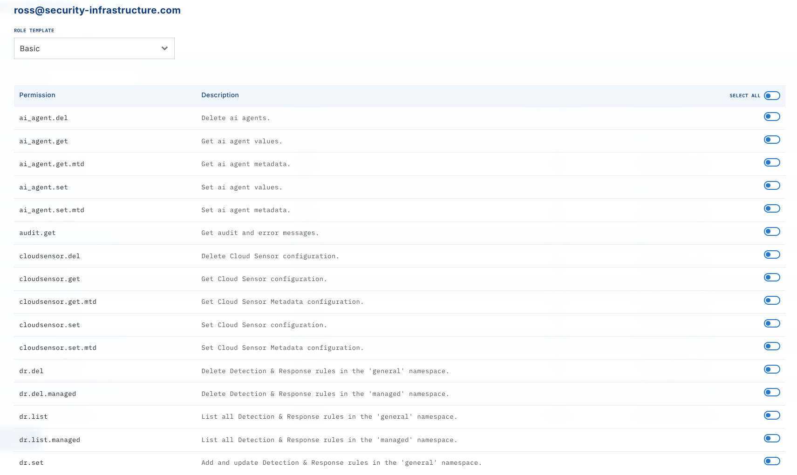
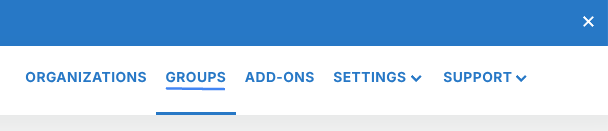
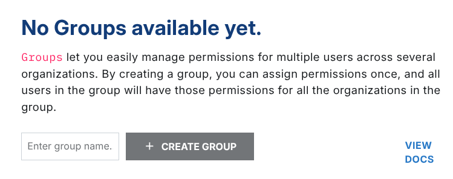
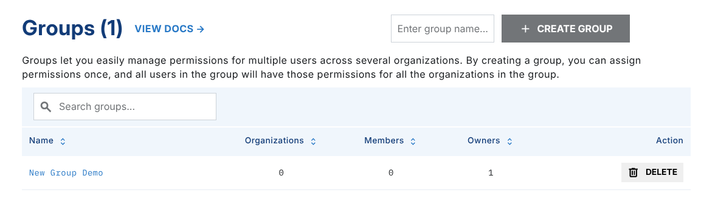
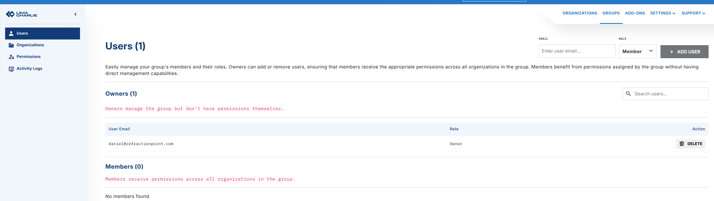
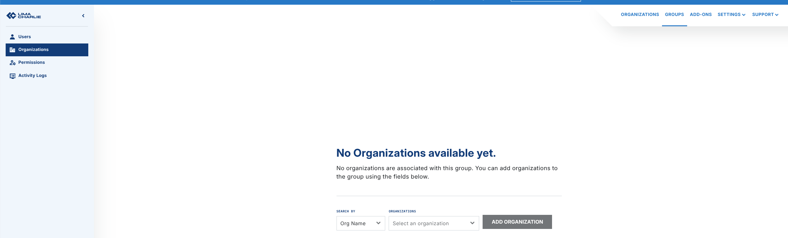
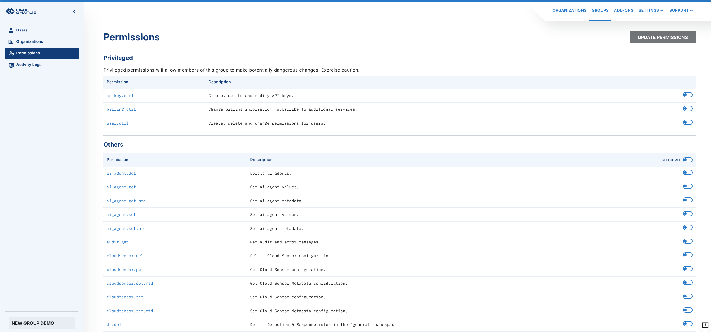

# User Access

!!! tip "Running more than one organization?"
    If you operate more than one organization, for example as an MSSP, MDR, or an enterprise with several business units, read [Designing Access for Multi-Org Deployments](designing-access.md) first. It explains how to structure organizations, groups, and roles. The steps below then make a safe access model that you can maintain.

To control who has access to an Organization, and what they can access, go to the "Users" section of the web app.

You add a user by email address. The user must have a limacharlie.io account.

The first user of an organization gets Owner permissions when you create the organization. Owner permissions give full access to everything.

A user that you add after the creation of an organization gets Unset privileges. Such a user can get only the most basic information about the organization.

After you add a new user, always change their permissions first. Click the Edit icon beside the name of the user.

You can set each permission individually. You can also apply a pre-set permission scheme: select the scheme at the top of the dialog box, click Apply, then click the Save button at the bottom.

User Permissions

LimaCharlie has granular user permissions. You control the roles and the level of access of each user. For the full list of permissions, see [Reference: Permissions](../../8-reference/permissions.md).

## Access on a per-organization basis

Before you add a user to an Organization, the new user must create their own LimaCharlie account.

After the new user creates the LimaCharlie account, add the email address of the user to your Organization.

After you add the user, you control the permissions that the user gets in this tenant. Click the email address of the user and change the permissions in the modal that opens. (See the information about user permissions above.)



## Access via Organization Groups

Groups let you grant permissions to a set of users on a group of organizations. To start, go to the upper right section of the web app and select groups.



Then create a new group, or click an existing group to edit it.



The user who creates a group becomes a group owner. Group owners manage the group but do not have permissions themselves.

You can add multiple group owners.



In the **Users** section (left panel), add each existing user that needs access to the organizations in this group. If you are a Group Owner and you want the permissions of this group to apply to you, add your email address here also.

Adding Accounts

All accounts must be *existing* LimaCharlie users.



Group owners can manage the group, but the permissions do not apply to them. The permissions apply to members, but members cannot change the group.

Under **Organizations** (left panel), select a list of organizations that you can access. To add an organization to the group, you must have the user.ctrl permission enabled for that organization.



Last, select the permissions for the members of the group in the organizations of this group.

The group adds its permissions to the permissions at the organization level. The permissions are additive. A group cannot subtract the permissions that the organization grants.



To finish, click `Update Permissions` at the top right corner.

To review the activity in this group, click **Activity Logs** (left panel).

.png)

## Verifying and Reviewing Access

After you create a new organization, and especially a production tenant, confirm to yourself or to a system administrator who can reach the org and with which permissions. Access to an organization comes from two sources: users added **directly** to the organization, and users added through an **Organization Group** that includes the organization. A complete review must cover both sources.

The sections below answer the common questions with the web app, the `limacharlie` CLI, or both. Each CLI example assumes that you selected the organization to inspect, with `--oid <uuid>` or with `limacharlie auth use-org`.

### 1. Who has direct access to this organization?

**Web app:** open the organization and go to the **Users** section. Each account in that list is added directly to the organization. Click an email address to see the exact permissions of that user.

**CLI:** list the users that are directly on the organization, and get the full permission map for each user:

```bash
# Users added directly to the org
limacharlie user list

# Exact permissions for every direct user on this org
limacharlie user permissions list
```

Compare the list with the people that must have access. To remove a user who must not be there, use `limacharlie user remove --email <address>` or the **Users** section of the web app.

### 2. Which groups grant access to this organization?

Users can also reach the organization through Organization Groups. A review of the users at the org level does not show those users. You must review the groups also.

**Web app:** open **Groups** from the upper-right menu. Open each group that you own or manage and look at the **Organizations** panel. If your new production organization is in that panel, each user in the **Users** panel of that group gets the permissions of the group on it.

**CLI:** list your groups, then inspect the organizations, members, owners, and permissions of each group:

```bash
# List all groups visible to you
limacharlie group list

# Inspect one group — shows orgs, members, owners, and the permissions granted
limacharlie group get --id <group_id>
```

If the production organization is under `orgs` for a group, each email under `members` has the permissions under `perms` on that organization. These permissions are additional to the direct permissions of the user.

!!! note
    A group **adds** its permissions to the permissions that the user already has directly on the organization. A group can only *add* access, it can never subtract access. A group cannot reduce the access of a user who has too many direct permissions.

### 3. What effective permissions does a given user have?

To confirm the effective permission set of one user on a production org:

1. Start with the direct permissions of the user. In the web app, open **Users**, click the user, and record the checked permissions. You can also run `limacharlie user permissions list` and find the email address of the user in the output.
2. Examine every group that includes this organization (see step 2 above). Record each group whose **Users** panel contains this user. Add the permissions of the group to the direct permissions of the user.
3. The union of those sets is the effective access of the user on the organization.

For a clear starting point on a new production org, assign a [predefined role](../../8-reference/permissions.md) with `limacharlie user permissions set-role --email <address> --role <Owner|Administrator|Operator|Viewer|Basic>`. This command replaces the previous direct permissions of the user on that org.

### 4. What access-related changes have been made, and by whom?

The organization and each group keep an audit trail. Use the audit trail to check that the current access is the result of intended changes. For long-term compliance, you can also send the `audit` stream to separate, append-only storage with an [Output](../../5-integrations/outputs/stream-structures.md#3-audit-stream-structure).

**Organization audit log (web app):** open **Audit Logs** in the organization. Filter for user-management events. These events show when an account invited a user, removed a user, or changed the permissions of a user.

**Organization audit log (CLI):** the `limacharlie audit list` command returns administrative events for the organization. Each entry includes `ident` (the account that did the action), `etype` (event type), `msg`, and `ts`:

```bash
# Last 24 hours (default window)
limacharlie audit list

# Custom window — review all changes since the org was created
limacharlie audit list --start $(date -d '2026-04-01' +%s) --end $(date +%s)
```

**Group audit log:** each Organization Group has its own activity log. Open it from **Activity Logs** in the left panel of the group in the web app, or use this command:

```bash
limacharlie group logs --gid <group_id>
```

Use the group log to check who added the production org to the group, who added members, and when the permissions of the group changed last.

### Suggested validation checklist for a new production organization

Give this sequence to a system administrator when you set up a production tenant:

1. **Confirm the direct user list.** The output of `limacharlie user list`, or the **Users** page, must match the agreed list of production operators exactly. Remove each unexpected user.
2. **Confirm that the permissions of each user are intentional.** Inspect the output of `limacharlie user permissions list`, or the permission modal for each user in the web app. Apply a [predefined role](../../8-reference/permissions.md) instead of hand-picked permissions, unless you have a specific reason.
3. **Enumerate every group that contains the org.** Run `limacharlie group list` and `limacharlie group get --id <group_id>` for each group. Record every group whose `orgs` array contains the new org. Confirm that the `members` and the `perms` of each group are correct.
4. **Compute the effective access of each user.** For each operator, add the permissions from every group that contains the org to the direct permissions. Confirm that the result matches the documented access policy.
5. **Review the audit trail.** Examine `limacharlie audit list` for the period after the creation of the org. Also examine `limacharlie group logs --gid <group_id>` for each group that grants access. Confirm that an authorized administrator did each addition of a user and each grant of a permission.
6. **Run this checklist again at regular intervals.** Access drifts when people join and leave. You can put the same commands in a script for a periodic review.

In LimaCharlie, an Organization is a tenant in the Agentic SecOps Workspace. It is a self-contained environment for security data, configurations, and assets. Each Organization has its own sensors, detection rules, data sources, and outputs. This structure supports multi-tenant setups for managed security providers, and for enterprises with many departments or clients.
