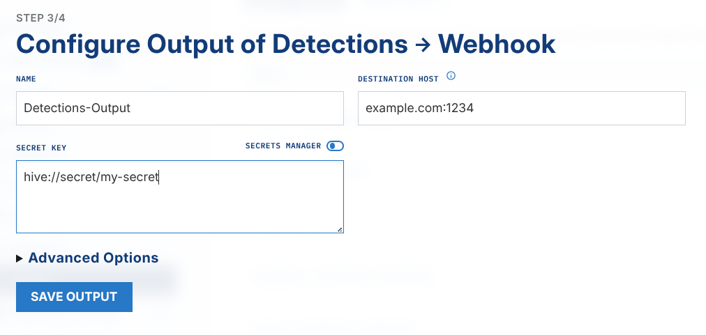

# Config Hive: Secrets

LimaCharlie has many options to ingest and to output data. Users can therefore collect many credentials and secret keys for these data operations. Not all users must see these secret keys. In the Config Hive, the `secrets` hive separates secrets from the places in LimaCharlie that use or configure them. You can also give a user the permission to see the configuration of an output, but not the credentials in it.

The most common use is to store the secret keys for [Adapters](../../2-sensors-deployment/adapters/usage.md) or [Outputs](../../5-integrations/outputs/testing.md). A reference to `secrets` in the Config Hive configures these services. You do not need to show the secret keys to all users.

To learn more about hive secrets, watch the video below, or read the sections below.

## Format

A secret record in `hive` has a basic format:

```json
{
    "secret": "data"
}
```

The `data` part of a record in this hive must have one key called `secret`. Different LimaCharlie components use the value of this key.

## Permissions

The `secret` hive needs these permissions for its operations:

- `secret.get`
- `secret.set`
- `secret.del`
- `secret.get.mtd`
- `secret.set.mtd`

## Secret Management

With enough integrations, you must create or update secrets on demand. You can do both with the LimaCharlie CLI or with the web app.

### Creating Secrets

With the correct permissions, you can create secrets in these ways:

1. With the LimaCharlie CLI, create a secret with the `limacharlie hive set secret` command (example below).
2. In the web app, under **Organization Settings** > **Secrets Manager**.

### Updating Secrets

After you set a secret, you can update it with these methods:

1. With the LimaCharlie CLI, update a secret with the `limacharlie hive update secret` command.
2. In the web app, go to **Organization Settings** > **Secrets Manager**. Select the secret that you want to update, and change it in the dialog box. Click **Save Secret** to save the changes in the platform.

## Usage

To use a secret with an output, do these steps:

1. Create a secret in the `secret` hive
2. Create an Output and use the format `hive://secret/my-secret-name` as the value for a credentials field.

## Programmatic Management

!!! info "Prerequisites"
    All API and SDK examples need an API key with the correct permissions. See [API Keys](../access/api-keys.md) for setup instructions.

### List Secrets

=== "REST API"

    ```bash
    curl -s -X GET \
      "https://api.limacharlie.io/v1/hive/secret/YOUR_OID" \
      -H "Authorization: Bearer $LC_JWT"
    ```

=== "Python"

    ```python
    from limacharlie.client import Client
    from limacharlie.sdk.organization import Organization
    from limacharlie.sdk.hive import Hive

    client = Client(oid="YOUR_OID", api_key="YOUR_API_KEY")
    org = Organization(client)
    hive = Hive(org, "secret")
    records = hive.list()
    for name, record in records.items():
        print(name, record.data)
    ```

=== "Go"

    ```go
    package main

    import (
        "fmt"
        limacharlie "github.com/refractionPOINT/go-limacharlie/limacharlie"
    )

    func main() {
        client, _ := limacharlie.NewClient(limacharlie.ClientOptions{
            OID:    "YOUR_OID",
            APIKey: "YOUR_API_KEY",
        }, nil)
        org, _ := limacharlie.NewOrganization(client)
        hc := limacharlie.NewHiveClient(org)

        records, _ := hc.List(limacharlie.HiveArgs{
            HiveName:     "secret",
            PartitionKey: "YOUR_OID",
        })
        for name, record := range records {
            fmt.Println(name, record.Data)
        }
    }
    ```

=== "CLI"

    ```bash
    limacharlie secret list
    ```

### Get a Secret

=== "REST API"

    ```bash
    curl -s -X GET \
      "https://api.limacharlie.io/v1/hive/secret/YOUR_OID/my-secret/data" \
      -H "Authorization: Bearer $LC_JWT"
    ```

=== "Python"

    ```python
    from limacharlie.client import Client
    from limacharlie.sdk.organization import Organization
    from limacharlie.sdk.hive import Hive

    client = Client(oid="YOUR_OID", api_key="YOUR_API_KEY")
    org = Organization(client)
    hive = Hive(org, "secret")
    record = hive.get("my-secret")
    print(record.data)
    ```

=== "Go"

    ```go
    package main

    import (
        "fmt"
        limacharlie "github.com/refractionPOINT/go-limacharlie/limacharlie"
    )

    func main() {
        client, _ := limacharlie.NewClient(limacharlie.ClientOptions{
            OID:    "YOUR_OID",
            APIKey: "YOUR_API_KEY",
        }, nil)
        org, _ := limacharlie.NewOrganization(client)
        hc := limacharlie.NewHiveClient(org)

        record, _ := hc.Get(limacharlie.HiveArgs{
            HiveName:     "secret",
            PartitionKey: "YOUR_OID",
            Key:          "my-secret",
        })
        fmt.Println(record.Data)
    }
    ```

=== "CLI"

    ```bash
    limacharlie secret get --key my-secret
    ```

### Create / Update a Secret

!!! warning
    The cloud creates new hive records **disabled by default**. Each example below enables the secret. To make the secret start disabled, remove the `enabled` part. You can then enable the secret later with `limacharlie secret enable --key …`.

=== "REST API"

    ```bash
    curl -s -X POST \
      "https://api.limacharlie.io/v1/hive/secret/YOUR_OID/my-secret/data" \
      -H "Authorization: Bearer $LC_JWT" \
      -d 'data={"secret":"my-secret-value"}' \
      -d 'usr_mtd={"enabled":true}'
    ```

=== "Python"

    ```python
    from limacharlie.client import Client
    from limacharlie.sdk.organization import Organization
    from limacharlie.sdk.hive import Hive, HiveRecord

    client = Client(oid="YOUR_OID", api_key="YOUR_API_KEY")
    org = Organization(client)
    hive = Hive(org, "secret")
    record = HiveRecord(
        "my-secret",
        data={"secret": "my-secret-value"},
        enabled=True,
    )
    hive.set(record)
    ```

=== "Go"

    ```go
    package main

    import (
        limacharlie "github.com/refractionPOINT/go-limacharlie/limacharlie"
    )

    func main() {
        client, _ := limacharlie.NewClient(limacharlie.ClientOptions{
            OID:    "YOUR_OID",
            APIKey: "YOUR_API_KEY",
        }, nil)
        org, _ := limacharlie.NewOrganization(client)
        hc := limacharlie.NewHiveClient(org)

        enabled := true
        hc.Add(limacharlie.HiveArgs{
            HiveName:     "secret",
            PartitionKey: "YOUR_OID",
            Key:          "my-secret",
            Data:         limacharlie.Dict{"secret": "my-secret-value"},
            Enabled:      &enabled,
        })
    }
    ```

=== "CLI"

    ```bash
    limacharlie secret set --key my-secret \
      --input-file secret.json --enabled
    ```

    Where `secret.json` contains:

    ```json
    {
        "data": {
            "secret": "my-secret-value"
        }
    }
    ```

    The `--enabled` flag creates and enables the record in one operation. Omit the flag, and omit `usr_mtd.enabled` in the file, to keep the secret disabled. The secret stays disabled until you call `limacharlie secret enable --key my-secret`.

### Delete a Secret

=== "REST API"

    ```bash
    curl -s -X DELETE \
      "https://api.limacharlie.io/v1/hive/secret/YOUR_OID/my-secret" \
      -H "Authorization: Bearer $LC_JWT"
    ```

=== "Python"

    ```python
    from limacharlie.client import Client
    from limacharlie.sdk.organization import Organization
    from limacharlie.sdk.hive import Hive

    client = Client(oid="YOUR_OID", api_key="YOUR_API_KEY")
    org = Organization(client)
    hive = Hive(org, "secret")
    hive.delete("my-secret")
    ```

=== "Go"

    ```go
    package main

    import (
        limacharlie "github.com/refractionPOINT/go-limacharlie/limacharlie"
    )

    func main() {
        client, _ := limacharlie.NewClient(limacharlie.ClientOptions{
            OID:    "YOUR_OID",
            APIKey: "YOUR_API_KEY",
        }, nil)
        org, _ := limacharlie.NewOrganization(client)
        hc := limacharlie.NewHiveClient(org)

        hc.Remove(limacharlie.HiveArgs{
            HiveName:     "secret",
            PartitionKey: "YOUR_OID",
            Key:          "my-secret",
        })
    }
    ```

=== "CLI"

    ```bash
    limacharlie secret delete --key my-secret --confirm
    ```

### Enable / Disable a Secret

=== "REST API"

    ```bash
    # 1. Read current metadata to preserve tags, expiry, comment:
    CURRENT=$(curl -s -X GET \
      "https://api.limacharlie.io/v1/hive/secret/YOUR_OID/my-secret/mtd" \
      -H "Authorization: Bearer $LC_JWT")

    # 2. Merge and update (set enabled to false, keep other fields):
    curl -s -X POST "https://api.limacharlie.io/v1/hive/secret/YOUR_OID/my-secret/mtd" \
      -H "Authorization: Bearer $LC_JWT" \
      -H "Content-Type: application/x-www-form-urlencoded" \
      -d 'usr_mtd={"enabled":false,"expiry":0,"tags":[],"comment":""}'
    ```

    !!! warning
        The API **replaces** all of `usr_mtd`. If you send only `{"enabled":false}`, the API resets tags, expiry, and comment to their defaults. Always read the current metadata first, then send all fields again.

=== "Python"

    ```python
    hive = Hive(org, "secret")
    # Read-modify-write to preserve other metadata:
    record = hive.get_metadata("my-secret")
    record.enabled = False  # or True to re-enable
    hive.set(record)
    ```

=== "Go"

    ```go
    hc := limacharlie.NewHiveClient(org)
    // Read current metadata first to preserve tags, expiry, comment.
    existing, _ := hc.GetMTD(limacharlie.HiveArgs{
        HiveName:     "secret",
        PartitionKey: org.GetOID(),
        Key:          "my-secret",
    })
    enabled := false
    hc.Add(limacharlie.HiveArgs{
        HiveName:     "secret",
        PartitionKey: org.GetOID(),
        Key:          "my-secret",
        Enabled:      &enabled,
        Tags:         existing.UsrMtd.Tags,
        Expiry:       &existing.UsrMtd.Expiry,
        Comment:      &existing.UsrMtd.Comment,
    })
    ```

=== "CLI"

    ```bash
    # Disable a secret (reads metadata first to preserve other fields):
    limacharlie secret disable --key my-secret
    # Re-enable:
    limacharlie secret enable --key my-secret
    # Or using the generic hive command:
    limacharlie hive disable --hive-name secret --key my-secret
    ```

## Example

This example creates a secret with the LimaCharlie CLI in a terminal. First, create a small file that contains the secret record:

```text
echo "my-secret-value" > my-secret
```

Next, set this secret in Hive with the LimaCharlie CLI:

```bash
limacharlie hive set secret --key my-secret --data my-secret --data-key secret
```

The CLI returns a confirmation that it created the secret. The confirmation includes the metadata of the secret and the OID:

```json
{
    "guid": "3a7a2865-a439-4d1a-8f50-b9a6d833075c",
    "hive": {
        "name": "secret",
        "partition": "8cbe27f4-aaaa-bbbb-cccc-138cd51389cd"
        },
    "name": "my-secret"
}
```

Next, create an output in the web app. Use the value `hive://secret/my-secret` for the Secret Key.



The output starts as expected. But when you view the configuration of the output, the secret shows the `hive` ARN and not the credentials.

## See Also

- [Adapter Usage](../../2-sensors-deployment/adapters/usage.md) -- Common consumer of hive secrets.
- [Outputs](../../5-integrations/outputs/index.md) -- Another common consumer of hive secrets.
- [D&R-Driven AI Sessions](../../9-ai-sessions/dr-sessions.md) -- The `start ai agent` action reads Anthropic and LC API keys through `hive://secret/<name>` references.
- [Compliance Installation](../../9-ai-sessions/compliance/installation.md) -- The `compliance-deploy` skill puts a scoped LC API key and an Anthropic key in this hive when it deploys the reviewer agent.
