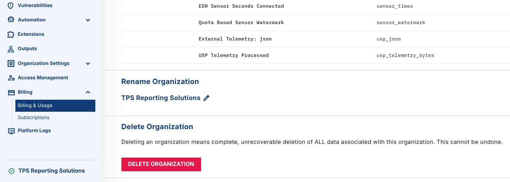
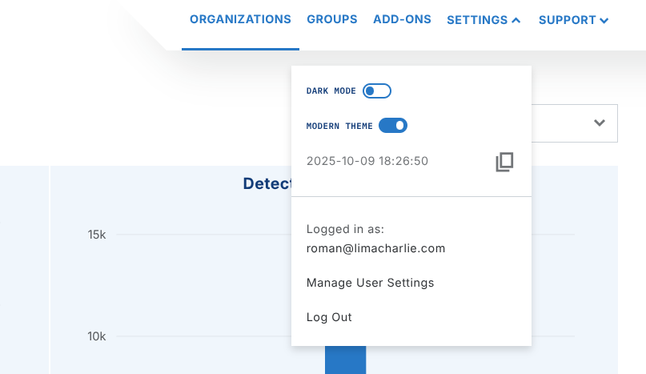
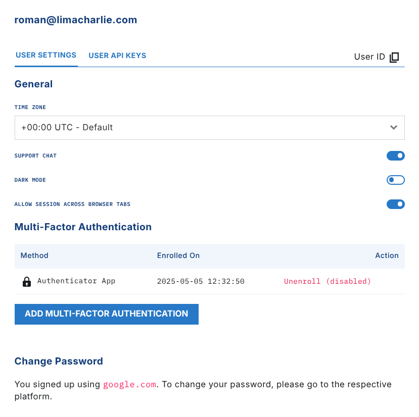

# FAQ - Account Management

## How Can I Create More Than Two Organizations?

By default, LimaCharlie has a limit of two organizations. To create more organizations, contact the support team. The support team changes this limit for you.

## How Do I Delete an Organization?

1. Open the Billing & Usage section of the organization that you want to delete.
2. At the bottom of the page, click the Delete Organization button.

This action is final. You cannot undo it.

## Is There a Way to Wipe an Organization?

To wipe the data retention, delete the `Insight` add-on with `DELETE /insight/{oid}`, then enable it again. If you disable `Insight` (unsubscribe from the marketplace), data collection only pauses. Historical telemetry is **not** deleted. To delete all stored telemetry for an organization permanently, you must issue an explicit delete operation. You cannot undo this action.

To wipe the configuration, use the Templates / Infrastructure as Code function with the `is_force` flag to remove everything. For more about infrastructure as code, see [Infrastructure Extension](../../5-integrations/extensions/limacharlie/infrastructure.md).

## Can I Transfer Ownership of an Organization?

You can transfer ownership of an organization to any other entity. The current owner of the organization (the billing or legal contact) must start the request. To start the request, contact [support@limacharlie.io](mailto:support@limacharlie.io).

## I Created an Account and Have Been Given Access, but I Do Not Seem to Have Access to Other Organizations

LimaCharlie has granular role-based access control. You can get access in one of two ways:

- On a per-organization basis
- To a set of organizations with [Organization Groups](../../7-administration/access/user-access.md)

Ask the person who gave you access which method that person used. Both methods work, but that person must add you to each organization one by one, or set up a group.

## How Can I Update My Time Zone?

The web app shows all dates and times in the time zone that the user prefers.

To set your time zone, click the settings icon in the right hand corner and select `Manage User Settings`.

Set your preferred time zone in the `Display` section of the `User Settings`. All changes are saved automatically.

## How Can I Unsubscribe/Cancel/Delete My Limacharlie Account?

1. Log in to app.limacharlie.io.
2. Go to Billing & Usage in the Billing section.
3. At the bottom of the page, click the Delete Organization button.
4. Obey the instructions on the screen.

## Why Didn't I Receive My Account Activation Email?

LimaCharlie sends an account activation email when you sign up for a new account. If the email is not in your inbox, look in the spam or junk folder. If you use Microsoft Office 365, or a similar service with server-side filtering, check your online Quarantine (or the equivalent). For details, see the [Microsoft instructions](https://docs.microsoft.com/en-us/microsoft-365/security/office-365-security/quarantine-email-messages?view=o365-worldwide).

Contact the support team. The support team can check if your mail server sent a successful delivery response.

In LimaCharlie, an Organization is a tenant in the Agentic SecOps Workspace. It is a self-contained environment where you manage security data, configurations, and assets independently. Each Organization has its own sensors, detection rules, data sources, and outputs, and gives you full control over security operations. This structure supports flexible, multi-tenant setups for managed security providers, and for enterprises that manage many departments or clients.

Infrastructure as Code (IaC) uses code to manage and provision IT infrastructure. It makes resources easier to scale, to maintain, and to deploy in a consistent way. In LimaCharlie, IaC lets security teams deploy and manage sensors, rules, and other security infrastructure programmatically. The result is repeatable configurations and faster response times, with the best practices of infrastructure as code in cybersecurity operations.
