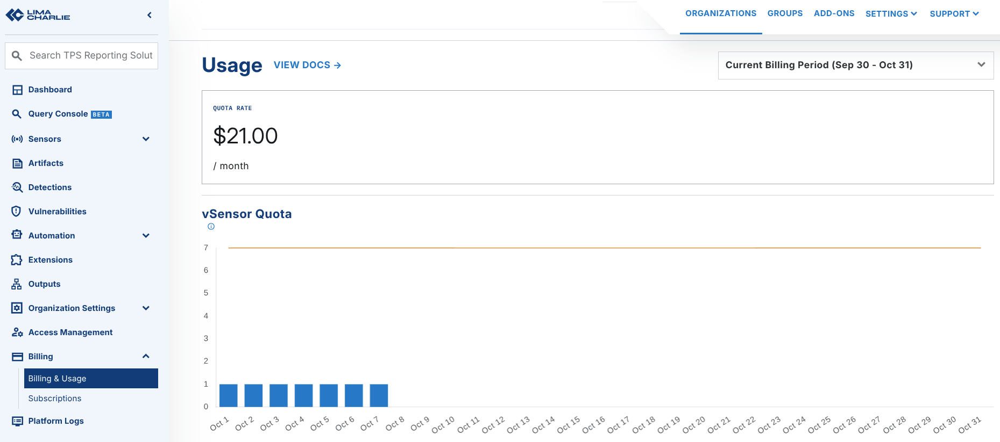
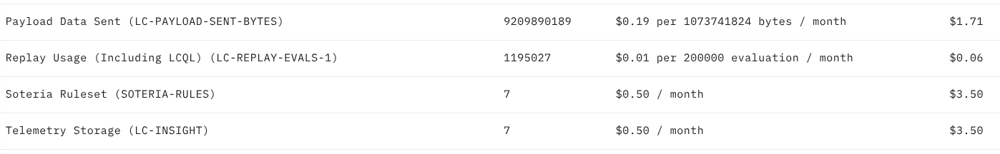

# FAQ - Billing

This page contains frequently asked questions about billing in LimaCharlie.

Pricing Details

LimaCharlie pricing is available on the [Pricing webpage](https://limacharlie.io/pricing).

## How Can I Change My Quota/Upgrade to the Paid Tier?

When you sign up for a LimaCharlie account, you start on the free tier. This tier lets you create two organizations with two sensors each. All add-ons and other services are free on this tier.

To upgrade to the paid tier, go to the Setup section of the Organization that you want to upgrade. Then do these steps:

1. Click the **Billing & Usage** tab and make sure that you have a payment method on file.
2. In the **Billing & Usage** tab, set the quota number and click **Update Quota**. The quota is the number of sensors that you want to support online at the same time.



## What is the Cost of Deploying Payloads via LimaCharlie?

The [pricing page](https://limacharlie.io/pricing) gives the payload pricing. For example, assume that payload deployment with LimaCharlie costs $0.19 for each 1 GB of data sent. A 1GB payload sent to 10 endpoints costs $1.9 (10GBs x  $0.19).

This applies only to organizations that use the Payloads function, and to the Atomic Red Team and Dumper services (these run as Payloads in LC).

To see the effect on your organization, check the **Metered Usage** section of the **Billing** page. It shows the new **Payload Data Sent** metric, the size of the payloads deployed, and the price.



## What is Usage-Based Billing?

LimaCharlie has a per endpoint pricing model. It also has a pure usage-based billing model for the Endpoint Detection & Response (EDR) capability. This model calculates the price only from the time that the Sensor is connected, the events processed, and the events stored. For more detail, see [billing options](../../7-administration/billing/options.md).

Some users do not need all the components all the time, and can benefit from access to an Endpoint Agent on an ad-hoc basis. This approach gives these results:

1. Incident responders can offer pre-deployments to their customers at almost zero cost. They can deploy to the full fleet of an organization, where the agents stay dormant in [sleeper mode](../../2-sensors-deployment/endpoint-agent/sleeper.md). With agents deployed before an incident, responders can offer competitive SLA's.
2. Product developers can use usage-based billing to get narrow bands of functionality at a low cost. They get the functionality that they need. They do not build it themselves, and they do not pay for a full EDR deployment.

## For Lc Adapters Billed on Usage, What Does "Block of Data" Mean & How Will It Impact the Price I Pay?

LimaCharlie bills some Adapters on usage. The [pricing page](https://limacharlie.io/pricing) gives the current pricing details.

For example, assume $0.15 for each block of data of 1 GB (at the organization level). Ten adapters in the same organization with less than 1 GB in total cost $0.15 for that month.

## How Do I Determine How Much I Need to Pay for an Org If It Was in Usage-Based Billing Mode?

If the organization has [1-year telemetry retention](https://app.limacharlie.io/add-ons/detail/insight) enabled, use the stats API to see the number of events retained:

`https://api.limacharlie.io/v1/usage/OID`
 or
`https://api.limacharlie.io/static/swagger/#/Organizations/getOrgUsageStats`

Check the `sensor_events` and `sensor_retained` values.

## How Is the Price of Sensors & Add-Ons Calculated in LimaCharlie?

There are two categories of Sensors: sensors billed on the Quota that the user sets (vSensor basis), and sensors billed on usage.

### vSensors

LimaCharlie has the concept of a vSensor. A vSensor is a virtual sensor that sets the quota and the billing of Endpoint Agents. vSensor pricing is the same as the pricing page shows, and it includes a year of full telemetry storage.

The quota-based approach lets you mix and match deployments and stay at a given price point.

If you set the quota to 100 vSensors, you can have concurrently:

- 50 Windows Sensors + 50 Linux Sensors, OR
- 20 Windows Sensors + 30 Linux Sensors + 50 macOS Sensors, OR
- 100 macOS Sensors
- Or any other combination, if the total number of sensors is not more than the quota of 100 vSensors.

### Sensors Over Quota

If the quota is full when a sensor tries to come online, the sensor gets a message to wait for a period of time and then check again. A `sensor_over_quota` event is also emitted in the deployments stream, so you can set up alerts for this condition. The wait time increases if the sensor connects again and the organization is still over quota.

## How Do I Check My Sensor Quota Usage?

Two REST API endpoints report sensor counts for an organization, and they answer different questions:

- `GET https://api.limacharlie.io/v1/online/{oid}` returns the number of sensors currently online.
- `GET https://api.limacharlie.io/v1/quota_usage/{oid}` returns the **enforced** quota usage: the weighted vSensor count that the cloud compares against your sensor quota when it decides if a sensor can come online.

Both endpoints need the `sensor.list` permission on the organization.

To size your sensor quota, use `/quota_usage`. Sensor categories have different weights for the quota, and some categories use only a fraction of a vSensor each. Also, the online count does not include some categories that count toward enforcement. Because of this, `/quota_usage` can be higher than `/online`. A quota that you size from the online count alone can be below the enforced usage and can trigger `sensor_over_quota` events.

A `/quota_usage` response contains the enforced usage, the currently configured quota, and a per-category breakdown:

```json
{
  "usage": 53,
  "quota": 100,
  "breakdown": {
    "windows": { "count": 50, "weight": 1.0, "quota": 50.0 },
    "chromium": { "count": 30, "weight": 0.1, "quota": 3.0 }
  }
}
```

- `usage`: the enforced weighted vSensor count, truncated to an integer the same way that enforcement truncates it. Compare this value against your configured quota.
- `quota`: the sensor quota currently configured for the organization. This field is best-effort and can be absent.
- `breakdown`: one entry for each sensor category that currently holds sensors, keyed by the platform or architecture name (for example `windows` or `chromium`) or by the sensor mode. Each entry reports `count`, the raw number of sensors in that category, `weight`, the vSensor cost of each sensor in that category, and `quota`, their weighted contribution to the usage total. Contributions are kept as floats, so they sum to the total before truncation.

## When Will My Credit Card Be Charged?

Quota-based items are charged a month ahead. Usage items are billed in the month after use, like most cellphone invoices or hosting invoices.

## How Do I Change My Billing Credit Card?

If you pay with a credit card and you want to change your address or card details, go to **Billing > Billing & Usage** in the web app. Then select **Change Payment Details** and update the details.

In LimaCharlie, an Organization is a tenant in the Agentic SecOps Workspace. It is a self-contained environment where you manage security data, configurations, and assets independently. Each Organization has its own sensors, detection rules, data sources, and outputs, and gives you full control over security operations. This structure supports flexible, multi-tenant setups for managed security providers, and for enterprises that manage many departments or clients.

Endpoint Detection & Response

Like agents, Sensors send telemetry to the LimaCharlie cloud as EDR telemetry or as forwarded logs. Sensors are a scalable, serverless solution that connects the endpoints of an organization to the cloud in a secure way.

Endpoint Agents are lightweight software agents that you deploy directly on endpoints such as workstations and servers. These sensors collect real-time data about system activity, network traffic, file changes, process behavior, and more.
