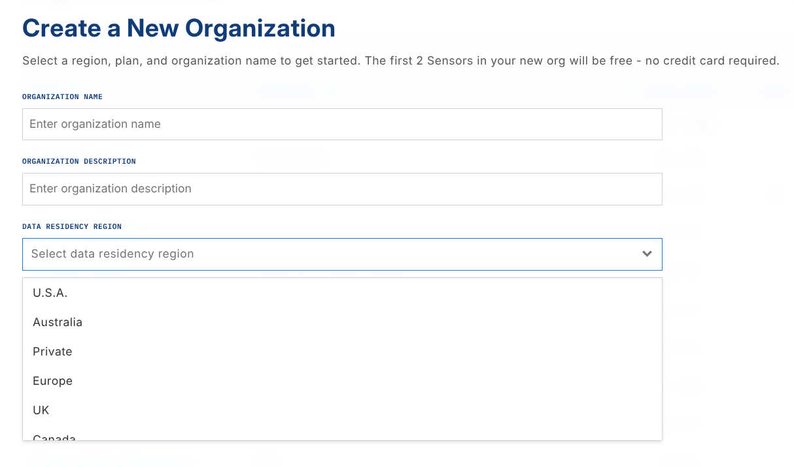
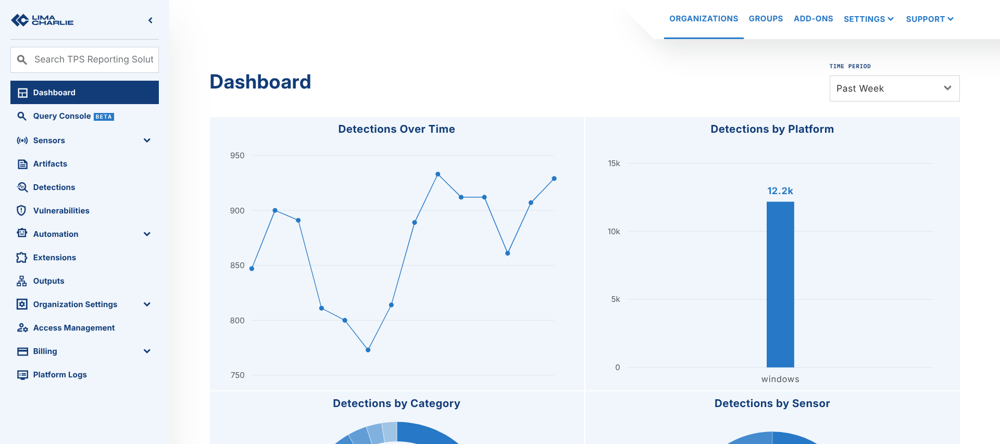

# FAQ - General

## Is my data secure with LimaCharlie?

LimaCharlie secures your data from the endpoint and through your infrastructure. The Google Cloud Platform hosts LimaCharlie. LimaCharlie uses many capabilities of that platform, from the management of credentials to the isolation of compute, to limit the attack surface.

Google Cloud IAM manages data access and isolates the different components and the customer data. Google Kubernetes Engine does the processing and adds one more layer of container isolation.

Each LimaCharlie data center uses independent cryptographic keys at all layers. Key management uses industry best practices such as key encryption at rest.

LimaCharlie is SOC 2 Type 2 and PCI-DSS compliant. The LimaCharlie infrastructure is in data centres that are ISO 27001 compliant.

## Where will my data be processed and stored?

The global infrastructure of LimaCharlie is built on the Google Cloud Platform (GCP). Computing resources are available in the USA, Canada, Europe, India, and the United Kingdom. On request, new data centers can start in any location where GCP is available.

When you set up an Organization for the first time, select the Data Residency Region that you want:

You select the GCP region for your data. The data is always processed in that location and never moves outside it. This can be important for data residency rules in regulatory compliance. For example, to keep all your information in the US, select the US region. LimaCharlie then processes and stores your data there.

Need to change the Data Residency Region?

After you select a region for an organization, you cannot change it.

## Can LimaCharlie staff access my data?

LimaCharlie staff access your private data only when you contact LimaCharlie and give permission. LimaCharlie always asks for your permission before staff access your private telemetry data.

LimaCharlie treats your sensors and your telemetry data as private and confidential. Access to this data is a great responsibility, and LimaCharlie understands it. LimaCharlie accesses your organization only to give the help that you request. LimaCharlie protects your private and confidential information with at least the same care as its own confidential information, as the privacy policy states.

## Will third parties get access to my data?

LimaCharlie gives your data to a third party only with your explicit consent. For example, when you set up an Output in LimaCharlie, you tell LimaCharlie to send your data to a third party.

## What control measures do you have in place to ensure that my data won't be accessed without proper authorizations?

LimaCharlie uses transparency as a control against insider threats. When LimaCharlie accesses your organization data, an entry is added to the audit log of your organization. You can read the audit log in the web app and through the API. You can also send audit log data out of LimaCharlie immediately, to a write-only bucket that you control in your own environment.

LimaCharlie uses a break-glass system. By default, LimaCharlie personnel do not have access to customer data. Access needs an explicit programmatic action inside LimaCharlie. This action has its own audit trail, and LimaCharlie staff cannot change that audit trail. The audit trail is reviewed regularly.

Only the LimaCharlie staff who need customer data for their official duties can access it.

LimaCharlie staff must request permission from the customer before access to any data or system is granted. The exception is an emergency where the infrastructure is at risk.

LimaCharlie uses role-based access control systems for granular control of the type of data access granted.

Access to customer organizations is granted programmatically, as a security control.

LimaCharlie staff must pass a background check and complete training, which includes privacy training, before they can access customer data.

LimaCharlie is SOC 2 (Type 2) compliant. A copy of the audit report is available on request.

## What is detected by LimaCharlie after it's initially installed?

After you install the Sensor, LimaCharlie starts to record the telemetry. It does not generate detections, and it does not protect the endpoints automatically. Each environment is different, and one approach for all environments rarely works well. By default, LimaCharlie uses the AWS approach: a new organization starts empty, with no pre-configured settings, add-ons, or rules.

## Can LimaCharlie be deployed on-premises?

LimaCharlie is a cloud-based solution. The Google Cloud Platform (GCP) hosts LimaCharlie. There are no limits between AWS and GCP, but LimaCharlie is not available on premises. If you configure the sensor on the endpoint, the sensor connects to the cloud.

## Does LimaCharlie detect variants of the latest malware?

After you install the sensor, LimaCharlie starts to record telemetry. It does not generate detections, and it does not protect the endpoints automatically. Each environment is different, and one approach for all environments rarely works well. By default, a new organization starts empty, with no pre-configured settings, add-ons, or D&R rules.

You can add a detection & response rule as soon as a new variant of malware is discovered. You keep full control of your coverage, and you do not wait for a vendor to write a new detection rule.

## What latency can I expect in LimaCharlie?

The D&R engine processes events in real-time with sub-100ms latency. Batch outputs (S3, SFTP, GCS) have configurable timing. Live outputs (Syslog) deliver immediately.

If you see high `routing.latency` values on detections, remember that this field measures the end-to-end time from the origin of the event to the creation of the detection. It does not measure the D&R processing time. For a full explanation of what contributes to this value and how to diagnose it, see [Understanding Latency](../latency.md).

## How can I integrate LimaCharlie with my existing SIEM?

The most common use case is to send detections and events data from LimaCharlie into the SIEM.

To do this, configure outputs. There are examples of outputs to an email address and to Chronicle.

Select the type of data that this configuration forwards (the stream). These options are available:

- **event**: Contains all events that come back from sensors (not cloud detections). This stream is verbose.
- **detect**: Contains all detections that D&R rules or subscriptions report. Select this option if you want detections to generate emails. You must also configure the D&R rules to generate detections.
- **audit**: Contains audit events about the management activity of the platform in the cloud.
- **deployment**: Contains all "deployment" events, such as sensor enrollment and cloned sensors.
- **artifact**: Contains all "artifact" events of files that the Artifact Collection mechanism collects.

Most users send detections and events data from LimaCharlie into the SIEM to integrate the two systems. You can also bring data into LimaCharlie from the SIEM, or build other custom workflows. Contact the support team if you need help with your use case or if you have more questions.

## What is the retention policy for management/audit logs?

LimaCharlie stores management/audit logs for one year.

To store your logs for more than one year, set up an [Output](../../5-integrations/outputs/index.md) that sends the logs to an external destination.

## Does LimaCharlie offer reporting capabilities?

Many users bring log, network, and endpoint data into LimaCharlie to use detection and response, advanced correlation, and storage. For data visualization, you can send the data that you need to Splunk, Tableau, or another solution through the public API.

In the LimaCharlie web app, you can track information such as detections and events over time, and the number of sensors online.

In LimaCharlie, an Organization is a tenant in the Agentic SecOps Workspace. It is a self-contained environment where you manage security data, configurations, and assets independently. Each Organization has its own sensors, detection rules, data sources, and outputs, and gives you full control over security operations. This structure supports flexible, multi-tenant setups for managed security providers, and for enterprises that manage many departments or clients.

Like agents, Sensors send telemetry to the LimaCharlie cloud as EDR telemetry or as forwarded logs. Sensors are a scalable, serverless solution that connects the endpoints of an organization to the cloud in a secure way.
