# FAQ - Privacy

LimaCharlie is a configurable platform for security infrastructure-as-a-service. Users control which data they ingest into the platform. The data comes from endpoints, cloud services, and other locations.

## Collection of personally identifiable information (PII)

The LimaCharlie platform collects machine telemetry. This type of telemetry does not usually contain personally identifiable information. The LimaCharlie Sensor does not usually monitor areas that hold much PII, such as the contents of email messages or documents. You therefore do not need to remove PII manually. Users can also ingest their own sources of data, and LimaCharlie does not know the nature of that data. For that data, users configure which fields to drop or to transform to protect privacy.

Be careful about the types of data that you collect. Your choice of data has a large effect on the privacy of your users. This responsibility helps you to keep a secure environment.

## Types of data LimaCharlie collects

The LimaCharlie Sensor collects telemetry from endpoints. Users configure the type of data that the sensor collects, and role-based access controls protect that data. The telemetry contains basic details about endpoints. Examples are the IP address, the platform name, and the version numbers of the OS and the packages.

Core sensor telemetry is collected and shown in JSON format.

*Example telemetry:*

```json
{
  "event": {
    "COMMAND_LINE": "C:\\WINDOWS\\system32\\svchost.exe -k NetworkService -p",
    "CREATION_TIME": 1726927583937,
    "FILE_IS_SIGNED": 1,
    "FILE_PATH": "C:\\WINDOWS\\system32\\svchost.exe",
    "HASH": "0ad27dc6b692903c4e129b1ad75ee8188da4b9ce34c309fed34a25fe86fb176d",
    "NETWORK_ACTIVITY": [
      {
        "DESTINATION": {
          "IP_ADDRESS": "ff02::fb",
          "PORT": 5353
        },
        "IS_OUTGOING": 1,
        "PROTOCOL": "udp6",
        "SOURCE": {
          "IP_ADDRESS": "fe80::77d6:f691:a738:9c7d",
          "PORT": 5353
        },
        "TIMESTAMP": 1727414615732
      },
      {
        "DESTINATION": {
          "IP_ADDRESS": "192.168.3.1",
          "PORT": 53
        },
        "IS_OUTGOING": 1,
        "PROTOCOL": "udp4",
        "SOURCE": {
          "IP_ADDRESS": "192.168.3.40",
          "PORT": 62283
        },
        "TIMESTAMP": 1727414631067
      }
    ],
    "PARENT_PROCESS_ID": 888,
    "PROCESS_ID": 2384,
    "USER_NAME": "NT AUTHORITY\\NETWORK SERVICE"
  },
  "routing": {
    "arch": 2,
    "did": "",
    "event_id": "68ff82ba-c580-4a19-990e-4455effb7255",
    "event_time": 1727414635585,
    "event_type": "NETWORK_CONNECTIONS",
    "ext_ip": "172.16.162.191",
    "hostname": "workstation",
    "iid": "c4cd7ab1-630d-40b4-b46c-2b817183117d",
    "int_ip": "192.168.3.40",
    "moduleid": 2,
    "oid": "e946c975-2f02-4044-be5f-945b9c43d061",
    "parent": "55f56dc5e19c460042d8179f66eed2f2",
    "plat": 268435456,
    "sid": "a8f8ca97-8614-438d-qb26-19100e8c90e3",
    "tags": [
      "workstations"
    ],
    "this": "4fef24a89ce77af24365721066f6416b"
  },
  "ts": "2024-09-27 05:23:55"
}
```

On Windows systems, the sensor collects these types of telemetry by default:

AUTORUN_CHANGE
 CODE_IDENTITY
 CONNECTED
 DIR_FINDHASH_REP
 DIR_LIST_REP
 DNS_REQUEST
 DRIVER_CHANGE
 EXEC_OOB
 EXISTING_PROCESS
 FILE_DEL_REP
 FILE_GET_REP
 FILELHASHLREP
 FILE_INFO_REP
 FILE_MOV_REP
 FILE_TYPE_ACCESSED
 FIM_HIT
 FIM_LIST_REP
 GET_DOCUMENT_REP
 GET_EXFIL_EVENT_REP
 HIDDEN_MODULE_DETECTED
 HISTORY_DUMP_REP
 LOG_GET_REP
 LOG_LIST_REP
 MEM_FIND_HANDLE_REP
 MEM_FIND_STRING_REP
 MEM_HANDLES_REP
 MEM_MAP_REP
 MEM_READ_REP
 MEM_STRINGS_REP
 MODULE_MEM_DISK_MISMATCH
 NETSTAT_REP
 NETWORK_CONNECTIONS
 NEW_DOCUMENT
 NEW_PROCESS
 OS_AUTORUNS_REP
 OS_DRIVERS_REP
 OS_KILL_PROCESS_REP
 OS_PACKAGES_REP
 0S_PROCESSES_REP
 0S_RESUME_REP
 OS_SERVICES_REP
 OS_SUSPEND_REP
 OS_USERS_REP
 OS_VERSION_REP
 POSSIBLE_DOC_EXPLOIT
 RECEIPT
 RECON_BURST
 REGISTRY_LIST_REP
 SELF_TEST_RESULT
 SENSITIVE_PROCESS_ACCESS
 SERVICE_CHANGE
 TERMINATE_PROCESS
 THREAD_INJECTION
 USER_OBSERVED
 VOLUME_MOUNT
 VOLUME_UNMOUNT
 WEL
 YARA_DETECTION

For each platform, users can enable or disable the collection of an event type. The default list is different for each OS platform, and it can change. For a full list of events with descriptions and samples, see [Events](../../4-data-queries/events/index.md).

## Examples of LimaCharlie Sensor Data

1. Sensor Overview
   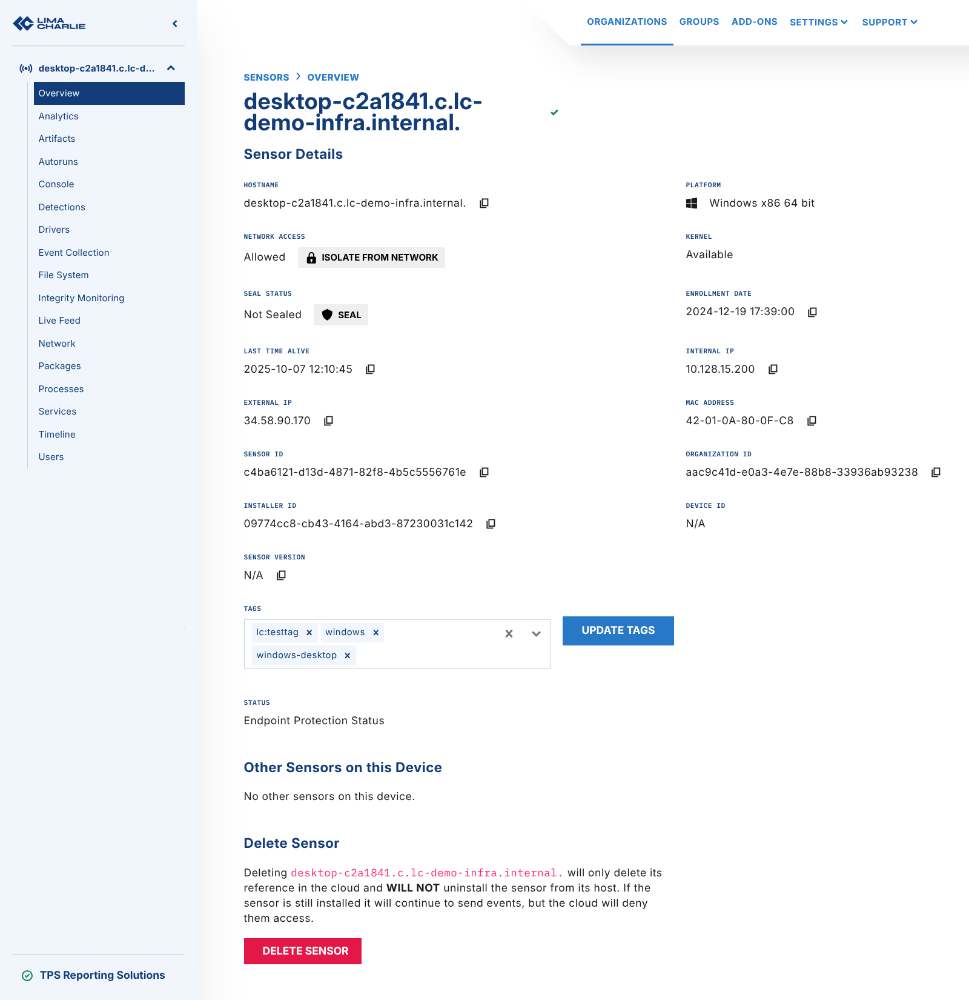
2. Artifacts
   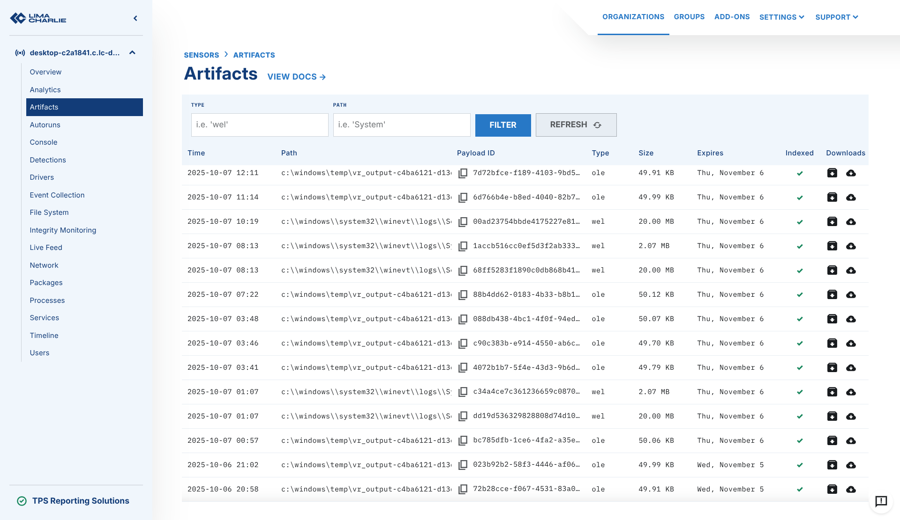
3. Autoruns
   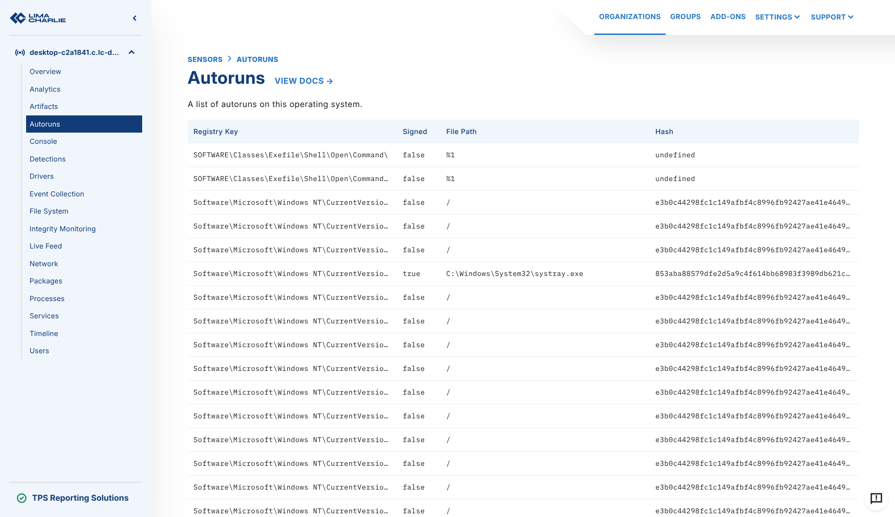
4. Console
   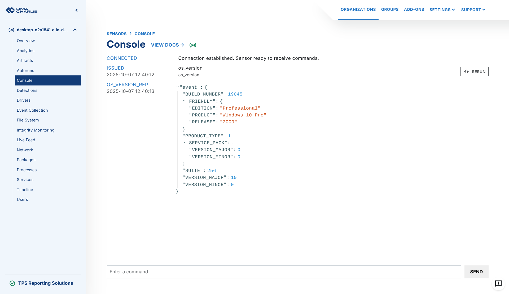
5. Detections
   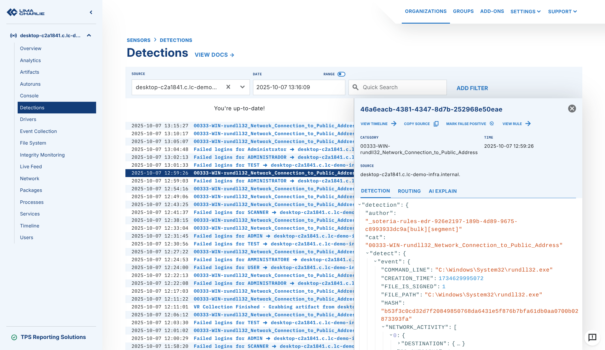
6. Drivers
   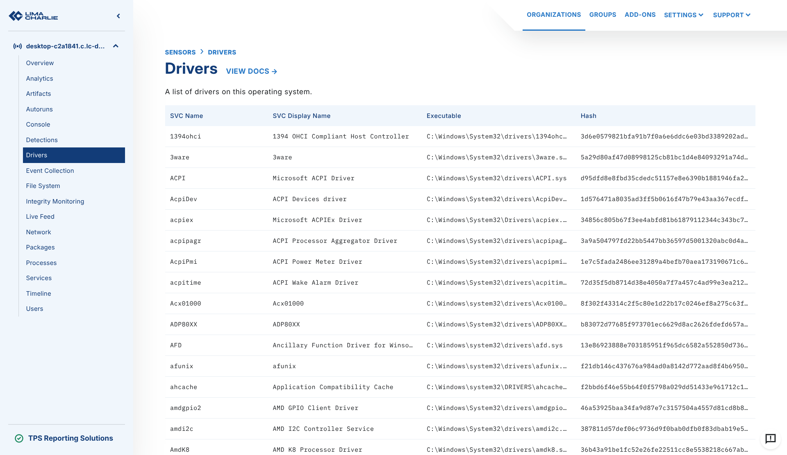
7. File System
   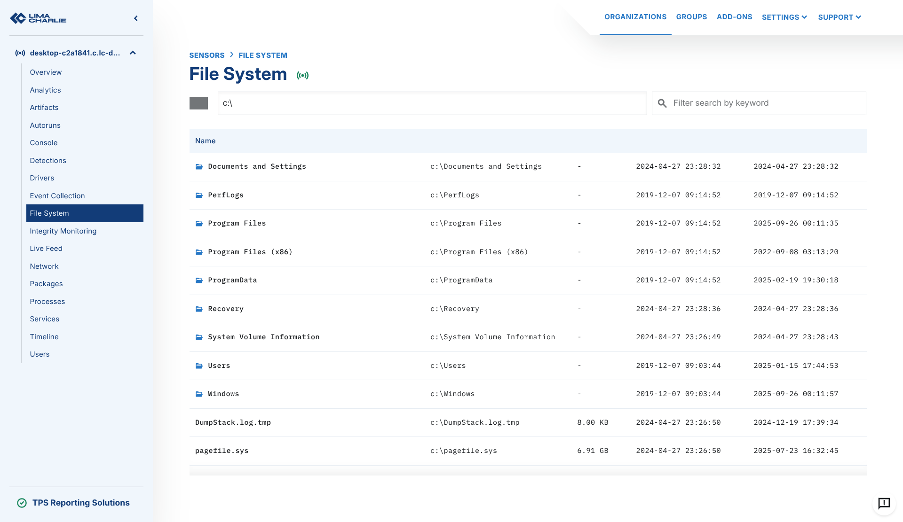
8. File Integrity Monitoring
   .png)
9. Network Connections
   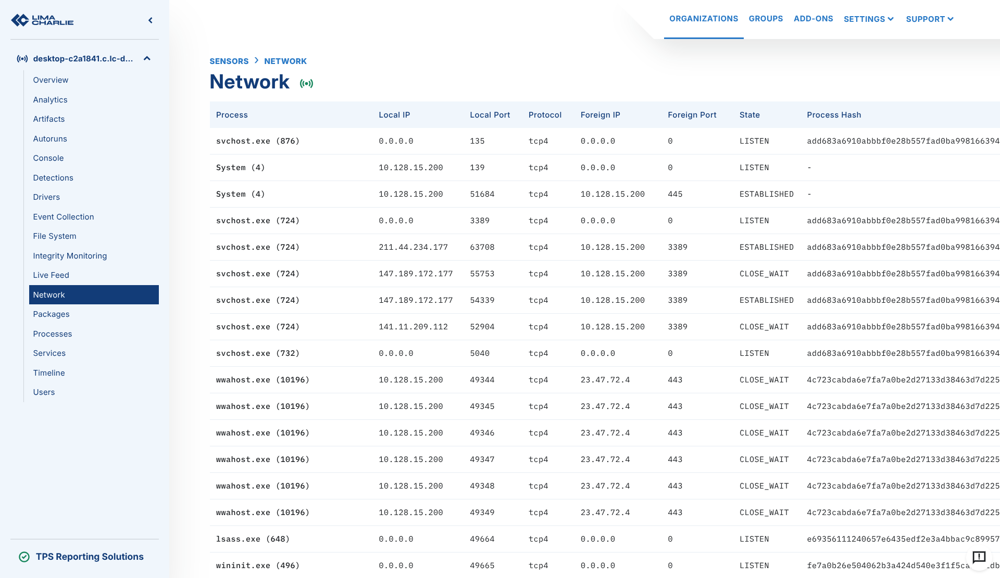
10. Packages
    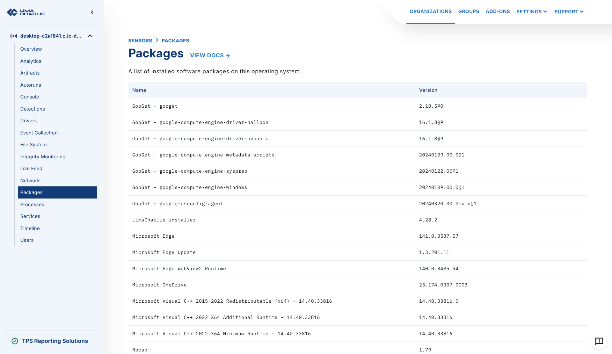
11. Processes
    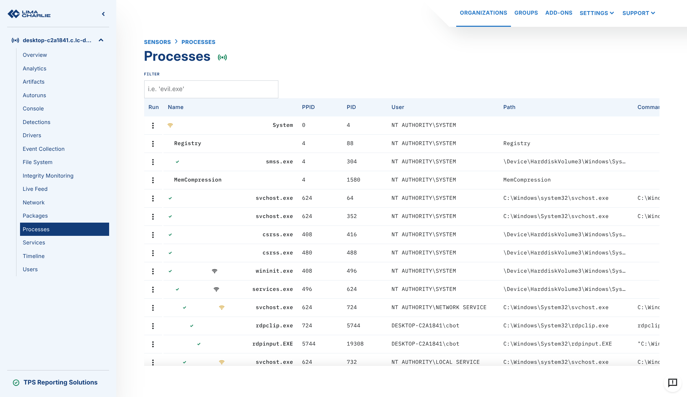
12. Services
    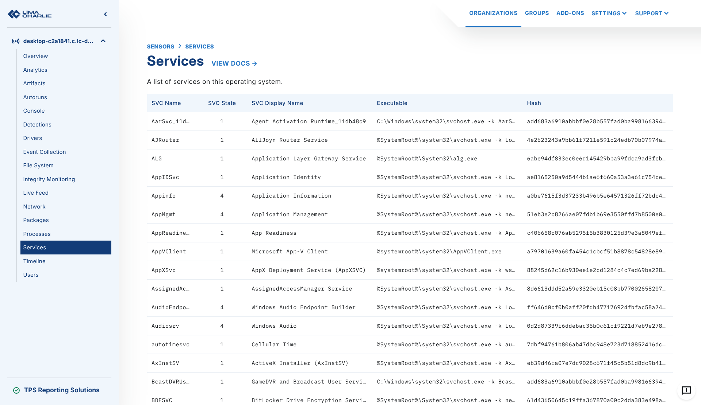
13. Timeline with Event Details
    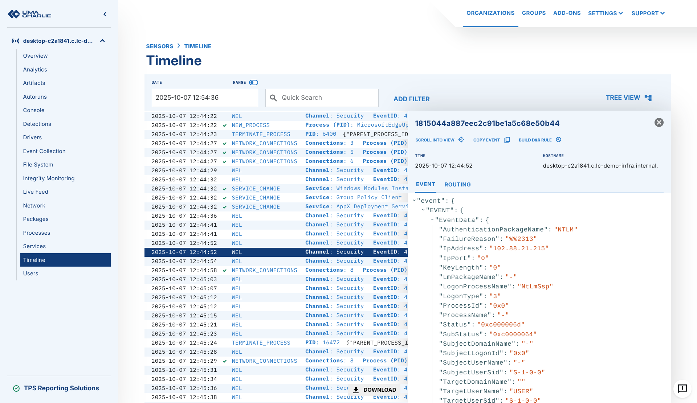
14. Users
    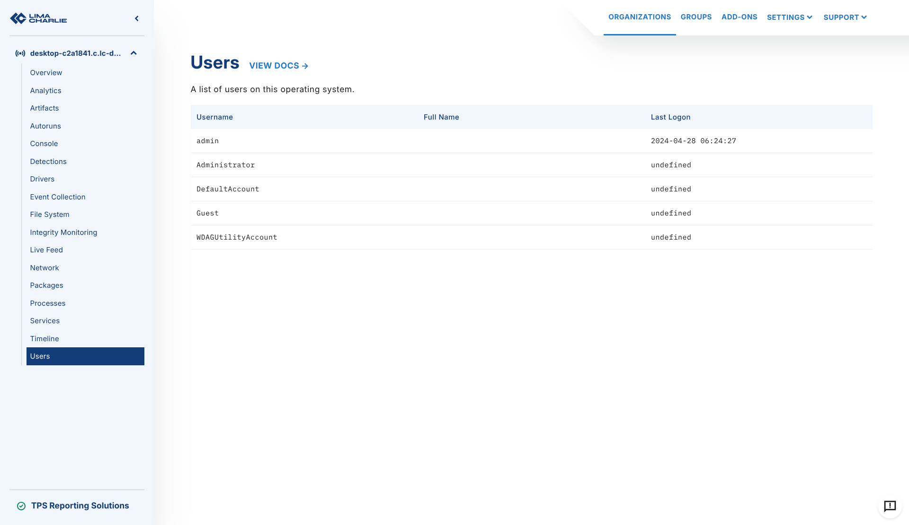

Like agents, sensors send telemetry to the LimaCharlie platform as EDR telemetry or as forwarded logs. A sensor is a scalable, serverless method to connect the endpoints of an organization to the cloud securely.
