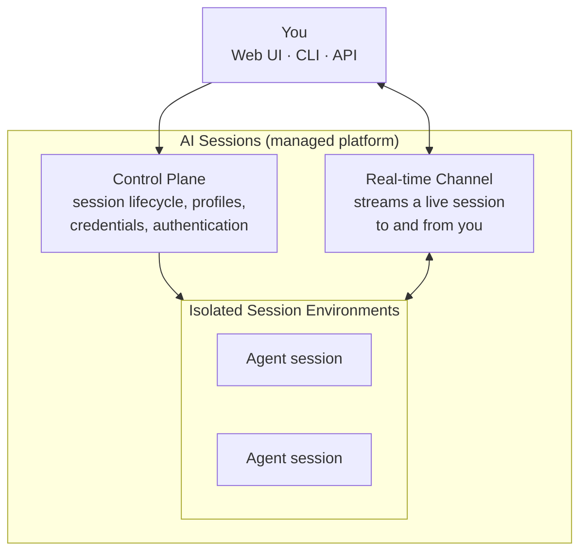
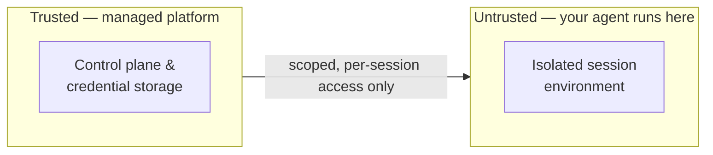

# Architecture

AI Sessions are fully-managed - you launch sessions and the platform handles provisioning,
isolation, scaling, and teardown. This page gives a high-level view of how the
platform is organized and the principles that keep your data and credentials safe.

## How It's Organized

At a high level there are three conceptual layers: a **control plane** that manages
sessions and credentials, **isolated session environments** where the agents
actually run, and a **real-time channel** that connects you to a live session.

## The Building Blocks

| Building block | What it does |
|----------------|--------------|
| **Control plane** | The front door for everything you do: registering, creating and managing sessions, storing profiles, and holding your encrypted credentials. Also records usage for billing. |
| **Session environment** | Where an agent actually runs — an isolated, ephemeral environment with the LimaCharlie CLI, security tooling, and your configured tools. One per session. See [Runner Environment](runner-environment.md). |
| **Real-time channel** | Carries your prompts, the agent's responses, tool-approval requests, and file transfers between you and a running session. See the [API Reference](api-reference.md) for the WebSocket protocol. |
| **Authentication service** | Lets you connect Claude Max credentials through a browser sign-in, with no local install. |

## Isolation & Trust

The most important design principle is **isolation**. An agent runs your prompts and
can execute code, so its environment is treated as untrusted and is walled off from
everything sensitive:

- A session environment **cannot reach your stored credentials or encryption keys**.
- A session environment **cannot see or interfere with any other session**.
- It communicates only over a single authenticated channel scoped to that one
  session.

The managed control plane sits on the trusted side of that boundary — it holds the
keys, verifies your identity, and hands each session only the narrow, scoped access
it needs for its lifetime.

## Data Protection

- **Bring Your Own Key** — you supply your own Anthropic credentials; LimaCharlie
  never has access to your Claude conversations.
- **Encrypted at rest** — credentials, MCP configurations, environment variables,
  and profile memory are encrypted, and isolated per user.
- **Encrypted in transit** — all traffic to and from the platform is encrypted.
- **Scoped access** — to act against a LimaCharlie organization, the credentials you
  provide must carry the `ai_agent.operate` permission on that org. The agent only
  ever has the access those credentials grant.

For how usage is billed and what it costs, see [Cost Tracking & Savings](cost-tracking.md)
and the [billing summary](index.md#billing).
