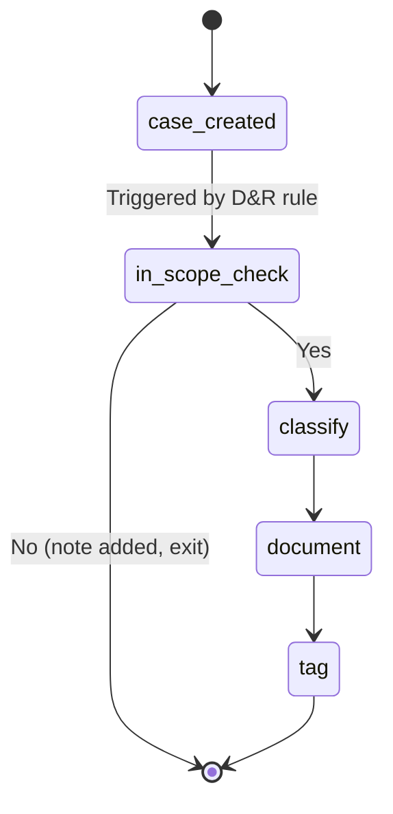

# Case-Reviewer Agent

The case-reviewer agent is the continuous, event-driven half of `lc-compliance`. Once deployed into a LimaCharlie organization, it watches the [Cases](../../5-integrations/extensions/limacharlie/cases.md) queue and classifies every new case against the framework's specific control citations, writing audit-grade documentation directly into the case record. It is built on top of [D&R-Driven AI Sessions](../dr-sessions.md).

One reviewer agent exists per framework. Multiple reviewers can be deployed into the same organization (for example, an org that is in scope for both PCI DSS and SOC 2 can run `pci-compliance-reviewer` and `soc2-compliance-reviewer` side by side, each scoped to its own tag).

## How it works



1. A detection fires on an in-scope sensor (e.g., a `cde`-tagged endpoint for PCI).
2. The Cases extension creates a case from the detection.
3. A webhook adapter emits a `case_created` event.
4. A D&R rule installed by `compliance-deploy` matches the event and invokes the agent via the `start ai agent` response action.
5. The agent runs **suppression** (max 10 cases per minute globally) and **debounce** (one review per case at a time) checks before starting work.
6. The agent performs a **scope check**: is this case in scope for the framework? (Is the sensor tagged correctly? Is the detection category one the framework cares about?)
   - If not, the agent adds a "not in scope" note to the case and exits.
   - If yes, the agent continues.
7. The agent **maps the event** to one or more specific control citations from the framework.
8. The agent **classifies the compliance impact**:
   - **Control functioning** — the detection itself is evidence that a control is operating correctly
   - **Control gap** — the event reveals a control that is missing or weak
   - **In-scope operational** — a routine in-scope event that does not indicate a security incident
   - **Security incident with compliance impact** — a real incident that the QSA / ISSO needs to be aware of
9. The agent **writes** a QSA-ready summary, conclusion, and analysis notes directly into the case via the case-investigation API, and tags the case with the compliance classification.

The agent is **read-only against your deployed configuration**. It reads detections, events, sensor metadata, hive records, and case data; it writes only to the case it was triggered for (notes, conclusion, tags). It does not modify D&R rules, exfil entries, FIM entries, sensors, secrets, or any other org configuration.

## Deployment

Deploy the reviewer for a framework using the [`compliance-deploy`](skills.md#compliance-deploy) skill:

```text
/lc-compliance:compliance-deploy pci-dss --oid <your-oid>
```

The skill walks through API-key creation, Anthropic secret staging, agent hive sync, and trigger D&R rule installation, with confirmation at each platform write. The deployment touches three [Config Hive](../../7-administration/config-hive/index.md) areas:

| Hive | Record name | Purpose |
|---|---|---|
| `ai_agent` | `<framework>-compliance-reviewer` | Agent prompt, model, tool allowlist, budget |
| `dr-general` | `<framework>-compliance-reviewer-trigger` | The D&R rule that fires the agent on `case_created` |
| `secret` | `<framework>-compliance-reviewer` and `anthropic-key` | Scoped LC API key and Anthropic API key |

After deployment, the agent identifier is `<framework>-compliance-reviewer` (e.g., `pci-compliance-reviewer`, `hipaa-compliance-reviewer`). The same identifier can be invoked manually from the CLI for ad-hoc reviews — see [Manual invocation](#manual-invocation).

## Permissions

The scoped LimaCharlie API key created by `compliance-deploy` is granted only the permissions the reviewer needs to operate:

| Permission | Reason |
|---|---|
| `org.get` | Read organization metadata |
| `sensor.list`, `sensor.get` | Identify in-scope sensors via tag selectors |
| `dr.list` | Read deployed D&R rule names and metadata for compliance correlation |
| `insight.det.get` | Read detections linked to the case |
| `insight.evt.get` | Read historical events for context |
| `investigation.get`, `investigation.set` | Read and update the case |
| `ext.request`, `ext.list` | Communicate with the Cases extension and list subscribed extensions |
| `org_notes.read` | Read organization-level notes for context |
| `sop.get`, `sop.get.mtd` | Read Standard Operating Procedures relevant to the case |
| `ai_agent.operate` | Operate as an AI agent in the org |

The agent does **not** receive write access to D&R rules, FIM rules, exfil configuration, sensor configuration, or installation keys. The least-privilege scoping is enforced at the API-key level — even if the agent's prompt asked it to modify configuration, the API would reject the call.

## Scope: what the agent reviews

The reviewer scopes itself by **sensor tag**, **detection category**, **detection rule tags**, and **rule metadata**. A case is treated as in scope when *any* of those signals matches the framework. The canonical scope tags accepted by each reviewer:

| Framework | Accepted scope tags |
|---|---|
| pci-dss | `cde`, `pci-scope`, `card-data`, `pci-dss` |
| hipaa | `ephi-host`, `hipaa-scope`, `phi-host`, `covered-entity` |
| cmmc | `cui`, `cui-host`, `cmmc-scope`, `dib-host` |
| nist-800-53 | `fisma-scope`, `fedramp-scope`, `federal-system`, `nist-scope` |
| soc2 | `soc2-scope`, `in-scope-system`, `audit-scope` |
| iso-27001 | `isms-scope`, `iso-scope`, `iso-27001-scope`, `soa-included` |
| cis-v8 | `cis-scope`, `cis-v8-scope` (plus optional `cis-ig1`/`cis-ig2`/`cis-ig3` for tier) |

The reviewer's full scope check considers, in order:

1. **Sensor tag match.** The case is in scope if the originating sensor carries any tag from the framework's accepted list.
2. **Detection category match.** The case is in scope if the detection category begins with the framework's prefix (`pci-`, `hipaa-`, `cmmc-`, `nist-`, `soc2-`, `iso-`, `cis-`).
3. **Rule-tag match.** The case is in scope if any linked detection's rule tags include the framework identifier (e.g., `pci-dss`).
4. **Rule metadata match.** The case is in scope if any linked detection's rule metadata carries the framework's citation key (e.g., `pci_dss_req:`, `hipaa_safeguard:`, `cis_safeguard:`).

Cases that match none of these signals receive a single explanatory note ("not in <framework> scope. No compliance review performed.") and the reviewer exits without altering classification, severity, status, or tags.

The scoping logic is encoded in the agent's prompt, which is one of the `ai_agent` hive record fields. Operators can override the scoping behavior by editing the hive record directly — see [Customization](#customization).

## Evidence model

The reviewer writes four artifacts into each in-scope case:

1. **Summary** (`--summary`) — one paragraph stating the host, the event, the control citations implicated, and the compliance classification.
2. **Conclusion** (`--conclusion`) — a few sentences mapping the event to specific control numbers, classifying it (see [Classifications](#classifications) below), citing evidence (sensor ID, hostname, event timestamp, detection rule name), and stating recommended remediation if applicable.
3. **Analysis note** (`case add-note --type analysis`) — a detailed technical timeline in markdown including verbatim event data, correlating events, and an explicit statement of the scope determination.
4. **Classification tags** — added via `case tag add`. Each reviewer uses framework-prefixed tags so multiple framework reviewers can run side-by-side without colliding.

### Classifications

Every in-scope case receives one of four classification tags. The tag names follow the framework-prefix convention:

| Classification | PCI tag | HIPAA tag | Pattern |
|---|---|---|---|
| Control functioning as designed | `pci-control-functioning` | `hipaa-control-functioning` | `<framework>-control-functioning` |
| Control gap revealed | `pci-control-gap` | `hipaa-control-gap` | `<framework>-control-gap` |
| In-scope operational activity | `pci-in-scope-ops` | `hipaa-in-scope-ops` | `<framework>-in-scope-ops` |
| Security incident with framework impact | `pci-security-incident` | `hipaa-security-incident` | `<framework>-security-incident` |

While the review is in flight, the case also carries a transient `<framework>-reviewing` tag (e.g., `pci-reviewing`), which the reviewer adds at the start of its workflow and removes when finished. Treat that tag as the in-flight signal, not the final classification.

Auditors who want to sample evidence work directly from the case queue, filtering by classification tag and framework. The agent does not generate stand-alone reports or PDFs — the case record itself is the evidence.

For organizations that also want a quarterly or annual roll-up across cases, the case queue can be queried via the [Cases API](https://cases.limacharlie.io/openapi) and the relevant classifications aggregated externally.

## Manual invocation

A deployed reviewer can also be invoked ad-hoc against an existing case from the CLI:

```bash
limacharlie ai start-session \
    --definition <framework>-compliance-reviewer \
    --prompt "Review case <case-number> against <framework> controls."
```

This is useful for re-reviewing cases after the agent's prompt has been updated, or for reviewing cases that pre-date the agent's deployment. See the [AI Sessions CLI reference](../cli.md) for the full command set.

## Customization

The agent's behavior is defined by the `ai_agent` hive record `<framework>-compliance-reviewer`. Operators can customize:

- **The system prompt** — to reflect organization-specific compliance practices, scope rules, escalation paths
- **The tool allowlist** — to restrict or expand the agent's capabilities
- **The model and budget** — to change the AI model used or cap per-session spend
- **The trigger rule** — the `dr-general` record `<framework>-compliance-reviewer-trigger` can be edited to change which `case_created` events fire the agent (for example, to only review high-severity cases)

To inspect or edit the records:

```bash
limacharlie hive get --hive-name ai_agent --key <framework>-compliance-reviewer --oid <your-oid>
limacharlie hive get --hive-name dr-general --key <framework>-compliance-reviewer-trigger --oid <your-oid>
```

To refresh customizations from a freshly-updated plugin (overwriting local edits), re-run `compliance-deploy`. The skill warns when it would overwrite an existing record.

## Cost and budget

Each agent run consumes Anthropic API tokens (billed directly to your Anthropic account via the staged key) plus a small AI Sessions runtime charge from LimaCharlie. The default budget is configured in the agent's hive record; consult the [AI Sessions billing section](../index.md#billing) for the current rates and the `max_budget_usd` parameter for per-session caps.

Suppression and debounce settings — the global 10-cases-per-minute cap and the per-case single-review lock — protect against runaway invocation when a noisy rule triggers many cases at once. Both are configurable in the trigger D&R rule.

## Limitations

- **The agent does not issue compliance attestations.** It produces evidence. The human auditor, QSA, or ISSO decides compliance status.
- **The agent does not take response actions.** It documents and classifies. It does not contain endpoints, kill processes, or modify configuration.
- **The agent depends on accurate scope tags.** A sensor that handles cardholder data but is not tagged `cde` will not be treated as in scope by the PCI reviewer. Tag accuracy is an operational responsibility — consider periodic tag audits using `compliance-gap`, which surfaces sensor-coverage issues.
- **The agent is best-effort, not deterministic.** It is an AI agent, and its outputs vary slightly between runs. For high-stakes cases, treat the agent's output as a first-draft documentation that a human analyst reviews before the auditor sees it.

## See also

- [D&R-Driven Sessions](../dr-sessions.md) — the underlying execution model
- [Cases](../../5-integrations/extensions/limacharlie/cases.md) — the case lifecycle the agent operates against
- [Hive Secrets](../../7-administration/config-hive/secrets.md) — where the agent's API keys are stored
- [Alternative AI Providers](../alternative-providers.md) — routing through Bedrock or Vertex AI instead of Anthropic direct
- [Skills Reference](skills.md) — `compliance-deploy` syntax and behavior
